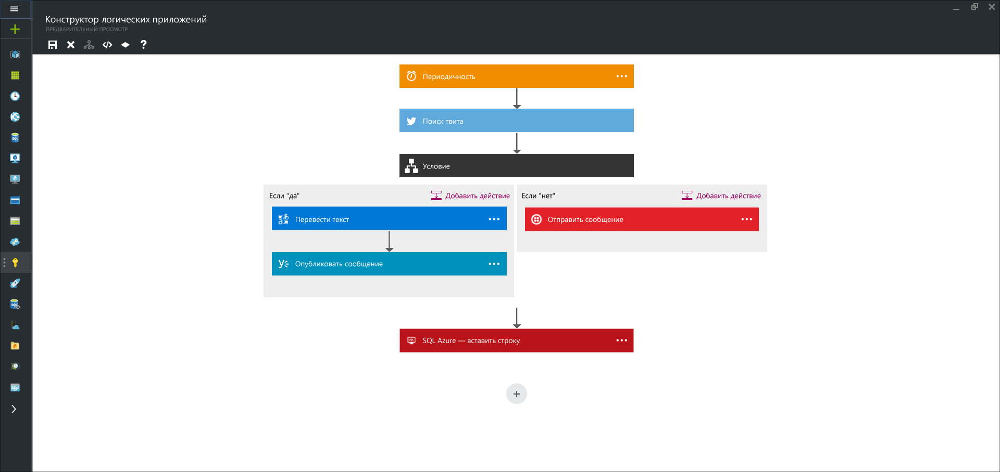

<properties 
	pageTitle="Что такое приложения логики?" 
	description="Дополнительные сведения о приложениях логики службы приложений" 
	authors="kevinlam1" 
	manager="dwrede" 
	editor="" 
	services="app-service\logic" 
	documentationCenter=""/>

<tags
	ms.service="app-service-logic"
	ms.workload="na"
	ms.tgt_pltfrm="na"
	ms.devlang="na"
	ms.topic="get-started-article"
	ms.date="02/22/2016"
	ms.author="klam"/>

#Что такое приложения логики?

| Краткий справочник |
| --------------- |
| [Язык описания приложений логики](https://msdn.microsoft.com/library/azure/dn948512.aspx?f=255&MSPPError=-2147217396) |
| [Logic Apps Managed API Documentation](https://azure.microsoft.com/documentation/articles/apis-list) (Документация по управляемым интерфейсам API приложений логики) |
| [Форум о приложениях логики](https://social.msdn.microsoft.com/Forums/ru-RU/home?forum=azurelogicapps) |

Служба приложений Azure является полностью управляемой платформой PaaS ("платформа как услуга") для разработчиков, которая облегчает создание веб-приложений, мобильных приложений и приложений интеграции. Приложения логики являются частью этого пакета и позволяют любому техническому пользователю или разработчику автоматизировать выполнение бизнес-процессов и рабочих процессов с помощью простого в использовании визуального конструктора.

А главное — приложения логики можно объединять со встроенными [управляемыми интерфейсами API][managedapis], чтобы с легкостью реализовывать сложные сценарии интеграции.

Можно настроить автоматическую репликацию новых записей в вашей базе данных SQL и отправку по почте передней панели. Кроме того, можно автоматически находить негативные твиты и отправлять их в канал Slack.

##Причины использования приложений логики

Приложения логики позволяют разработчикам проектировать рабочие процессы, которые запускаются триггером, а затем выполняют ряд действий. Каждый шаг вызывает API. При этом выполняется проверка подлинности и учитываются рекомендации, связанные в том числе с созданием контрольных точек и устойчивым выполнением.

Если вы хотите автоматизировать какой-либо бизнес-процесс (например, поиск негативных твитов и отправка их во внутренний канал Slack или репликация новых записей клиента из SQL в свою систему CRM по мере их поступления), приложения логики легко выполняют интеграцию разнородных источников данных, от облачных до локальных. Ознакомьтесь с [управляемыми интерфейсами API][managedapis] и [приступайте к работе][create] прямо сейчас, чтобы узнать о возможностях их использования.

Более того, [управляемые API BizTalk][biztalk] позволяют реализовывать даже сложные сценарии интеграции, используя возможности [обработчика правил][rules], [управления торговыми партнерами][tpm] и многое другое.

- **Простые в использовании средства проектирования** — приложения логики можно полностью разработать в браузере. Начните с триггера — с простого плана для события, когда появляется твит о вашей компании. Далее можно управлять любым количеством действий с помощью богатой коллекции соединителей.

- **Простое создание SaaS** — даже композиционные задачи, которые очень легко описать, трудно реализовать в коде. Приложения логики делают несложным подключение разрозненных систем. Хотите создать задачу в программном обеспечении CRM на основе действий из учетных записей Facebook или Twitter? Хотите подключить свое облачное коммерческое решение к локальной системе выставления счетов? Приложения логики представляют самый быстрый и самый надежный способ решения этих проблем.

- **Быстрое начало работы из шаблонов** — чтобы помочь вам начать работу, мы предусмотрели [коллекцию шаблонов][templates], которые позволяют быстро создать некоторые простые решения. От современных решений BizTalk до простой возможности подключения SaaS, и даже больше — эта коллекция является самым быстрым способом понять возможности приложений логики.

- **Интегрированная расширяемость** — не удается найти нужный интерфейс API? Приложения логики предназначены для работы с приложениями API. Вы можете легко создать собственное приложение API для использования в качестве настраиваемого интерфейса API. Постройте новое приложение только для себя или предложите его на рынке и получайте прибыль.

- **Мощность реальной интеграции** — начните с простого и увеличивайте сложность по мере необходимости. Приложения логики могут легко использовать возможности BizTalk, ведущее отраслевое решение интеграции от корпорации Майкрософт, чтобы специалисты в области интеграции могли строить необходимые решения. Узнайте больше о [возможностях BizTalk, предоставляемых приложениями логики][biztalk].

## Основные понятия приложений логики

Далее приводятся некоторые ключевые элементы, охватывающие возможности приложений логики.

- **Рабочий процесс.** Приложения логики предоставляют графический способ моделирования бизнес-процессов в виде последовательности шагов или рабочего процесса.
- **Управляемые интерфейсы API**. Приложениям логики требуется доступ к данным и службам. Управляемые интерфейсы API разработаны специально для того, чтобы помочь вам при подключении к данным и работе с ними. Ознакомьтесь со списком доступных [управляемых интерфейсов API][managedapis].
- **Триггеры**. Некоторые управляемые интерфейсы API могут действовать и как триггеры. Триггер запускает новый экземпляр рабочего процесса на основе определенного события, такого как поступление электронной почты или изменение в учетной записи хранения Azure.
-  **Действия.** Каждый шаг после вызова действия триггера в рабочем процессе. Каждое действие обычно сопоставляется с операцией управляемого или настраиваемого интерфейса API.
- **BizTalk**. Для более сложных сценариев интеграции приложения логики предоставляют возможности BizTalk. Biztalk — это ведущая отраслевая платформа интеграции от корпорации Майкрософт. Приложения API BizTalk позволяют легко включать проверку, преобразование, правила и многое другое в рабочие процессы приложений логики. Узнайте больше о том, [что такое приложения API BizTalk][biztalk].

## Приступая к работе

Чтобы начать работу с приложениями логики, выполните задания из учебника [Создание приложения логики][create].

Дополнительные сведения о платформе службы приложений Azure см. в статье [Служба приложений Azure][appservice].

[biztalk]: app-service-logic-what-are-biztalk-api-apps.md
[appservice]: ../app-service/app-service-value-prop-what-is.md
[create]: app-service-logic-create-a-logic-app.md
[managedapis]: app-service-logic-connectors-list.md
[tpm]: app-service-logic-create-a-trading-partner-agreement.md
[rules]: app-service-logic-use-biztalk-rules.md
[templates]: app-service-logic-use-logic-app-templates.md

<!---HONumber=AcomDC_0224_2016-->