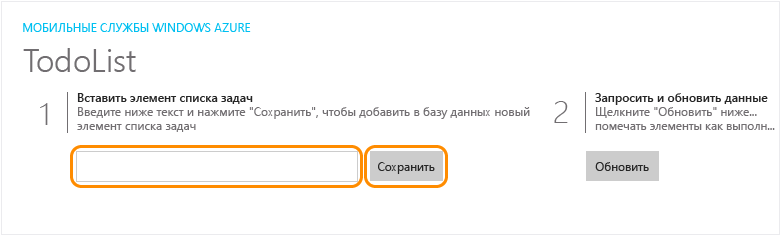
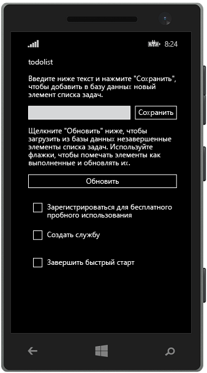

<properties
	pageTitle="Создание универсального приложения среды выполнения Windows 8.1 в службе мобильных приложений Azure | Microsoft Azure"
	description="Следуйте указаниям этой статьи, чтобы начать работу с серверной частью мобильных приложений Azure для разработки приложений Магазина Windows на C#, Visual Basic или JavaScript."
	services="app-service\mobile"
	documentationCenter="windows"
	authors="ggailey777"
	manager="dwrede"
	editor=""/>

<tags
	ms.service="app-service-mobile"
	ms.workload="mobile"
	ms.tgt_pltfrm="mobile-windows"
	ms.devlang="dotnet"
	ms.topic="hero-article"
	ms.date="08/14/2015"
	ms.author="glenga"/>

#Создание приложения Windows

[AZURE.INCLUDE [app-service-mobile-selector-get-started-preview](../../includes/app-service-mobile-selector-get-started-preview.md)]&nbsp;[AZURE.INCLUDE [app-service-mobile-note-mobile-services-preview](../../includes/app-service-mobile-note-mobile-services-preview.md)]

##Обзор

В этой статье показано, как добавить облачную серверную службу в универсальное приложение для среды выполнения Windows 8.1 с помощью серверной части мобильного приложения Azure. Решения для универсальных приложений Windows включают проекты для приложений Магазинов Windows 8.1 и Windows Phone 8.1, а также общий проект.

[AZURE.INCLUDE [app-service-mobile-windows-universal-get-started-preview](../../includes/app-service-mobile-windows-universal-get-started-preview.md)]

##Предварительные требования

Для работы с этим учебником требуется:

* Активная учетная запись Azure. Если у вас нет учетной записи, можно зарегистрироваться для получения бесплатной пробной версии Azure и получить до 10 бесплатных мобильных приложений, которые можно использовать и после окончания пробного периода. Дополнительные сведения см. в разделе [Бесплатная пробная версия Azure](http://azure.microsoft.com/pricing/free-trial/).

* [Visual Studio Community 2013] или более поздняя версия.

>[AZURE.NOTE]Если вы хотите приступить к работе со службой приложений Azure до регистрации учетной записи Azure, перейдите на страницу [Пробное использование службы приложений](http://go.microsoft.com/fwlink/?LinkId=523751&appServiceName=mobile). Там вы сможете немедленно создать кратковременное начальное мобильное приложение в службе приложений. Для этого не потребуется ни кредитная карта, ни какие-либо обязательства.

##Создание серверной части мобильного приложения Azure

[AZURE.INCLUDE [app-service-mobile-dotnet-backend-create-new-service-preview](../../includes/app-service-mobile-dotnet-backend-create-new-service-preview.md)]

## Скачивание проекта сервера

1. На [портале Azure] последовательно выберите пункты **Просмотреть все** > **Веб-приложения**, а затем щелкните только что созданную серверную часть мобильного приложения.

2. В серверной части мобильного приложения щелкните **Все параметры**, а затем в разделе **Мобильное приложение** последовательно выберите **Быстрый запуск** > **Windows (C#)**.

3. В разделе **Загрузка и запуск серверного проекта** диалогового окна **Создание нового приложения** щелкните **Загрузить**, извлеките сжатые файлы проекта на локальный компьютер и откройте решение в Visual Studio.

4. Выполните сборку проекта, чтобы восстановить пакеты NuGet.

##Публикация серверного проекта в Azure

[AZURE.INCLUDE [app-service-mobile-dotnet-backend-publish-service-preview](../../includes/app-service-mobile-dotnet-backend-publish-service-preview.md)]

##Скачивание и выполнение клиентского проекта

Создав серверную часть мобильного приложения, с помощью простых инструкций на портале Azure создайте новое приложение (или измените существующее) и подключите его к серверной части своего мобильного приложения.

В этом разделе вы загрузите проект шаблона универсального приложения Windows, который настроен для подключения к серверной части мобильного приложения Azure.

1. В колонке серверной части мобильного приложения щелкните **Все параметры**, а затем в разделе **Мобильное приложение** последовательно выберите **Быстрый запуск** > **Windows (C#)**.

2.  В разделе **Загрузка и запуск проекта Windows** диалогового окна **Создание нового приложения** щелкните **Загрузить** и извлеките сжатые файлы проекта на локальный компьютер.

3. (Необязательно.) Добавьте в решение с серверным проектом проект универсального приложения Windows. Это упрощает отладку и тестирование приложения и серверной части в одном решении Visual Studio, если вам это потребуется.

4. Назначив запускаемым проектом приложение Магазина Windows, нажмите клавишу F5, чтобы повторить сборку проекта, после чего запустите приложение Магазина Windows.

5. В приложении введите содержательный текст, например *Завершение учебника*, в поле **Вставить в TodoItem**, затем щелкните **Сохранить**.

	

	В результате будет отправлен запрос POST к серверной части нового мобильного приложения, размещенного в Azure.

6. Остановите отладку, щелкните правой кнопкой мыши проект `<your app name>.WindowsPhone`, щелкните **Назначить запускаемым проектом**, затем еще раз нажмите клавишу F5.

	

	Обратите внимание, что данные, сохраненные на предыдущем этапе, загружаются из мобильного приложения после запуска приложения Windows.

##Дальнейшие действия

* [Добавление аутентификации в приложение](app-service-mobile-dotnet-backend-windows-store-dotnet-get-started-users-preview.md)  Узнайте, как аутентифицировать пользователей приложения с помощью поставщика удостоверений.

* [Добавление push-уведомлений в приложение](app-service-mobile-dotnet-backend-windows-store-dotnet-get-started-push-preview.md)  Узнайте, как отправлять в приложение простейшие push-уведомления.

<!-- Anchors. -->
<!-- Images. -->
<!-- URLs. -->
[Get started with authentication]: app-service-mobile-dotnet-backend-windows-store-dotnet-get-started-users-preview.md
[Mobile App SDK]: http://go.microsoft.com/fwlink/?LinkId=257545
[портале Azure]: https://portal.azure.com/
[Visual Studio Community 2013]: https://go.microsoft.com/fwLink/p/?LinkID=534203

<!---HONumber=Oct15_HO3-->