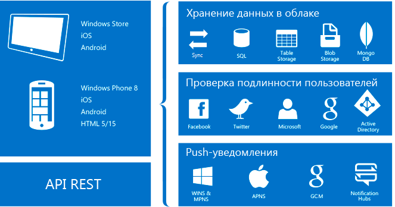

# Компонент "Мобильные приложения" в службе приложений Azure
Служба приложений Azure — это решение для профессиональных разработчиков на основе полностью управляемой [платформы как услуги](https://azure.microsoft.com/overview/what-is-paas/) (PaaS). Эта служба привносит широкий спектр возможностей в сценарии с использованием Интернета, мобильных устройств и интеграции. 

Компонент "Мобильные приложения" службы приложений Azure представляет собой высокомасштабируемую глобально доступную платформу разработки мобильных приложений для корпоративных разработчиков и системных интеграторов.

## Почему мобильные приложения
Возможности компонента "Мобильные приложения":

* **Создание собственных и кроссплатформенных приложений.** Какие бы приложения вы ни создавали — собственные для iOS, Android и Windows или кроссплатформенные для Xamarin или Cordova (PhoneGap) — вы можете воспользоваться службой приложений с помощью соответствующих собственных пакетов SDK.
* **Подключение к корпоративным системам.** С помощью компонента "Мобильные приложения" вы можете добавить функцию корпоративного единого входа за считаные минуты и подключить к корпоративной сети локальные или облачные ресурсы.
* **Создание приложений с возможностью автономной работы и синхронизацией данных.** Повышайте мобильность сотрудников, создавая приложения, которые работают автономно и синхронизируют данные в фоновом режиме с помощью компонента "Мобильные приложения", когда появляется подключение к любому корпоративному источнику данных или API-интерфейсам программного обеспечения как услуги (SaaS).
* **Отправка push-уведомлений миллионам получателей за считаные секунды.** В нужное время отправляйте своим клиентам на любые устройства мгновенные персонализированные push-уведомления.

## Возможности компонента "Мобильные приложения"
Ниже перечислены важные функции для разработки мобильных приложений с поддержкой облака.

* **Аутентификация и авторизация.** Выберите поставщик удостоверений из постоянно растущего списка, например Azure Active Directory для аутентификации в корпоративной сети, а также поставщики аутентификации через социальные сети (Facebook, Google, Twitter) или учетную запись Майкрософт. Компонент "Мобильные приложения" предоставляет службу OAuth 2.0 для каждого поставщика. Вы также можете интегрировать пакет SDK для поставщика удостоверений, чтобы использовать соответствующие функции.

    Дополнительные сведения см. в статье [Проверка подлинности и авторизация в мобильных приложениях Azure].

* **Доступ к данным.** Компонент "Мобильные приложения" предоставляет адаптированный для мобильных устройств источник данных OData версии 3, который связан с базой данных SQL Azure или с локальным сервером SQL Server. Так как эту службу можно разместить на платформе Entity Framework, вы можете легко выполнять интеграцию с другими поставщиками данных SQL и NoSQL, включая [хранилище таблиц Azure], MongoDB и [Azure Cosmos DB], а также с поставщиками API SaaS, такими как Office 365 и Salesforce.com.

* **Автономная синхронизация.** Клиентские пакеты SDK позволяют создавать надежные и быстрые мобильные приложения для работы с автономным набором данных. Эти наборы данных могут автоматически синхронизироваться с данными сервера, включая поддержку устранения конфликтов.

  Дополнительные сведения см. в статье [Автономная синхронизация данных в мобильных приложениях Azure].

* **Push-уведомления.** Клиентские пакеты SDK полностью поддерживают возможности регистрации центров уведомлений Azure, что позволяет одновременно отправлять push-уведомления миллионам пользователей.

  Дополнительные сведения см. в статье [Концентраторы уведомлений Azure].

* **Клиентские пакеты SDK.** Доступен полный набор клиентских пакетов SDK для разработки собственных ([iOS], [Android] и [Windows]), кроссплатформенных ([Xamarin.iOS и Xamarin.Android], [Xamarin.Forms]) и гибридных приложений ([Apache Cordova]). Каждый клиентский пакет SDK имеет открытый исходный код и поставляется с лицензией MIT.

## Функции службы приложений Azure
Ниже перечислены функции платформы, которые удобно использовать на рабочих сайтах для мобильных устройств.

* **Автоматическое масштабирование.** Служба приложений позволяет быстро увеличивать и уменьшать масштаб, чтобы справиться с любой нагрузкой. Вручную выберите количество и размер виртуальных машин или настройте автоматическое масштабирование, чтобы масштаб серверной части мобильных приложений автоматически изменялся в зависимости от нагрузки или по расписанию.

  Дополнительные сведения см. в статье [Увеличение масштаба приложения в Azure].

* **Промежуточные среды.** В службе приложений можно запустить несколько версий сайта, выполнить А/В-тестирование или тестирование в рабочей среде в рамках более крупного плана DevOps, а также поместить данные новой серверной части на промежуточное хранение.

  Дополнительные сведения см. в статье [Настройка промежуточных сред для веб-приложений в службе приложений Azure].

* **Непрерывное развертывание.** Службу приложений можно интегрировать с распространенными _системами управления версиями (SCM)_, чтобы с легкостью развертывать новую версию серверной части.

  Дополнительные сведения см. в статье [Развертывание приложения в службе приложений Azure](../app-service/app-service-deploy-local-git.md).

* **Виртуальные сети.** Службу приложений можно подключать к локальным ресурсам с помощью виртуальной сети, Azure ExpressRoute или гибридных подключений.

  Дополнительные сведения см. в статьях [Доступ к локальным ресурсам с помощью гибридных подключений в службе приложений Azure], [Интеграция приложения с виртуальной сетью Azure] и [Сведения о конфигурации сети для сред службы приложений с ExpressRoute].

* **Изолированные и выделенные среды.** Для безопасного выполнения приложений Службы приложений Azure эту службу можно запускать в полностью изолированном и выделенном окружении. Эта среда идеально подходит для рабочих нагрузок приложений, требующих большого масштаба, изолированной среды или безопасного доступа к сети.

  Дополнительные сведения см. в статье [Введение в среду службы приложения версии 1].

## Дополнительная информация

Чтобы приступить к работе с компонентом "Мобильные приложения" службы приложений Azure, изучите руководство [по началу работы]. В этом руководстве приведены общие сведения по созданию серверной части мобильного приложения и мобильного клиента на свой выбор. В нем также рассматривается интеграция проверки подлинности, автономная синхронизация и push-уведомления. Вы можете обращаться к этому руководству каждый раз при создании клиентского приложения.

Перечень дополнительных статей, посвященных компоненту "Мобильные приложения", см. в [карте обучения].
Дополнительные сведения о платформе службы приложений Azure см. в соответствующей статье.

<!-- URLs. -->
[Migrate your mobile service to App Service]: app-service-mobile-migrating-from-mobile-services.md
[по началу работы]: app-service-mobile-ios-get-started.md
[хранилище таблиц Azure]:../cosmos-db/table-storage-how-to-use-dotnet.md
[Azure Cosmos DB]: ../cosmos-db/sql-api-get-started.md
[Проверка подлинности и авторизация в мобильных приложениях Azure]: ./app-service-mobile-auth.md
[Автономная синхронизация данных в мобильных приложениях Azure]: ./app-service-mobile-offline-data-sync.md
[Концентраторы уведомлений Azure]: ../notification-hubs/notification-hubs-push-notification-overview.md
[iOS]: ./app-service-mobile-ios-how-to-use-client-library.md
[Android]: ./app-service-mobile-android-how-to-use-client-library.md
[Windows]: ./app-service-mobile-dotnet-how-to-use-client-library.md
[Xamarin.iOS и Xamarin.Android]: ./app-service-mobile-dotnet-how-to-use-client-library.md
[Xamarin.Forms]: ./app-service-mobile-xamarin-forms-get-started.md
[Apache Cordova]: ./app-service-mobile-cordova-how-to-use-client-library.md
[Увеличение масштаба приложения в Azure]: ../app-service/web-sites-scale.md
[Настройка промежуточных сред для веб-приложений в службе приложений Azure]: ../app-service/web-sites-staged-publishing.md
[Доступ к локальным ресурсам с помощью гибридных подключений в службе приложений Azure]: ../biztalk-services/integration-hybrid-connection-overview.md
[Интеграция приложения с виртуальной сетью Azure]: ../app-service/web-sites-integrate-with-vnet.md
[Сведения о конфигурации сети для сред службы приложений с ExpressRoute]: ../app-service/environment/app-service-app-service-environment-network-configuration-expressroute.md
[Введение в среду службы приложения версии 1]: ../app-service/environment/intro.md
[карте обучения]: https://azure.microsoft.com/documentation/learning-paths/appservice-mobileapps/
