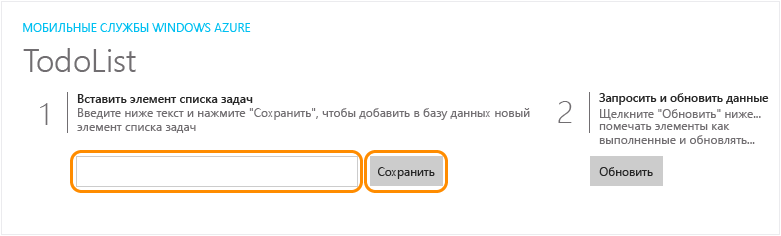

<properties
	pageTitle="Создание универсального приложения среды выполнения Windows 8.1 в службе мобильных приложений Azure | Microsoft Azure"
	description="Следуйте указаниям этой статьи, чтобы начать работу с серверной частью мобильных приложений Azure для разработки приложений Магазина Windows на C#, Visual Basic или JavaScript."
	services="app-service\mobile"
	documentationCenter="windows"
	authors="ggailey777"
	manager="dwrede"
	editor=""/>

<tags
	ms.service="app-service-mobile"
	ms.workload="mobile"
	ms.tgt_pltfrm="mobile-windows"
	ms.devlang="dotnet"
	ms.topic="hero-article"
	ms.date="11/16/2015"
	ms.author="glenga"/>

#Создание приложения Windows

[AZURE.INCLUDE [app-service-mobile-selector-get-started](../../includes/app-service-mobile-selector-get-started.md)]
&nbsp;  
[AZURE.INCLUDE [app-service-mobile-note-mobile-services](../../includes/app-service-mobile-note-mobile-services.md)]

##Обзор

В этом руководстве показано, как добавить облачную серверную службу в универсальное приложение Windows. Дополнительные сведения см. в статье [Что такое мобильные приложения?](app-service-mobile-value-prop.md)

[AZURE.INCLUDE [app-service-mobile-windows-universal-get-started](../../includes/app-service-mobile-windows-universal-get-started.md)]

##Предварительные требования

Для работы с этим учебником требуется:

* Активная учетная запись Azure. Если у вас нет учетной записи, можно зарегистрироваться для получения бесплатной пробной версии Azure и получить до 10 бесплатных мобильных приложений, которые можно использовать и после окончания пробного периода. Дополнительные сведения см. в разделе [Бесплатная пробная версия Azure](http://azure.microsoft.com/pricing/free-trial/).

* [Visual Studio Community 2013] или более поздняя версия.

>[AZURE.NOTE]Если вы хотите приступить к работе со службой приложений Azure до регистрации и получения учетной записи Azure, перейдите на страницу [Пробное использование службы приложений](https://tryappservice.azure.com/?appServiceName=mobile). Там вы сможете немедленно создать кратковременное начальное мобильное приложение в службе приложений. Для этого не потребуется ни кредитная карта, ни какие-либо обязательства.

##Создание серверной части мобильного приложения Azure

Чтобы создать серверную часть мобильного приложения, выполните указанные ниже действия.

[AZURE.INCLUDE [app-service-mobile-dotnet-backend-create-new-service](../../includes/app-service-mobile-dotnet-backend-create-new-service.md)]

Итак, вы подготовили серверную часть мобильного Azure, которая может использоваться мобильными клиентскими приложениями. Теперь скачайте серверный проект со списком простых задач и опубликуйте его в Azure.

## Настройка серверного проекта

[AZURE.INCLUDE [app-service-mobile-configure-new-backend.md](../../includes/app-service-mobile-configure-new-backend.md)]

##Скачивание и выполнение клиентского проекта

Настроив серверную часть мобильного приложения, можно создать новое клиентское приложение или изменить существующее приложение, чтобы подключиться к Azure. В этом разделе вы загрузите проект шаблона универсального приложения Windows, который настроен для подключения к серверной части мобильного приложения.

1. Вернитесь в колонку **Приступая к работе** серверной части мобильного приложения и последовательно выберите элементы **Создать новое приложение** > **Загрузить**. Затем извлеките сжатые файлы проекта на локальный компьютер.

3. (Необязательно.) Добавьте в решение с серверным проектом проект универсального приложения Windows. Это упрощает отладку и тестирование приложения и серверной части в одном решении Visual Studio, если вам это потребуется.

4. Назначив запускаемым проектом приложение Магазина Windows, нажмите клавишу F5, чтобы повторить сборку проекта, после чего запустите приложение Магазина Windows.

5. В приложении в поле **Вставить TodoItem** введите содержательный текст, например *Работа с руководством*, и нажмите кнопку **Сохранить**.

	

	В результате будет отправлен запрос POST к серверной части нового мобильного приложения, размещенного в Azure.

6. Остановите отладку, щелкните проект `<your app name>.WindowsPhone` правой кнопкой мыши, щелкните **Назначить запускаемым проектом**, затем еще раз нажмите клавишу F5.

	

	Обратите внимание, что данные, сохраненные на предыдущем этапе, загружаются из мобильного приложения после запуска приложения Windows.

##Дальнейшие действия

* [Добавление проверки подлинности в приложение](app-service-mobile-windows-store-dotnet-get-started-users.md)  Узнайте, как проверять подлинность пользователей приложения с помощью поставщика удостоверений.

* [Добавление push-уведомлений в приложение](app-service-mobile-windows-store-dotnet-get-started-push.md)  Узнайте, как отправлять в приложение простейшие push-уведомления.

<!-- Anchors. -->
<!-- Images. -->
<!-- URLs. -->
[Mobile App SDK]: http://go.microsoft.com/fwlink/?LinkId=257545
[Azure portal]: https://portal.azure.com/
[Visual Studio Community 2013]: https://go.microsoft.com/fwLink/p/?LinkID=534203

<!---HONumber=AcomDC_1203_2015--->