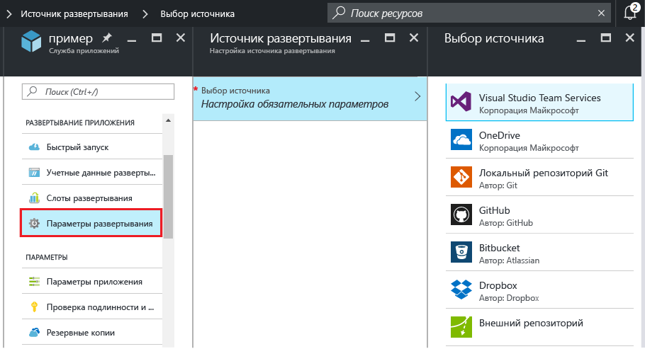
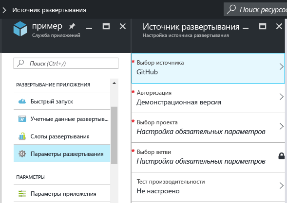
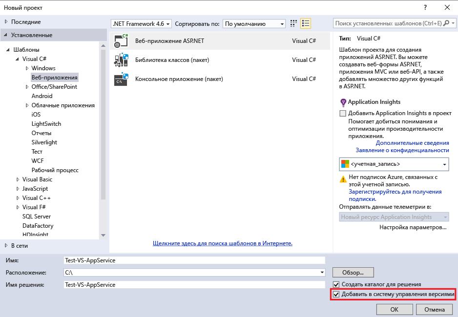
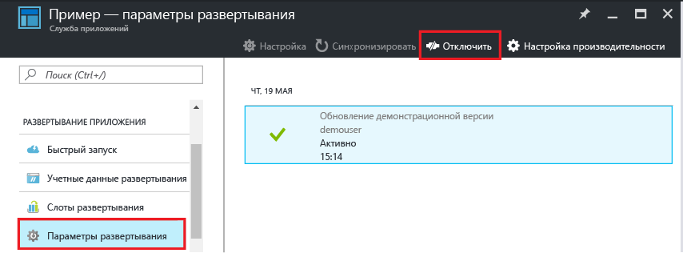

<properties
	pageTitle="Непрерывное развертывание в службе приложений Azure | Microsoft Azure"
	description="Узнайте, как включить непрерывное развертывание в службе приложений Azure."
	services="app-service"
	documentationCenter=""
	authors="dariagrigoriu"
	manager="wpickett"
	editor="mollybos"/>

<tags
	ms.service="app-service"
	ms.workload="na"
	ms.tgt_pltfrm="na"
	ms.devlang="na"
	ms.topic="article"
	ms.date="07/23/2016"
	ms.author="dariagrigoriu"/>
    
# Непрерывное развертывание в службе приложений Azure

В этом руководстве описано, как настроить рабочий процесс непрерывного развертывания для приложения [службы приложений Azure]. Служба приложений Azure интегрируется с BitBucket, GitHub и Visual Studio Team Services (VSTS), что обеспечивает непрерывное развертывание, когда Azure извлекает последние обновления из проекта, опубликованные в одной из этих служб. Непрерывное развертывание очень удобно для проектов, которые часто обновляются несколькими участниками.

## Включение непрерывного развертывания

Чтобы включить непрерывное развертывание, выполните следующие действия.

1. Опубликуйте содержимое приложения в репозиторий, который будет использоваться для непрерывного развертывания. Дополнительные сведения о публикации проекта в этих службах см. в разделе [Создание репозитория (GitHub)], [Создание репозитория (BitBucket)] и [Приступая к работе с VSTS].

2. В колонке приложения на [портале Azure] выберите **Параметры > Источник развертывания**. Щелкните **Выбор источника** и выберите, например, источник **GitHub**.

	
	
    > [AZURE.NOTE] Чтобы настроить учетную запись VSTS для развертывания службы приложений, см. этот [учебник](https://github.com/projectkudu/kudu/wiki/Setting-up-a-VSTS-account-so-it-can-deploy-to-a-Web-App).
    
3. Пройдите авторизацию.

4. В колонке **Источник развертывания** выберите проект и филиал, откуда будет проводиться развертывание. Закончив, нажмите кнопку **OK**.
  
	

	> [AZURE.NOTE] При включении непрерывного развертывания с использованием GitHub или BitBucket будут отображаться и открытые, и закрытые проекты.

    Служба приложений создает связь с выбранным репозиторием, извлекает файлы из указанного филиала и поддерживает клон репозитория для приложения службы приложений. При настройке непрерывного развертывания VSTS с портала Azure для интеграции используется [механизм развертывания Kudu](https://github.com/projectkudu/kudu/wiki) службы приложений, который автоматизирует задачи сборки и развертывания при каждом вызове `git push`. Настраивать отдельно непрерывное развертывание в VSTS не нужно. После завершения процесса в разделе **Развертывание** колонки приложения появится сообщение **Активное развертывание**, что означает успешное завершение развертывания.

5. Убедиться в том, что приложение было успешно развернуто, можно щелкнув **URL-адрес** в верхней части колонки приложения на портале Azure.

6. Чтобы убедиться, что непрерывное развертывание выполняется из выбранного репозитория, отправьте в этот репозиторий изменения. Приложение должно обновиться в соответствии с этими изменениями вскоре после их отправки в репозиторий. Убедиться в том, что приложение применило соответствующие изменения, можно в колонке **Развертывания** приложения.

## Непрерывное развертывание решения Visual Studio 

Передача решения Visual Studio в службу приложений Azure не сложнее передачи простого файла index.html. Процесс развертывания службы приложений упрощает выполнение всех операций, включая восстановление зависимостей NuGet и создание двоичных файлов приложения. Вы можете воспользоваться практическими рекомендациями по управлению версиями только в репозитории Git, а всем остальным займется процесс развертывания службы приложений Azure.

Операции по передаче решения Visual Studio в службу приложений будут такими же, как в [предыдущем разделе](#overview), если вы настроите решение и репозиторий следующим образом.

-	С помощью управления версиями в Visual Studio создайте файл `.gitignore`, как на рисунке ниже, или вручную добавьте в корневую папку репозитория файл `.gitignore` с содержимым, аналогичным [примеру GITIGNORE](https://github.com/github/gitignore/blob/master/VisualStudio.gitignore).

    
 
-	Добавьте в репозиторий все дерево каталогов решения с файлом .sln в корневой папке репозитория.

Настроив, как указано, репозиторий и задав непрерывную публикацию приложения Azure из одного из сетевых репозиториев Git, можно разрабатывать приложение ASP.NET локально в Visual Studio и непрерывно разворачивать свой код путем простой отправки изменений в сетевой репозиторий Git.

## Отключение непрерывного развертывания

Чтобы отключить непрерывное развертывание, выполните следующие действия.

1. В колонке приложения на [портале Azure] выберите **Параметры > Источник развертывания**. В колонке **Развертывания** щелкните **Отключить**.

    

2. Ответив **Да** на сообщение о подтверждении, можно вернуться к колонке приложения и выбрать **Параметры > Источник развертывания**, если требуется настроить публикацию из другого источника.

## Дополнительные ресурсы

* [Изучение распространенных проблем с непрерывным развертыванием](https://github.com/projectkudu/kudu/wiki/Investigating-continuous-deployment)
* [Использование PowerShell для Azure]
* [Средства командной строки Azure для Mac и Linux]
* [Документация по Git]
* [Project Kudu](https://github.com/projectkudu/kudu/wiki)

>[AZURE.NOTE] Если вы хотите приступить к работе со службой приложений Azure до создания учетной записи Azure, перейдите к разделу [Пробное использование службы приложений](http://go.microsoft.com/fwlink/?LinkId=523751), где вы можете быстро создать кратковременное веб-приложение начального уровня в службе приложений. Никаких кредитных карт и обязательств.

[службы приложений Azure]: https://azure.microsoft.com/ru-RU/documentation/articles/app-service-changes-existing-services/
[портале Azure]: https://portal.azure.com
[VSTS Portal]: https://www.visualstudio.com/ru-RU/products/visual-studio-team-services-vs.aspx
[Installing Git]: http://git-scm.com/book/en/Getting-Started-Installing-Git
[Использование PowerShell для Azure]: ../articles/powershell-install-configure.md
[Средства командной строки Azure для Mac и Linux]: ../articles/xplat-cli-install.md
[Документация по Git]: http://git-scm.com/documentation

[Создание репозитория (GitHub)]: https://help.github.com/articles/create-a-repo
[Создание репозитория (BitBucket)]: https://confluence.atlassian.com/display/BITBUCKET/Create+an+Account+and+a+Git+Repo
[Приступая к работе с VSTS]: https://www.visualstudio.com/get-started/overview-of-get-started-tasks-vs
[Continuous delivery to Azure using Visual Studio Team Services]: ../articles/cloud-services/cloud-services-continuous-delivery-use-vso.md

<!---HONumber=AcomDC_0803_2016-->