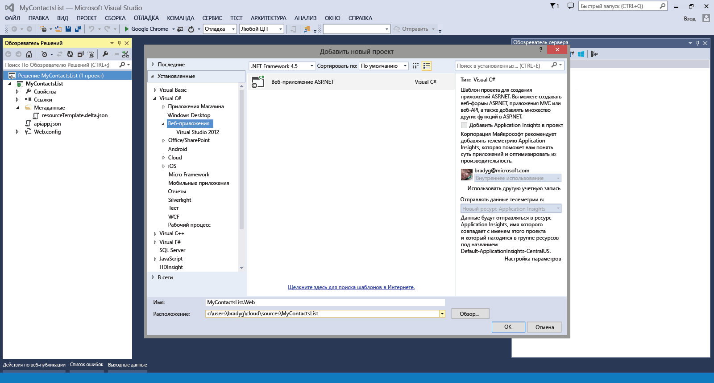
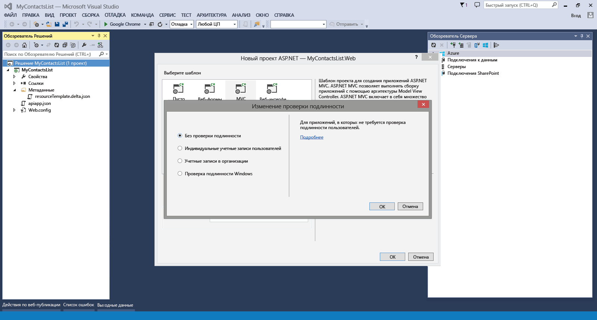
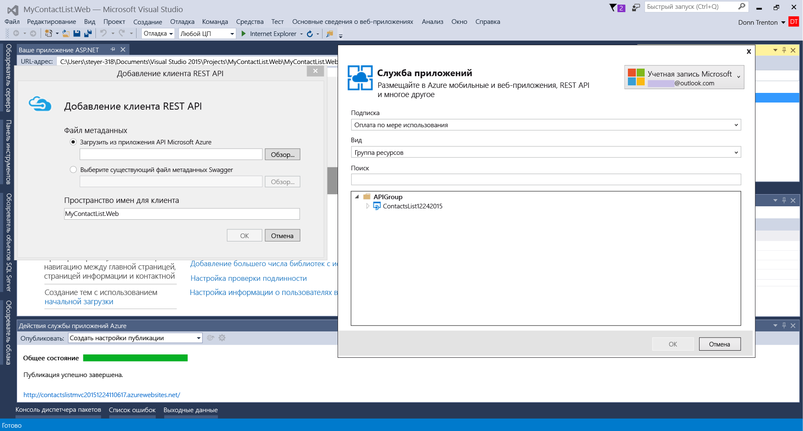
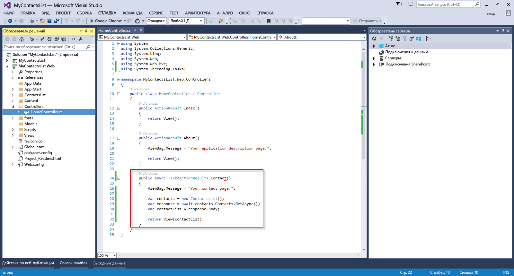
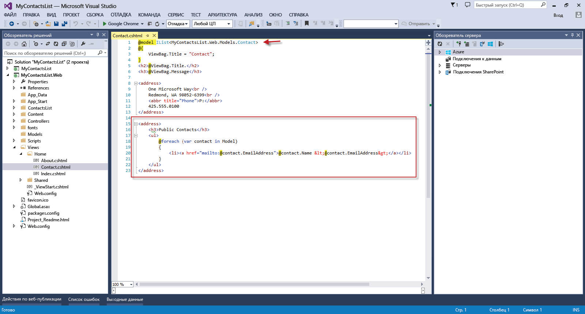

<properties 
	pageTitle="Подключение веб-приложения к приложению API в службе приложений Azure" 
	description="В этом учебнике показано, как использовать приложение API из веб-приложения ASP.NET, размещенного в службе приложений Azure." 
	services="app-service\web" 
	documentationCenter=".net" 
	authors="syntaxc4" 
	manager="yochayk" 
	editor="jimbe"/>

<tags
	ms.service="app-service-web"
	ms.devlang="dotnet"
	ms.topic="article"
	ms.tgt_pltfrm="na"
	ms.workload="na" 
	ms.date="02/26/2016"
	ms.author="cfowler"/>

# Подключение веб-приложения к приложению API в службе приложений Azure

В этом учебнике показано, как использовать приложение API из ASP.NET, размещенное в [службе приложений](https://azure.microsoft.com/services/app-service/).

## Предварительные требования

Этот учебник основан на статье [Создание приложения API Azure](../app-service-api/app-service-api-dotnet-get-started.md).

## Создание приложения ASP.NET MVC в Visual Studio

1. Откройте Visual Studio. Используйте диалоговое окно **Новый проект**, чтобы добавить новое **веб-приложение ASP.NET**. Нажмите кнопку **ОК**.

	

1. Выберите шаблон **MVC**. Щелкните **Изменить проверку подлинности**, выберите **Без проверки подлинности**, а затем дважды нажмите кнопку **ОК**.

	

1. В обозревателе решений щелкните правой кнопкой мыши только что созданный проект веб-приложения и выберите **Добавить** > **Клиент REST API…**.

	

1. В окне **Добавление клиента REST API** выберите скачивание из приложения API Microsoft Azure и нажмите кнопку "Обзор". Выберите приложение API, к которому вы хотите подключиться.

	

	>[AZURE.NOTE] Код клиента для подключения к API приложению создается автоматически из конечной точки Swagger API.

1. Чтобы использовать созданный код API, откройте файл HomeController.cs и замените действие `Contact` следующим:

	    public async Task<ActionResult> Contact()
        {
            ViewBag.Message = "Your contact page.";

            var contacts = new ContactsList12242015();
            var contactList = await contacts.Contacts.GetAsync();
            
            return View(contactList);
        }

	

1. Обновите представление `Contact` для отражения динамического списка контактов с помощью следующего кода:
	<pre>// Добавьте в самое начало файла представления
	@model IList&lt;MyContactsList.Web.Models.Contact>
	
	// Замените электронные адреса по умолчанию на следующие
	&lt;h3>Общие контакты &lt;/h3>
	&lt;ul>
	    @foreach (var contact in Model)
	    {
	        &lt;li>&lt;a href="mailto:@contact.EmailAddress">@contact.Name &amp;lt;@contact.EmailAddress&amp;gt;&lt;/a>&lt;/li>
	    }
	&lt;/ul> 
	</pre>

	

## Развертывание веб-приложения в веб-приложениях в службе приложений

Следуйте инструкциям из раздела [Развертывание веб-приложения Azure](web-sites-deploy.md).

>[AZURE.NOTE] Если вы хотите приступить к работе со службой приложений Azure до создания учетной записи Azure, перейдите к разделу [Пробное использование службы приложений](http://go.microsoft.com/fwlink/?LinkId=523751), где вы можете быстро создать кратковременное веб-приложение начального уровня в службе приложений. Никаких кредитных карт и обязательств.

## Изменения
* Указания по изменениям при переходе от веб-сайтов к службе приложений см. в разделе [Служба приложений Azure и ее влияние на существующие службы Azure](http://go.microsoft.com/fwlink/?LinkId=529714).
 

<!---HONumber=AcomDC_0518_2016-->