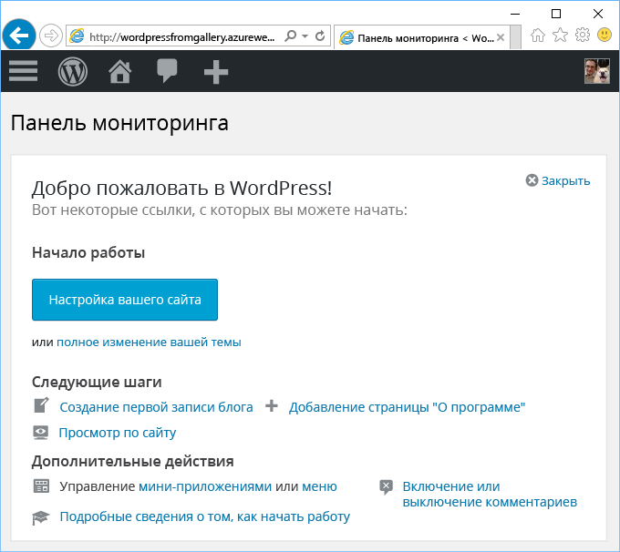

# Создание веб-приложения из Azure Marketplace
<!-- Note: This article replaces web-sites-php-web-site-gallery.md -->

[!INCLUDE [tabs](../../includes/app-service-web-get-started-nav-tabs.md)]

Azure Marketplace предоставляет широкий выбор популярных веб-приложений, разработанных сообществами ПО с открытым кодом, например WordPress и Umbraco CMS. В этом руководстве вы узнаете, как создать приложение WordPress из Azure Marketplace.
При котором создается веб-приложение Azure и база данных MySQL. 

## Перед началом работы 

Если у вас еще нет подписки Azure, [создайте бесплатную учетную запись Azure](https://azure.microsoft.com/free/?WT.mc_id=A261C142F) , прежде чем начинать работу.

## Развертывание из Azure Marketplace
Выполните приведенные ниже действия для развертывания шаблона WordPress из Azure Marketplace.

### Вход в Azure
Войдите на [портал Azure](https://portal.azure.com).

### Развертывание шаблона WordPress
Azure Marketplace предоставляет шаблоны для настройки ресурсов. Настройте шаблон [WordPress](https://portal.azure.com/#create/WordPress.WordPress), чтобы приступить к развертыванию.
   
Введите следующие сведения, чтобы развернуть приложение WordPress и его ресурсы.

  

| Поле         | Рекомендуемое значение           | Описание  |
| ------------- |-------------------------|-------------|
| Имя приложения      | mywordpressapp          | Введите уникальное **имя веб-приложения**. Это имя используется как часть DNS-имени по умолчанию для приложения `<app_name>.azurewebsites.net`, поэтому оно должно быть глобально уникальным среди всех приложений Azure. Позже вы можете сопоставить имя личного домена с приложением, перед тем как предоставить его пользователям. |
| Подписка  | Оплата по мере использования             | Выберите **подписку**. Если у вас имеется несколько подписок, выберите соответствующую подписку. |
| Группа ресурсов| mywordpressappgroup                 |    Укажите **группу ресурсов**. Группа ресурсов — это логический контейнер, в котором происходит развертывание ресурсов Azure (веб-приложений, баз данных и т. д.) и управление ими. Можно создать новую группу ресурсов или использовать существующую. |
| План обслуживания приложения | myappplan          | Планы службы приложений представляют собой коллекцию физических ресурсов, используемых для размещения приложений. Выберите **расположение** и **ценовую категорию**. Дополнительные сведения о ценах см. в разделе [Ценовая категория службы приложений](https://azure.microsoft.com/pricing/details/app-service/). |
| База данных      | mywordpressapp          | Выберите соответствующего поставщика базы данных MySQL. Веб-приложения поддерживают **ClearDB**, **базу данных Azure для MySQL** и **MySQL в приложении**. Дополнительные сведения см. в разделе [Конфигурация базы данных](#database-config) ниже. |
| Application Insights | "Вкл." или "Выкл."          | Это необязательно. Если щелкнуть **Вкл.**, [Application Insights](https://azure.microsoft.com/en-us/services/application-insights/) будет предоставлять службы мониторинга для веб-приложения.|

### Конфигурация базы данных
Выполните следующие действия в зависимости от выбранного поставщика базы данных MySQL.  Рекомендуется разместить веб-приложение и базу данных MySQL одном расположении.

#### ClearDB 
[ClearDB](https://azuremarketplace.microsoft.com/en-us/marketplace/apps/SuccessBricksInc.ClearDBMySQLDatabase?tab=Overview) — это стороннее решение для полностью интегрированной службы MySQL в Azure. Чтобы использовать базы данных ClearDB, необходимо привязать кредитную карту к своей [учетной записи Azure](http://account.windowsazure.com/subscriptions). Если выбран поставщик базы данных ClearDB, можно просмотреть список существующих баз данных, чтобы выбрать одну из них, или нажать кнопку **Создать**, чтобы создать базу данных.

#### База данных Azure для MySQL (предварительная версия)
[База данных Azure для MySQL](https://azure.microsoft.com/en-us/services/mysql) предоставляет управляемую службу базы данных для разработки и развертывания приложений, позволяющую настроить базу данных MySQL за считанные минуты, а также выполнять масштабирование на лету в надежной облачной службе. Учитывая включенные модели ценообразования, вы можете получить любые возможности, например высокий уровень доступности, требуемые безопасность и восстановление. Все эти функции встроены и предоставляются бесплатно. Щелкните **Ценовая категория**, чтобы выбрать другую [ценовую категорию](https://azure.microsoft.com/pricing/details/mysql). Чтобы использовать существующую базу данных или существующий сервер MySQL, укажите существующую группу ресурсов, в которой находится этот сервер. 

> [!NOTE]
>  База данных Azure для MySQL (предварительная версия) и веб-приложение на платформе Linux (предварительная версия) доступны не во всех регионах. Узнайте больше об ограничениях [базы данных Azure для MySQL (предварительная версия)](https://docs.microsoft.com/en-us/azure/mysql) и [веб-приложения на платформе Linux](./app-service-linux-intro.md). 

#### MySQL в приложении
[MySQL в приложении](https://blogs.msdn.microsoft.com/appserviceteam/2017/03/06/announcing-general-availability-for-mysql-in-app) — это функция службы приложений, которая позволяет запускать MySQL в собственном коде на платформе. Ниже перечислены основные функции, поддерживаемые в выпуске этой функции.

- Сервер MySQL работает на том же экземпляре, что и веб-сервер, на котором размещается сайт. Это повышает производительность вашего приложения
- Хранилище совместно используется для MySQL и файлов веб-приложения. Обратите внимание, что при использовании планов "Бесплатный" и "Общий" возможно достижение лимитов квоты при использовании сайта, в зависимости от ваших действий. Ознакомьтесь с [лимитами квоты](https://azure.microsoft.com/en-us/pricing/details/app-service/plans/) для планов "Бесплатный" и "Общий".
- Можно включить медленное ведение журнала и общее ведение журнала для MySQL. Обратите внимание, что эта функция может повлиять на производительность сайта и она не должна быть всегда включена. Функция ведения журнала помогает при анализе проблем приложения. 

Дополнительные сведения см. в [этой статье](https://blogs.msdn.microsoft.com/appserviceteam/2016/08/18/announcing-mysql-in-app-preview-for-web-apps/ ).

Во время развертывания приложения WordPress можно отслеживать ход выполнения, щелкнув значок колокольчика в верхней части страницы портала.    

## Управление новым веб-приложением Azure

Перейдите на портал Azure, чтобы просмотреть созданное приложение.

Для этого войдите на портал [https://portal.azure.com](https://portal.azure.com).

В меню слева выберите **Службы приложений**, а затем щелкните имя своего веб-приложения Azure.

Вы попадете в _колонку_ веб-приложения (страница портала, открывшаяся горизонтально).

По умолчанию колонка веб-приложения отображает страницу **обзора**. Здесь вы можете наблюдать за работой приложения. Вы также можете выполнять базовые задачи управления: обзор, завершение, запуск, перезагрузку и удаление. Вкладки в левой области колонки отображают разные страницы конфигурации, которые вы можете открыть.

На вкладках в колонке содержится множество полезных функций, которые вы можете добавить в веб-приложение. Ниже представлены лишь некоторые из возможностей:

* сопоставление настраиваемого DNS-имени;
* привязка настраиваемого SSL-сертификата;
* настройка непрерывного развертывания;
* вертикальное и горизонтальное масштабирование;
* добавление аутентификации пользователей.

Выполните инструкции мастера установки WordPress за 5 минут, чтобы настроить и запустить приложение WordPress. Ознакомьтесь с [документацией по WordPress](https://codex.WordPress.org/) для разработки веб-приложения.

## Настройка приложения 
Необходимо выполнить несколько действий по управлению приложением WordPress, прежде чем оно будет готово к использованию в рабочей среде. Выполните следующие действия, чтобы настроить приложение WordPress и управлять им.

| Для этого... | Используйте это... |
| --- | --- |
| **Отправка или хранение больших файлов** |[Подключаемый модуль WordPress для использования хранилища BLOB-объектов](https://wordpress.org/plugins/windows-azure-storage/)|
| **Отправка электронной почты** |Приобретите службу электронной почты [SendGrid](https://azuremarketplace.microsoft.com/en-us/marketplace/apps/SendGrid.SendGrid?tab=Overview) и используйте [подключаемый модуль WordPress для использования SendGrid](https://wordpress.org/plugins/sendgrid-email-delivery-simplified/), чтобы настроить ее.|
| **Личные доменные имена** |[Настройка личного доменного имени в службе приложений Azure](app-service-web-tutorial-custom-domain.md) |
| **HTTPS** |[Включите протокол HTTPS для веб-приложения в службе приложений Azure](app-service-web-tutorial-custom-ssl.md). |
| **Предварительная проверка** |[Настройте промежуточную среду и среду разработки для веб-приложений в службе приложений Azure](web-sites-staged-publishing.md).|
| **Мониторинг и устранение неполадок** |[Включите ведение журнала диагностики для веб-приложений в службе приложений Azure](web-sites-enable-diagnostic-log.md) и [осуществляйте мониторинг веб-приложений в службе приложений Azure](app-service-web-tutorial-monitoring.md). |
| **Развертывание сайта** |[Разверните веб-приложение в службе приложений Azure](app-service-deploy-local-git.md). |

## Защита приложения 
Необходимо выполнить несколько действий по управлению приложением WordPress, прежде чем оно будет готово к использованию в рабочей среде. Выполните следующие действия, чтобы настроить приложение WordPress и управлять им.

| Для этого... | Используйте это... |
| --- | --- |
| **Надежное имя пользователя и пароль**|  Часто изменяйте пароль. Не применяйте часто используемые имена пользователей, например *admin* или *wordpress* и т. д. Предпишите всем пользователям WordPress использовать уникальные имена пользователей и надежные пароли. |
| **Установка обновлений** | Обновляйте ядро, темы и подключаемые модули WordPress. Используйте последнюю версию среды выполнения PHP, доступную в службе приложений Azure. |
| **Обновление ключей безопасности WordPress** | Обновляйте [ключ безопасности WordPress](https://codex.wordpress.org/Editing_wp-config.php#Security_Keys) для улучшения шифрования хранящихся файлов cookie.|

## Повышение производительности
Производительность в облаке достигается в основном через кэширование и масштабирование, но следует также учитывать память, пропускную способность и другие атрибуты размещения веб-приложений.

| Для этого... | Используйте это... |
| --- | --- |
| **Общая информация о возможностях экземпляра службы приложений** |[Информация о ценах, в том числе о возможностях уровней службы приложений](https://azure.microsoft.com/en-us/pricing/details/app-service/).|
| **Ресурсы кэша** |Используйте [кэш Redis для Azure](https://azure.microsoft.com/en-us/services/cache/) или другое предложение для кэширования в [службе хранилища Azure](https://azuremarketplace.microsoft.com). |
| **Масштабирование приложения** |Необходимо масштабировать [веб-приложение в службе приложений Azure](web-sites-scale.md) и (или) базу данных MySQL. Функция "MySQL в приложении" не поддерживает развертывание, поэтому выберите ClearDB или базу данных Azure для MySQL (предварительная версия). [Масштабируйте базу данных Azure для MySQL (предварительная версия)](https://azure.microsoft.com/en-us/pricing/details/mysql/) или используйте [высокий уровень доступности Cleardb](http://w2.cleardb.net/faqs/), чтобы увеличивать масштаб базы данных. |

## Доступность и аварийное восстановление
Высокий уровень доступности включает в себя аварийное восстановление, обеспечивающее непрерывность бизнес-процессов. Любой план реагирования на сбои и аварии в облаке предполагает быстрое обнаружение сбоев. Эти решения помогают реализовать стратегию для обеспечения высокого уровня доступности.

| Для этого... | Используйте это... |
| --- | --- |
| **Сайты балансировки нагрузки** или **геораспределенные сайты** |[Используйте маршрутизацию трафика с помощью диспетчера трафика Azure](https://azure.microsoft.com/en-us/services/traffic-manager/). |
| **Архивация и восстановление** |[Архивируйте веб-приложение в Azure](web-sites-backup.md) и [восстанавливайте веб-приложение в Azure](web-sites-restore.md). |

## Дальнейшие действия
Узнайте о различных функциях [службы приложений для разработки и масштабирования](/app-service-web/).
