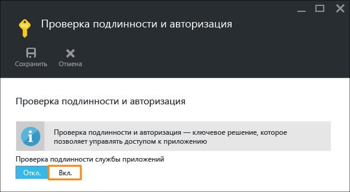

<properties 
	pageTitle="Начало работы с веб-приложениями в службе приложений Azure (часть 2)" 
	description="Быстрое добавление важных возможностей в веб-приложение в службе приложений." 
	services="app-service\web"
	documentationCenter=""
	authors="cephalin" 
	manager="wpickett" 
	editor="" 
/>

<tags 
	ms.service="app-service-web" 
	ms.workload="web" 
	ms.tgt_pltfrm="na" 
	ms.devlang="na" 
	ms.topic="hero-article"
	ms.date="03/17/2016" 
	ms.author="cephalin"
/>

# Начало работы со службой приложений Azure (часть 2)

Выполнив инструкции из статьи [Начало работы с веб-приложениями в службе приложений Azure](app-service-web-get-started.md), вы развернули веб-приложение в службу приложений Azure и настроили все для быстрых и удобных обновлений. Следуя инструкциям из этой статьи, вы сможете добавить в развернутое приложение некоторые важные функции для поддержания его правильной работы. Сделав это, вы поймете, что служба приложений — это не только хостер веб-сайтов. Она привносит в приложения возможности корпоративного уровня. Благодаря этому разработчики могут сконцентрироваться на творческих аспектах, тогда как за соблюдением требований к безопасности, масштабируемости, производительности, управлению и др. будет следить служба.

Из этой статьи вы узнаете, как:

- применять обязательную проверку подлинности для пользователей;
- автоматически масштабировать приложения;
- получать оповещения о производительности приложения.

Приведенное здесь руководство можно использовать независимо от того, какой пример приложения вы развернули во время изучения предыдущей статьи.

## Проверка подлинности пользователей

Добавить в приложение проверку подлинности очень просто.

1. В колонке портала для вашего приложения щелкните **Параметры** > **Проверка подлинности и авторизация**. 
    
2. Щелкните **Вкл.**, чтобы включить проверку подлинности. 
    
4. В разделе **Поставщики проверки подлинности** щелкните **Azure Active Directory**. 

5. В колонке **Параметры Azure Active Directory** щелкните **Стандартные**, затем нажмите кнопку **ОК**. В соответствии с параметрами по умолчанию в вашем каталоге по умолчанию будет создано новое приложение Azure AD. 

6. Щелкните **Сохранить**. 

    После успешного внесения изменений значок звонка станет зеленым и появится соответствующее сообщение.

7. В колонке портала для вашего приложения щелкните ссылку **URL-адрес** (или нажмите кнопку **Обзор** в строке меню). Ссылка является HTTP-адресом.  Когда приложение откроется в новой вкладке, браузер выполнит несколько перенаправлений. В итоге вы попадете на страницу своего приложения с адресом HTTPS. Вы увидите, что вы уже вошли в учетную запись Майкрософт с помощью подписки Azure и автоматически вошли в приложение с использованием этой учетной записи.  Если вы откроете сеанс, который не прошел проверку подлинности, в другом браузере, при переходе по тому же URL-адресу вы увидите экран входа:  Если вы раньше не работали с Azure Active Directory, в каталоге по умолчанию, скорее всего, не будет пользователей Azure AD. Вероятно, там будет только ваша учетная запись Майкрософт с подпиской Azure. Именно поэтому вы смогли автоматически войти в приложение в том же браузере ранее. Ту же учетную запись Майкрософт можно использовать для входа и на этой странице.

Поздравляем, теперь на вашем веб-сайте проверяется подлинность всего трафика.

Вы могли заметить, что в колонке **Проверка подлинности и авторизация** можно настроить и другие возможности, в частности:

- разрешить вход с помощью учетных записей социальных сетей;
- включить несколько вариантов входа в систему;
- изменить стандартное поведение во время первого перехода пользователя к вашему приложению.

Служба приложений предоставляет готовое решение для некоторых распространенных сценариев проверки подлинности, поэтому вам не нужно самостоятельно организовывать логику проверки подлинности. Дополнительные сведения см. в статье [App Service Authentication/Authorization](/blog/announcing-app-service-authentication-authorization/) (Проверка подлинности и авторизация службы приложений).

## Масштабирование и развертывание приложения

Давайте увеличим масштаб приложения. Приложение в службе приложений можно масштабировать двумя способами.

- [Увеличение масштаба](https://en.wikipedia.org/wiki/Scalability#Horizontal_and_vertical_scaling). При масштабировании приложения в службе приложений вы изменяете ценовую категорию плана службы приложений, к которой принадлежит приложение. Масштабирование не только обеспечивает увеличение показателей таких параметров, как ЦП, память и дисковое пространство, но и дает вам дополнительные преимущества, например выделенные экземпляры виртуальных машин, автоматическое масштабирование, соглашение об уровне обслуживания на уровне 99,95 %, личные домены, пользовательские сертификаты SSL, слоты развертывания, резервное копирование и восстановление и многое другое. Чем выше уровень, тем больше функций доступно для приложения.  
- [Развертывание](https://en.wikipedia.org/wiki/Scalability#Horizontal_and_vertical_scaling). При развертывании приложения в службе приложений вы изменяете количество экземпляров виртуальных машин, на которых работает приложение (или приложения в рамках одного плана службы приложений). Если для вашего приложения используется план "Стандартный" и выше, вы можете включить автоматическое масштабирование экземпляров виртуальных машин на основе метрик производительности. 

Теперь давайте настроим автоматическое масштабирование для вашего приложения.

1. Сначала мы увеличим масштаб, чтобы включить автоматическое масштабирование. В колонке портала для вашего приложения щелкните **Параметры** > **Увеличить масштаб (план службы приложений)**. 

2. Прокрутите список и выберите уровень **Стандартный S1** (выделен на снимке экрана). Это минимальный уровень, на котором возможно автоматическое масштабирование. Затем нажмите кнопку **Выбрать**. 

    Вот и все, что нужно было сделать для увеличения масштаба.
    
    >[AZURE.IMPORTANT] После выбора этого уровня все кредиты бесплатной пробной версии исчезнут. При использовании платной учетной записи c вас будет взиматься плата.
    
3. Теперь давайте настроим автоматическое масштабирование. В колонке портала для вашего приложения щелкните **Параметры** > **Расширить (план службы приложений)**. 

4. Для параметра **Масштабировать по** выберите значение **Процент ЦП**. Ползунки под раскрывающимся списком займут соответствующие места. Затем определите диапазон **экземпляров** (от **1** до **2**) и **целевой диапазон** (от **40** до **80**). Эти значения можно ввести вручную или задать с помощью ползунков. 
    
    На основе этой конфигурации приложение будет автоматически развертываться, если загрузка ЦП превысит 80 %, и свертываться, если загрузка ЦП будет меньше 40 %.
    
5. В строке меню нажмите кнопку **Сохранить**.

Поздравляем! Вы настроили для своего приложения автоматическое масштабирование.

Возможно, вы обратили внимание, что в колонке **Настройки масштабирования** можно настроить и другие возможности, в частности:

- масштабирование до определенного числа экземпляров вручную;
- масштабирование с учетом других метрик производительности, таких как процент использования памяти и очередь диска;
- настройка поведения масштабирования при запуске правила производительности;
- автоматическое масштабирование по расписанию;
- настройка поведения автоматического масштабирования для будущих событий.

Дополнительные сведения см. в статье [Масштабирование ценовой категории в службе приложения Azure](../app-service/app-service-scale.md). Дополнительные сведения см. в статье [Масштабирование числа экземпляров вручную или автоматически](../azure-portal/insights-how-to-scale.md).

## Получение оповещений о приложении

Теперь, когда для приложения настроено автоматическое масштабирование, что произойдет при достижении максимального числа экземпляров (2) и превышении желаемой нормы загрузки ЦП (80 %)? Настроив оповещения, вы будете получать информацию о возникновении таких ситуаций и сможете, например, еще больше увеличить масштаб приложения. Давайте быстро настроим оповещение для такого сценария.

1. В колонке портала для вашего приложения щелкните **Средства** > **Оповещения**. 

2. Нажмите кнопку **Добавить оповещение**. Затем в раскрывающемся списке **Ресурс** выберите ресурс, который заканчивается на **(serverfarms)**. Это ваш план службы приложений. 

3. Укажите для параметра **Имя** значение `CPU Maxed`, для параметра **Метрика** — **Процент ЦП**, а для параметра **Пороговое значение** — `90`. После этого установите флажок **Сообщать по электронной почте владельцам, участникам и читателям** и нажмите кнопку **ОК**. 
    
    Когда Azure завершит создание оповещения, вы увидите его в колонке **Предупреждения**. 

Поздравляем! Вы настроили получение оповещений.

Эта настройка оповещений теперь будет проверять использование ЦП каждые пять минут. Если процент использования превысит 90 %, вы получите оповещение по электронной почте. Его также получат другие пользователи, у которых есть для этого необходимые права. Чтобы просмотреть, кто имеет право получать оповещения, вернитесь в колонку портала для вашего приложения и нажмите кнопку **Доступ**. 

Вы увидите, что **администраторы подписки** уже входят в группу **владельцев** приложения. В эту группу также входите вы, если вы являетесь администратором учетной записи подписки Azure (например, своей пробной подписки). Дополнительные сведения об управлении доступом на основе ролей см. в статье [Управление доступом на основе ролей в Azure](../active-directory/role-based-access-control-configure.md).

## Дальнейшие действия

Во время настройки оповещений вы, возможно, заметили большой набор средств в колонке **Средства**. С их помощью можно устранять неполадки, наблюдать за производительностью, проверять наличие уязвимостей, управлять ресурсами, взаимодействовать с консолью виртуальной машины и добавлять полезные расширения. Изучите их все. Так вы поймете, насколько простые и в то же время мощные инструменты у вас всегда есть под рукой.

Ознакомьтесь с дополнительной информацией о работе с развернутым приложением. Ниже приведен неполный список ресурсов.

- [Приобретение и настройка личного домена для службы приложений Azure](custom-dns-web-site-buydomains-web-app.md)
- [Настройка промежуточных сред для веб-приложений в службе приложений Azure](web-sites-staged-publishing.md)
- [Непрерывное развертывание с использованием GIT в службе приложений Azure](web-sites-publish-source-control.md)
- [Резервное копирование веб-приложений в службе приложений Azure](web-sites-backup.md)
- [Включение ведения журнала диагностики для веб-приложений в службе приложений Azure](web-sites-enable-diagnostic-log.md)
- [Доступ к локальным ресурсам с помощью гибридных подключений в службе приложений Azure](web-sites-hybrid-connection-get-started.md)
- [Принцип работы службы приложений](../app-service/app-service-how-works-readme.md) 

<!---HONumber=AcomDC_0323_2016-->