# Добавление функциональных возможностей в первое веб-приложение
Выполнив инструкции из статьи [Развертывание первого веб-приложения в Azure за пять минут](app-service-web-get-started-cli-nodejs.md), вы развернули пример веб-приложения в [службе приложений Azure](../app-service/app-service-value-prop-what-is.md). Эта статья поможет быстро добавить в развернутое веб-приложение некоторые важные функции. Через несколько минут вы научитесь:

* применять обязательную проверку подлинности для пользователей;
* автоматически масштабировать приложение;
* получать оповещения о производительности приложения;

Приведенное здесь руководство можно использовать независимо от того, какой пример приложения вы развернули во время изучения предыдущей статьи.

Три действия в этом руководстве — это лишь некоторые примеры из множества полезных функций, которыми можно пользоваться при размещении веб-приложения в службе приложений. Многие функции доступны на уровне **Бесплатный** (на нем работает первое веб-приложение). Можно также использовать кредиты пробной версии, чтобы испытать функции из более высоких ценовых категорий. Вы можете быть уверены, что веб-приложение останется на уровне **Бесплатный**, если явно не переводить его в другую ценовую категорию.

> [!NOTE]
> Веб-приложение, созданное с помощью интерфейса командной строки Azure, работает на уровне **Бесплатный**, где допускается только один общий экземпляр виртуальной машины с квотами ресурсов. Дополнительные сведения о ресурсах, доступных на уровне **Бесплатный**, см. в разделе [Ограничения службы приложений](../azure-subscription-service-limits.md#app-service-limits).
> 
> 

## Проверка подлинности пользователей
Теперь рассмотрим, как добавить в приложение проверку подлинности (дополнительные сведения см. в записи блога о [проверке подлинности и авторизации в службе приложений](https://azure.microsoft.com/blog/announcing-app-service-authentication-authorization/)).

1. На портале откройте колонку своего приложения и щелкните **Параметры** > **Проверка подлинности и авторизация**.  
    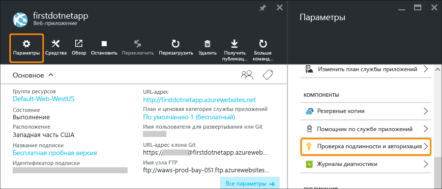
2. Щелкните **Вкл.** , чтобы включить проверку подлинности.  
3. В разделе **Поставщики проверки подлинности** щелкните **Azure Active Directory**.  
    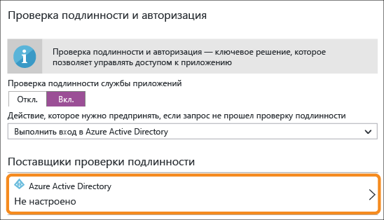
4. В колонке **Параметры Azure Active Directory** щелкните **Экспресс**, а затем нажмите кнопку **ОК**. В соответствии с параметрами по умолчанию в вашем каталоге по умолчанию будет создано новое приложение Azure AD.  
    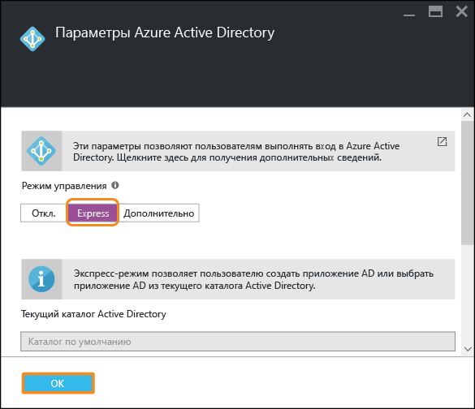
5. Щелкните **Сохранить**.  
    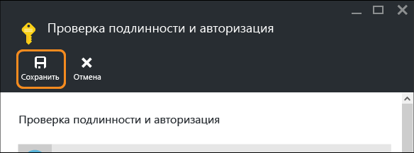
   
    После успешного внесения изменений значок звонка станет зеленым и появится соответствующее сообщение.
6. На портале в колонке своего приложения щелкните ссылку с **URL-адресом** или нажмите кнопку **Обзор** в строке меню. Ссылка является HTTP-адресом.  
    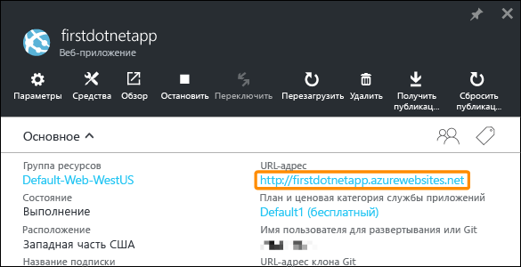  
    Когда приложение откроется в новой вкладке, браузер выполнит несколько перенаправлений. В итоге откроется страница приложения с адресом HTTPS. Вход в подписку Azure и проверка подлинности в приложении будут выполнены автоматически.  
    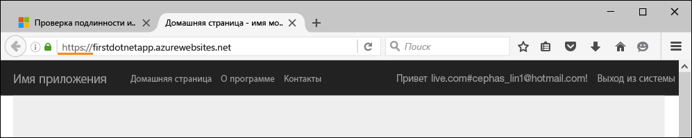  
    Поэтому, если сейчас открыть сеанс без проверки подлинности в другом браузере, можно увидеть экран входа при переходе на тот же URL-адрес.  
    <!-- 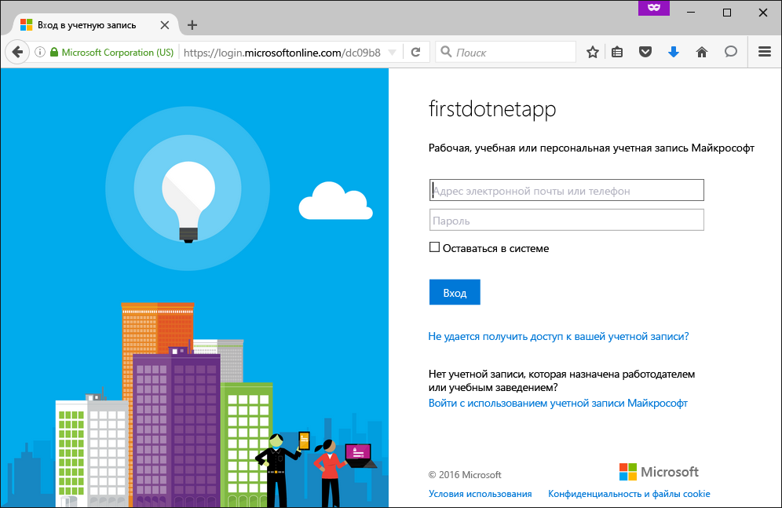  -->
    Если вы никогда не работали с Azure Active Directory, ваш каталог по умолчанию может не содержать всех пользователей Azure AD. Вероятно, там будет только ваша учетная запись Майкрософт с подпиской Azure. Именно поэтому вы смогли автоматически войти в приложение в том же браузере ранее.
   Ту же учетную запись Майкрософт можно использовать для входа и на этой странице.

Поздравляем, теперь в вашем веб-приложении проверяется подлинность всего трафика.

Вы могли заметить, что в колонке **Проверка подлинности и авторизация** можно настроить и другие возможности, в частности:

* разрешить вход с помощью учетных записей социальных сетей;
* включить несколько вариантов входа в систему;
* изменить стандартное поведение приложения при первом входе пользователя;

Служба приложений предоставляет готовое решение для некоторых распространенных сценариев проверки подлинности, поэтому вам не нужно самостоятельно организовывать логику проверки подлинности.
Дополнительные сведения см. в записи блога о [проверке подлинности и авторизации в службе приложений](https://azure.microsoft.com/blog/announcing-app-service-authentication-authorization/).

## Автоматическое масштабирование приложения по требованию
Теперь выполним автоматическое масштабирование приложения, чтобы оно автоматически изменяло свою производительность по требованию пользователя. Дополнительные сведения см. в статьях [Увеличение масштаба приложения в Azure](web-sites-scale.md) и [Масштабирование числа экземпляров вручную или автоматически](../monitoring-and-diagnostics/insights-how-to-scale.md).

Веб-приложение можно масштабировать двумя способами.

* [Увеличение масштаба](https://en.wikipedia.org/wiki/Scalability#Horizontal_and_vertical_scaling) — получение дополнительных ресурсов, в том числе ЦП, памяти и места на диске, и дополнительных возможностей, таких как выделенные виртуальные машины, пользовательские домены и сертификаты, промежуточные слоты, автоматическое масштабирование и т. д. Масштаб приложения можно увеличить, изменив ценовую категорию плана службы приложений, к которой относится приложение.
* [Развертывание](https://en.wikipedia.org/wiki/Scalability#Horizontal_and_vertical_scaling)— увеличение количества экземпляров виртуальных машин, на которых работает приложение.
  В зависимости от ценовой категории вы можете развернуть приложение на виртуальных машинах в количестве до 50 экземпляров.

Теперь настроим автоматическое масштабирование.

1. Сначала мы увеличим масштаб, чтобы включить автоматическое масштабирование. На портале в колонке своего приложения щелкните **Параметры** > **Увеличить масштаб (план службы приложений)**.  
    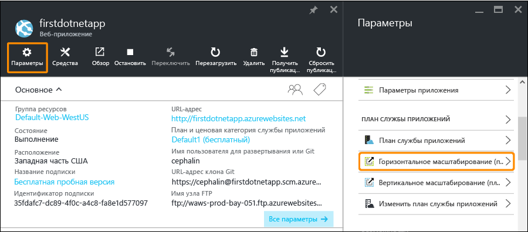
2. Прокрутите список и выберите уровень **Стандартный S1** (выделен на снимке экрана). Это минимальный уровень, на котором возможно автоматическое масштабирование. Затем нажмите кнопку **Выбрать**.  
    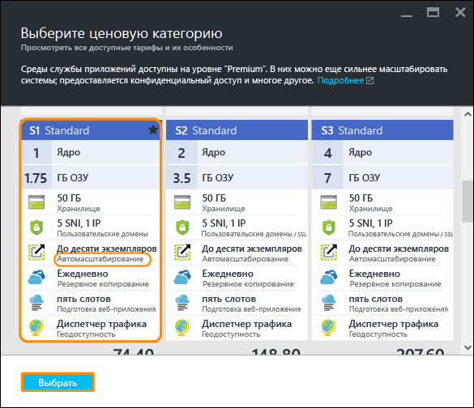
   
    Вот и все, что нужно было сделать для увеличения масштаба.
   
   > [!IMPORTANT]
   > Для этого уровня нужно потратить кредиты на бесплатную пробную версию. Если ваша учетная запись предусматривает оплату за использование, c вас будет взиматься плата.
   > 
   > 
3. Теперь давайте настроим автоматическое масштабирование. На портале в колонке своего приложения щелкните **Параметры** > **Расширить (план службы приложений)**.  
    
4. Для параметра **Режим масштабирования** выберите значение **Процент ЦП**. Ползунки под раскрывающимся списком займут соответствующие места. Затем определите диапазон **экземпляров** (от **1** до **2**) и **целевой диапазон** (от **40** до **80**). Эти значения можно ввести вручную или задать с помощью ползунков.  
    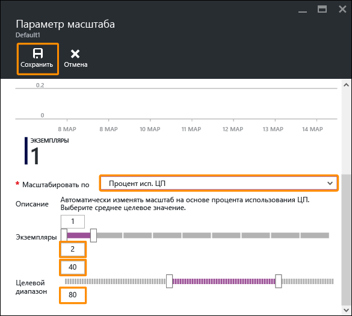
   
    При таких настройках приложение будет автоматически развертываться, если загрузка ЦП превысит 80 %, и свертываться, если загрузка ЦП будет меньше 40 %.
5. В строке меню нажмите кнопку **Сохранить** .

Поздравляем! Вы настроили для своего приложения автоматическое масштабирование.

Возможно, вы обратили внимание, что в колонке **Настройки масштабирования** можно настроить и другие возможности, в частности:

* масштабирование до определенного числа экземпляров вручную;
* масштабирование с учетом других метрик производительности, таких как процент использования памяти и очередь диска;
* настройка поведения масштабирования при запуске правила производительности;
* автоматическое масштабирование по расписанию;
* настройка поведения автоматического масштабирования для будущих событий.

Дополнительные сведения см. в статье [Увеличение масштаба приложения в Azure](web-sites-scale.md). Дополнительные сведения см. в статье [Масштабирование числа экземпляров вручную или автоматически](../monitoring-and-diagnostics/insights-how-to-scale.md).

## Получение оповещений о приложении
Теперь, когда для приложения настроено автоматическое масштабирование, что произойдет при достижении максимального числа экземпляров (2) и превышении желаемой нормы загрузки ЦП (80 %)?
Настроив оповещения (дополнительную информацию см. в статье [Создание оповещений для служб Azure с помощью портала Azure](../monitoring-and-diagnostics/insights-receive-alert-notifications.md)), вы будете получать информацию о возникновении таких ситуаций и сможете, например, еще больше увеличить масштаб приложения. Давайте быстро настроим оповещение для такого сценария.

1. На портале в колонке приложения щелкните **Средства** > **Оповещения**.  
    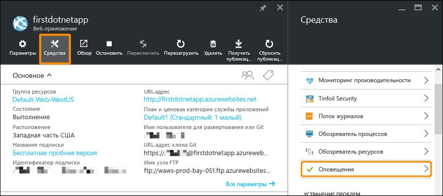
2. Нажмите кнопку **Добавить оповещение**. Затем в раскрывающемся списке **Ресурс** выберите тот, который заканчивается на **(serverfarms)**. Это ваш план службы приложений.  
    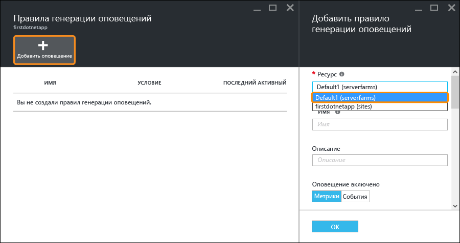
3. Укажите для параметра **Имя** значение `CPU Maxed`, для параметра **Метрика** — **Процент ЦП**, а для параметра **Пороговое значение** — `90`. После этого установите флажок **Участники, читатели и владельцы электронной почты** и нажмите кнопку **ОК**.   
    
   
    Когда Azure завершит создание оповещения, вы увидите его в колонке **Предупреждения** .  
    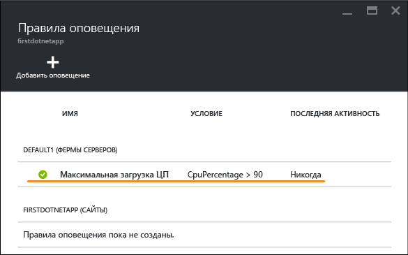

Поздравляем! Вы настроили получение оповещений.

При такой настройке оповещений использование ЦП проверяется каждые пять минут. Если процент использования превысит 90 %, вы получите оповещение по электронной почте. Его также получат другие пользователи, у которых есть для этого необходимые права. Чтобы просмотреть, кто имеет право получать оповещения, вернитесь в колонку своего приложения на портале и нажмите кнопку **Доступ**.  
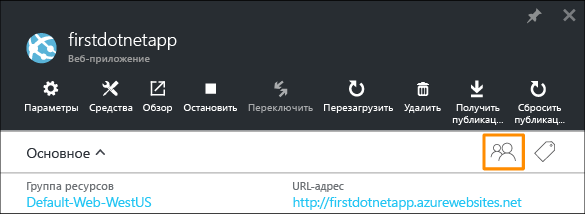

Вы увидите, что **администраторы подписки** уже входят в группу **владельцев** приложения. Если вы являетесь администратором учетной записи подписки Azure (например, пробной подписки), вы также входите в эту группу. Дополнительные сведения об управлении доступом на основе ролей см. в [этой статье](../active-directory/role-based-access-control-configure.md).

> [!NOTE]
> Правила Azure — это функция Azure. Дополнительные сведения см. в статье [Создание оповещений для служб Azure с помощью портала Azure](../monitoring-and-diagnostics/insights-receive-alert-notifications.md).
> 
> 

## Дальнейшие действия
Во время настройки оповещений можно заметить большой набор средств в колонке **Средства**. С их помощью можно устранять неполадки, наблюдать за производительностью, проверять наличие уязвимостей, управлять ресурсами, взаимодействовать с консолью виртуальной машины и добавлять полезные расширения. Изучите их все. Так вы поймете, насколько простые и в то же время мощные инструменты у вас всегда есть под рукой.

Ознакомьтесь с дополнительной информацией о работе с развернутым приложением. Вот только некоторые из возможностей.

* [Приобретение и настройка личного домена для службы приложений Azure.](custom-dns-web-site-buydomains-web-app.md) Приобретите для веб-приложения домен с привлекательным именем, который будет использоваться вместо домена *.azurewebsites.net domain. Или используйте свой домен.
* [Настройка промежуточных сред для веб-приложений в службе приложений Azure.](web-sites-staged-publishing.md) Разверните приложение в промежуточном URL-адресе, прежде чем поместить его в рабочую среду. Уверенно обновляйте свое веб-приложение. Настройте решение для разработки DevOps с несколькими слотами развертывания.
* [Настройка непрерывного развертывания.](app-service-continuous-deployment.md) Интегрируйте развертывание приложения в систему управления версиями. Развертывайте каждую фиксацию в Azure.
* [Доступ к локальным ресурсам с помощью гибридных подключений в службе приложений Azure.](web-sites-hybrid-connection-get-started.md) Обращайтесь к существующей локальной базе данных или системе CRM.
* [Резервное копирование веб-приложений в службе приложений Azure.](web-sites-backup.md) Настройте резервное копирование и восстановление веб-приложения. Подготовьтесь к неожиданным сбоям и восстановлению после них.
* [Включение ведения журнала диагностики для веб-приложений в службе приложений Azure.](web-sites-enable-diagnostic-log.md) Читайте журналы IIS из трассировки Azure или приложения. Читайте журналы в потоке, загружайте их или передавайте в [Application Insights](../application-insights/app-insights-overview.md) для анализа "под ключ".
* [Web Vulnerability Scanning for Azure App Service powered by Tinfoil Security](https://azure.microsoft.com/blog/web-vulnerability-scanning-for-azure-app-service-powered-by-tinfoil-security/) (Сканирование веб-уязвимостей службы приложений Azure с помощью Tinfoil Security). -
   Просканируйте свое веб-приложение на уязвимость перед современными угрозами с помощью службы [Tinfoil Security](https://www.tinfoilsecurity.com/).
* [Обзор функций Azure.](../azure-functions/functions-overview.md) Выполнение заданий по обработке данных, созданию отчетов и т. д.
* [Принцип работы службы приложений](../app-service/app-service-how-works-readme.md)

