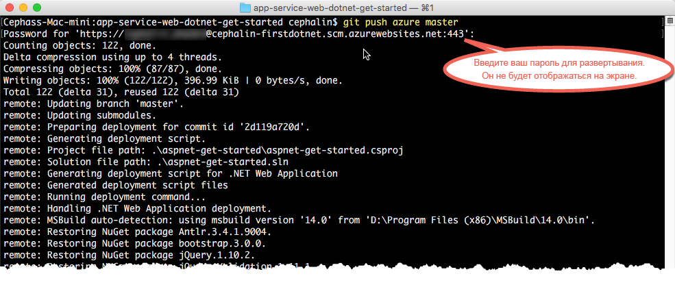

# Развертывание первого веб-приложения ASP.NET в Azure за пять минут (предварительная версия CLI 2.0)

> [!div class="op_single_selector"]
> * [Первый HTML-сайт](app-service-web-get-started-html.md)
> * [Первое приложение .NET](app-service-web-get-started-dotnet.md)
> * [Первое приложение PHP](app-service-web-get-started-php.md)
> * [Первое приложение Node.js](app-service-web-get-started-nodejs.md)
> * [Первое приложение Python](app-service-web-get-started-python.md)
> * [Первое приложение Java](app-service-web-get-started-java.md)
> 
> 

Это руководство поможет вам развернуть простое веб-приложение ASP.NET в [службе приложений Azure](../app-service/app-service-value-prop-what-is.md).
В службе приложений можно создавать веб-приложения, [серверные части мобильных приложений](/documentation/learning-paths/appservice-mobileapps/) и [приложения API](../app-service-api/app-service-api-apps-why-best-platform.md).

Вы сможете выполнять следующие задачи: 

* создавать веб-приложения в службе приложений Azure;
* развертывать образцы кода ASP.NET;
* просматривать код, выполняющийся в рабочей среде в реальном времени;
* обновлять веб-приложение так же, как вы [отправляете фиксации Git](https://git-scm.com/docs/git-push).

[!INCLUDE [app-service-linux](../../includes/app-service-linux.md)]

## Версии интерфейса командной строки для выполнения задачи

Вы можете выполнить задачу, используя одну из следующих версий интерфейса командной строки.

- [Azure CLI 1.0](app-service-web-get-started-dotnet-cli-nodejs.md) — интерфейс командной строки для классической модели развертывания и модели развертывания Resource Manager.
- [Azure CLI 2.0 (предварительная версия)](app-service-web-get-started-dotnet.md) — интерфейс командной строки нового поколения для модели развертывания Resource Manager.

## Предварительные требования
* [Git](http://www.git-scm.com/downloads).
* [Azure CLI 2.0 (предварительная версия)](/cli/azure/install-az-cli2).
* Учетная запись Microsoft Azure. Если у вас нет учетной записи, [подпишитесь на бесплатную пробную версию](https://azure.microsoft.com/pricing/free-trial/?WT.mc_id=A261C142F) или [активируйте преимущества для подписчиков Visual Studio](https://azure.microsoft.com/pricing/member-offers/msdn-benefits-details/?WT.mc_id=A261C142F).

> [!NOTE]
> [Пробное использование службы приложений](http://go.microsoft.com/fwlink/?LinkId=523751) возможно даже без учетной записи Azure. Вы можете создать приложение начального уровня и экспериментировать с ним в течение часа. Для этого вам не нужно указывать данные кредитной карты или брать на себя какие-либо обязательства.
> 
> 

## Развертывание веб-приложения ASP.NET
1. Откройте новое окно командной строки Windows, окно PowerShell, оболочку Linux или терминал OS X. Выполните команды `git --version` и `azure --version`, чтобы убедиться, что система GIT и интерфейс командной строки Azure установлены на компьютере.
   
    
   
    Если вы еще не установили необходимые инструменты, то ссылки для их скачивания доступны в разделе [Предварительные требования](#Prerequisites).
2. Войдите в Azure:
   
        az login
   
    Следуйте инструкциям из справочного сообщения, чтобы продолжить процесс входа в систему.
   
    

3. Укажите пользователя развертывания для службы приложений. Вы развернете код позже с помощью этих учетных данных.
   
        az appservice web deployment user set --user-name <username> --password <password>

3. Создайте [группу ресурсов](../azure-resource-manager/resource-group-overview.md). В рамках этого руководства по использованию службы приложений вам не обязательно знать, что это такое.

        az group create --location "<location>" --name my-first-app-group

    Чтобы увидеть доступные значения для `<location>`, используйте команду `az appservice list-locations` интерфейса командной строки.

3. Создайте [план службы приложений](../app-service/azure-web-sites-web-hosting-plans-in-depth-overview.md) уровня "Бесплатный". В рамках этого руководства по использованию службы приложений вам достаточно знать, что это план не предусматривает выставление счетов за веб-приложения.

        az appservice plan create --name my-free-appservice-plan --resource-group my-first-app-group --sku FREE

4. Создайте веб-приложение с уникальным именем в `<app_name>`.

        az appservice web create --name <app_name> --resource-group my-first-app-group --plan my-free-appservice-plan

4. Затем получите пример кода ASP.NET, который необходимо развернуть. Перейдите в рабочий каталог (`CD`) и клонируйте пример приложения следующим образом:
   
        cd <working_directory>
        git clone https://github.com/Azure-Samples/app-service-web-dotnet-get-started.git

5. Перейдите в репозиторий примера приложения. 
   
        cd app-service-web-dotnet-get-started
5. Настройте локальное развертывание Git для веб-приложения службы приложений с помощью следующей команды:

        az appservice web source-control config-local-git --name <app_name> --resource-group my-first-app-group

    Если вы получите приблизительно следующие выходные данные JSON, это значит, что удаленный репозиторий Git настроен:

        {
        "url": "https://<deployment_user>@<app_name>.scm.azurewebsites.net/<app_name>.git"
        }

6. Добавьте URL-адрес в JSON в качестве удаленного репозитория Git для локального репозитория (для простоты называется `azure`).

        git remote add azure https://<deployment_user>@<app_name>.scm.azurewebsites.net/<app_name>.git
   
7. Разверните пример кода в приложении Azure так же, как вы отправляете любой код с помощью Git. При появлении запроса введите пароль, который вы настроили ранее.
   
        git push azure master
   
    
   
    `git push` не только помещает код в Azure, но также восстанавливает требуемые пакеты и создает двоичные файлы ASP.NET. 

Поздравляем, вы развернули свое приложение в службе приложений Azure.

## Наблюдение за работой приложения в реальном времени
Чтобы увидеть работу приложения в Azure в реальном времени, выполните в любом каталоге репозитория следующую команду:

    azure site browse

## Обновление приложения
Теперь с помощью Git можно в любой момент передать на рабочий сайт изменения из корневого каталога проекта (репозитория). Для этого нужно выполнить те же действия, что и при первом развертывании кода. Например, каждый раз, когда вам нужно отправить новое изменение, протестированное локально, просто выполните следующие команды из корневого каталога проекта (репозитория):

    git add .
    git commit -m "<your_message>"
    git push azure master

## Дальнейшие действия
Прочтите статью [Развертывание веб-приложения ASP.NET в службе приложений Azure с помощью Visual Studio](web-sites-dotnet-get-started.md), чтобы узнать, как создавать, разрабатывать и развертывать веб-приложения .NET в Azure непосредственно в среде Visual Studio.

Вы также можете продолжить работу над своим первым веб-приложением. Например:

* Попробуйте [другие способы развертывания кода в Azure](web-sites-deploy.md). Например, чтобы развернуть приложение из какого-либо репозитория на GitHub, в разделе **Параметры развертывания** нужно просто указать **GitHub**, а не **Локальный репозиторий Git**.
* Выведите приложение Azure на следующий уровень. Проверяйте подлинность пользователей. Масштабируйте приложение в зависимости от потребностей. Настраивайте оповещения производительности. И все это — с помощью нескольких действий. См. статью [Добавление функциональных возможностей в первое веб-приложение](app-service-web-get-started-2.md).

<!--HONumber=Jan17_HO1-->

