# <a name="create-your-first-aspnet-web-app-in-azure-in-five-minutes"></a>Создание первого веб-приложения ASP.NET в Azure за пять минут

[!INCLUDE [app-service-web-selector-get-started](../../includes/app-service-web-selector-get-started.md)] 

Это краткое руководство поможет вам развернуть первое веб-приложение ASP.NET в [службе приложений Azure](../app-service/app-service-value-prop-what-is.md) за считаные минуты. Ознакомившись с этим руководством, вы получите простое веб-приложение, работающее в облаке.

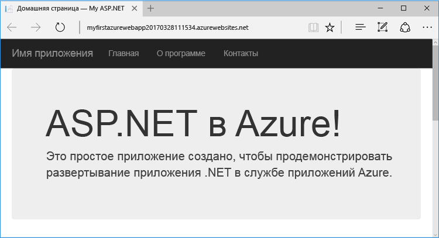

## <a name="prerequisites"></a>Предварительные требования

В этом руководстве описывается использование Visual Studio 2017 для сборки и развертывания веб-приложения ASP.NET в Azure. Если вы еще не установили Visual Studio 2017, вы можете скачать и использовать **бесплатный** [выпуск Community для Visual Studio 2017](https://www.visualstudio.com/downloads/). При установке Visual Studio необходимо включить возможность **разработки для Azure**.

[!INCLUDE [quickstarts-free-trial-note](../../includes/quickstarts-free-trial-note.md)]

## <a name="create-an-aspnet-web-app"></a>Создание веб-приложения ASP.NET

В Visual Studio создайте проект с помощью клавиш `Ctrl`+`Shift`+`N`.

В диалоговом окне **Новый проект** щелкните **Visual C# > Интернет > Веб-приложение ASP.NET (.NET Framework)**.

Присвойте приложению имя **myFirstAzureWebApp** и нажмите кнопку **ОК**.
   
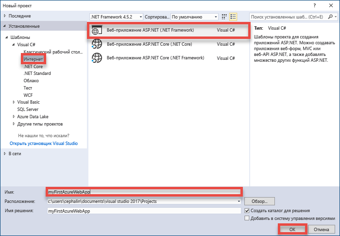

Вы можете развернуть любой тип веб-приложения ASP.NET в Azure. В целях этого руководства выберите шаблон **MVC** и задайте для аутентификации значение **Без аутентификации**.
      
Нажмите кнопку **ОК**.

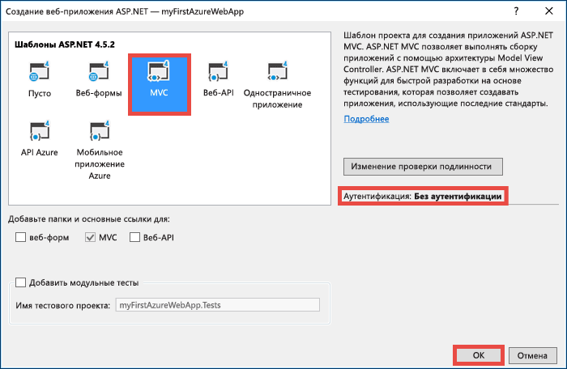

## <a name="publish-to-azure"></a>Публикация в Azure

Щелкните правой кнопкой мыши проект **myFirstAzureWebApp** в **обозревателе решений** и выберите **Опубликовать**.

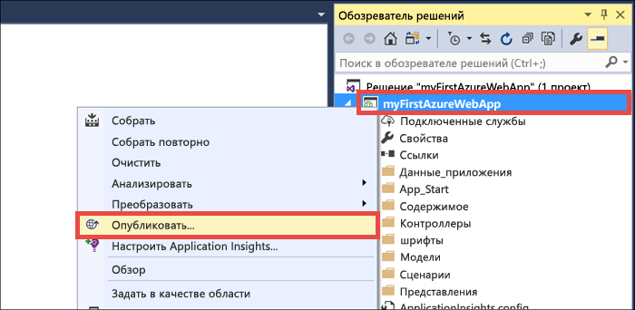

Выберите **Служба приложений Microsoft Azure** и нажмите кнопку **Опубликовать**.

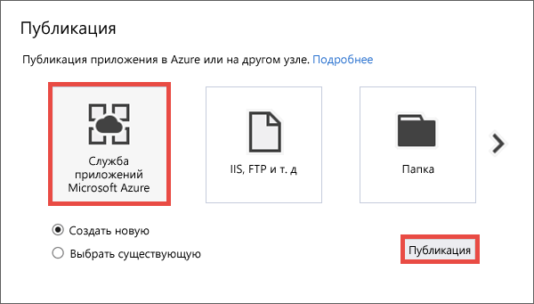

Откроется диалоговое окно **Создать службу приложений**, с помощью которого вы можете создать все ресурсы Azure, необходимые для запуска веб-приложения ASP.NET в Azure.

## <a name="sign-in-to-azure"></a>Вход в Azure

В диалоговом окне **Создать службу приложений** щелкните **Добавить новую учетную запись**, а затем выполните вход в подписку Azure. Если вы уже вошли в учетную запись Майкрософт, проверьте, содержит ли она подписку Azure. Если подписки нет, щелкните ее, чтобы добавить правильную учетную запись.
   
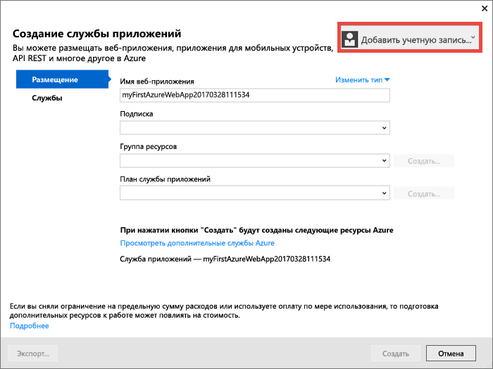

После того как вы войдете в систему, вы будете готовы создать все ресурсы, необходимые для веб-приложения Azure в этом диалоговом окне.

## <a name="create-a-resource-group"></a>Создание группы ресурсов

В первую очередь вам необходима _группа ресурсов_. 

> [!NOTE] 
> Группа ресурсов — это логический контейнер, в котором происходит развертывание ресурсов Azure (веб-приложений, баз данных и учетных записей хранения) и управление ими.
>
>

Рядом с **группой ресурсов** щелкните **Создать**.

Присвойте группе ресурсов имя **myResourceGroup** и нажмите кнопку **ОК**.

## <a name="create-an-app-service-plan"></a>Создание плана службы приложений

[!INCLUDE [app-service-plan](../../includes/app-service-plan.md)]

Рядом с **планом службы приложений** щелкните **Создать**. 

В диалоговом окне **Настроить план службы приложений** настройте новый план службы приложений, задав приведенные ниже параметры.

- **План службы приложений**. Введите **myAppServicePlan**. 
- **Расположение.** Выберите **Западная Европа** или ближайший регион.
- **Размер.** Выберите **Бесплатный** или любую другую [ценовую категорию](https://azure.microsoft.com/pricing/details/app-service/) на свое усмотрение.

Нажмите кнопку **ОК**.

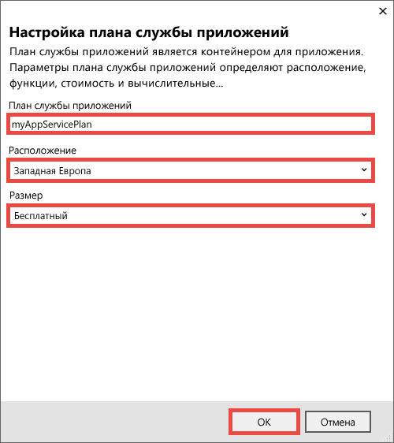

## <a name="create-and-publish-the-web-app"></a>Создание и публикация веб-приложения

И наконец, нужно присвоить имя веб-приложению. В поле **Имя веб-приложения** введите уникальное имя. Это имя будет использоваться как часть DNS-имени по умолчанию для приложения (`<app_name>.azurewebsites.net`), поэтому оно должно быть глобально уникальным среди всех приложений Azure. Позже вы можете сопоставить имя пользовательского домена с приложением, перед тем как предоставить его пользователям.

Вы также можете принять имя, созданное автоматически, которое тоже является уникальным.

Нажмите кнопку **Создать**, чтобы начать создавать ресурсы Azure.

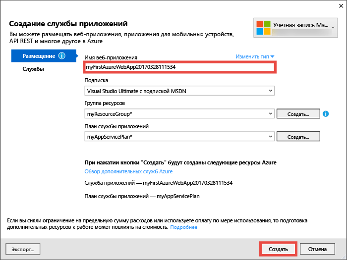

Когда мастер создаст ресурсы Azure, веб-приложение ASP.NET будет автоматически опубликовано в Azure, а затем оно откроется в браузере по умолчанию.

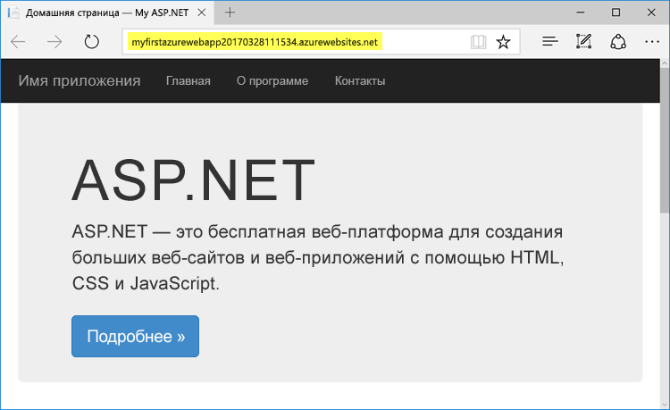

URL-адрес использует указанное вами ранее имя веб-приложения в формате `http://<app_name>.azurewebsites.net`. 

Поздравляем, ваше первое веб-приложение ASP.NET работает в службе приложений Azure в режиме реального времени.

## <a name="update-the-app-and-redeploy"></a>Обновление и повторное развертывание приложения

Обновить и повторно развернуть обновление в Azure очень просто. Давайте обновим домашнюю страницу.

В **обозревателе решений** откройте **Views\Home\Index.cshtml**.

Найдите тег HTML `<div class="jumbotron">` в верхней области и замените его следующим кодом:

```HTML
<div class="jumbotron">
    <h1>ASP.NET in Azure!</h1>
    <p class="lead">This is a simple app that we’ve built that demonstrates how to deploy a .NET app to Azure App Service.</p>
</div>
```

Чтобы выполнить повторное развертывание в Azure, щелкните правой кнопкой мыши свой проект **myFirstAzureWebApp** в **обозревателе решений**, а затем выберите **Опубликовать**.

На странице публикации щелкните **Опубликовать**.

Когда работа Visual Studio будет окончена, обновленное веб-приложение Azure откроется в браузере.


## <a name="manage-your-new-azure-web-app"></a>Управление новым веб-приложением Azure

Перейдите на портал Azure, чтобы просмотреть созданное приложение. 

Для этого войдите на портал [https://portal.azure.com](https://portal.azure.com).

В меню слева выберите **Службы приложений**, а затем щелкните имя своего веб-приложения Azure.

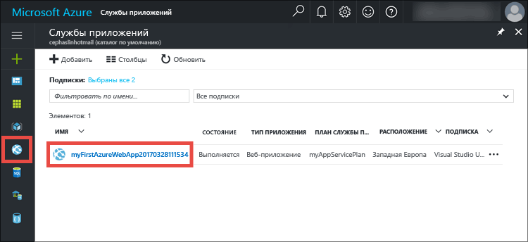

Вы попадете в _колонку_ веб-приложения (страница портала, открывшаяся горизонтально). 

По умолчанию колонка веб-приложения отображает страницу **обзора**. Здесь вы можете наблюдать за работой приложения. Вы также можете выполнять базовые задачи управления: обзор, завершение, запуск, перезагрузку и удаление.  

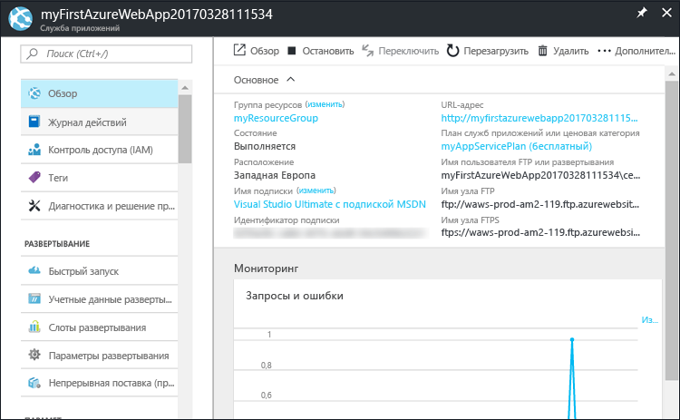

На вкладках в левой части колонки отображаются различные страницы конфигурации, которые можно открыть. Ниже представлены лишь некоторые из возможностей:

- сопоставление настраиваемого DNS-имени;
- привязка настраиваемого SSL-сертификата;
- настройка непрерывного развертывания;
- вертикальное и горизонтальное масштабирование;
- добавление аутентификации пользователей.

## <a name="clean-up-resources"></a>Очистка ресурсов

Чтобы удалить первое веб-приложение Azure, щелкните **Удалить** на странице **обзора**. Однако есть более удобный способ удалить все, что было создано в рамках этого руководства. Используя страницу **обзора** веб-приложения, щелкните группу ресурсов, чтобы открыть соответствующую колонку. 


В колонке группы ресурсов вы увидите план службы приложений и само приложение службы, созданное Visual Studio. 

Нажмите кнопку **Удалить** в верхней части колонки. 

<!---->

В колонке подтверждения введите имя группы ресурсов **myResourceGroup** в текстовом поле и нажмите кнопку **Удалить**.

## <a name="next-steps"></a>Дальнейшие действия

> [!div class="nextstepaction"]
> [Создание приложения ASP.NET в Azure с подключением к базе данных SQL](app-service-web-tutorial-dotnet-sqldatabase.md)

> [!div class="nextstepaction"]
> [Примеры сценариев Azure PowerShell](app-service-powershell-samples.md)

