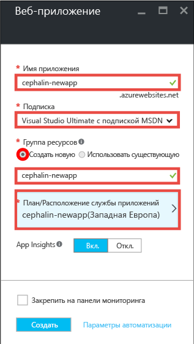
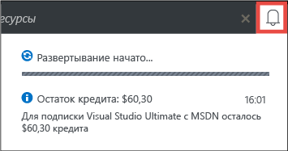
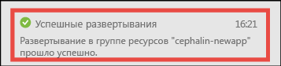
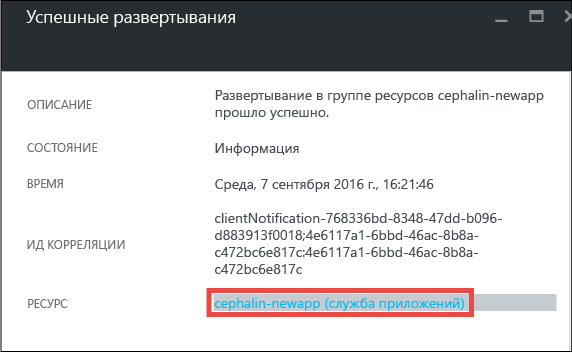
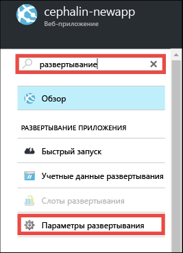
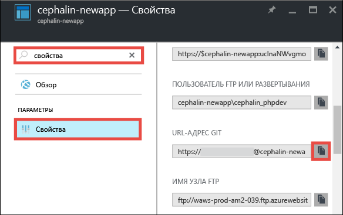
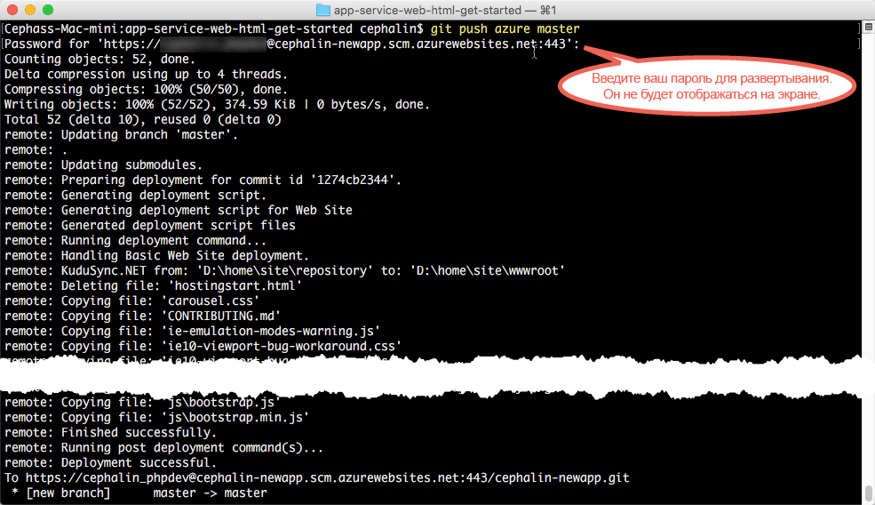

<properties 
	pageTitle="Развертывание первого веб-приложения в Azure за пять минут | Microsoft Azure" 
	description="Узнайте, как можно быстро запускать веб-приложения в службе приложений, развернув пример приложения. Начните с разработки настоящего приложения — и сразу же получите результаты." 
	services="app-service\web"
	documentationCenter=""
	authors="andkjell"
	manager="wpickett"
	editor=""
/>

<tags
	ms.service="app-service-web"
	ms.workload="web"
	ms.tgt_pltfrm="na"
	ms.devlang="na"
	ms.topic="hero-article"
	ms.date="09/16/2016" 
	ms.author="andkjell"
/>
	
# Развертывание первого веб-приложения в Azure за пять минут

Это руководство поможет вам развернуть простое веб-приложение HTML+CSS в [службе приложений Azure](../app-service/app-service-value-prop-what-is.md). В службе приложений можно создавать веб-приложения, [серверные части мобильных приложений](/documentation/learning-paths/appservice-mobileapps/) и [приложения API](../app-service-api/app-service-api-apps-why-best-platform.md).

Вы сможете выполнять следующие задачи:

- создавать веб-приложения в службе приложений Azure;
- Развертывать в них код HTML и CSS.
- Просматривать страницы, выполняющиеся в рабочей среде в реальном времени.
- Обновлять содержимое так же, как вы [отправляете фиксации Git](https://git-scm.com/docs/git-push).

## Предварительные требования

- [Установка Git](http://www.git-scm.com/downloads). Чтобы убедиться, что установка завершена успешно, выполните команду `git --version` в новом окне командной строки Windows, окне PowerShell, оболочке Linux или терминале OS X.
- Учетная запись Microsoft Azure. Если у вас нет учетной записи, [создайте бесплатную пробную версию](/pricing/free-trial/?WT.mc_id=A261C142F) или [активируйте преимущества для подписчиков Visual Studio](/pricing/member-offers/msdn-benefits-details/?WT.mc_id=A261C142F).

>[AZURE.NOTE] [Пробное использование службы приложений](http://go.microsoft.com/fwlink/?LinkId=523751) возможно даже без учетной записи Azure. Вы можете создать приложение начального уровня и экспериментировать с ним в течение часа. Для этого вам не нужно указывать данные кредитной карты или брать на себя какие-либо обязательства.

## Создание веб-приложения

1. Войдите на [портал Azure](https://portal.azure.com) с помощью своей учетной записи Azure.

2. В меню слева щелкните **Создать** > **Интернет+мобильные устройства** > **Веб-приложение**.

    

3. В колонке создания приложения укажите следующие параметры нового приложения.

    - **Имя приложения**: введите уникальное имя.
    - **Группа ресурсов**: щелкните **Создать** и укажите имя группы ресурсов.
    - **Расположение или план службы приложений**: чтобы настроить план службы приложений, выберите этот пункт, затем щелкните **Создать** и укажите имя, расположение и ценовую категорию плана службы приложений. Вы можете выбрать для ценовой категории уровень **Бесплатный**.

    Заполненная колонка создания приложения должна выглядеть так:

    

3. Нажмите внизу кнопку **Создать**. Чтобы следить за ходом выполнения, щелкните вверху значок **Уведомление**.

    

4. Когда развертывание завершится, вы получите следующее уведомление. Щелкните его, чтобы открыть колонку с информацией о развертывании.

    

5. В колонке **Развертывание прошло успешно** щелкните ссылку **Ресурс**, чтобы открыть колонку нового веб-приложения.

    

## Развертывание содержимого в веб-приложении

Теперь давайте развернем какое-нибудь содержимое в Azure с помощью Git.

5. В колонке веб-приложения прокрутите вниз до пункта **Параметры развертывания** (либо найдите его с помощью поиска). Щелкните этот пункт.

    

6. Щелкните **Выбор источника** > **Локальный репозиторий Git** > **ОК**.

7. В колонке веб-приложения щелкните **Учетные данные развертывания**.

8. Укажите учетные данные развертывания и нажмите кнопку **Сохранить**.

7. В колонке веб-приложения прокрутите вниз до пункта **Свойства** (либо найдите его с помощью поиска). Щелкните этот пункт. Нажмите кнопку **Копировать** рядом с полем **URL-адрес Git**.

    

    Теперь можно приступить к развертыванию содержимого с помощью GIT.

1. В командной строке перейдите в рабочий каталог (`CD`) и клонируйте пример приложения следующим образом:

        git clone https://github.com/Azure-Samples/app-service-web-html-get-started.git

    

2. Перейдите в репозиторий примера приложения. Например:

        cd app-service-web-html-get-started

3. Настройте удаленный доступ к своему приложению Azure по URL-адресу Git, который вы скопировали с портала на одном из предыдущих шагов.

        git remote add azure <giturlfromportal>

4. Разверните пример кода в приложении Azure так же, как вы отправляете любой код с помощью Git:

        git push azure master

    

Вот и все! Ваш код теперь выполняется в Azure. В браузере перейдите по адресу http://*&lt;appname>*.azurewebsites.net, чтобы увидеть работу приложения в реальном времени.

## Внесение изменений в приложение

Теперь с помощью Git можно в любой момент передать на рабочий сайт изменения из корневого каталога проекта (репозитория). Для этого нужно выполнить те же действия, что и при первом развертывании содержимого. Например, каждый раз, когда вам нужно отправить новое изменение, протестированное локально, просто выполните следующие команды из корневого каталога проекта (репозитория):

    git add .
    git commit -m "<your_message>"
    git push azure master

## Дальнейшие действия

Определите предпочтительный способ разработки и этапы развертывания приложений в соответствии с используемой языковой платформой:

> [AZURE.SELECTOR]
- [.NET](web-sites-dotnet-get-started.md)
- [PHP](app-service-web-php-get-started.md)
- [Node.js](app-service-web-nodejs-get-started.md)
- [Python](web-sites-python-ptvs-django-mysql.md)
- [Java](web-sites-java-get-started.md)

Вы также можете продолжить работу над своим первым веб-приложением. Например:

- Попробуйте [другие способы развертывания кода в Azure](../app-service-web/web-sites-deploy.md). Например, чтобы развернуть приложение из какого-либо репозитория на GitHub, в разделе **Параметры развертывания** нужно просто указать **GitHub**, а не **Локальный репозиторий Git**.
- Выведите приложение Azure на следующий уровень. Проверяйте подлинность пользователей. Масштабируйте приложение в зависимости от потребностей. Настраивайте оповещения производительности. И все это — с помощью нескольких действий. См. статью [Добавление функциональных возможностей в первое веб-приложение](app-service-web-get-started-2.md).

<!---HONumber=AcomDC_0920_2016--->
