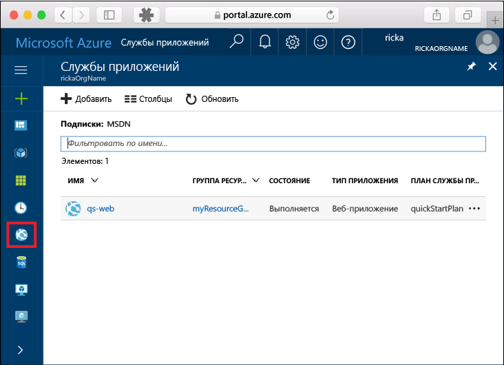
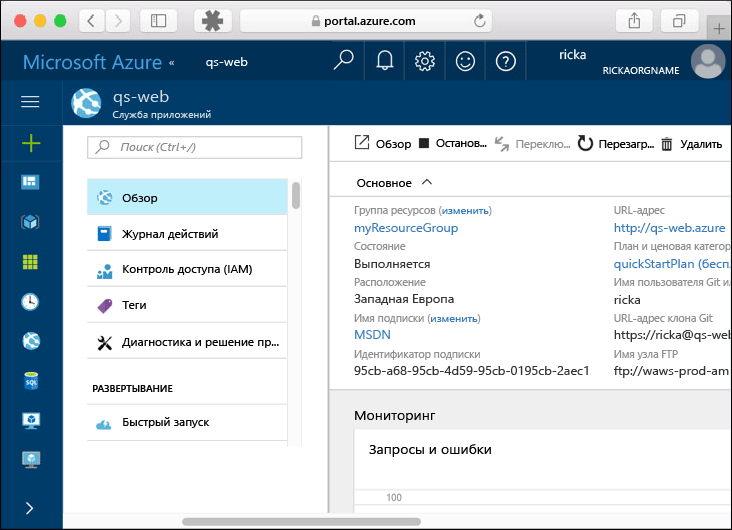

# <a name="create-a-static-html-web-app-in-azure"></a>Создание статического веб-приложения HTML в Azure

[Веб-приложения Azure](https://docs.microsoft.com/azure/app-service-web/app-service-web-overview) — это служба веб-размещения с самостоятельной установкой исправлений и высоким уровнем масштабируемости.  В этом кратком руководстве объясняется, как развернуть базовый сайт HTML+CSS в веб-приложениях Azure. Создайте веб-приложение с помощью [Azure CLI](https://docs.microsoft.com/cli/azure/get-started-with-azure-cli) и разверните пример HTML-содержимого в веб-приложении с помощью Git.


Выполните действия, приведенные ниже, с помощью компьютера Mac, Windows или Linux. После установки необходимых компонентов для выполнения этих шагов потребуется около пяти минут.

## <a name="prerequisites"></a>Предварительные требования

Для работы с этим кратким руководством сделайте следующее:

- [Установите Git](https://git-scm.com/)
[!INCLUDE [quickstarts-free-trial-note](../../includes/quickstarts-free-trial-note.md)].

[!INCLUDE [cloud-shell-try-it.md](../../includes/cloud-shell-try-it.md)]

Если вы решили установить и использовать интерфейс командной строки локально, для работы с этим руководством вам понадобится Azure CLI 2.0 или более поздней версии. Чтобы узнать версию, выполните команду `az --version`. Если вам необходимо выполнить установку или обновление, см. статью [Установка Azure CLI 2.0]( /cli/azure/install-azure-cli). 

## <a name="download-the-sample"></a>Скачивание примера приложения

В окне терминала выполните следующую команду, чтобы клонировать репозиторий с примером приложения на локальный компьютер.

```bash
git clone https://github.com/Azure-Samples/html-docs-hello-world.git
```

Используйте это окно терминала для выполнения всех команд в рамках этого руководства.

## <a name="view-the-html"></a>Просмотр HTML

Перейдите в каталог, в котором содержится пример HTML. Откройте файл *index.html* в браузере.


[!INCLUDE [Log in to Azure](../../includes/login-to-azure.md)] 

[!INCLUDE [Configure deployment user](../../includes/configure-deployment-user.md)] 

[!INCLUDE [Create resource group](../../includes/app-service-web-create-resource-group.md)] 

[!INCLUDE [Create app service plan](../../includes/app-service-web-create-app-service-plan.md)] 

[!INCLUDE [Create web app](../../includes/app-service-web-create-web-app.md)] 


Вы создали пустое веб-приложение в Azure.

[!INCLUDE [Configure local git](../../includes/app-service-web-configure-local-git.md)] 

[!INCLUDE [Push to Azure](../../includes/app-service-web-git-push-to-azure.md)] 

```bash
Counting objects: 13, done.
Delta compression using up to 4 threads.
Compressing objects: 100% (11/11), done.
Writing objects: 100% (13/13), 2.07 KiB | 0 bytes/s, done.
Total 13 (delta 2), reused 0 (delta 0)
remote: Updating branch 'master'.
remote: Updating submodules.
remote: Preparing deployment for commit id 'cc39b1e4cb'.
remote: Generating deployment script.
remote: Generating deployment script for Web Site
remote: Generated deployment script files
remote: Running deployment command...
remote: Handling Basic Web Site deployment.
remote: KuduSync.NET from: 'D:\home\site\repository' to: 'D:\home\site\wwwroot'
remote: Deleting file: 'hostingstart.html'
remote: Copying file: '.gitignore'
remote: Copying file: 'LICENSE'
remote: Copying file: 'README.md'
remote: Finished successfully.
remote: Running post deployment command(s)...
remote: Deployment successful.
To https://<app_name>.scm.azurewebsites.net/<app_name>.git
 * [new branch]      master -> master
```

## <a name="browse-to-the-app"></a>Переход в приложение

В браузере перейдите по URL-адресу веб-приложения Azure:

```
http://<app_name>.azurewebsites.net
```

Страница выполняется как веб-приложение службы приложений Azure.


**Поздравляем!** Вы развернули свое первое HTML-приложение в службе приложений.

## <a name="update-and-redeploy-the-app"></a>Обновление и повторное развертывание приложения

Откройте файл *index.html* в текстовом редакторе и измените разметку. Например, измените заголовок H1 "Служба приложений Azure — пример статического HTML-сайта" на "Служба приложений Azure".

Зафиксируйте изменения в Git, а затем отправьте изменения кода в Azure.

```bash
git commit -am "updated HTML"
git push azure master
```

Завершив развертывание, обновите страницу в браузере, чтобы увидеть изменения.


## <a name="manage-your-new-azure-web-app"></a>Управление новым веб-приложением Azure

Перейдите на <a href="https://portal.azure.com" target="_blank">портал Azure</a> для управления созданным веб-приложением.

В меню слева выберите **Службы приложений**, а затем щелкните имя своего веб-приложения Azure.



Отобразится страница обзора вашего веб-приложения. Вы можете выполнять базовые задачи управления: обзор, завершение, запуск, перезагрузку и удаление. 



В меню слева доступно несколько страниц для настройки приложения. 

[!INCLUDE [cli-samples-clean-up](../../includes/cli-samples-clean-up.md)]

## <a name="next-steps"></a>Дальнейшие действия

> [!div class="nextstepaction"]
> [Сопоставление пользовательского домена](app-service-web-tutorial-custom-domain.md)

