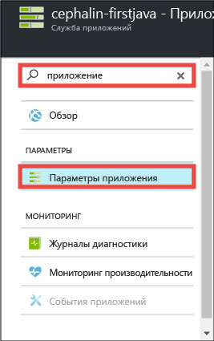
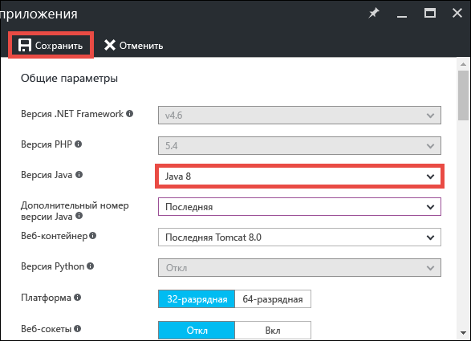
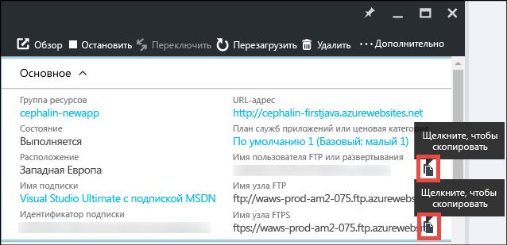
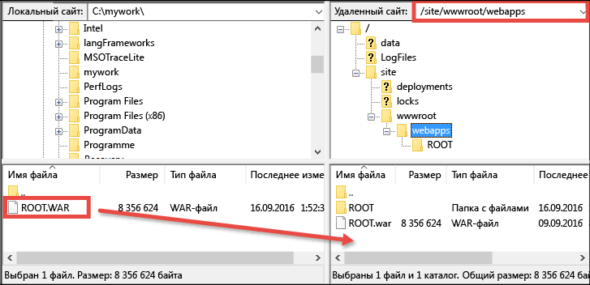

# Развертывание первого веб-приложения Java в Azure за пять минут (предварительная версия CLI 2.0)

> [!div class="op_single_selector"]
> * [Первый HTML-сайт](app-service-web-get-started-html-cli-nodejs.md)
> * [Первое приложение .NET](app-service-web-get-started-dotnet-cli-nodejs.md)
> * [Первое приложение PHP](app-service-web-get-started-php-cli-nodejs.md)
> * [Первое приложение Node.js](app-service-web-get-started-nodejs-cli-nodejs.md)
> * [Первое приложение Python](app-service-web-get-started-python-cli-nodejs.md)
> * [Первое приложение Java](app-service-web-get-started-java.md)
> 
> 

Это руководство поможет вам развернуть простое веб-приложение Java в [службе приложений Azure](../app-service/app-service-value-prop-what-is.md).
В службе приложений можно создавать веб-приложения, [серверные части мобильных приложений](/documentation/learning-paths/appservice-mobileapps/) и [приложения API](../app-service-api/app-service-api-apps-why-best-platform.md).

Вы сможете выполнять следующие задачи: 

* создавать веб-приложения в службе приложений Azure;
* развертывать примеры приложений Java;
* просматривать код, выполняющийся в рабочей среде в реальном времени.

## Предварительные требования
* Клиент FTP или FTPS (например, [FileZilla](https://filezilla-project.org/)).
* Учетная запись Microsoft Azure. Если у вас нет учетной записи, [подпишитесь на бесплатную пробную версию](https://azure.microsoft.com/pricing/free-trial/?WT.mc_id=A261C142F) или [активируйте преимущества для подписчиков Visual Studio](https://azure.microsoft.com/pricing/member-offers/msdn-benefits-details/?WT.mc_id=A261C142F).

> [!NOTE]
> [Пробное использование службы приложений](https://azure.microsoft.com/try/app-service/) возможно даже без учетной записи Azure. Вы можете создать приложение начального уровня и экспериментировать с ним в течение часа. Для этого вам не нужно указывать данные кредитной карты или брать на себя какие-либо обязательства.
> 
> 

## Создание веб-приложения
1. Войдите на [портал Azure](https://portal.azure.com) с помощью своей учетной записи Azure.
2. В меню слева щелкните **Создать** > **Интернет+мобильные устройства** > **Веб-приложение**.
   
    
3. В колонке создания приложения укажите следующие параметры нового приложения.
   
   * **Имя приложения**: введите уникальное имя.
   * **Группа ресурсов**: щелкните **Создать** и укажите имя группы ресурсов.
   * **Расположение или план службы приложений**: чтобы настроить план службы приложений, выберите этот пункт, а затем щелкните **Создать** и укажите имя, расположение и ценовую категорию плана службы приложений. Вы можете выбрать для ценовой категории уровень **Бесплатный** .
     
     Заполненная колонка создания приложения должна выглядеть так:
     
     
4. Нажмите внизу кнопку **Создать** . Чтобы следить за ходом выполнения, щелкните вверху значок **Уведомление** .
   
    
5. Когда развертывание завершится, вы получите следующее уведомление. Щелкните его, чтобы открыть колонку с информацией о развертывании.
   
    
6. В колонке **Развертывание прошло успешно** щелкните ссылку **Ресурс**, чтобы открыть колонку нового веб-приложения.
   
    

## Развертывание приложения Java в веб-приложении
Теперь давайте с помощью FTPS развернем в Azure приложение Java.

1. В колонке веб-приложения прокрутите вниз до пункта **Параметры приложения** (либо найдите его с помощью поиска). Щелкните этот пункт. 
   
    
2. В списке **Версия Java** выберите **Java 8** и нажмите кнопку **Сохранить**.
   
    
   
    Получив уведомление **Параметры веб-приложения успешно обновлены**, перейдите по адресу http://*&lt;имя_приложения>*.azurewebsites.net, чтобы просмотреть стандартный сервлет JSP в действии.
3. Вернитесь в колонку веб-приложения и прокрутите вниз до пункта **Учетные данные развертывания** (либо найдите его с помощью поиска). Щелкните этот пункт.
4. Укажите учетные данные развертывания и нажмите кнопку **Сохранить**.
5. В колонке веб-приложения нажмите кнопку **Обзор**. Нажмите кнопку **Копировать** рядом с полями **Имя пользователя FTP или развертывания** и **Имя узла FTPS**, чтобы скопировать эти значения.
   
    
   
    Теперь можно приступить к развертыванию приложения Java с помощью FTPS.
6. В клиентском приложении FTP или FTPS войдите на FTP-сервер своего веб-приложения Azure с помощью значений, скопированных на предыдущем этапе. Используйте созданный ранее пароль для развертывания.
   
    Ниже показано, как войти с помощью FileZilla.
   
    
   
    Вы можете увидеть предупреждения системы безопасности Azure о неопознанном SSL-сертификате. Не обращайте внимания.
7. Щелкните [эту ссылку](https://github.com/Azure-Samples/app-service-web-java-get-started/raw/master/webapps/ROOT.war) , чтобы скачать WAR-файл на локальный компьютер.
8. В клиентском приложении FTP или FTPS откройте на удаленном сайте каталог **/site/wwwroot/webapps** и перетащите в него WAR-файл, скачанный на локальный компьютер.
   
    
   
    Щелкните **ОК** , чтобы переопределить файл в Azure.
   
   > [!NOTE]
   > Tomcat по умолчанию обрабатывает имя файла **ROOT.war** в каталоге /site/wwwroot/webapps как корневое веб-приложение http://*&lt;имя_приложения>*.azurewebsites.net), а имя файла ***&lt;любое_имя>*.war** — как именованное веб-приложение (http://*&lt;имя_приложения>*.azurewebsites.net/*&lt;любое_имя>*.
   > 
   > 

Вот и все! Приложение Java теперь выполняется в Azure. В браузере перейдите по адресу http://*&lt;имя_приложения>*.azurewebsites.net, чтобы увидеть работу приложения в реальном времени. 

## Внесение изменений в приложение
Всякий раз, когда вам нужно внести изменения, просто поместите новый WAR-файл в тот же удаленный каталог с клиентом FTP и FTPS.

## Дальнейшие действия
[Создавайте веб-приложения Java из шаблонов в Azure Marketplace](web-sites-java-get-started.md#marketplace). Вы можете получить полностью настраиваемый контейнер Tomcat со знакомым пользовательским интерфейсом диспетчера. 

Выполняйте отладку веб-приложения Azure непосредственно в [IntelliJ](app-service-web-debug-java-web-app-in-intellij.md) или [Eclipse](app-service-web-debug-java-web-app-in-eclipse.md).

Вы также можете продолжить работу над своим первым веб-приложением. Например:

* Попробуйте [другие способы развертывания кода в Azure](web-sites-deploy.md). 
* Выведите приложение Azure на следующий уровень. Проверяйте подлинность пользователей. Масштабируйте приложение в зависимости от потребностей. Настраивайте оповещения производительности. И все это — с помощью нескольких действий. См. статью [Добавление функциональных возможностей в первое веб-приложение](app-service-web-get-started-2.md).

<!--HONumber=Jan17_HO3-->

