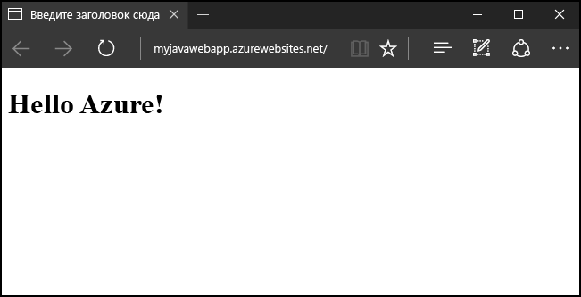
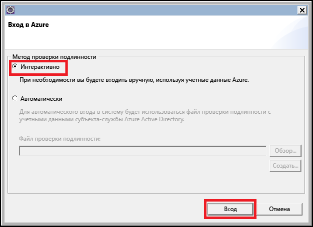
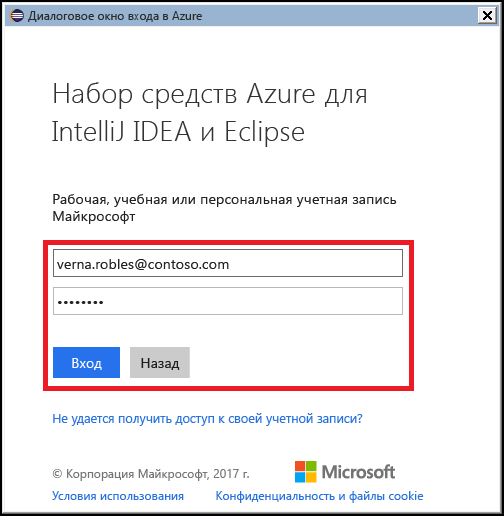
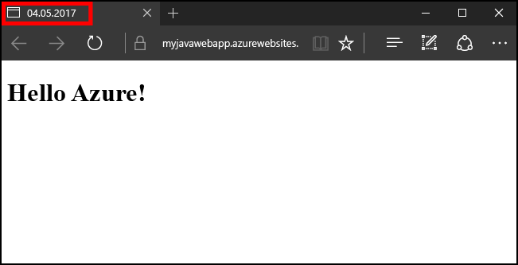

# <a name="create-your-first-java-web-app-in-azure-in-five-minutes"></a>Создание первого веб-приложения Java в Azure за пять минут

[!INCLUDE [app-service-web-selector-get-started](../../includes/app-service-web-selector-get-started.md)] 

Это краткое руководство поможет вам развернуть первое веб-приложение Java в [службе приложений Azure](../app-service/app-service-value-prop-what-is.md) за считаные минуты. Поработав с этим руководством, вы получите простое веб-приложение на платформе Java, работающее в облаке.



## <a name="before-you-begin"></a>Перед началом работы

В этом руководстве показано, как создать и развернуть веб-приложение Java в Azure, используя интегрированную среду разработки Eclipse для разработчиков Java EE. Если у вас еще не установлен Eclipse, его можно загрузить бесплатно по ссылке http://www.eclipse.org/.

Чтобы упростить процесс публикации веб-приложений Java в Azure, используйте инструкции, описанные в руководстве [Набор средств Azure для Eclipse](/azure/azure-toolkit-for-eclipse). Инструкции по установке набора средств Azure см. в статье [Установка набора средств Azure для Eclipse](/azure/azure-toolkit-for-eclipse-installation).

> [!NOTE]
>
> В этом руководстве можно также использовать [IntelliJ IDEA](https://www.jetbrains.com/idea/) от компании JetBrains. Некоторые действия для этой среды разработки могут отличаться, несмотря на то, что имеется [набор средств Azure для IntelliJ](/azure/azure-toolkit-for-intellij), который позволяет упростить процесс публикации в этой среде.
>

Для работы с этим руководством вам потребуется подписка Azure. Если у вас нет подписки Azure, вы можете активировать [преимущества для подписчиков MSDN](https://azure.microsoft.com/pricing/member-offers/msdn-benefits-details/) или зарегистрироваться для получения [бесплатной учетной записи Azure](https://azure.microsoft.com/pricing/free-trial/).

## <a name="create-a-dynamic-web-project-in-eclipse"></a>Создание динамических веб-проектов в Eclipse

В Eclipse откройте меню **File** (Файл), выберите пункт **New** (Создать) и щелкните **Dynamic Web Project** (Динамический веб-проект).

В диалоговом окне **New Dynamic Web Project** (Новый динамический веб-проект) присвойте проекту имя **MyFirstJavaOnAzureWebApp** и нажмите кнопку **Finish** (Готово).
   


> [!NOTE]
>
> Если у вас установлена локальная среда [Apache Tomcat](https://tomcat.apache.org/), укажите это в поле **Целевая среда выполнения**.
>

После создания динамического веб-проекта добавьте новую страницу JSP, развернув проект в обозревателе проектов, щелкните правой кнопкой мыши папку **WebContent**, а затем нажмите кнопку **Создать** и выберите **JSP File** (JSP-файл).


В диалоговом окне New JSP File (Создание JSP-файла) укажите имя файла **index.jsp**, оставьте родительскую папку **MyFirstJavaOnAzureWebApp/WebContent** без изменений, а затем нажмите кнопку **Далее**.


На следующей странице диалогового окна New JSP File (Создание JSP-файла) укажите имя файла **index.jsp**, оставьте родительскую папку **MyFirstJavaOnAzureWebApp/WebContent** без изменений, а затем нажмите кнопку **Готово**.


Когда в Eclipse откроется новая страница, замените существующий раздел `<body></body>` следующим кодом:

```jsp
<body>
<h1><% out.println("Hello Azure!"); %></h1>
</body>
```

Сохраните изменения на странице.

## <a name="publish-your-web-app-to-azure"></a>Публикация веб-приложения в Azure

Чтобы развернуть веб-приложение в Azure, воспользуйтесь преимуществом некоторых функциональных возможностей, предоставляемых набором инструментов Azure для Eclipse.

Чтобы начать процесс публикации, используйте один из следующих методов:

* Щелкните правой кнопкой мыши проект в Eclipse **Обозреватель проектов**, щелкните **Azure**, а затем выберите **Publish as Azure Web App** (Опубликовать как веб-приложение Azure).

   

* Щелкните значок **Опубликовать** на панели инструментов Eclipse, а затем щелкните **Publish as Azure Web App** (Опубликовать как веб-приложение Azure).

   

Если вы еще не вошли в свою учетную запись Azure, появится запрос на вход: Для этого выполните следующие действия.

1. Существует два различных варианта для входа в учетную запись Azure. В этом руководстве выберите **интерактивный**.

   

1. Введите учетные данные Azure и нажмите кнопку **Войти**.

   

1. Выберите подписку Azure и нажмите кнопку **Выбрать**.

   

> [!NOTE]
>
> Подробные инструкции об **интерактивном** и **автоматическом** входе в систему см. в статье [Azure Sign In Instructions for the Azure Toolkit for Eclipse](https://go.microsoft.com/fwlink/?linkid=846174) (Инструкции для входа в Azure. Набор инструментов Azure для Eclipse).
>

После входа в учетную запись Azure отобразится диалоговое окно **Deploy Web App** (Развертывание веб-приложения). Если это первая публикация веб-приложения в Azure, служб приложений не будет в списке. Если это так или если вы хотите создать службу приложений, создайте ее на следующем этапе. Для этого нажмите кнопку **Создать**.


Когда отобразится диалоговое окно **Create App Service** (Создание службы приложений), необходимо ввести исходные данные:

* Уникальное имя, которое станет DNS-адресом веб-приложения. Например, **MyJavaWebApp** станет *myjavawebapp.azurewebsites.net*.

* Веб-контейнер, который будет использовать веб-приложение, например **последняя версия Tomcat 8.5**.

* Вашу подписку Azure.

   

Если у вас есть существующие планы службы приложений или если вы хотите создать план службы, необходимо указать следующие сведения:

* Уникальное имя для нового плана службы. Это имя будет отображаться в будущем при публикации веб-приложений с помощью набора инструментов Azure, а также указано в списке на [портале Azure](https://portal.azure.com) при управлении вашей учетной записью.

* Географическое расположение, где будет создаваться план службы.

* Ценовую категорию плана службы.

   

Щелкните вкладку **Группа ресурсов**. Если у вас нет существующей группы ресурсов или если вы хотите создать ее, необходимо указать уникальное имя новой группы ресурсов. В противном случае выберите существующую группу ресурсов в раскрывающемся меню.


Наконец, щелкните вкладку **JDK**. Здесь представлено несколько вариантов, что позволяет разработчикам указывать сторонние или пользовательские наборы Java Developer Kit (JDK). В целях этого руководства выберите **По умолчанию**, а затем нажмите кнопку **Создать**.


Набор средств Azure приступит к созданию службы приложений и отобразит диалоговое окно хода выполнения во время обработки.


После создания службы приложений необходимо выбрать, нужно ли развертывать веб-приложение в корневом каталоге веб-сайта. Например, если у вас есть служба приложений в *wingtiptoys.azurewebsites.net* и вы не выполните развертывание в корневой каталог, тогда веб-приложение **MyFirstJavaOnAzureWebApp** будет развернуто в каталоге *wingtiptoys.azurewebsites.net/MyFirstJavaOnAzureWebApp*.


Выполнив предыдущие действия, щелкните **Развернуть** для публикации веб-приложения в Azure.


Поздравляем! Веб-приложение успешно развернуто в Azure. Теперь можно просмотреть веб-приложение на веб-сайте Azure:


## <a name="updating-your-web-app"></a>Обновление веб-приложения

После успешной публикации веб-приложения в Azure его обновление существенно упростится. Далее представлен процесс публикации изменений в веб-приложении.

Сначала измените пример кода JSP из более ранней версии, чтобы заголовок заменился на сегодняшнюю дату:

```jsp
<%@ page
    language="java"
    contentType="text/html; charset=ISO-8859-1"
    pageEncoding="ISO-8859-1"
    import="java.text.SimpleDateFormat"
    import="java.util.Date" %>
<!DOCTYPE html PUBLIC "-//W3C//DTD HTML 4.01 Transitional//EN" "http://www.w3.org/TR/html4/loose.dtd">
<html>
<head>
<meta http-equiv="Content-Type" content="text/html; charset=ISO-8859-1">
<% SimpleDateFormat date = new SimpleDateFormat("yyyy/MM/dd"); %>
<title><% out.println(date.format(new Date())); %></title>
</head>
<body>
<h1><% out.println("Hello Azure!"); %></h1>
</body>
</html>
```

Сохранив изменения, щелкните проект правой кнопкой мыши в **обозревателе проектов** Eclipse, выберите **Azure**, а затем — **Publish as Azure Web App** (Опубликовать как веб-приложение Azure).


Когда откроется диалоговое окно **Deploy Web App** (Развертывание веб-приложения), появятся предыдущие службы приложений. Чтобы обновить веб-приложение, выделите службу приложений и нажмите кнопку **Развернуть** для публикации изменений.


> [!NOTE]
>
> Во время развертывания веб-приложения в корневую папку службы приложений нужно устанавливать флажок **Deploy to root** (Развернуть в корень) каждый раз при публикации изменений.
>

После публикации изменений можно заметить, что заголовок страницы в браузере изменился на сегодняшнюю дату.



## <a name="clean-up-resources"></a>Очистка ресурсов

Чтобы удалить веб-приложение, используйте **обозреватель Azure**, входящий в состав набора средств Azure. Если представление **обозревателя Azure** еще не отображается в Eclipse, сделайте следующее:

1. Щелкните **Окно**, **Show View** (Показать представление), а затем выберите **Другие**.

   

2. Когда откроется диалоговое окно **Show View** (Показать представление), выберите **Azure Explorer** (Обозреватель Azure) и нажмите кнопку **ОК**.

   

Чтобы удалить веб-приложение из обозревателя Azure, разверните узел **Веб-приложения**, затем щелкните веб-приложение правой кнопкой мыши и выберите **Удалить**.


При появлении запроса на удаление веб-приложения нажмите кнопку **ОК**.

## <a name="next-steps"></a>Дальнейшие действия

Дополнительные сведения о наборах средств Azure для Java IDE см. по следующим ссылкам:

* [Набор средств Azure для Eclipse (в этой статье)](../azure-toolkit-for-eclipse.md)
  * [Новые возможности набора средств Azure для Eclipse](../azure-toolkit-for-eclipse-whats-new.md)
  * [Установка набора средств Azure для Eclipse](../azure-toolkit-for-eclipse-installation.md)
  * [Sign In Instructions for the Azure Toolkit for Eclipse](https://go.microsoft.com/fwlink/?linkid=846174) (Инструкции по входу для набора средств Azure для Eclipse)
* [Набор средств Azure для IntelliJ](../azure-toolkit-for-intellij.md)
  * [Новые возможности набора средств Azure для IntelliJ](../azure-toolkit-for-intellij-whats-new.md)
  * [Установка набора средств Azure для IntelliJ](../azure-toolkit-for-intellij-installation.md)
  * [Sign In Instructions for the Azure Toolkit for IntelliJ](https://go.microsoft.com/fwlink/?linkid=846179) (Инструкции по входу для набора средств Azure для IntelliJ)

Дополнительные сведения об использовании Azure см. в [центре разработчиков Java для Azure](https://azure.microsoft.com/develop/java/) и на странице [инструментов Java для Visual Studio Team Services](https://java.visualstudio.com/).

