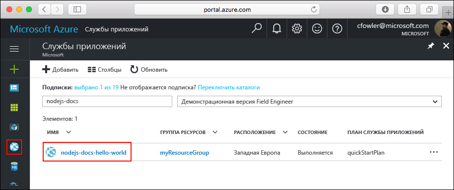

# <a name="create-a-python-web-app-in-azure"></a>Создание веб-приложения Python в Azure

[Веб-приложения Azure](https://docs.microsoft.com/azure/app-service-web/app-service-web-overview) — это служба веб-размещения с самостоятельной установкой исправлений и высоким уровнем масштабируемости.  В этом кратком руководстве объясняется, как разработать и развернуть приложение Python в веб-приложениях Azure. Создайте веб-приложение с помощью [Azure CLI](https://docs.microsoft.com/cli/azure/get-started-with-azure-cli) и разверните пример кода Python в веб-приложении с помощью Git.


Выполните действия, приведенные ниже, с помощью компьютера Mac, Windows или Linux. После установки необходимых компонентов для выполнения этих шагов потребуется около пяти минут.
## <a name="prerequisites"></a>Предварительные требования

Для работы с этим руководством:

1. [установите Git](https://git-scm.com/);
1. [установите Python](https://www.python.org/downloads/).

[!INCLUDE [quickstarts-free-trial-note](../../includes/quickstarts-free-trial-note.md)]

[!INCLUDE [cloud-shell-try-it.md](../../includes/cloud-shell-try-it.md)]

Если вы решили установить и использовать интерфейс командной строки локально, для работы с этим руководством вам понадобится Azure CLI 2.0 или более поздней версии. Чтобы узнать версию, выполните команду `az --version`. Если вам необходимо выполнить установку или обновление, см. статью [Установка Azure CLI 2.0]( /cli/azure/install-azure-cli). 

## <a name="download-the-sample"></a>Скачивание примера приложения

В окне терминала выполните следующую команду, чтобы клонировать репозиторий с примером приложения на локальный компьютер.

```bash
git clone https://github.com/Azure-Samples/python-docs-hello-world
```

Используйте это окно терминала для выполнения всех команд в рамках этого руководства.

Перейдите в каталог, в котором содержится образец кода.

```bash
cd Python-docs-hello-world
```

## <a name="run-the-app-locally"></a>Локальный запуск приложения

Установите необходимые пакеты с помощью `pip`.

```bash
pip install -r requirements.txt
```

Запустите приложение в локальной среде, открыв окно терминала и выполнив команду `Python`, чтобы запустить встроенный веб-сервер Python.

```bash
python main.py
```

Откройте браузер и перейдите к примеру приложения по адресу http://localhost:5000.

На странице отобразится сообщение **Hello World** из примера приложения.


В окне терминала нажмите клавиши **CTRL+C**, чтобы выйти из веб-сервера.

[!INCLUDE [Log in to Azure](../../includes/login-to-azure.md)] 

[!INCLUDE [Configure deployment user](../../includes/configure-deployment-user.md)] 

[!INCLUDE [Create resource group](../../includes/app-service-web-create-resource-group.md)] 

[!INCLUDE [Create app service plan](../../includes/app-service-web-create-app-service-plan.md)] 

[!INCLUDE [Create web app](../../includes/app-service-web-create-web-app.md)] 


Вы создали пустое веб-приложение в Azure.

## <a name="configure-to-use-python"></a>Настройка использования Python

Используйте команду [az webapp config set](/cli/azure/webapp/config#set), чтобы настроить в веб-приложении использование языка Python версии `3.4`.

```azurecli-interactive
az webapp config set --python-version 3.4 --name <app_name> --resource-group myResourceGroup
```


При такой настройке версии Python будет использоваться контейнер по умолчанию, предоставляемый платформой. Чтобы использовать собственный контейнер, см. сведения о команде [az webapp config container set](/cli/azure/webapp/config/container#set) в справочнике по интерфейсу командной строки.

[!INCLUDE [Configure local git](../../includes/app-service-web-configure-local-git.md)] 

[!INCLUDE [Push to Azure](../../includes/app-service-web-git-push-to-azure.md)] 

```bash
Counting objects: 18, done.
Delta compression using up to 4 threads.
Compressing objects: 100% (16/16), done.
Writing objects: 100% (18/18), 4.31 KiB | 0 bytes/s, done.
Total 18 (delta 4), reused 0 (delta 0)
remote: Updating branch 'master'.
remote: Updating submodules.
remote: Preparing deployment for commit id '44e74fe7dd'.
remote: Generating deployment script.
remote: Generating deployment script for python Web Site
remote: Generated deployment script files
remote: Running deployment command...
remote: Handling python deployment.
remote: KuduSync.NET from: 'D:\home\site\repository' to: 'D:\home\site\wwwroot'
remote: Deleting file: 'hostingstart.html'
remote: Copying file: '.gitignore'
remote: Copying file: 'LICENSE'
remote: Copying file: 'main.py'
remote: Copying file: 'README.md'
remote: Copying file: 'requirements.txt'
remote: Copying file: 'virtualenv_proxy.py'
remote: Copying file: 'web.2.7.config'
remote: Copying file: 'web.3.4.config'
remote: Detected requirements.txt.  You can skip Python specific steps with a .skipPythonDeployment file.
remote: Detecting Python runtime from site configuration
remote: Detected python-3.4
remote: Creating python-3.4 virtual environment.
remote: .................................
remote: Pip install requirements.
remote: Successfully installed Flask click itsdangerous Jinja2 Werkzeug MarkupSafe
remote: Cleaning up...
remote: .
remote: Overwriting web.config with web.3.4.config
remote:         1 file(s) copied.
remote: Finished successfully.
remote: Running post deployment command(s)...
remote: Deployment successful.
To https://<app_name>.scm.azurewebsites.net/<app_name>.git
 * [new branch]      master -> master
```

## <a name="browse-to-the-app"></a>Переход в приложение

Перейдите в развертываемое приложение с помощью веб-браузера.

```bash
http://<app_name>.azurewebsites.net
```

Пример кода Python выполняется в веб-приложении службы приложений Azure.


**Поздравляем!** Вы развернули свое первое приложение Python в службе приложений.

## <a name="update-and-redeploy-the-code"></a>Обновление и повторное развертывание кода

В локальном текстовом редакторе в приложении Python откройте файл `main.py` и внесите небольшое изменение в текст рядом с оператором `return`:

```python
return 'Hello, Azure!'
```

Зафиксируйте изменения в Git, а затем отправьте изменения кода в Azure.

```bash
git commit -am "updated output"
git push azure master
```

После завершения развертывания перейдите в окно браузера, открытое на шаге [перехода в приложение](#browse-to-the-app), и обновите страницу.


## <a name="manage-your-new-azure-web-app"></a>Управление новым веб-приложением Azure

Перейдите на <a href="https://portal.azure.com" target="_blank">портал Azure</a> для управления созданным веб-приложением.

В меню слева выберите **Службы приложений**, а затем щелкните имя своего веб-приложения Azure.



Отобразится страница обзора вашего веб-приложения. Вы можете выполнять базовые задачи управления: обзор, завершение, запуск, перезагрузку и удаление. 


В меню слева доступно несколько страниц для настройки приложения. 

[!INCLUDE [cli-samples-clean-up](../../includes/cli-samples-clean-up.md)]

## <a name="next-steps"></a>Дальнейшие действия

> [!div class="nextstepaction"]
> [Использование Python и PostgreSQL](app-service-web-tutorial-docker-python-postgresql-app.md)

