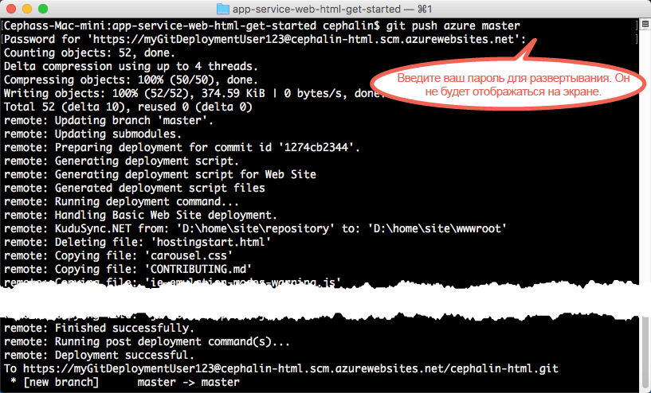
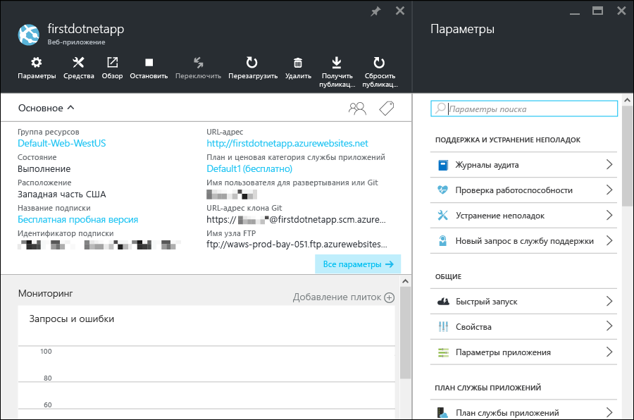

<properties 
	pageTitle="Развертывание первого веб-приложения в Azure в течение 5 минут" 
	description="Убедитесь, как просто запускать веб-приложения в службе приложений, развернув пример приложения с помощью всего нескольких действий. Начните разрабатывать настоящее приложение в течение 5 минут — и сразу же получите результаты." 
	services="app-service\web"
	documentationCenter=""
	authors="cephalin" 
	manager="wpickett" 
	editor="" 
/>

<tags 
	ms.service="app-service-web" 
	ms.workload="web" 
	ms.tgt_pltfrm="na" 
	ms.devlang="na" 
	ms.topic="hero-article"
	ms.date="05/12/2016" 
	ms.author="cephalin"
/>
	
# Развертывание первого веб-приложения в Azure в течение 5 минут

[AZURE.INCLUDE [вкладки](../../includes/app-service-web-get-started-nav-tabs.md)]

Это руководство поможет вам развернуть ваше первое веб-приложение в [службе приложений Azure](../app-service/app-service-value-prop-what-is.md). В службе приложений можно создавать веб-приложения, [серверные части мобильных приложений](/documentation/learning-paths/appservice-mobileapps/) и [приложения API](../app-service-api/app-service-api-apps-why-best-platform.md).

Выполнив несколько простых действий, вы сможете:

- развернуть образец веб-приложения (ASP.NET, PHP, Node.js, Java или Python);
- уже через несколько секунд увидеть работающее приложение в режиме реального времени;
- обновить веб-приложение так же, как вы отправляете фиксации [Git](https://git-scm.com/docs/git-push).

Вы также ознакомитесь с [порталом Azure](https://portal.azure.com) и его возможностями.

## Предварительные требования

- [Установите Git](http://www.git-scm.com/downloads). 
- [Установка Azure CLI](../xplat-cli-install.md). 
- Учетная запись Microsoft Azure. Если у вас нет учетной записи, [подпишитесь на бесплатную пробную версию](/pricing/free-trial/?WT.mc_id=A261C142F) или [активируйте преимущества для подписчиков Visual Studio](/pricing/member-offers/msdn-benefits-details/?WT.mc_id=A261C142F).

>[AZURE.NOTE] Веб-приложение можно увидеть в действии. [Попробуйте службу приложений](http://go.microsoft.com/fwlink/?LinkId=523751) — в ней можно быстро создать кратковременное приложение начального уровня. Для этого не потребуется ни кредитная карта, ни какие-либо обязательства.

## Развертывание веб-приложения

Давайте развернем веб-приложение в службе приложений Azure.

1. Откройте новое окно командной строки Windows, окно PowerShell, оболочку Linux или терминал OS X. Выполните команды `git --version` и `azure --version`, чтобы убедиться, что система GIT и интерфейс командной строки Azure установлены на компьютере. 

    

    Если вы еще не установили инструменты, см. ссылки для их загрузки в разделе [Предварительные требования](#Prerequisites).

1. Выполните команду `CD` в рабочем каталоге и клонируйте пример приложения следующим образом:

        git clone <github_sample_url>

    

    В качестве значения для *lt;github\_sample\_url>* используйте один из следующих URL-адресов в зависимости от выбранной платформы:

    - HTML+CSS+JS: [https://github.com/Azure-Samples/app-service-web-html-get-started.git](https://github.com/Azure-Samples/app-service-web-html-get-started.git);
    - ASP.NET: [https://github.com/Azure-Samples/app-service-web-dotnet-get-started.git](https://github.com/Azure-Samples/app-service-web-dotnet-get-started.git);
    - PHP (CodeIgniter): [https://github.com/Azure-Samples/app-service-web-php-get-started.git](https://github.com/Azure-Samples/app-service-web-php-get-started.git);
    - Node.js (Express): [https://github.com/Azure-Samples/app-service-web-nodejs-get-started.git](https://github.com/Azure-Samples/app-service-web-nodejs-get-started.git); 
    - Java: [https://github.com/Azure-Samples/app-service-web-java-get-started.git](https://github.com/Azure-Samples/app-service-web-java-get-started.git);
    - Python (Django): [https://github.com/Azure-Samples/app-service-web-python-get-started.git](https://github.com/Azure-Samples/app-service-web-python-get-started.git).

2. С помощью команды `CD` перейдите в репозиторий примера приложения. Например,

        cd app-service-web-html-get-started

3. Войдите в Azure:

        azure login
    
    Следуйте инструкциям из справочного сообщения, чтобы продолжить процесс входа в систему.
    
    

4. Создайте ресурс приложения службы приложений Azure с уникальным именем приложения, используя приведенную ниже команду. При появлении запроса укажите номер нужного региона.

        azure site create --git <app_name>
    
    
    
    >[AZURE.NOTE] Если вы еще не настроили учетные данные развертывания для своей подписки Azure, вам будет предложено создать их. Именно эти учетные данные (а не соответствующие данные учетной записи Azure) используются службой приложений только для развертывания Git и входа по протоколу FTP.
    
    В Azure сейчас создается ваше приложение, а также выполняется Git-инициализация текущего каталога и его подключение к новому приложению службы приложений как удаленного репозитория Git. Вы можете перейти по URL-адресу приложения (http://&lt;app_name>.azurewebsites.net), чтобы увидеть красивую HTML-страницу по умолчанию, но лучше создать свой собственный код.

4. Теперь разверните пример кода в новом приложении службы приложений так, как вы отправляете любой код с помощью Git:

        git push azure master 

    
    
    Если используется одна из языковых платформ, выходные данные будут отличаться от указанных выше. Это происходит потому, что команда `git push` не только помещает код в Azure, но и активирует задачи развертывания в подсистеме развертывания. Если в корневом каталоге проекта (репозитория) содержится файл package.json (Node.js) или файл requirements.txt (Python) либо если в проекте ASP.NET содержится файл packages.config, скрипты развертывания смогут автоматически восстановить необходимые пакеты. Вы также можете [включить расширение Composer](web-sites-php-mysql-deploy-use-git.md#composer) для автоматической обработки файлов composer.json в приложении PHP.

Поздравляем, вы развернули свое приложение в службе приложений Azure.

## Наблюдение за работой приложения в реальном времени

Чтобы увидеть работу приложения в Azure в реальном времени, выполните в любом каталоге репозитория следующую команду:

    azure site browse

## Обновление приложения

Теперь с помощью Git можно в любой момент передать на рабочий сайт изменения из корневого каталога проекта (репозитория). Это можно сделать так же, как при первом развертывании приложения в Azure. Например, каждый раз, когда вам нужно отправить новое изменение, протестированное локально, просто выполните следующие команды из корневого каталога проекта (репозитория):
    
    git add .
    git commit -m "<your_message>"
    git push azure master

## Просмотр приложения на портале Azure

Теперь перейдем на портал Azure, чтобы увидеть результат нашей работы.

1. Войдите на [портал Azure](https://portal.azure.com) с помощью учетной записи Майкрософт в рамках вашей подписки Azure.

2. На панели слева щелкните **Службы приложений**.

3. Выберите только что созданное приложение, чтобы открыть соответствующую страницу ([колонку](../azure-portal-overview.md)) на портале. Для удобства также откроется колонка **Параметры**.

    

Колонка портала для приложения службы приложений содержит широкий набор параметров и средств для настройки, мониторинга, защиты приложения и устранения неполадок в нем. Уделите минуту, чтобы ознакомиться с этим интерфейсом, выполнив некоторые простые задачи (номер задачи соответствует числу на снимке экрана).

1. Остановите приложение.
2. Перезапустите приложение.
3. Щелкните ссылку **Группа ресурсов**, чтобы просмотреть все ресурсы, развернутые в группе ресурсов.
4. Щелкните **Параметры** > **Свойства**, чтобы просмотреть дополнительные сведения о приложении.
5. Щелкните **Инструменты**, чтобы получить доступ к полезным средствам для мониторинга и устранения неполадок.  

## Дальнейшие действия

- Выведите приложение Azure на следующий уровень. Защитите его с помощью проверки подлинности. Масштабируйте его в зависимости от потребностей. Настройте оповещения производительности. Все это можно сделать с помощью нескольких щелчков мыши. См. статью [Начало работы со службой приложений Azure (часть 2)](app-service-web-get-started-2.md).
- Помимо GIT и Azure CLI, существуют другие способы развертывания веб-приложений в Azure (см. статью [Развертывание приложения в службе приложений Azure](../app-service-web/web-sites-deploy.md)). Выберите платформу в начале статьи, чтобы открыть шаги по разработке и развертыванию, соответствующие вашей языковой платформе.

<!---HONumber=AcomDC_0518_2016-->