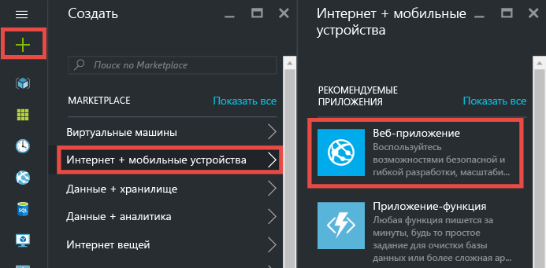
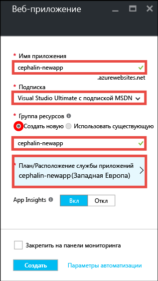
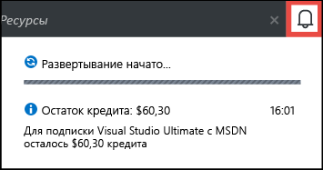
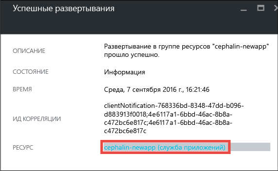
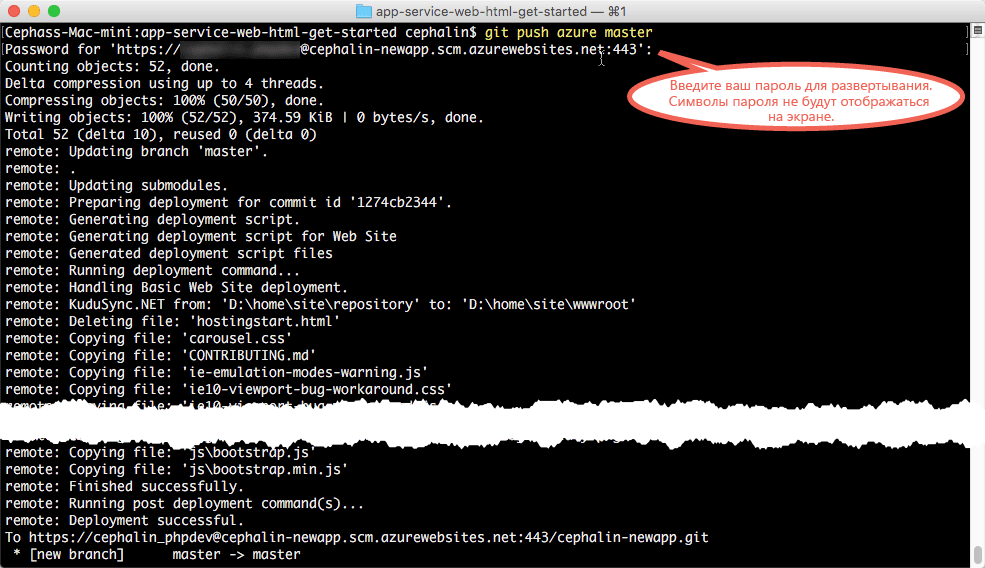

<properties 
	pageTitle="Развертывание первого веб-приложения в Azure за пять минут | Microsoft Azure" 
	description="Убедитесь, как просто запускать веб-приложения в службе приложений, развернув пример собственного приложения. Начните сразу с разработки настоящего приложения — и сразу же получите результаты." 
	services="app-service\web"
	documentationCenter=""
	authors="cephalin"
	manager="wpickett"
	editor=""
/>

<tags
	ms.service="app-service-web"
	ms.workload="web"
	ms.tgt_pltfrm="na"
	ms.devlang="na"
	ms.topic="hero-article"
	ms.date="09/09/2016" 
	ms.author="cephalin"
/>
	
# Развертывание первого веб-приложения в Azure за пять минут

Это руководство поможет вам развернуть ваше первое веб-приложение в [службе приложений Azure](../app-service/app-service-value-prop-what-is.md). В службе приложений можно создавать веб-приложения, [серверные части мобильных приложений](/documentation/learning-paths/appservice-mobileapps/) и [приложения API](../app-service-api/app-service-api-apps-why-best-platform.md).

В результате вы сможете:

- создать веб-приложение в службе приложений Azure;
- развернуть пример кода (ASP.NET, PHP, Node.js, Java или Python);
- увидеть запущенное приложение в рабочей среде;
- обновить веб-приложение так же, как вы отправляете фиксации [Git](https://git-scm.com/docs/git-push).

## Предварительные требования

- [Установите Git](http://www.git-scm.com/downloads). Чтобы проверить правильность установки, выполните команду `git --version` в новом окне командной строки Windows, окне PowerShell, оболочке Linux или терминале OS X.
- Учетная запись Microsoft Azure. Если у вас нет учетной записи, [подпишитесь на бесплатную пробную версию](/pricing/free-trial/?WT.mc_id=A261C142F) или [активируйте преимущества для подписчиков Visual Studio](/pricing/member-offers/msdn-benefits-details/?WT.mc_id=A261C142F).

>[AZURE.NOTE] Даже не имея учетной записи Azure, [вы можете поработать в службе приложений](http://go.microsoft.com/fwlink/?LinkId=523751). Здесь можно создать приложение начального уровня и экспериментировать с ним в течение часа. Для этого не требуется вводить данные кредитной карты или брать на себя какие-либо обязательства.

## Создание веб-приложения

1. Войдите на [портал Azure](https://portal.azure.com) с помощью своей учетной записи Azure.

2. В меню слева щелкните **Создать** > **Интернет + мобильные устройства** > **Веб-приложение**.

    

3. В колонке создания приложения укажите следующие параметры нового приложения:

    - **Имя приложения**: введите уникальное имя.
    - **Группа ресурсов**: щелкните **Создать** и укажите имя группы ресурсов.
    - **План/Расположение службы приложений**: чтобы настроить план службы приложений, выберите этот пункт, затем щелкните **Создать новую** и укажите имя, расположение и ценовую категорию плана службы приложений. Вы можете выбрать для ценовой категории уровень **Бесплатный**.

    Заполненная колонка создания приложения должна выглядеть так:

    

3. Нажмите кнопку **Создать** внизу. Чтобы отслеживать ход выполнения задания, щелкните значок **Уведомление** вверху.

    

4. Когда развертывание завершится, вы получите следующее уведомление. Щелкните его, чтобы открыть колонку с информацией о развертывании.

    

5. В колонке **Развертывание прошло успешно** щелкните ссылку **Ресурс**, чтобы открыть колонку нового веб-приложения.

    

## Развертывание кода веб-приложения

Давайте попробуем развернуть код в Azure с помощью GIT.

5. В колонке веб-приложения прокрутите вниз до пункта **Параметры развертывания** либо воспользуйтесь поиском. Щелкните этот пункт.

    

6. Щелкните **Выбор источника** > **Локальный репозиторий Git** > **ОК**.

7. Вернитесь в колонку веб-приложения и щелкните **Учетные данные развертывания**.

8. Задайте учетные данные развертывания и нажмите кнопку **Сохранить**.

7. В колонке веб-приложения прокрутите вниз до пункта **Свойства** либо воспользуйтесь поиском. Щелкните этот пункт. Нажмите кнопку **Копировать** рядом с полем **URL-адрес Git**.

    

    Теперь можно приступить к развертыванию кода с помощью GIT.

1. В командной строке перейдите в рабочий каталог (`CD`) и клонируйте пример приложения следующим образом:

        git clone <github_sample_url>

    

    В качестве значения для *lt;github\_sample\_url>* используйте один из следующих URL-адресов в зависимости от выбранной платформы:

    - HTML+CSS+JS: [https://github.com/Azure-Samples/app-service-web-html-get-started.git](https://github.com/Azure-Samples/app-service-web-html-get-started.git);
    - ASP.NET: [https://github.com/Azure-Samples/app-service-web-dotnet-get-started.git](https://github.com/Azure-Samples/app-service-web-dotnet-get-started.git);
    - PHP (CodeIgniter): [https://github.com/Azure-Samples/app-service-web-php-get-started.git](https://github.com/Azure-Samples/app-service-web-php-get-started.git);
    - Node.js (Express): [https://github.com/Azure-Samples/app-service-web-nodejs-get-started.git](https://github.com/Azure-Samples/app-service-web-nodejs-get-started.git);
    - Java: [https://github.com/Azure-Samples/app-service-web-java-get-started.git](https://github.com/Azure-Samples/app-service-web-java-get-started.git);
    - Python (Django): [https://github.com/Azure-Samples/app-service-web-python-get-started.git](https://github.com/Azure-Samples/app-service-web-python-get-started.git).

2. Перейдите в репозиторий примера приложения. Например,

        cd app-service-web-html-get-started

3. Настройте удаленный доступ своего приложения Azure к URL-адресу GIT, который вы скопировали с портала на одном из предыдущих шагов.

        git remote add azure <giturlfromportal>

4. Разверните пример кода в новом приложении Azure так, как вы отправляете любой код с помощью GIT:

        git push azure master

    

    Если используется одна из языковых платформ, выходные данные будут отличаться. Это происходит потому, что команда `git push` не только помещает код в Azure, но и активирует задачи развертывания в подсистеме развертывания. Если в корневом каталоге проекта (репозитория) содержится файл package.json (Node.js) или файл requirements.txt (Python) либо если в проекте ASP.NET содержится файл packages.config, скрипт развертывания сможет автоматически восстановить необходимые пакеты. Вы также можете [включить расширение Composer](web-sites-php-mysql-deploy-use-git.md#composer) для автоматической обработки файлов composer.json в приложении PHP.

Вот и все! Ваш код теперь работает в среде Azure. В браузере перейдите по адресу http://*&lt;appname>*.azurewebsites.net, чтобы увидеть работу приложения в реальном времени.

## Обновление приложения

Теперь с помощью Git можно в любой момент передать на рабочий сайт изменения из корневого каталога проекта (репозитория). Для этого нужно выполнить те же действия, что и при первом развертывании кода. Например, каждый раз, когда вам нужно отправить новое изменение, протестированное локально, просто выполните следующие команды из корневого каталога проекта (репозитория):

    git add .
    git commit -m "<your_message>"
    git push azure master

## Дальнейшие действия

Определите предпочтительный способ разработки и шаги по развертыванию приложений в соответствии с используемой языковой платформой:

> [AZURE.SELECTOR]
- [.NET](web-sites-dotnet-get-started.md)
- [PHP](app-service-web-php-get-started.md)
- [Node.js](app-service-web-nodejs-get-started.md)
- [Python](web-sites-python-ptvs-django-mysql.md)
- [Java](web-sites-java-get-started.md)

Вы также можете продолжить работу над своим первым веб-приложением. Например:

- Попробуйте [другие способы развертывания кода в Azure](../app-service-web/web-sites-deploy.md). Например, чтобы развернуть приложение из одного из репозиториев на GitHub, нужно просто выбрать **GitHub** вместо **Локальный репозиторий Git** в разделе **Параметры развертывания**.
- Выведите приложение Azure на следующий уровень. Проверяйте подлинность пользователей. Масштабируйте его в зависимости от потребностей. Настройте оповещения производительности. Все это можно сделать с помощью нескольких щелчков мыши. См. статью [Добавление функциональных возможностей в первое веб-приложение](app-service-web-get-started-2.md).

<!---HONumber=AcomDC_0914_2016--->