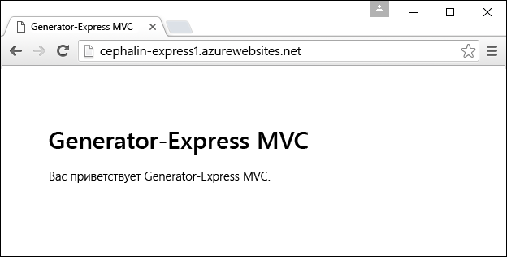
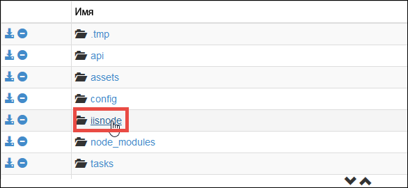
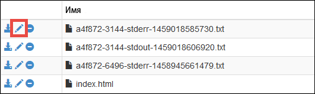
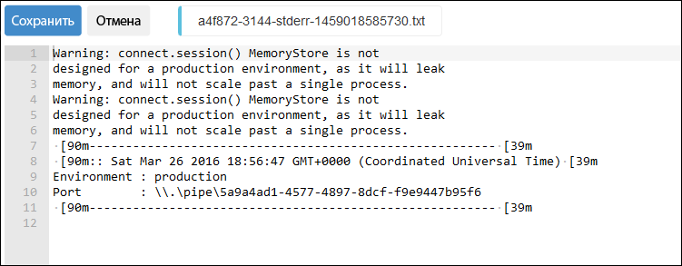

<properties
	pageTitle="Начало работы с веб-приложениями Node.js в службе приложений Azure"
	description="Сведения о развертывании приложения Node.js в веб-приложение в службе приложений Azure."
	services="app-service\web"
	documentationCenter="nodejs"
	authors="cephalin"
	manager="wpickett"
	editor=""/>

<tags
	ms.service="app-service-web"
	ms.workload="web"
	ms.tgt_pltfrm="na"
	ms.devlang="nodejs"
	ms.topic="get-started-article"
	ms.date="03/31/2016"
	ms.author="cephalin;robmcm"/>

# Начало работы с веб-приложениями Node.js в службе приложений Azure

> [AZURE.SELECTOR]
- [.Net](web-sites-dotnet-get-started.md)
- [Node.js](app-service-web-nodejs-get-started.md)
- [Java](web-sites-java-get-started.md)
- [PHP — Git](web-sites-php-mysql-deploy-use-git.md)
- [PHP — FTP](web-sites-php-mysql-deploy-use-ftp.md)
- [Python](web-sites-python-ptvs-django-mysql.md)

В этом руководстве описывается, как создать простое приложение [Node.js](http://nodejs.org), а затем развернуть его в [веб-приложении](app-service-web-overview.md) в [службе приложений Azure](../app-service/app-service-value-prop-what-is.md) с помощью командной строки (cmd.exe или bash). Инструкции, приведенные в этом учебнике, применимы к любой операционной системе, на которой может работать Node.js.

<a name="prereq"/>
## Предварительные требования

- Node.js. Двоичные файлы установки доступны [здесь](https://nodejs.org/).
- Yeoman. Инструкции по установке доступны [здесь](http://yeoman.io/).
- Git. Двоичные файлы установки доступны [здесь](http://www.git-scm.com/downloads).
- Azure CLI. Инструкции по установке доступны [здесь](../xplat-cli-install.md).
- Учетная запись Microsoft Azure. Если у вас нет учетной записи, можно [подписаться на бесплатную пробную версию](/pricing/free-trial/?WT.mc_id=A261C142F) или [активировать преимущества для подписчиков Visual Studio](/pricing/member-offers/msdn-benefits-details/?WT.mc_id=A261C142F).

## Создание и развертывание простого веб-приложения Node.js

1. Откройте окно командной строки на свой выбор, чтобы установить [генератор Express для Yeоman](https://github.com/petecoop/generator-express).

        npm install -g generator-express

2. Перейдите с помощью команды `CD` в рабочий каталог и создайте приложение Еxpress:

        yo express
        
    Выберите следующие параметры при появлении запроса:

    `? Would you like to create a new directory for your project?` **Yes** `? Enter directory name` **&lt;appname>** `? Select a version to install:` **MVC** `? Select a view engine to use:` **Jade** `? Select a css preprocessor to use (Sass Requires Ruby):` **None** `? Select a database to use:` **None** `? Select a build tool to use:` **Grunt**

3. Перейдите с помощью команды `CD` в корневой каталог нового приложения и запустите его, чтобы проверить его работоспособность в среде разработки:

        npm start

    В браузере перейдите по адресу [http://localhost:3000](http://localhost:3000), чтобы проверить отображение домашней страницы Express. Убедившись в работоспособности приложения, остановите его с помощью команды `Ctrl-C`.
    
1. Войдите в Azure (для этого вам понадобится [интерфейс командной строки Azure](#prereq)):

        azure login

    Следуйте указаниям, чтобы продолжить вход в браузере с помощью учетной записи Майкрософт в рамках вашей подписки Azure.

2. Убедитесь, что вы по-прежнему в корневом каталоге приложения. Создайте ресурс приложения службы приложений Azure с уникальным именем приложения, используя приведенную ниже команду. URL-адрес веб-приложения будет таким: http://&lt;appname>.azurewebsites.net.

        azure site create --git <appname>

    Следуйте указаниям, чтобы выбрать регион Azure для развертывания. Если вы еще не настроили учетные данные развертывания Git/FTP для своей подписки Azure, вам также будет предложено создать их.

3. Откройте файл config/config.js и измените рабочий порт на `process.env.port`. Рабочий объект JSON должен выглядеть так:

        production: {
            root: rootPath,
            app: {
                name: 'express1'
            },
            port: process.env.port,
        }

    Благодаря этому приложение Node.js сможет отвечать на веб-запросы с использованием порта по умолчанию, который прослушивается iisnode.
    
4. Сохраните изменения, а затем разверните приложение в Azure с помощью команды git:

        git add .
        git commit -m "<your commit message>"
        git push azure master

    Генератор Express включает файл GITIGNORE, поэтому команда `git push` не будет использовать пропускную способность при попытке отправки в каталог node\_modules.

5. Наконец, просто запустите живое приложение Azure в браузере:

        azure site browse

    Теперь вы увидите веб-приложение Node.js, запущенное в службе приложений Azure в режиме реального времени.
    
    

## Обновление веб-приложения Node.js

Чтобы обновить веб-приложение Node.js, запущенное в службе приложений, просто запустите `git add`, `git commit` и `git push` так же, как и при первом развертывании.
     
## Как служба приложений развертывает приложение Node.js

Для запуска приложений Node.js служба приложений Azure использует [iisnode](https://github.com/tjanczuk/iisnode/wiki). Совместное использование Azure CLI и ядра Kudu (развертывание Git) упрощает разработку и развертывание приложений Node.js из командной строки.

- Команда `azure site create --git` распознает общий шаблон Node.js (server.js или app.js) и создает файл iisnode.yml в корневом каталоге. Этот файл можно использовать для настройки iisnode.
- С помощью команды `git push azure master` Kudu автоматизирует следующие задачи развертывания.

    - Если файл package.json находится в корневой папке репозитория, выполните команду `npm install --production`.
    - Создайте файл Web.config для iisnode, который указывает на ваш файл в скрипте запуска в файле package.json (например, server.js или app.js).
    - Настройте файл Web.config для подготовки приложения к отладке с помощью Node-Inspector.
    
## Использование платформы Node.js

Если для разработки приложений вы используете популярную платформу Node.js (например, [Sails.js](http://sailsjs.org/) или [MEAN.js](http://meanjs.org/)), вы можете развернуть их в службе приложений. Популярные платформы Node.js имеют свои особенности. Их связанные зависимости пакетов регулярно обновляются. Так как при этом служба приложений предоставляет доступ к журналам stdout и stderr, вы точно будете знать, что происходит с вашим приложением, чтобы вносить соответствующие изменения. Дополнительные сведения см. в разделе [Получение журналов stdout и stderr из iisnode](#iisnodelog).

Также ознакомьтесь с руководствами, в которых показано, как работать с конкретной платформой в службе приложений:

- [Развертывание веб-приложения Sails.js в службе приложений Azure](app-service-web-nodejs-sails.md)
- [Создание приложения для разговоров на Node.js с использованием Socket.IO в службе приложений Azure](web-sites-nodejs-chat-app-socketio.md)
- [Как использовать io.js с веб-приложениями службы приложений Azure](web-sites-nodejs-iojs.md)

## Использование определенного модуля Node.js

В рамках обычного рабочего процесса вы можете настроить службу приложений для использования определенного модуля Node.js, как и в файле package.json. Например:

    "engines": {
        "node": "5.5.0"
    }, 

Подсистема развертывания Kudu определяет, какой модуль Node.js будет использоваться, в следующем порядке:

- Сначала проверьте, указан ли в файле iisnode.yml элемент `nodeProcessCommandLine`. Если элемент указан, используйте его.
- Затем проверьте, указан ли в файле package.json элемент `"node": "..."` в объекте `engines`. Если элемент указан, используйте его.
- Выберите версию Node.js по умолчанию.

<a name="iisnodelog" />
## Получение журналов stdout и stderr из iisnode

Для чтения журналов iisnode выполните следующие действия.

1. Откройте файл iisnode.yml с помощью интерфейса командной строки Azure.

2. Укажите следующие параметры:

        loggingEnabled: true
        logDirectory: iisnode
    
    Эти два параметра указывают iisnode в службе приложений поместить выходные данные stdout и stderror в каталог D:\\home\\site\\wwwroot**iisnode**.

3. Сохраните изменения, а затем примените изменения в Azure с помощью следующих команд Git:

        git add .
        git commit -m "<your commit message>"
        git push azure master
   
   Вы настроили iisnode. Далее показано, как получить доступ к этим журналам.
     
4. В браузере откройте консоль отладки Kudu для своего приложения по адресу:

        https://<appname>.scm.azurewebsites.net/DebugConsole 

5. Перейдите в каталог D:\\home\\site\\wwwroot\\iisnode.

    

6. Щелкните значок **Изменить** для журнала, который требуется прочитать. При необходимости также можно щелкнуть **Скачать** или **Удалить**.

    

    Теперь вы можете просмотреть журнал для отладки развертывания службы приложений.
    
    

## Отладка приложения с помощью Node-Inspector

Если вы выполняете отладку приложений Node.js с помощью Node-Inspector, это средство можно использовать также для живого приложения службы приложений. Средство Node-Inspector предустановлено в установке iisnode для службы приложений. Если развертывание выполняется через Git, автоматически созданный в Kudu файл Web.config уже содержит все настройки, необходимые для включения Node-Inspector.

Включить Node-Inspector можно так.

1. Откройте файл iisnode.yml в корневой папке репозитория и укажите следующие параметры: 

        debuggingEnabled: true
        debuggerExtensionDll: iisnode-inspector.dll

3. Сохраните изменения, а затем примените изменения в Azure с помощью следующих команд Git:

        git add .
        git commit -m "<your commit message>"
        git push azure master
   
4. Теперь просто перейдите к файлу запуска приложения, добавив /debug к URL-адресу, указанному в скрипте запуска в вашем файле package.json. Например,

        http://<appname>.azurewebsites.net/server.js/debug
    
    или
    
        http://<appname>.azurewebsites.net/app.js/debug

## Дополнительные ресурсы

- [Указание версии Node.js в приложении Azure](../nodejs-specify-node-version-azure-apps.md)
- [Отладка веб-приложения Node.js в службе приложений Azure](web-sites-nodejs-debug.md)
- [Использование модулей Node.js с приложениями Azure](../nodejs-use-node-modules-azure-apps.md)
- [Azure App Service Web Apps: Node.js (Веб-приложения службы приложений Azure: Node.js)](http://blogs.msdn.com/b/silverlining/archive/2012/06/14/windows-azure-websites-node-js.aspx)
- [Центр разработчиков Node.js.](/develop/nodejs/)
- [Начало работы с веб-приложениями в службе приложений Azure](app-service-web-get-started.md)

<!---HONumber=AcomDC_0413_2016-->