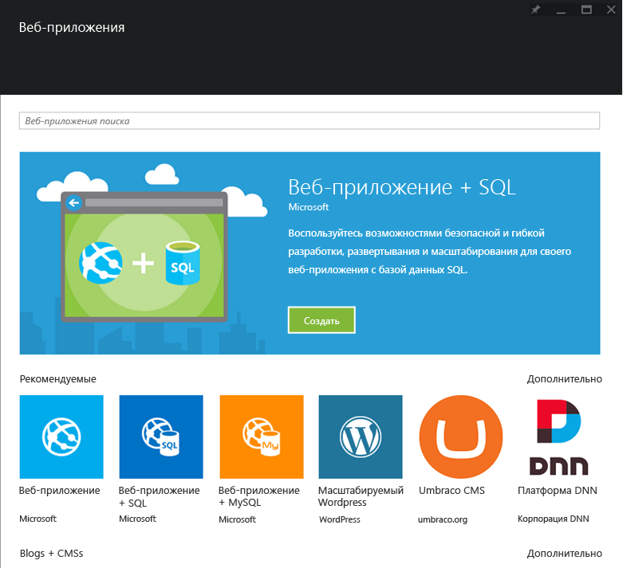

<properties
	pageTitle="Обзор веб-приложений"
	description="Дополнительные сведения о веб-приложениях службы приложений"
	services="app-service\web"
	documentationCenter=""
	authors="jaime-espinosa"
	manager="wpickett"
	editor="jimbe"/>

<tags
	ms.service="app-service-web"
	ms.workload="web"
	ms.tgt_pltfrm="na"
	ms.devlang="na"
	ms.topic="get-started-article"
	ms.date="01/09/2016"
	ms.author="jaime.espinosa"/>

#Обзор веб-приложений

[Служба приложений](http://go.microsoft.com/fwlink/?LinkId=529714) — это полностью управляемая платформа для профессиональных разработчиков, которая привносит широкий спектр возможностей в сценарии веб-сайтов, мобильных устройств и интеграции. Быстро создавайте и развертывайте критически важные веб-приложения, масштабирующиеся вместе с вашей компанией с помощью службы приложений Azure.

Используйте всю полноту возможностей[ веб-приложений службы приложений](http://go.microsoft.com/fwlink/?LinkId=529714), чтобы работать с привычными языками и платформами, быстро развертывать приложения в облаке Azure и постоянно улучшать код без всяких переживаний по поводу инфраструктуры.

[AZURE.INCLUDE [compute-table](../../includes/compute-options-table.md)]

## Больше, чем просто веб-приложения##

Современные предприятия постоянно усложняют механизмы взаимодействия с клиентами. Компании всех типов рассматривают свое корпоративное присутствие в Интернете как критически важную составляющую часть бизнеса, основной компонент в своем бизнес-плане. Для реализации этого момента предприятиям требуется платформа, которая обеспечит им гибкость, безопасность и масштабируемость. Кроме того, им необходима возможность связи с существующей бизнес-системой, возможность быстрого развертывания нового кода и глобального запуска экземпляров. С появлением службы приложений Azure и веб-приложений организации получили возможность быстро и эффективно удовлетворять потребности клиентов.

## Почему веб-приложения? ##

Веб-сайты службы приложений Azure — это полностью управляемая платформа, позволяющая создавать, развертывать и масштабировать веб-приложения корпоративного уровня буквально за секунды. Сосредоточьтесь на коде приложения и позвольте Azure позаботиться об инфраструктуре, позволяющей безопасно выполнять и масштабировать это приложение. Особенности веб-приложения:

- **Привычность и быстрота.** Используйте имеющиеся навыки для работы со знакомыми языками, платформами и интегрированными средами разработки. Всего несколькими щелчками для существующего веб-приложения можно добавить управление версиями, обновление, единый вход, брокер удостоверений, изолированное хранилище и мониторинг производительности. Используйте материалы обширной коллекции в качестве стандартных блоков для ускорения разработки. Оцените несравненный уровень производительности труда разработчика и передовые возможности, такие как непрерывная интеграция, отладка на работающем сайте, а также ведущую в отрасли интегрированную среду разработки Visual Studio.
- **Корпоративный уровень** — веб-приложения предназначены для создания и размещения безопасных и критически важных приложений. Создавайте интегрированные с Active Directory бизнес-приложения, которые безопасно подключаются к локальным ресурсам, а затем разместите их на безопасной облачной платформе, которая совместима со стандартами ISO, SOC2 и PCI. И не забывайте про преимущества соглашений об уровне обслуживания корпоративного уровня.
- **Глобальный масштаб** — веб-приложения оптимизированы для обеспечения доступности и автоматического масштабирования в глобальной инфраструктуре центров обработки данных. Легко масштабируйте приложения вверх или вниз по требованию. Реализуйте высокий уровень доступности в разных географических регионах. Репликация данных и размещение служб в нескольких разных местах осуществляются легко и просто, а расширение в новые области и географические регионы стало не сложнее щелчка мышью.  

## Основные понятия веб-приложений ##

- **Коллекция веб-приложений** — оцените постоянно пополняемый список имеющихся шаблонов веб-приложений. Используйте лучшие решения сообщества по приложениям OSS, одним щелчком мышью устанавливая такие пакеты, как Wordpress, Joomla и Drupal. С самого начала организуйте правильный подход к разработке приложений, используя такие платформы, как .NET MVC, Django и CakePHP.
- **Автоматическое масштабирование** — веб-приложения позволяют быстро осуществлять горизонтальное и вертикальное масштабирование для обработки любого уровня нагрузки клиентов. Вручную выберите количество и размер виртуальных машин или настройте автомасштабирование для масштабирования серверов на основе нагрузки или по расписанию.
- **Непрерывная интеграция** — настройте рабочие процессы непрерывной интеграции и развертывания в VSTS, GitHub, TeamCity, Hudson или BitBucket, что позволит вам автоматически выполнять сборку, тестировать и развертывать веб-приложение при каждом успешном возврате кода или тестах интеграции.
- **Слоты развертывания** — реализуйте [промежуточное развертывание][Slots] для проверки кода в подготовительной среде, которая идентична рабочему веб-приложению в службе приложений Azure. При достижении нужного результата выпустите новую версию приложения с нулевым временем простоя, выполнив операцию замены. 
- **Тестирование в рабочей среде** — поднимите поэтапное развертывание на новый уровень и выполните A/B тестирование, чтобы испытать новый код с помощью настраиваемого объема реального трафика. 
- **Веб-задания** — запускайте любую программу или скрипт на виртуальных машинах веб-приложений. Выполняйте задания непрерывно или по расписанию и масштабируйте их для запуска на нескольких виртуальных машинах. Используйте Azure [WebJobs SDK][Webjobs] для интеграции с хранилищем Azure или служебной шиной.
- **Гибридные подключения** — доступ к локальным данным с помощью [гибридных подключений](../biztalk-services/integration-hybrid-connection-overview.md) и [виртуальной сети](../app-service-web/web-sites-integrate-with-vnet.md).

## Приступая к работе ##
Чтобы приступить к работе с веб-приложениями, пройдите учебник [Создание веб-приложения ASP.NET][create].

Дополнительные сведения о платформе службы приложений Azure см. в статье [Служба приложений Azure][appservice].

>[AZURE.NOTE] Если вы хотите приступить к работе со службой приложений Azure до создания учетной записи Azure, перейдите к разделу [Пробное использование службы приложений](http://go.microsoft.com/fwlink/?LinkId=523751), где вы можете быстро создать кратковременное веб-приложение начального уровня в службе приложений. Никаких кредитных карт и обязательств.

## Изменения
* Указания по изменениям при переходе от веб-сайтов к службе приложений см. в разделе [Служба приложений Azure и ее влияние на существующие службы Azure](http://go.microsoft.com/fwlink/?LinkId=529714).

[appservice]: ../app-service/app-service-value-prop-what-is.md
[create]: web-sites-dotnet-get-started.md
[Webjobs]: websites-dotnet-webjobs-sdk-get-started.md
[Slots]: web-sites-staged-publishing.md

 

<!---HONumber=AcomDC_0413_2016-->