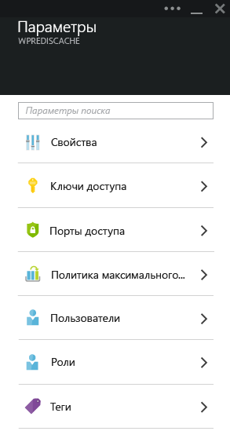
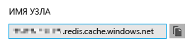
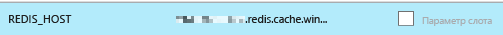
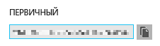
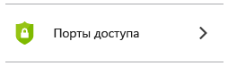
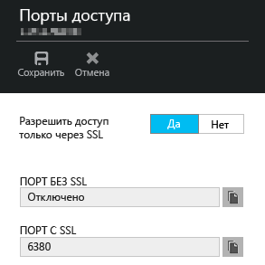
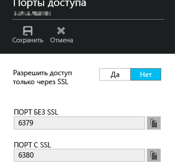

<properties
	pageTitle="Присоединение веб-приложения в службе приложений Azure к кэшу Redis при помощи протокола Memcache | Microsoft Azure"
	description="Присоединение веб-приложения в службе приложений Azure к кэшу Redis с помощью протокола Memcache"
	services="app-service\web"
	documentationCenter="php"
	authors="SyntaxC4"
	manager="wpickett"
	editor="riande"/>

<tags
	ms.service="app-service"
	ms.devlang="php"
	ms.topic="get-started-article"
	ms.tgt_pltfrm="windows"
	ms.workload="web"
	ms.date="09/16/2015"
	ms.author="cfowler"/>

# Присоединение веб-приложения в службе приложений Azure к кэшу Redis при помощи протокола Memcache

В этой статье вы узнаете, как подключить веб-приложение WordPress в [службе приложений Azure](http://go.microsoft.com/fwlink/?LinkId=529714) к [кэшу Redis для Azure][12] с использованием протокола [Memcache][13]. Существующее веб-приложение, которое использует сервер Memcached для кэширования в память, можно перенести в службу приложений Azure и использовать для кэширования основное решение в службе Microsoft Azure с минимальными изменениями кода приложения или без изменений вообще. Кроме того, можно использовать существующие навыки работы с Memcache для создания в службе приложений Azure распределенных приложений высокой степени масштабируемости с кэшем Redis для Azure для кэширования в память, используя при этом известные программные платформы, такие как .NET, PHP, Node.js, Java и Python.

Веб-приложения службы приложений разрешают сценарий этого приложения с оболочкой совместимости веб-приложений Memcache, которая является локальным сервером Memcache, действующим как прокси-сервер Memcache для кэширования вызовов в кэш Redis для Azure. Это позволяет любому приложению, которое передает данные при помощи протокола Memcache, кэшировать данные в кэше Redis. Эта оболочка совместимости Memcache работает на уровне протокола, поэтому ее может использовать любое приложение или любая исполняющая среда, при условии использования протокола Memcache для связи.

[AZURE.INCLUDE [app-service-web-to-api-and-mobile](../../includes/app-service-web-to-api-and-mobile.md)]

## Предварительные требования

Оболочку совместимости веб-приложений Memcache можно использовать с любым приложением при условии использования для связи протокола Memcache. В этом конкретном примере используется масштабируемый сайт WordPress, который можно получить на сайте Azure Marketplace.

Выполните шаги, описанные в следующих статьях:

* [Подготовка экземпляра службы кэша Redis для Azure][1]
* [Развертывание масштабируемого сайта WordPress в Azure][0]

После развертывания масштабируемого сайта WordPress и создания экземпляра кэша Redis можно продолжить включение оболочки совместимости Memcache в веб-приложениях службы приложений Azure.

## Включение оболочки совместимости веб-приложений Memcache

Чтобы настроить оболочку совместимости Memcache, необходимо создать три параметра приложения. Это можно сделать разнообразными способами, в том числе с помощью [портала Azure](http://go.microsoft.com/fwlink/?LinkId=529715), [старого портала][3], [командлетов PowerShell для Azure][5] или [интерфейса командной строки Azure][5]. В этой публикации мы будем использовать [портал Azure][4] для определения параметров приложения. Следующие значения можно получить в колонке **Параметры** вашего экземпляра кэша Redis.



### Добавление параметра приложения REDIS\_HOST

Сначала нужно создать параметр приложения **REDIS\_HOST**. Этот параметр определяет назначение, к которому оболочка совместимости направляет данные кэша. Значение, необходимое для параметра приложения REDIS\_HOST, можно получить в колонке **Свойства** вашего экземпляра кэша Redis.



Задайте ключ параметра приложения **REDIS\_HOST** и значение параметра приложения **hostname** для экземпляра кэша Redis.



### Добавление параметра приложения REDIS\_KEY

Затем необходимо создать параметр приложения **REDIS\_KEY**. Этот параметр предоставляет маркер аутентификации для получения безопасного доступа к экземпляру кэша Redis. Значение, необходимое для параметра REDIS\_KEY, можно получить в колонке **Ключи доступа** экземпляра кэша Redis.



Задайте ключ параметра приложения **REDIS\_KEY** и значение параметра приложения **Primary Key** для экземпляра кэша Redis.


### Добавление параметра приложения MEMCACHESHIM\_REDIS\_ENABLE

Последний параметр приложения используется для включения оболочки совместимости Memcache в веб-приложениях, которые будут использовать параметры REDIS\_HOST и REDIS\_KEY для подключения к кэшу Redis для Azure и переадресовывать вызовы кэша. Задайте ключ параметра приложения **MEMCACHESHIM\_REDIS\_ENABLE** и значение **true**.


После добавления трех (3) параметров приложения щелкните **Сохранить**.

## Включение расширения Memcache для PHP

Чтобы приложение использовало протокол Memcache, установите расширение Memcache в PHP — языковой платформе вашего сайта WordPress.

### Загрузка расширения php\_memcache

Перейдите в раздел [PECL][6]. В категории кэширования выберите [memcache][7]. В столбце загрузок щелкните ссылку DLL.


Загрузите расширение по ссылке Non-Thread Safe (NTS) x86 для версии PHP, работающей в веб-приложениях (по умолчанию это PHP 5.4).


### Включение расширения php\_memcache

После скачивания файла распакуйте его и добавьте файл **php\_memcache.dll** в каталог **d:\\home\\site\\wwwroot\\bin\\ext\**. После загрузки файла php\_memcache.dll в веб-приложение необходимо включить расширение в среде выполнения PHP. Чтобы включить расширение Memcache на портале Azure, откройте колонку **Параметры приложения** для веб-приложения, затем добавьте новый параметр приложения с ключом **PHP\_EXTENSIONS** и значением **bin\\ext\\php\_memcache.dll**.


> [AZURE.NOTE]Если для веб-приложения необходимо загрузить несколько расширений PHP, значение параметра PHP\_EXTENSIONS должно быть списком относительных путей к DLL-файлам с разделителями-запятыми.


По завершении щелкните **Сохранить**.

## Установка подключаемого модуля Memcache WordPress

> [AZURE.NOTE]На сайте WordPress.org. можно также скачать подключаемый модуль [Memcached Object Cache](https://wordpress.org/plugins/memcached/).

На странице подключаемых модулей WordPress нажмите кнопку **Добавить новый**.


В поле поиска введите **memcached** и нажмите клавишу **ВВОД**.


Найдите **Memcached Object Cache** в списке, а затем нажмите кнопку **Установить**.


### Включение подключаемого модуля Memcache WordPress

>[AZURE.NOTE]Чтобы установить Visual Studio Online, следуйте указаниям в этой записи блога [Как включить расширение сайта в веб-приложениях][8].

В файле `wp-config.php` добавьте следующий фрагмент кода перед комментарием о прекращении правки в самом конце файла.

```php
$memcached_servers = array(
	'default' => array('localhost:' . getenv("MEMCACHESHIM_PORT"))
);
```

После вставки этого фрагмента кода функция monaco автоматически сохранит документ.

Следующим действием будет включение подключаемого модуля кэша объектов. Для этого перетащите файл **object-cache.php** из папки **wp-content/memcached** в папку **wp-content**, чтобы включить функциональность кэша объектов Memcache.


Теперь, когда файл **object-cache.php** находится в папке **wp-content**, кэш объектов Memcached включен.


## Проверка функционирования подключаемого модуля Memcache Object Cache

На этом все действия по включению оболочки совместимости Memcache в веб-приложениях завершены. Остается проверить заполнение данными экземпляра кэша Redis.

### Включение поддержки порта подключения без SSL в кэше Redis для Azure

>[AZURE.NOTE]На момент написания этой статьи интерфейс командной строки Redis не поддерживал соединение SSL, поэтому необходимо выполнить следующие действия.

В портале Azure найдите в созданном вами экземпляре кэша Redis это веб-приложение. Открыв колонку кэша, щелкните значок **Параметры**.


Выберите **Порты доступа** в списке.



Щелкните **Нет** для параметра **Разрешить доступ только через SSL**.



После этого отобразится установленный порт, не использующий протокол SSL. Щелкните **Сохранить**.



### Подключение к кэшу Redis для Azure через Redis CLI

>[AZURE.NOTE]При выполнении этого действия предполагается, что программное обеспечение Redis установлено локально на компьютере, на котором проводится разработка. [Установите Redis локально, следуя этим указаниям][9].

Откройте выбранную консоль командной строки и введите следующую команду:

```shell
redis-cli –h <hostname-for-redis-cache> –a <primary-key-for-redis-cache> –p 6379
```

Замените **<hostname-for-redis-cache>** фактическим именем хоста xxxxx.redis.cache.windows.net, а **<primary-key-for-redis-cache>** — ключом доступа для кэша, после чего нажмите клавишу **ВВОД**. После подключения CLI к экземпляру кэша Redis запустите любую команду redis. На снимке экрана ниже я выбрал список ключей.


Вызов списка ключей должен возвратить значение. Если нет, перейдите к веб-приложению и повторите попытку.

## Заключение

Поздравляем! Приложение WordPress теперь располагает централизованным кэшированием в памяти, что поддерживает увеличение пропускной способности. Помните, что оболочку совместимости веб-приложений Memcache можно использовать с любым клиентом Memcache, независимо от языка программирования или исполняющей среды. Отправить отзыв или задать вопросы об оболочке совместимости веб-приложений Memcache можно на [форумах MSDN][10] или на сайте [Stackoverflow][11].

>[AZURE.NOTE]Чтобы приступить к работе со службой приложений Azure до создания учетной записи Azure, перейдите к разделу [Пробное использование службы приложений](http://go.microsoft.com/fwlink/?LinkId=523751), где вы можете быстро создать кратковременное веб-приложение начального уровня в службе приложений. Никаких кредитных карт и обязательств.

## Изменения
* Указания по изменениям при переходе от веб-сайтов к службе приложений см. в статье [Служба приложений Azure и ее влияние на существующие службы Azure](http://go.microsoft.com/fwlink/?LinkId=529714).
* Руководство по смене старого портала на новый портал см. в разделе [Справочник по навигации на предварительной версии портала](http://go.microsoft.com/fwlink/?LinkId=529715).


[0]: http://bit.ly/1F0m3tw
[1]: http://bit.ly/1t0KxBQ
[2]: http://manage.windowsazure.com
[3]: http://portal.azure.com
[4]: ../powershell-install-configure.md
[5]: /downloads
[6]: http://pecl.php.net
[7]: http://pecl.php.net/package/memcache
[8]: http://blog.syntaxc4.net/post/2015/02/05/how-to-enable-a-site-extension-in-azure-websites.aspx
[9]: http://redis.io/download#installation
[10]: https://social.msdn.microsoft.com/Forums/home?forum=windowsazurewebsitespreview
[11]: http://stackoverflow.com/questions/tagged/azure-web-sites
[12]: /services/cache/
[13]: http://memcached.org

<!---HONumber=Sept15_HO3-->