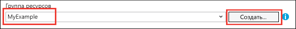

# Развертывание веб-приложения ASP.NET в службе приложений Azure с помощью Visual Studio
[!INCLUDE [tabs](../../includes/app-service-web-get-started-nav-tabs.md)]

## Обзор
В этом руководстве описано, как развернуть веб-приложение ASP.NET [в веб-приложении службы приложений Azure](app-service-web-overview.md) с помощью Visual Studio 2015.

Это руководство создано для разработчиков ASP.NET без опыта работы с Azure. По завершении его изучения вы получите простое веб-приложение, работающее в облаке.

Вы узнаете следующее:

* Как создать новое веб-приложение службы приложений во время создания веб-проекта в Visual Studio.
* Как развернуть веб-проект для веб-приложения службы приложений с помощью Visual Studio.

На схеме ниже показаны шаги, рассматриваемые в этом руководстве.

В конце руководства в разделе [Устранение неполадок](#troubleshooting) приводятся рекомендации на случай возможных неисправностей, а в разделе [Дальнейшие действия](#next-steps) указаны ссылки на другие руководства с подробными сведениями об использовании службы приложений Azure.

В этом руководстве по началу работы продемонстрировано развертывание простого веб-проекта, в котором не используется база данных и не выполняется аутентификация или авторизация. Ссылки на дополнительные разделы, посвященные развертыванию, см. в [руководстве по развертыванию веб-приложения Azure](web-sites-deploy.md).

Помимо времени, необходимого для установки пакета Azure SDK для .NET, изучение этого руководства займет около 10–15 минут.

## Предварительные требования
* В этом руководстве предполагается, что у вас есть опыт работы с ASP.NET MVC и Visual Studio. Общие сведения об этих компонентах см. в статье [Getting Started with ASP.NET MVC 5](http://www.asp.net/mvc/overview/getting-started/introduction/getting-started) (Приступая к работе с Azure и ASP.NET MVC 5).
* Вам понадобится учетная запись Azure. Вы можете [создать бесплатную учетную запись Azure](https://azure.microsoft.com/pricing/free-trial/?WT.mc_id=A261C142F) или [активировать преимущества для подписчиков Visual Studio](https://azure.microsoft.com/pricing/member-offers/msdn-benefits-details/?WT.mc_id=A261C142F). 
  
    Чтобы приступить к работе со службой приложений Azure до регистрации и получения учетной записи Azure, перейдите на страницу [пробного использования службы приложений](https://azure.microsoft.com/try/app-service/). Там можно создать кратковременное приложение начального уровня в службе приложений. Для этого не потребуется ни кредитная карта, ни какие-либо обязательства.

## Настройка среды разработки
Это руководство написано для Visual Studio 2015 с [пакетом Azure SDK для .NET](../dotnet-sdk.md) версии 2.9 или более поздней. 

* [Скачайте пакет Azure SDK для Visual Studio 2015 последней версии](http://go.microsoft.com/fwlink/?linkid=518003). Вместе с пакетом SDK также установится Visual Studio 2015, если вы еще этого не сделали.
  
  > [!NOTE]
  > В зависимости от того, сколько зависимостей пакета SDK уже имеется на компьютере, установка пакета SDK может занять определенное время, от нескольких минут до получаса или более.
  > 
  > 

Если вы хотите использовать уже установленную версию Visual Studio 2013, [скачайте пакет Azure SDK для Visual Studio 2013 последней версии](http://go.microsoft.com/fwlink/?LinkID=324322). Некоторые снимки экранов, приведенные здесь, могут отличаться от реальных.

## Создание веб-приложения
Теперь нужно создать проект веб-приложения в Visual Studio и веб-приложение в службе приложений Azure. В этом разделе руководства мы настроим новый веб-проект. 

1. Откройте Visual Studio 2015.
2. Щелкните **Файл > Создать > Проект**.
3. В диалоговом окне **Новый проект** последовательно щелкните **Visual C# > Интернет > Веб-приложение ASP.NET**.
4. Убедитесь, что выбрана версия **.NET Framework 4.5.2** .
5. [Azure Application Insights](../application-insights/app-insights-overview.md) . Флажок **Добавить Application Insights в проект** будет установлен по умолчанию, если веб-проект создается впервые после установки Visual Studio. Если вы не хотите использовать Application Insights, снимите этот флажок.
6. Присвойте приложению имя **MyExample** и нажмите кнопку **ОК**.
   
    
7. В диалоговом окне **Новый проект ASP.NET** выберите шаблон **MVC**, а затем щелкните **Изменить способ проверки подлинности**.
   
    В этом руководстве описывается развертывание веб-проекта ASP.NET MVC. Сведения о том, как развернуть проект веб-API ASP.NET, см. в разделе [Дальнейшие действия](#next-steps). 
   
    
8. В диалоговом окне **Изменить способ проверки подлинности** установите переключатель **Без проверки подлинности** и нажмите кнопку **ОК**.
   
    
   
    Работая с этим руководством по началу работы, вы развернете простое приложение, которое не предусматривает вход пользователя.
9. В диалоговом окне **Новый проект ASP.NET** в разделе **Microsoft Azure** установите флажок **Разместить в облаке**, а в раскрывающемся списке выберите пункт **Служба приложений**.
   
    
   
    Эти параметры указывают, что Visual Studio создаст веб-приложение Azure для вашего веб-проекта.
10. Нажмите кнопку **ОК**

## Создание ресурсов Azure
Теперь в Visual Studio можно указать ресурсы Azure, которые требуется создать.

1. В диалоговом окне **Создать службу приложений** щелкните **Добавить учетную запись**, а затем войдите в Azure с помощью идентификатора и пароля учетной записи, используемой для управления подпиской Azure.
   
    
   
    Если вы вошли в Azure ранее на этом же компьютере, кнопка **Добавить учетную запись** может не отображаться. В этом случае можно пропустить этот шаг или при необходимости повторно ввести учетные данные.
2. В поле **Имя веб-приложения** введите имя, которое является уникальным в домене *azurewebsites.net*. Вы можете назвать приложение MyExample и добавить уникальный номер справа (например, MyExample810) или использовать уникальное имя, которое создается автоматически.
   
    Если кто-то уже использует введенное вами имя, вместо зеленой галочки справа появится красный восклицательный знак. Это значит, что вам нужно ввести другое имя.
   
    URL-адрес приложения состоит из этого имени и домена *.azurewebsites.net*. Например, если имя — `MyExample810`, URL-адрес будет таким: `myexample810.azurewebsites.net`.
   
    Для веб-приложения Azure можно также использовать личный домен. Дополнительные сведения см. в статье [Сопоставление имени личного домена с приложением Azure](web-sites-custom-domain-name.md).
3. Нажмите кнопку **Создать** рядом с полем **Группа ресурсов** и введите имя MyExample (или любое другое имя). 
   
    
   
    Группа ресурсов — это совокупность ресурсов Azure, таких как веб-приложения, базы данных и виртуальные машины. Для этого руководства рекомендуется создать новую группу ресурсов, чтобы потом одновременно удалить все ресурсы Azure, созданные для работы с этим руководством. Дополнительные сведения см. в [обзоре Azure Resource Manager](../azure-resource-manager/resource-group-overview.md).
4. Нажмите кнопку **Создать** возле раскрывающегося списка **План службы приложений**.
   
    
   
    Отобразится диалоговое окно **Настроить план службы приложений** .
   
    
   
    Далее мы настроим план службы приложений для новой группы ресурсов. План службы приложений определяет вычислительные ресурсы, на которых будет работать ваше веб-приложение. Например, если выбрать уровень "Бесплатный", ваше приложение будет работает на общих виртуальных машинах, тогда как при выборе некоторых платных уровней приложение будет работать на выделенных виртуальных машинах. Дополнительные сведения см. в статье [Подробный обзор планов службы приложений Azure](../app-service/azure-web-sites-web-hosting-plans-in-depth-overview.md).
5. В диалоговом окне **Настроить план службы приложений** в соответствующем поле введите MyExamplePlan или другое имя.
6. В раскрывающемся списке **Расположение** выберите ближайшее расположение.
   
    Этот параметр определяет, в каком центре обработки данных Azure будет выполняться приложение. При работе с учебником вы можете выбрать любой регион, и это не будет оказывать существенного влияния. Тем не менее для рабочего приложения необходимо, чтобы сервер располагался как можно ближе к клиентам, которые осуществляют к нему доступ. Это позволит минимизировать [задержки](http://www.bing.com/search?q=web%20latency%20introduction&qs=n&form=QBRE&pq=web%20latency%20introduction&sc=1-24&sp=-1&sk=&cvid=eefff99dfc864d25a75a83740f1e0090).
7. В раскрывающемся списке **Размер** щелкните **Бесплатный**.
   
    Эта ценовая категория обеспечит достаточную производительность в рамках заданий этого руководства.
8. В диалоговом окне **Настроить план служб приложений** нажмите кнопку **ОК**.
9. В диалоговом окне **Создать службу приложений** нажмите кнопку **Создать**.

## Проверка ресурсов Azure в Visual Studio
За короткий промежуток времени, обычно не более минуты, Visual Studio создаст веб-проект и веб-приложение.  

В окне **обозревателя решений** отображаются файлы и папки нового проекта.

В окне **Действие службы приложений Azure** будет показано, что ресурсы службы приложений созданы в Azure. Вы можете щелкнуть приведенную здесь ссылку, чтобы сразу же опубликовать новый проект. Далее в руководстве показано, как опубликовать файлы в любое время.

В окне **Cloud Explorer** можно просматривать ресурсы Azure, включая только что созданное веб-приложение, и управлять ими.

## Развертывание веб-проекта в Azure
В этом разделе мы развернем веб-проект в ресурсе веб-приложения, созданном в службе приложений Azure.

1. В **Обозревателе решений** щелкните правой кнопкой проект и выберите пункт **Опубликовать**.
   
    
   
    Через несколько секунд откроется окно **мастера веб-публикации** . В мастере откроется *профиль публикации* , содержащий параметры для развертывания веб-проекта в новом веб-приложении.
   
    > [!TIP] 
    > Профиль публикации содержит имя пользователя и пароль для развертывания.  Эти учетные данные созданы автоматически. Их не нужно вводить. Пароль хранится в зашифрованном виде в скрытом пользовательском файле в папке `Properties\PublishProfiles`.
    >
    >
2. На вкладке **Подключение** мастера **публикации веб-сайта** нажмите кнопку **Далее**.
   
    
   
    После этого отобразится вкладка **Параметры** . Здесь можно изменить конфигурацию сборки, чтобы развернуть отладочную сборку для [удаленной отладки](web-sites-dotnet-troubleshoot-visual-studio.md#remotedebug). На этой вкладке также представлено несколько [параметров публикации файлов](https://msdn.microsoft.com/library/dd465337.aspx#Anchor_2).
3. На вкладке **Параметры** нажмите кнопку **Далее**.
   
   
   
   Следующая вкладка — **Предварительный просмотр** . На ней можно узнать, какие файлы будут скопированы из проекта в приложение API. Если вы развертываете проект в приложение API, в которое проект уже был развернут, копируются только измененные файлы. Чтобы просмотреть список файлов, которые будут скопированы, нажмите кнопку **Начать просмотр** .
4. На вкладке **Предварительный просмотр** нажмите кнопку **Опубликовать**.
   
   
   
   Когда вы нажмете кнопку **Опубликовать**, Visual Studio начнет копирование файлов на сервер Azure. Это может занять несколько минут.
   
   В окнах **Вывод** и **Действия службы приложений Azure** отображаются не только сведения о действиях, выполняемых при развертывании, но и отчет об успешном завершении развертывания.
   
   
   
   После успешного развертывания URL-адрес развернутого веб-приложения автоматически открывается в используемом по умолчанию браузере, а созданное приложение теперь выполняется в облаке. URL-адрес в адресной строке браузера указывает на то, что веб-приложение загружается из Интернета.
   
   
   
   > [!TIP]
   > Для быстрого развертывания можно включить панель инструментов **Веб-публикация одним щелчком** . Щелкните **Вид > Панели инструментов**, а затем выберите элемент **Веб-публикация одним щелчком**. На панели инструментов выберите профиль, нажмите кнопку публикации или откройте мастер **публикации веб-сайта** .
   > 
   > 
   > 

## Устранение неполадок
Если при работе с этим руководством возникли проблемы, убедитесь, что вы используете последнюю версию пакета Azure SDK для .NET. Самый простой способ сделать это — [скачать пакет Azure SDK для Visual Studio 2015](http://go.microsoft.com/fwlink/?linkid=518003). Если текущая версия установлена, установщик веб-платформы сообщит вам, что установка не требуется.

Запустив веб-приложение ASP.NET в службе приложений Azure, можно узнать больше о функциях Visual Studio, которые упрощают устранение неполадок. Сведения о ведении журналов, удаленной отладке и другую информацию см. в статье [Устранение неполадок веб-приложения в службе приложений Azure с помощью Visual Studio](web-sites-dotnet-troubleshoot-visual-studio.md).

## Дальнейшие действия
Из этого учебника вы узнали, как создать простое веб-приложение и развернуть его в Azure. Ниже перечислены статьи и ресурсы с дополнительными сведениями о службе приложений Azure.

* Мониторинг веб-приложения и управление им с помощью [портала Azure](https://portal.azure.com/). 
  
    Дополнительные сведения см. в [обзоре портала Azure](/services/management-portal/) и статье [Настройка веб-приложений в службе приложений Azure](web-sites-configure.md).
* Развертывание существующего веб-проекта в новом веб-приложении с помощью Visual Studio.
  
    В окне **Обозреватель решений** щелкните правой кнопкой мыши проект и выберите пункт **Опубликовать**. Выберите в качестве цели публикации **службу приложений Microsoft Azure** и нажмите кнопку **Создать**. Диалоговые окна станут такими, как показано в этом руководстве.
* Развертывание веб-проекта из системы управления версиями.
  
    Сведения об [автоматизации развертывания](http://www.asp.net/aspnet/overview/developing-apps-with-windows-azure/building-real-world-cloud-apps-with-windows-azure/continuous-integration-and-continuous-delivery) из [системы управления версиями](http://www.asp.net/aspnet/overview/developing-apps-with-windows-azure/building-real-world-cloud-apps-with-windows-azure/source-control) см. в статьях [Развертывание первого веб-приложения в Azure за пять минут](app-service-web-get-started.md) и [Развертывание приложения в службе приложений Azure](web-sites-deploy.md).
* Развертывание веб-API ASP.NET 2 в приложении API в службе приложений Azure.
  
    Вы узнали, как создать экземпляр службы приложений Azure, который предназначен главным образом для размещения веб-сайта. Служба приложений также предусматривает возможности для размещения веб-API, в частности поддержку CORS и метаданных API для создания клиентского кода. В веб-приложении можно использовать функции API, но если основная цель — это размещение API в экземпляре службы приложений, лучше использовать **приложение API**. Дополнительные сведения см. в статье [Приступая к работе с приложениями API, ASP.NET и Swagger в службе приложений Azure](../app-service-api/app-service-api-dotnet-get-started.md). 
* Добавление имени личного домена и SSL.
  
    Информацию об использовании SSL и собственного домена (например, www.contoso.com вместо contoso.azurewebsites.net) см. в следующих статьях.
  
  * [Настройка личного доменного имени в службе приложений Azure](web-sites-custom-domain-name.md)
  * [Включение HTTPS для веб-приложения Azure](web-sites-configure-ssl-certificate.md)
* Удаление группы ресурсов, содержащей веб-приложение и все связанные ресурсы Azure после завершения работы с ними.
  
    Дополнительные сведения о работе с группами ресурсов на портале Azure см. в статье [Развертывание ресурсов с использованием шаблонов Resource Manager и портала Azure](../azure-resource-manager/resource-group-template-deploy-portal.md).   
* Дополнительные примеры создания веб-приложения ASP.NET в службе приложений см. в статьях [Create and deploy an ASP.NET web app in Azure App Service](https://github.com/Microsoft/HealthClinic.biz/wiki/Create-and-deploy-an-ASP.NET-web-app-in-Azure-App-Service) (Создание и развертывание веб-приложения ASP.NET в службе приложений Azure) и [Create and deploy a mobile app in Azure App Service](https://github.com/Microsoft/HealthClinic.biz/wiki/Create-and-deploy-a-mobile-app-in-Azure-App-Service) (Создание и развертывание мобильного приложения в службе приложений Azure), описывающих [демонстрационный проект](https://blogs.msdn.microsoft.com/visualstudio/2015/12/08/connectdemos-2015-healthclinic-biz/) [HealthClinic.biz](https://github.com/Microsoft/HealthClinic.biz) 2015 Connect. Дополнительные инструкции по быстрому началу работы с помощью средств разработчика Azure из демонстрационного проекта HealthClinic.biz см. [здесь](https://github.com/Microsoft/HealthClinic.biz/wiki/Azure-Developer-Tools-Quickstarts).

