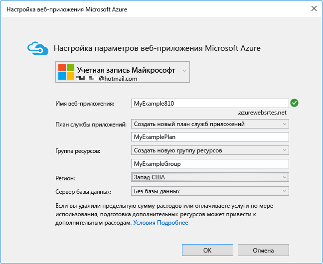
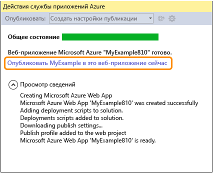
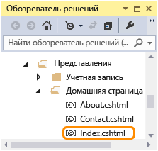

<properties
	pageTitle="Создание веб-приложения ASP.NET в службе приложений Azure | Microsoft Azure"
	description="В данном учебнике демонстрируется, как создать веб-проект ASP.NET в Visual Studio 2013 и развернуть его в веб-приложении в службе приложений Azure."
	services="app-service\web"
	documentationCenter=".net"
	authors="tdykstra"
	manager="wpickett"
	editor="jimbe"/>

<tags
	ms.service="app-service-web"
	ms.workload="web"
	ms.tgt_pltfrm="na"
	ms.devlang="dotnet"
	ms.topic="hero-article"
	ms.date="08/10/2015"
	ms.author="tdykstra"/>

# Создание веб-приложения ASP.NET в службе приложений Azure

## Обзор

В этом учебнике показано, как создать веб-приложение ASP.NET и развернуть его [в веб-приложении службы приложений Azure](app-service-web-overview.md) с помощью Visual Studio 2015 или Visual Studio 2013. Этот учебник разработан для читателей, не имеющих опыта использования Azure или ASP.NET. По завершении изучения этого учебника вы получите простое веб-приложение, работающее в облаке.

На следующем рисунке показано завершенное приложение:

Вы узнаете следующее:

* Как подготовить компьютер к разработке для Azure путем установки пакета Azure SDK.
* Как создать веб-проект ASP.NET в Visual Studio и развернуть его в веб-приложении Azure.
* Как внести изменения в веб-проект и повторно развернуть приложение.
* Как использовать [портал Azure](/overview/preview-portal/) для мониторинга веб-приложения и управления им.

##Регистрация в Microsoft Azure

Для завершения заданий в учебнике потребуется учетная запись Azure. Вы можете:

* [Открыть учетную запись Azure бесплатно](/pricing/free-trial/?WT.mc_id=A261C142F). Вы получаете кредиты, которые можно использовать, чтобы попробовать платные службы Azure. Даже после того как кредиты использованы, учетная запись остается за вами и вы можете использовать бесплатные службы и функции Azure, например компонент веб-приложений в службы приложений Azure.
* [Активировать преимущества подписчика MSDN](/pricing/member-offers/msdn-benefits-details/?WT.mc_id=A261C142F): ваша подписка MSDN каждый месяц приносит вам кредиты, которые можно использовать для оплаты за службы Azure.

> [AZURE.NOTE]Чтобы приступить к работе со службой приложений Azure до регистрации для получения учетной записи Azure, перейдите на страницу [Пробное использование службы приложений](http://go.microsoft.com/fwlink/?LinkId=523751). Там вы сможете немедленно создать кратковременное начальное веб-приложение в службе приложений. Для этого не потребуется ни кредитная карта, ни какие-либо обязательства.

В этом видео Скотт Хансельман (Scott Hanselman) демонстрирует, как легко можно подписаться на бесплатную пробную версию Microsoft Azure. (Длительность: 1:58)

> [AZURE.VIDEO sign-up-for-microsoft-azure]

[AZURE.INCLUDE [install-sdk-2015-2013](../../includes/install-sdk-2015-2013.md)]

## Создание веб-приложения ASP.NET

Прежде всего нужно создать веб-проект в Visual Studio и веб-приложение в службе приложений Azure. Далее следует развернуть проект в веб-приложении, чтобы предоставить к нему доступ в Интернете.

На следующей диаграмме пошагово показано создание и развертывание.

1. Откройте Visual Studio 2015 или Visual Studio 2013.

	Интерфейс Visual Studio 2013 может несколько отличаться от приведенных здесь снимков экрана, но порядок действий в целом тот же.

2. В меню **Файл** выберите **Новый проект**.

3. В диалоговом окне **Новый проект** щелкните **C# > Интернет > Веб-приложение ASP.NET**. При желании вы можете выбрать **Visual Basic**.

3. Убедитесь, что выбрана версия **.NET Framework 4.5.2**.

4.  Для мониторинга доступности, производительности и использования веб-приложения используется служба [Azure Application Insights](app-insights-overview.md). Если вы не хотите ее использовать, снимите флажок **Добавить Application Insights в проект**.

4. Присвойте приложению имя **MyExample**.

5. Нажмите кнопку **ОК**.

	

5. В диалоговом окне **Новый проект ASP.NET** выберите шаблон **MVC**.

	[MVC](http://www.asp.net/mvc) — это платформа ASP.NET для разработки веб-приложений.

7. Щелкните **Изменить проверку подлинности**.

	

6. В диалоговом окне **Изменить аутентификацию** щелкните **Без аутентификации** и нажмите кнопку **ОК**.

	

	В примере приложения, которое вы создаете, не будет функции входа пользователей в систему. В разделе [Дальнейшие действия](#next-steps) приводятся ссылки на учебник, в котором описывается реализация функций аутентификации и авторизации.

5. В диалоговом окне **Новый проект ASP.NET** оставьте параметры в разделе **MicrosoftAzure** без изменений и нажмите кнопку **OK**.

	

	Эти параметры по умолчанию указывают, что Visual Studio создаст веб-приложение Azure для вашего веб-проекта. В следующем разделе учебника вы займетесь развертыванием веб-проекта в только что созданном веб-приложении.

5. Если вы еще не вошли в Azure, Visual Studio покажет запрос для того, чтобы это сделать. Войдите, введя идентификатор и пароль учетной записи, которая используется для управления подпиской Azure.

	После выполнения входа появится диалоговое окно **Настройка параметров веб-приложения Microsoft Azure**, где вам будет предложено выбрать ресурсы, которые требуется создать.

	

3. В диалоговом окне **Настройка параметров веб-приложения Microsoft Azure** введите **имя веб-приложения** (оно должно быть уникальным в домене *azurewebsites.net*). Вы можете назвать приложение MyExample и добавить уникальный номер справа (например, MyExample810) или использовать уникальное имя, которое создается автоматически.

	Если кто-то уже использует введенное вами имя, вместо зеленой галочки справа появится красный восклицательный знак. Это значит, что нужно ввести другое имя.

	Azure будет использовать это имя в качестве префикса для URL-адреса приложения. Полный URL-адрес будет состоять из этого имени плюс *.azurewebsites.net* (как указано рядом с текстовым полем **Имя веб-приложения**). Например, если имя — `MyExample810`, URL-адрес будет `MyExample810.azurewebsites.net`. URL-адрес должен быть уникальным.

4. В раскрывающемся списке **План службы приложений** выберите пункт **Создать новый план службы приложений**.

	В разделе [Дальнейшие действия](#next-steps) есть ссылки на информацию о планах службы приложений.

5. Введите **MyExamplePlan** или другое имя плана на ваш выбор.

6. В раскрывающемся списке **Группы ресурсов** выберите пункт **Создать новую группу ресурсов**.

	В разделе [Дальнейшие действия](#next-steps) имеются ссылки на информацию о группах ресурсов.

5. Введите **MyExampleGroup** или другое имя группы ресурсов на свой выбор.

5. В раскрывающемся списке **Регион** выберите ближайшее к вам расположение.

	Этот параметр указывает, в каком центре обработки данных Azure будет выполняться ваше веб-приложение. При работе с учебником вы можете выбрать любой регион, и это не будет оказывать существенного влияния. Однако для производственного веб-приложения необходимо, чтобы веб-сервер располагался максимально близко к браузерам, которые осуществляют доступ к вашему сайту, чтобы минимизировать [задержку](http://www.bing.com/search?q=web%20latency%20introduction&qs=n&form=QBRE&pq=web%20latency%20introduction&sc=1-24&sp=-1&sk=&cvid=eefff99dfc864d25a75a83740f1e0090).

5. Оставьте поле базы данных без изменений.

	В этом учебнике база данных не используется. В разделе [Дальнейшие действия](#next-steps) приводятся ссылки на учебник, в котором показано, как использовать базу данных.

6. Нажмите кнопку **ОК**.

	

	Через несколько секунд Visual Studio создаст веб-проект в указанной папке и создаст веб-приложение в выбранном регионе Azure.

	В окне **обозревателя решений** отображаются файлы и папки нового проекта.

	

	В окне **Действие службы приложений Azure** показывается, что веб-приложение было создано.

	

	Вы можете увидеть созданное веб-приложение в **обозревателе сервера**.

	

## Развертывание приложения в Azure

7. В окне **Действие службы приложений Azure** щелкните **Опубликовать MyExample в этом веб-приложении**.

	

	Через несколько секунд отобразится окно мастера **публикации веб-сайта**.

	Параметры, необходимые Visual Studio для развертывания проекта в Azure, были сохранены в *профиле публикации*. Используйте мастер, чтобы просмотреть и изменить эти параметры.

8. На вкладке **Подключение** мастера **публикации веб-сайта** нажмите кнопку **Далее**.

	В Visual Studio можно настроить все параметры, необходимые для развертывания веб-приложения в Azure.

	

10. На вкладке **Параметры** нажмите кнопку **Далее**.

	Можно принять значения по умолчанию для **Конфигурации** и **Параметров публикации файла**.

	В раскрывающемся списке **Конфигурация** можно развертывать отладочное построение для удаленной отладки. В разделе [Дальнейшие действия](#next-steps) приводятся ссылки на учебник, в котором описывается удаленный запуск Visual Studio в режиме отладки.

	

11. На вкладке **Предварительный просмотр** нажмите кнопку **Опубликовать**.

	Если вы хотите узнать, какие файлы будут скопированы в Azure, сначала выберите элемент **Начать предварительный просмотр**, а потом — **Опубликовать**.

	

	Visual Studio начнет процесс копирования файлов в Azure.

	В окнах **Вывод** и **Действия службы приложений Azure** перечисляются действия, выполняемые при развертывании, а также выводится отчет о его успешном завершении.

	

	После успешного развертывания URL-адрес развернутого веб-приложения автоматически открывается в используемом по умолчанию браузере, а созданное приложение теперь выполняется в облаке. URL-адрес в адресной строке браузера указывает на то, что веб-приложение загружается из Интернета.

	

13. Закройте браузер.

## Внесение изменений и повторное развертывание

Этот раздел руководства является необязательным. В нем вы измените заголовок **h1** на домашней странице, запустите проект локально на компьютере разработчика, чтобы проверить изменения, а затем развернете их в Azure.

2. Откройте файл **Views/Home/Index.cshtml** или **.vbhtml** в **Обозревателе решений**, измените заголовок **h1** с ASP.NET на ASP.NET and Azure и сохраните файл.

	

	

1. Нажмите клавиши CTRL+F5, чтобы увидеть обновленный заголовок, запустив веб-приложение на локальном компьютере.

	

	URL-адрес `localhost` указывает, что веб-приложение выполняется на локальном компьютере. По умолчанию оно работает в IIS Express — упрощенной версии IIS, используемой на этапе разработки веб-приложений.

1. Закройте браузер.

1. В **Обозревателе решений** щелкните правой кнопкой проект и выберите пункт **Опубликовать**.

	

	Откроется вкладка **Предварительный просмотр** мастера **публикации веб-сайта**. Если бы потребовалось изменить какие-либо параметры публикации, вы бы выбрали другую вкладку, но нам нужно просто выполнить повторное развертывание с теми же параметрами.

2. В мастере **Публикация веб-сайтов** щелкните **Опубликовать**.

	

	Visual Studio развертывает проект в Azure и открывает веб-приложение в браузере по умолчанию.

	

**Совет:** можно включить панель инструментов **Веб-публикация одним щелчком** для еще более быстрого развертывания. Щелкните **Вид > Панели инструментов**, а затем выберите **Веб-публикация одним щелчком**. Используя панель инструментов, можно выбрать профиль, нажать кнопку публикации или открыть мастер **публикации веб-сайта**.

## Мониторинг веб-приложения и управление им с помощью портала Azure

[Портал Azure](/services/management-portal/) — это веб-интерфейс, в котором можно осуществлять мониторинг таких служб Azure, как только что созданное веб-приложение, и управлять ими. В этом разделе вы узнаете, что можно делать на портале.

1. В браузере перейдите по адресу [https://portal.azure.com](https://portal.azure.com) и войдите со своими учетными данными Azure.

2. Щелкните **Просмотреть все > Веб-приложения**, а затем выберите имя своего веб-приложения.

	В колонке **Веб-приложение** отображается сводка параметров и статистика использования вашего веб-приложения.

	

	До сих пор трафик вашего веб-приложения был незначительным, и на графике может ничего не отображаться. Если вы перейдете к своему приложению, обновите страницу несколько раз, а затем обновите страницу портала, и вы увидите, как будет отображаться некоторая статистика.

3. Щелкните **Параметры**, чтобы просмотреть дополнительные параметры настройки веб-приложения.

	Появится список типов параметров.

	

4. Щелкните **Параметры приложения**, чтобы просмотреть примеры различных параметров, которые можно настроить на портале.

	Например, вы можете управлять версией .NET, используемой для веб-приложения, включать компоненты, такие как [WebSockets](/blog/2013/11/14/introduction-to-websockets-on-windows-azure-web-sites/), и задавать [значения строки подключения](/blog/2013/07/17/windows-azure-web-sites-how-application-strings-and-connection-strings-work/).

	

Это всего лишь несколько функций, доступных на портале. Кроме этого, можно создавать новые веб-приложения, удалять существующие веб-приложения, останавливать и повторно запускать их, а также управлять различными службами Azure, такими как базы данных и виртуальные машины.

## Дальнейшие действия

Из этого учебника вы узнали, как создать простое веб-приложение и развернуть его в Azure. Ниже перечислены статьи и ресурсы с дополнительными сведениями о веб-приложениях в службе приложений Azure.

* Другие способы развертывания веб-проекта

	В этом учебнике был показан самый быстрый способ создания веб-приложения и его развертывания с помощью одной операции. Обзор других способов развертывания с помощью Visual Studio и [автоматизации развертывания](http://www.asp.net/aspnet/overview/developing-apps-with-windows-azure/building-real-world-cloud-apps-with-windows-azure/continuous-integration-and-continuous-delivery) из [системы управления версиями](http://www.asp.net/aspnet/overview/developing-apps-with-windows-azure/building-real-world-cloud-apps-with-windows-azure/source-control) см. в разделе [Развертывание веб-приложения Azure](web-sites-deploy.md).

	Visual Studio может также создавать скрипты Windows PowerShell, которые можно использовать для автоматизации развертывания. Дополнительные сведения см. в разделе [Полная автоматизация (создание реальных облачных приложений в Azure)](http://www.asp.net/aspnet/overview/developing-apps-with-windows-azure/building-real-world-cloud-apps-with-windows-azure/automate-everything).

* Как управлять веб-приложением в Visual Studio

	Дополнительную информацию о функциях управления веб-приложениями, которые можно использовать в **обозревателе сервера**, см. в разделе [Устранение неполадок веб-приложений Azure в Visual Studio](web-sites-dotnet-troubleshoot-visual-studio.md).

* Как устранить неполадки веб-приложения

	Visual Studio предоставляет функции, упрощающие просмотр журналов Azure по мере их создания в режиме реального времени. Можно также работать в Azure удаленно в режиме отладки. Дополнительную информацию см. в разделе [Устранение неполадок веб-приложений Azure в Visual Studio](web-sites-dotnet-troubleshoot-visual-studio.md).

* Как добавить функции доступа к базе данных и авторизации

	Учебник по доступу к базе данных и ограничению некоторых функций приложения для использования авторизованными пользователями см. в разделе [Развертывание безопасного приложения ASP.NET MVC с членством, OAuth и базой данных SQL в веб-приложении Azure](/develop/net/tutorials/web-site-with-sql-database/).

* Добавление настраиваемого доменного имени и SSL

	Информацию об использовании SSL и собственного домена (например, www.contoso.com вместо contoso.azurewebsites.net) см. в следующих статьях.

	* [Настройка личного доменного имени в службе приложений Azure](web-sites-custom-domain-name.md)
	* [Включение HTTPS для веб-приложения Azure](web-sites-configure-ssl-certificate.md)

* Как избежать затрат времени на ожидание пробуждения после времени простоя

	По умолчанию в случае простоя в течение определенного периода времени веб-приложения будут выгружены. Первый отправленный после этого запрос будет ожидать, пока веб-приложение загрузится снова. Чтобы пропустить время ожидания, можно включить функцию AlwaysOn. Дополнительные сведения о параметрах конфигурации см. в статье [Настройка веб-приложений](web-sites-configure.md).

* Как добавить работающие в режиме реального времени функции, например, чат

	Если ваше веб-приложение будет содержать функции, работающие в режиме реального времени (например, служба чата, игра, тикер акций), наилучшей производительности можно добиться при использовании [ASP.NET SignalR](http://www.asp.net/signalr) с методом транспортировки [WebSockets](/blog/2013/11/14/introduction-to-websockets-on-windows-azure-web-sites/). Дополнительную информацию см. в разделе [Использование SignalR с веб-приложениями Azure](http://www.asp.net/signalr/overview/signalr-20/getting-started-with-signalr-20/using-signalr-with-windows-azure-web-sites).

* Как выбрать между службой приложений, облачными службами Azure и виртуальными машинами Azure для веб-приложений

	Веб-приложения в Azure можно выполнять в веб-приложениях службы приложений Azure, как показано в этом учебнике, а также в облачных службах и на виртуальных машинах. Дополнительные сведения см. в статье [Сравнение службы приложений, облачных служб и виртуальных машин Azure](/manage/services/web-sites/choose-web-app-service/).

* [Как выбрать или создать план службы приложений](../app-service/azure-web-sites-web-hosting-plans-in-depth-overview.md)

* [Как выбрать или создать группу ресурсов](../azure-preview-portal-using-resource-groups.md)

## Изменения
* Указания по изменениям при переходе от веб-сайтов к службе приложений см. в статье [Служба приложений Azure и существующие службы Azure](http://go.microsoft.com/fwlink/?LinkId=529714).
* Информацию о смене старого портала на новый см. в статье [Краткий справочник по навигации на портале Azure](http://go.microsoft.com/fwlink/?LinkId=529715).

<!-----HONumber=September15_HO1-->