<properties
	pageTitle="Приступая к работе со службой приложений Azure и ASP.NET | Microsoft Azure"
	description="Узнайте, как с помощью Visual Studio развернуть веб-проект ASP.NET в новом веб-приложении в службе приложений Azure."
	services="app-service\web"
	documentationCenter=".net"
	authors="tdykstra"
	manager="wpickett"
	editor=""/>

<tags
	ms.service="app-service-web"
	ms.workload="web"
	ms.tgt_pltfrm="na"
	ms.devlang="dotnet"
	ms.topic="get-started-article"
	ms.date="04/22/2016"
	ms.author="tdykstra"/>

# Начало работы с веб-приложениями в службе приложений Azure с помощью ASP.NET и Visual Studio

> [AZURE.SELECTOR]
- [.Net](web-sites-dotnet-get-started.md)
- [Node.js](app-service-web-nodejs-get-started.md)
- [Java](web-sites-java-get-started.md)
- [PHP — Git](web-sites-php-mysql-deploy-use-git.md)
- [PHP — FTP](web-sites-php-mysql-deploy-use-ftp.md)
- [Python](web-sites-python-ptvs-django-mysql.md)

## Обзор

В этом учебнике описано, как развернуть веб-приложение ASP.NET [в веб-приложение службы приложений Azure](app-service-web-overview.md) с помощью Visual Studio 2015. Этот учебник создан для разработчиков ASP.NET без опыта работы с Azure. По завершении изучения этого учебника вы получите простое веб-приложение, работающее в облаке.

На следующем рисунке показано завершенное приложение:

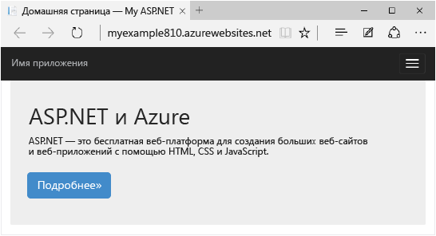

Вы узнаете следующее:

* Как создать новое веб-приложение службы приложений во время создания веб-проекта в Visual Studio.
* Как развернуть веб-проект для веб-приложения службы приложений с помощью Visual Studio.
* Как использовать [портал Azure](/features/azure-portal/) для мониторинга веб-приложения и управления им.

В конце руководства в разделе [Устранение неполадок](#troubleshooting) приводятся рекомендации на случай возможных неисправностей, а в разделе [Дальнейшие действия](#next-steps) указаны ссылки на другие руководства с подробной информацией об использовании службы приложений Azure.

## Предварительные требования

[AZURE.INCLUDE [Предварительные требования](../../includes/app-service-web-dotnet-get-started-prereqs.md)]

## Создание веб-проекта и веб-приложения в службе приложений Azure

Прежде всего нужно создать веб-проект в Visual Studio и веб-приложение в службе приложений Azure. Далее следует развернуть проект в веб-приложении, чтобы предоставить к нему доступ в Интернете.

На следующей диаграмме пошагово показано создание и развертывание.

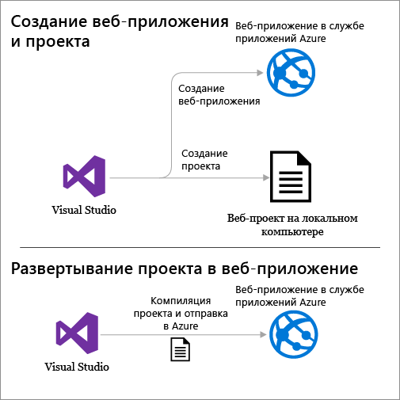

1. Откройте Visual Studio 2015.

2. Щелкните **Файл > Создать > Проект**.

3. В диалоговом окне **Новый проект** щелкните **Visual C# > Интернет > Веб-приложение ASP.NET**. (При желании вы можете выбрать **Visual Basic**).

3. Убедитесь, что выбрана версия **.NET Framework 4.5.2**.

4.  Для мониторинга доступности, производительности и использования веб-приложения используется служба [Azure Application Insights](../application-insights/app-insights-overview.md). Флажок **Добавить Application Insights в проект** будет установлен по умолчанию, если вы впервые создаете веб-проект после установки Visual Studio. Если вы не хотите использовать Application Insights, снимите этот флажок.

4. Присвойте приложению имя **MyExample**.

5. Нажмите кнопку **ОК**.

	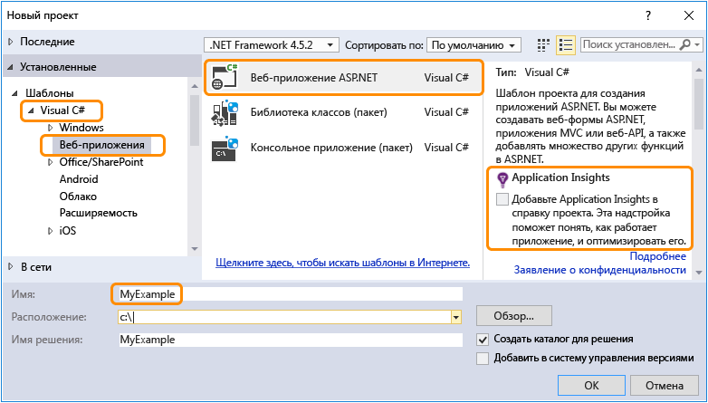

5. В диалоговом окне **Новый проект ASP.NET** выберите шаблон **MVC**.

7. Щелкните **Изменить проверку подлинности**.

	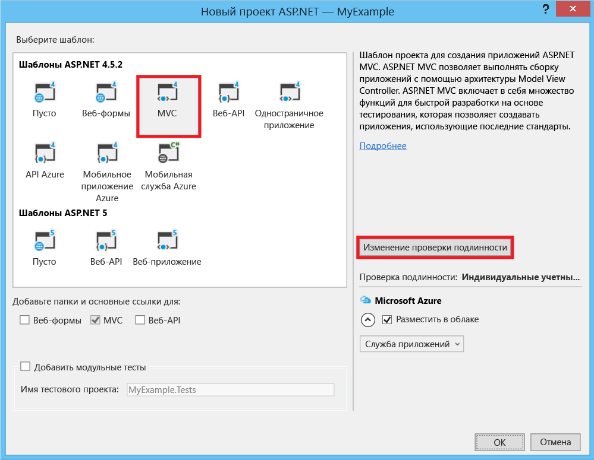

6. В диалоговом окне **Изменить аутентификацию** щелкните **Без аутентификации** и нажмите кнопку **ОК**.

	

	В этом руководстве мы создаем простое приложение, которое не поддерживает вход пользователя в систему.

5. В разделе **Microsoft Azure** диалогового окна **Новый проект ASP.NET** убедитесь, что флажок **Разместить в облаке** установлен, а в раскрывающемся списке выбран пункт **Служба приложений**.

	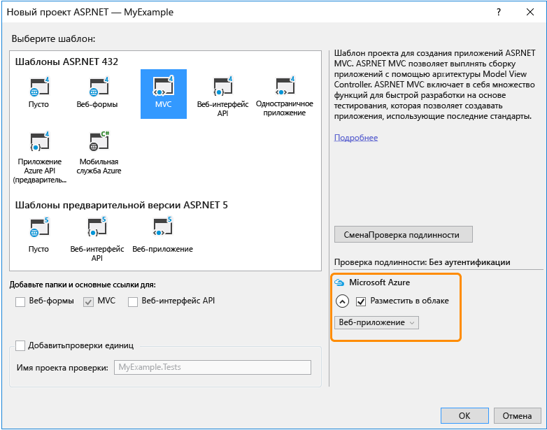

	Эти параметры указывают, что Visual Studio создаст веб-приложение Azure для вашего веб-проекта.

6. Нажмите кнопку **ОК**.

5. Если вы еще не вошли в Azure, Visual Studio покажет запрос для того, чтобы это сделать. Войдите, введя идентификатор и пароль учетной записи, которая используется для управления подпиской Azure.

	Войдя, вы увидите диалоговое окно **Создание службы приложений**, где вам будет предложено выбрать ресурсы, которые требуется создать.

	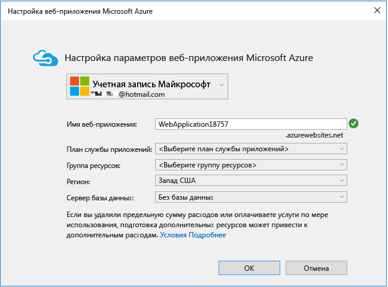

3. В диалоговом окне **Создание службы приложений** укажите **имя веб-приложения** (оно должно быть уникальным в домене *azurewebsites.net*). Вы можете назвать приложение MyExample и добавить уникальный номер справа (например, MyExample810) или использовать уникальное имя, которое создается автоматически.

	Если кто-то уже использует введенное вами имя, вместо зеленой галочки справа появится красный восклицательный знак. Это значит, что вам нужно ввести другое имя.

	URL-адрес вашего приложения будет состоять из этого имени и блока *.azurewebsites.net* (как указано рядом с текстовым полем **Имя веб-приложения**). Например, если имя — `MyExample810`, URL-адрес будет таким: `myexample810.azurewebsites.net`.

	В разделе [Дальнейшие действия](#next-steps) приведены ссылки на руководство, в котором объясняется, как использовать личный домен с веб-приложением Azure.

6. Рядом с полем **Группа ресурсов** щелкните **Создать** и введите имя MyExample (или любое другое имя).

	В этом поле со списком можно выбрать существующую группу ресурсов или создать отдельную, введя имя, которое отличается от имени любой существующей группы ресурсов в подписке.

	Группа ресурсов — это совокупность ресурсов Azure, таких как веб-приложения, базы данных и виртуальные машины. Для этого руководства рекомендуется создать новую группу ресурсов, чтобы потом одновременно удалить все ресурсы Azure, созданные для работы с этим руководством. Дополнительную информацию см. в статье [Общие сведения об Azure Resource Manager](../resource-group-overview.md).

4. Нажмите кнопку **Создать** возле раскрывающегося списка **План службы приложений**.

	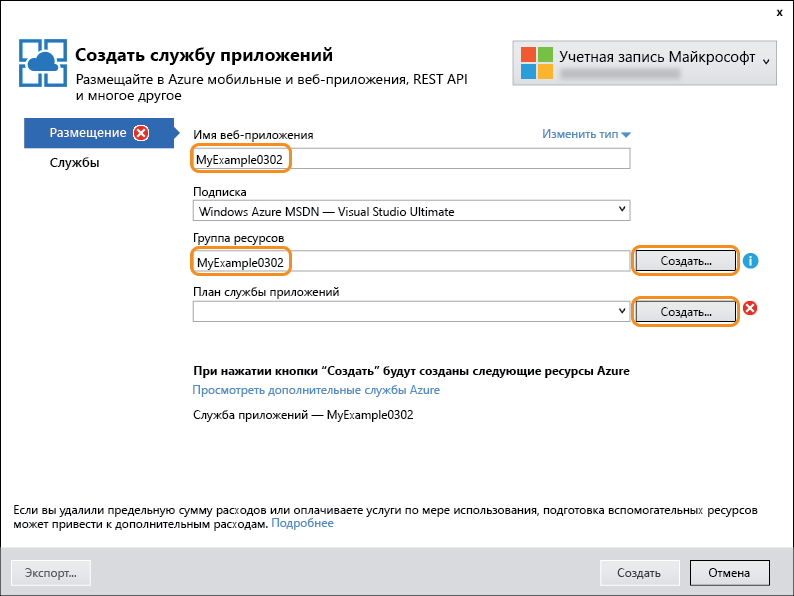

	На снимке экрана ниже показаны примеры значений в полях **Имя веб-приложения**, **Подписка** и **Группа ресурсов**. Ваши значения будут другими.

	Далее мы создадим план службы приложений для новой группы ресурсов. План службы приложений определяет вычислительные ресурсы, на которых будет работать ваше веб-приложение. Например, если выбрать уровень "Бесплатный", ваше приложение будет работает на общих виртуальных машинах, тогда как при выборе некоторых платных уровней приложение будет работать на выделенных виртуальных машинах. Дополнительные сведения см. в статье [Подробный обзор планов службы приложений Azure](../app-service/azure-web-sites-web-hosting-plans-in-depth-overview.md).

5. В диалоговом окне **Настройка плана службы приложений** в соответствующем поле введите MyExamplePlan или другое имя.

5. В раскрывающемся списке **Расположение** выберите ближайшее расположение.

	Этот параметр определяет, в каком центре обработки данных Azure будет выполняться приложение. При работе с учебником вы можете выбрать любой регион, и это не будет оказывать существенного влияния. Тем не менее для рабочего приложения необходимо, чтобы сервер располагался максимально близко к клиентам, которые осуществляют к нему доступ. Это позволит минимизировать [задержки](http://www.bing.com/search?q=web%20latency%20introduction&qs=n&form=QBRE&pq=web%20latency%20introduction&sc=1-24&sp=-1&sk=&cvid=eefff99dfc864d25a75a83740f1e0090).

5. В раскрывающемся списке **Размер** щелкните **Бесплатный**.

	Эта ценовая категория обеспечит достаточную производительность в рамках заданий этого руководства.

6. В диалоговом окне **Настройка плана службы приложений** нажмите кнопку **ОК**.

	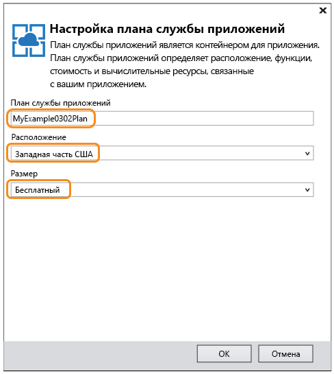

7. В диалоговом окне **Создание службы приложений** нажмите кнопку **Создать**.

	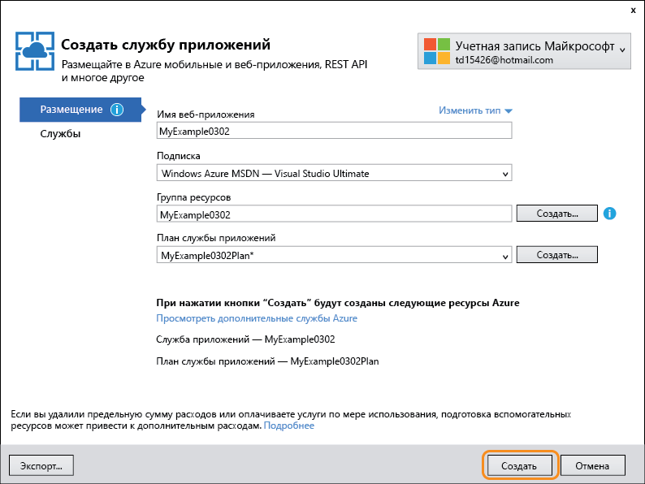

	За короткий промежуток времени, обычно не более минуты, Visual Studio создаст веб-проект и веб-приложение.

	В окне **обозревателя решений** отображаются файлы и папки нового проекта.

	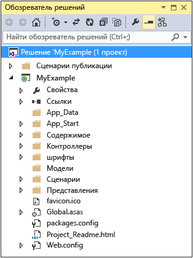

	В окне **Действие службы приложений Azure** показывается, что веб-приложение было создано.

	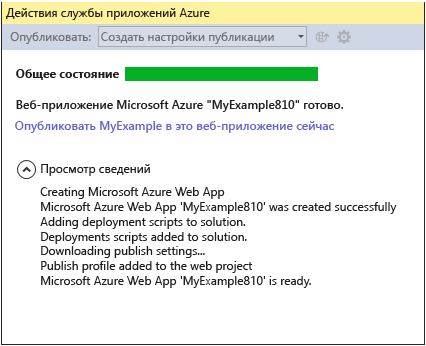

	Также веб-приложение отобразится в окне **Cloud Explorer** программы Visual Studio.

	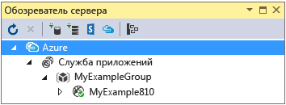
	
	В этом окне можно просматривать различные ресурсы Azure и управлять ими. На снимке экрана показаны только веб-приложения, но в окне **Cloud Explorer** можно просмотреть и другие типы ресурсов. Щелкните правой кнопкой мыши ресурс, например веб-приложение, чтобы просмотреть варианты управления им.

## Развертывание веб-проекта в веб-приложении Azure

В этом разделе вы развернете веб-проект в веб-приложении, как показано в действии 2 на схеме.

1. В **Обозревателе решений** щелкните правой кнопкой проект и выберите пункт **Опубликовать**.

	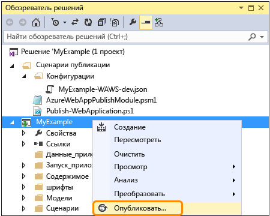

	Через несколько секунд откроется окно **мастера веб-публикации**. В мастере откроется *профиль публикации*, содержащий параметры для развертывания веб-проекта в новом веб-приложении. Если вы хотите выполнить развертывание в другом веб-приложении, откройте вкладку **Профиль** и создайте другой профиль. В этом руководстве вам нужно будет принять параметры, развертывающие веб-приложение, которое было создано ранее.

	Профиль публикации содержит имя пользователя и пароль для развертывания. Эти учетные данные созданы автоматически. Их не нужно вводить или изменять. Пароль хранится зашифрованным в скрытом пользовательском файле в папке `Properties\PublishProfiles`.

8. На вкладке **Подключение** **мастера веб-публикации** нажмите кнопку **Далее**.

	

	Следующая вкладка — **Параметры**. Здесь можно изменить конфигурацию сборки, чтобы развернуть отладочную сборку для [удаленной отладки](../app-service-web/web-sites-dotnet-troubleshoot-visual-studio.md#remotedebug). На вкладке также представлено несколько **параметров публикации файлов**:

	* "Удалить дополнительные файлы в месте назначения";
	* "Предварительно компилировать при публикации";
	* "Исключить файлы из папки App\_Data".

	В данном руководстве эти параметры не используются. Подробное описание этих параметров см. в статье [Как развертывать проект веб-приложения с помощью публикации одним щелчком в Visual Studio](https://msdn.microsoft.com/library/dd465337.aspx).

10. На вкладке **Параметры** нажмите кнопку **Далее**.

	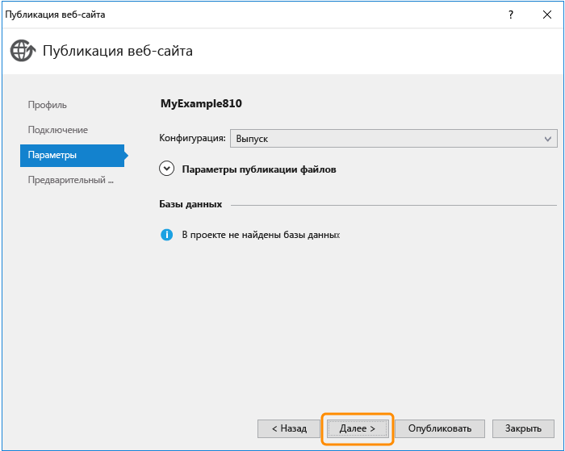

	Следующая вкладка — **Предварительный просмотр**. На ней можно узнать, какие файлы будут скопированы из проекта в приложение API. Если вы развертываете проект в приложение API, в которое проект уже был развернут, копируются только измененные файлы. Чтобы просмотреть список файлов, которые будут скопированы, нажмите кнопку **Начать просмотр**.

11. На вкладке **Предварительный просмотр** нажмите кнопку **Опубликовать**.

	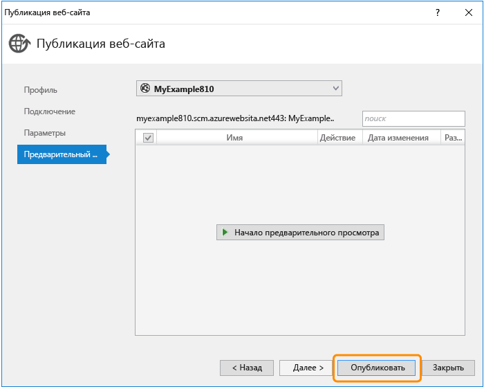

	Когда вы нажмете кнопку **Опубликовать**, Visual Studio начнет копирование файлов на сервер Azure. Это может занять несколько минут.

	В окнах **Вывод** и **Действия службы приложений Azure** отображаются не только сведения о действиях, выполняемых при развертывании, но и отчет об успешном завершении развертывания.

	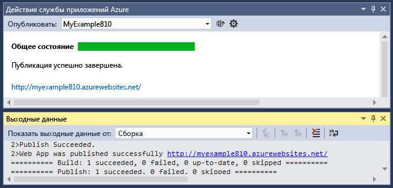

	После успешного развертывания URL-адрес развернутого веб-приложения автоматически открывается в используемом по умолчанию браузере, а созданное приложение теперь выполняется в облаке. URL-адрес в адресной строке браузера указывает на то, что веб-приложение загружается из Интернета.

	

> [AZURE.TIP] Для быстрого развертывания можно включить панель инструментов **Веб-публикация одним щелчком**. Щелкните **Вид > Панели инструментов**, а затем выберите элемент **Веб-публикация одним щелчком**. На панели инструментов можно выбрать профиль, нажать кнопку публикации или открыть мастер **публикации веб-сайта**. 

##  Мониторинг веб-приложения и управление им с помощью портала Azure

[Портал Azure](/services/management-portal/) — это веб-интерфейс, с помощью которого вы можете отслеживать работу служб Azure (например только что созданное веб-приложение), а также управлять ими. В этом разделе вы узнаете, что можно делать на портале.

1. В браузере перейдите по адресу [https://portal.azure.com](https://portal.azure.com) и войдите в систему с учетными данными, используемыми для управления учетной записью Azure.

2. Щелкните **Веб-приложения** и выберите имя веб-приложения.

	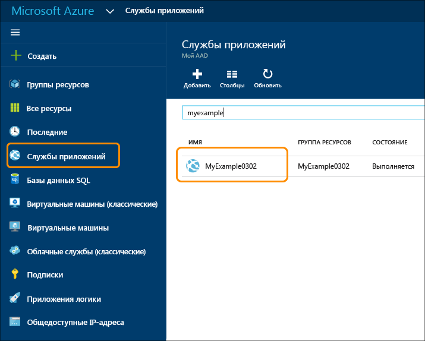

	В колонке **Веб-приложение** отображается сводка параметров и статистика использования веб-приложения. (Окна, которые открываются справа на портале, называются *колонками*.)

	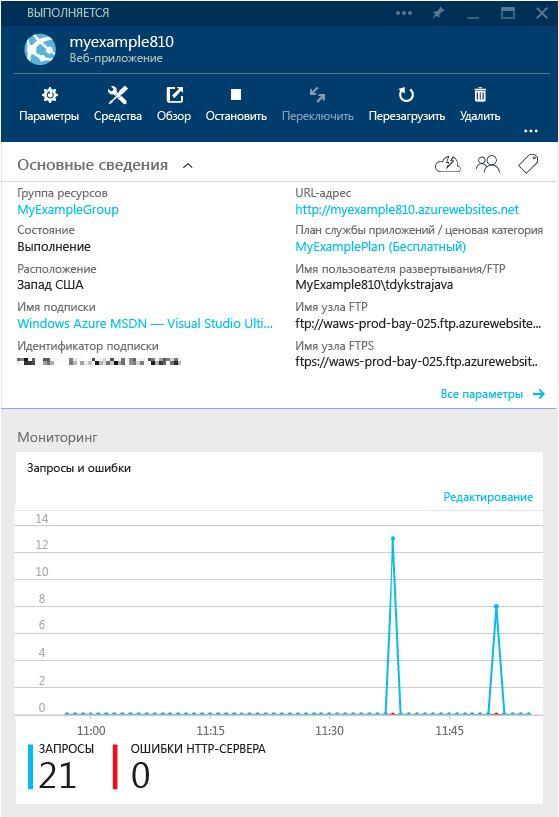

	До сих пор трафик вашего веб-приложения был незначительным, и на графике может ничего не отображаться. Если вы перейдете к своему приложению, обновите страницу несколько раз, а затем обновите страницу портала, и вы увидите, как будет отображаться некоторая статистика.

3. В колонке **Параметры** представлены дополнительные параметры конфигурации веб-приложения.

	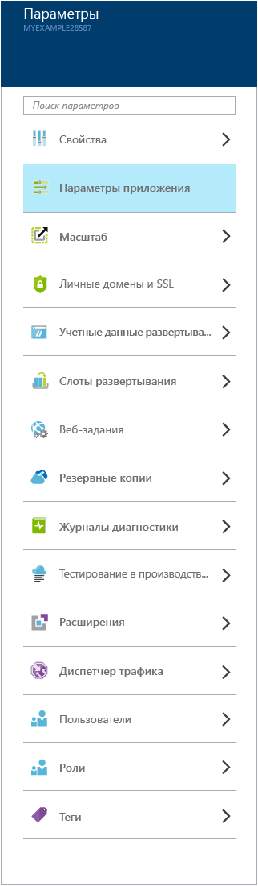

	Обратите внимание на ссылку **Учетные данные развертывания** в разделе **Публикация**. Здесь можно создать настраиваемое имя пользователя и пароль для развертывания. Нажмите кнопку **Сохранить** в верхней части колонки, чтобы внести изменения. Если вы создадите новое имя пользователя и пароль, необходимо ввести те же значения на вкладке **Подключение** в мастере **публикации веб-сайта** в своем веб-проекте.
	
	На снимке экрана показана только часть колонки **Параметры**. В этой колонке есть дополнительные разделы, которые не показаны на снимке экрана.

4. Щелкните элемент **Параметры приложения** в разделе **Общее** колонки **Параметры**, чтобы отобразить примеры разных параметров, которые можно настроить на портале.

	Например, вы можете управлять версией .NET, используемой для веб-приложения, включать такие компоненты, как [WebSockets](/blog/2013/11/14/introduction-to-websockets-on-windows-azure-web-sites/), а также указывать [значения строки подключения](/blog/2013/07/17/windows-azure-web-sites-how-application-strings-and-connection-strings-work/).

	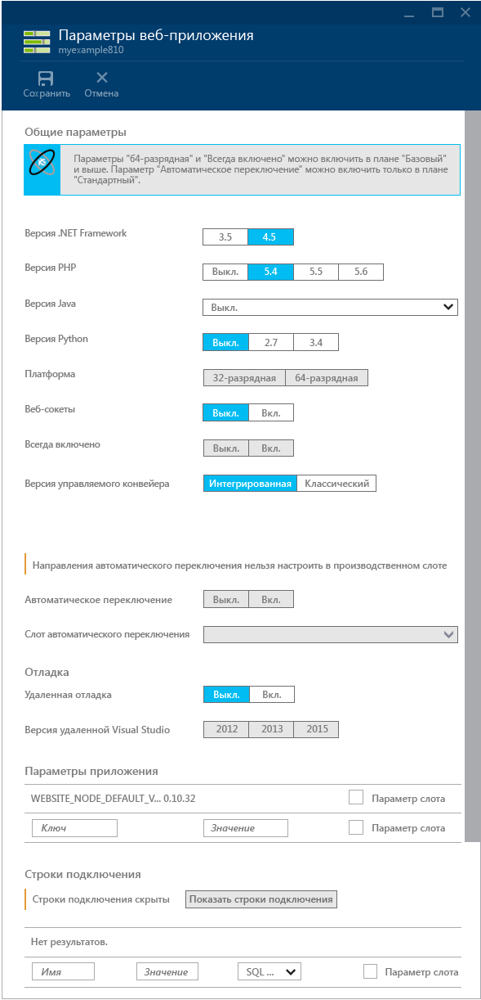

Это всего лишь несколько функций, доступных на портале. Кроме этого, можно создавать новые веб-приложения, удалять существующие веб-приложения, останавливать и повторно запускать их, а также управлять различными службами Azure, такими как базы данных и виртуальные машины.

## Удаление веб-приложения Azure

Если вам больше не нужно веб-приложение, созданное для этого руководства, его можно удалить.

Чтобы быстро удалить веб-приложение, нажмите кнопку **Удалить** в верхней части соответствующей колонки **Веб-приложение** на портале Azure. Лучший способ — удаление группы ресурсов, созданной для хранения веб-приложения. В этом руководстве группа ресурсов содержит только веб-приложение, но обычно она содержит коллекцию связанных ресурсов. Например, веб-приложение может использовать базу данных или учетную запись хранения Azure, которая больше не потребуется, когда вы удалите веб-приложение. При удалении группы ресурсов удаляется все ее содержимое. Чтобы удалить группу ресурсов с помощью портала Azure, выполните следующие действия.

1. Перейдите на домашнюю страницу [портала Azure](https://portal.azure.com).

2. Щелкните раздел **Группа ресурсов**.

3. В списке групп ресурсов щелкните имя группы ресурсов, которую нужно удалить.

	Появится колонка **Группа ресурсов** со списком содержащихся в ней ресурсов.

4. В колонке **Группа ресурсов** щелкните **Удалить**.

	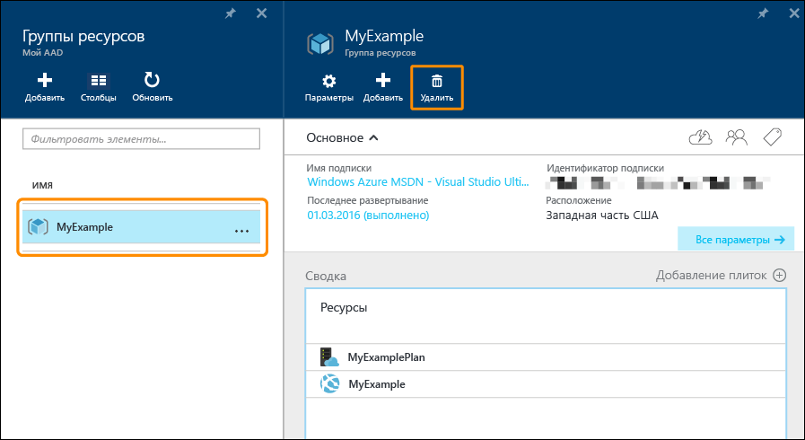

## Устранение неполадок

Если при работе с этим руководством возникли проблемы, убедитесь, что вы используете последнюю версию пакета Azure SDK для .NET. Самый простой способ сделать это — [скачать пакет Azure SDK для Visual Studio 2015](http://go.microsoft.com/fwlink/?linkid=518003). Если текущая версия установлена, установщик веб-платформы сообщит вам, что установка не требуется.

Если вы работаете в корпоративной сети и пытаетесь развернуть службу приложений Azure через брандмауэр, убедитесь, что порты 443 и 8172 открыты для веб-развертывания. Если не удается открыть эти порты, в разделе "Дальнейшие действия" ниже приведены другие варианты развертывания.

Запустив веб-приложение ASP.NET в службе приложений Azure, можно узнать больше о функциях Visual Studio, которые упрощают устранение неполадок. Сведения о ведении журналов, удаленной отладке и другую информацию см. в статье [Устранение неполадок веб-приложения в службе приложений Azure с помощью Visual Studio](web-sites-dotnet-troubleshoot-visual-studio.md).

## Дальнейшие действия

Из этого учебника вы узнали, как создать простое веб-приложение и развернуть его в Azure. Ниже перечислены статьи и ресурсы с дополнительными сведениями о службе приложений Azure.

* Развертывание существующего веб-проекта в новом веб-приложении.

	Чтобы начать процесс развертывания существующего веб-проекта, щелкните проект правой кнопкой мыши в **обозревателе решений** и выберите пункт **Опубликовать**. Выберите в качестве цели публикации **службу приложений Microsoft Azure**. Затем выберите существующее веб-приложение Azure или нажмите кнопку **Создать**, чтобы создать новое. Если вы нажали кнопку **Создать**, приложение будет создано, как описано в этом руководстве.

* Другие способы создания веб-приложений

	Веб-приложения также можно создавать с помощью [портала Azure](https://portal.azure.com/), [командлетов Azure для Windows PowerShell](../powershell-install-configure.md) или [кроссплатформенного интерфейса командной строки](../xplat-cli.md).

* Создание приложений API

	Вы узнали, как создать экземпляр службы приложений Azure, который предназначен главным образом для размещения веб-сайта. Такие экземпляры называются веб-приложениями. Служба приложений также имеет функции для упрощения разработки, тестирования и размещения интерфейсов API. Экземпляры службы приложений, предназначенные главным образом для размещения API-интерфейсов, называются приложениями API. Дополнительные сведения см. в статье [Приступая к работе с приложениями API и ASP.NET в службе приложений Azure](../app-service-api/app-service-api-dotnet-get-started.md).

* Другие способы развертывания веб-проекта

	Сведения о других способах развертывания веб-проектов в веб-приложениях с помощью Visual Studio или функции [автоматизации развертывания](http://www.asp.net/aspnet/overview/developing-apps-with-windows-azure/building-real-world-cloud-apps-with-windows-azure/continuous-integration-and-continuous-delivery) из [системы управления версиями](http://www.asp.net/aspnet/overview/developing-apps-with-windows-azure/building-real-world-cloud-apps-with-windows-azure/source-control) см. в статьях [Начало работы с веб-приложениями в службе приложений Azure](app-service-web-get-started.md) и [Развертывание приложения в службе приложений Azure](web-sites-deploy.md).

* Добавление настраиваемого доменного имени и SSL

	Информацию об использовании SSL и собственного домена (например, www.contoso.com вместо contoso.azurewebsites.net) см. в следующих статьях.

	* [Настройка личного доменного имени в службе приложений Azure](web-sites-custom-domain-name.md)
	* [Включение HTTPS для веб-приложения Azure](web-sites-configure-ssl-certificate.md)

* Как добавить работающие в режиме реального времени функции, например, чат

	Для функций, работающих в режиме реального времени (таких, как служба чата, игра или тикер акций), максимальной производительности можно добиться, используя [ASP.NET SignalR](http://www.asp.net/signalr) с методом транспортировки [WebSockets](/blog/2013/11/14/introduction-to-websockets-on-windows-azure-web-sites/). Дополнительную информацию см. в разделе [Использование SignalR с веб-приложениями Azure](http://www.asp.net/signalr/overview/signalr-20/getting-started-with-signalr-20/using-signalr-with-windows-azure-web-sites).

* Как выбрать между службой приложений, облачными службами Azure и виртуальными машинами Azure для веб-приложений

	Веб-приложения в Azure можно выполнять в веб-приложениях службы приложений Azure, как показано в этом учебнике, а также в облачных службах и на виртуальных машинах. Дополнительные сведения см. в статье [Сравнение службы приложений, облачных служб, виртуальных машин Azure и Service Fabric](/manage/services/web-sites/choose-web-app-service/).

<!---HONumber=AcomDC_0427_2016-->