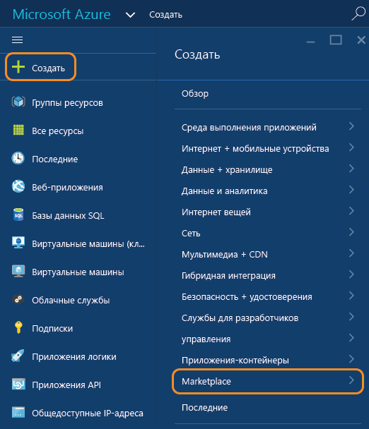
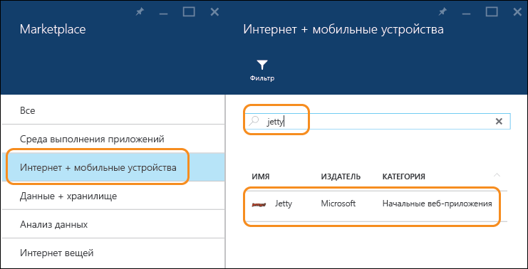
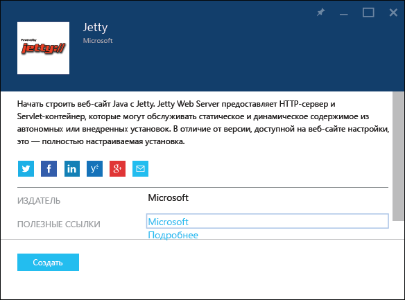
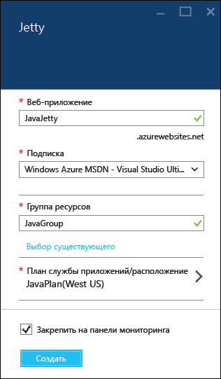
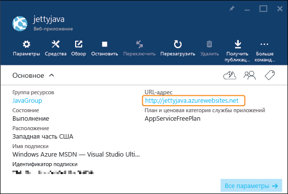
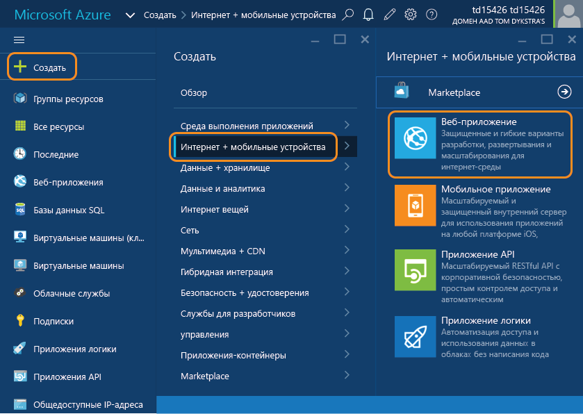
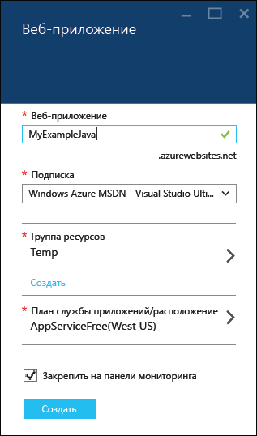
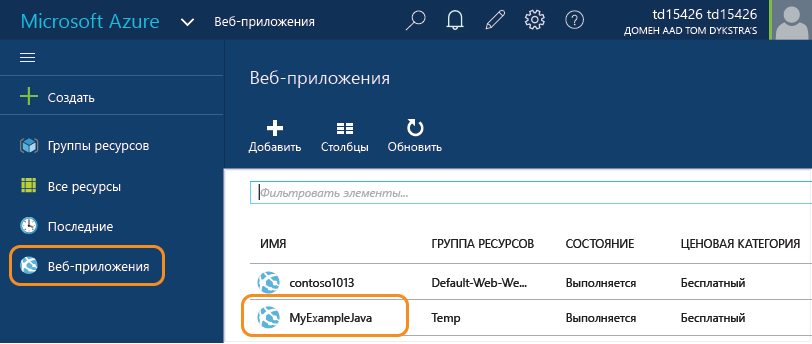
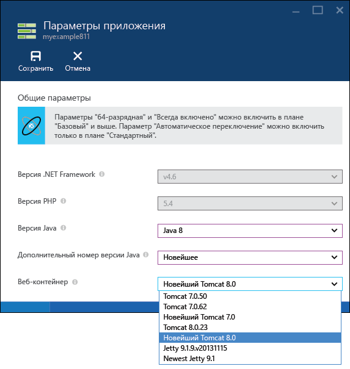

<properties
	pageTitle="Создание веб-приложения на Java в службе приложений Azure | Microsoft Azure"
	description="В этом учебнике показано, как развернуть веб-приложение Java для службы приложений Azure."
	services="app-service\web"
	documentationCenter="java"
	authors="rmcmurray"
	manager="wpickett"
	editor=""/>
<tags
	ms.service="app-service-web"
	ms.workload="web"
	ms.tgt_pltfrm="na"
	ms.devlang="Java"
	ms.topic="hero-article"
	ms.date="01/09/2016"
	ms.author="robmcm"/>

# Создание веб-приложения Java в службе приложений Azure

> [AZURE.SELECTOR]
- [.Net](web-sites-dotnet-get-started.md)
- [Node.js](web-sites-nodejs-develop-deploy-mac.md)
- [Java](web-sites-java-get-started.md)
- [PHP - Git](web-sites-php-mysql-deploy-use-git.md)
- [PHP - FTP](web-sites-php-mysql-deploy-use-ftp.md)
- [Python](web-sites-python-ptvs-django-mysql.md)

В этом руководстве объясняется, как создать [веб-приложение Java в службе приложений Azure](http://go.microsoft.com/fwlink/?LinkId=529714) с помощью [портала Azure](https://portal.azure.com/). Портал Azure — это веб-интерфейс, который можно использовать для управления ресурсами Azure.

> [AZURE.NOTE]Для работы с этим учебником необходимо использовать учетную запись Microsoft Azure. Если у вас нет учетной записи, можно [активировать преимущества для подписчиков Visual Studio][] или [подписаться на бесплатную пробную версию][].
>
> Если вы хотите приступить к работе со службой приложений Azure до регистрации и получения учетной записи Azure, перейдите на страницу [Пробное использование службы приложений][]. Там вы сможете немедленно создать кратковременное начальное веб-приложение в службе приложений. Для этого не потребуется ни кредитная карта, ни какие-либо обязательства.

## Параметры приложений Java

Приложение Java в веб-приложении службы приложений можно настроить несколькими способами.

1. Используйте шаблон из Azure Marketplace.

	В Azure Marketplace есть шаблоны, которые автоматически создают и настраивают веб-приложения Java с веб-контейнерами Tomcat или Jetty. Вы можете изменять конфигурацию веб-контейнеров, настроенных шаблонами. Дополнительные сведения см. в разделе [Использование шаблона Java из Azure Marketplace](#marketplace) данного руководства.
 
1. Создайте приложение, а затем настройте **Параметры приложения**.

	Служба приложений предоставляет несколько версий Tomcat и Jetty с конфигурацией по умолчанию. Если приложение, которое вы разместите в контейнере, будет работать с одной из встроенных версий, этот метод настройки веб-контейнера будет самым простым. Но вы не сможете изменить конфигурацию контейнера, как при использовании других методов. Используя этот метод, вы создадите приложение на портале Azure, а затем перейдете в колонку приложения **Параметры приложения**, чтобы выбрать свою версию Java и нужный веб-контейнер Java. Когда вы используете этот метод, приложение запускается с локального жесткого диска. Этот диск использует рабочая роль для размещения приложения, которое не занимает дисковое пространство клиента. Используя эту модель, вы не можете редактировать файлы в этой части файловой системы. Это означает, что вы не можете настраивать файл *server.xml* или помещать файлы библиотеки в папку */lib*. Дополнительные сведения см. в разделе [Создание и настройка веб-приложения Java](#appsettings) этого руководства.
  
3. Создайте приложение, затем вручную скопируйте и измените файлы конфигурации.

	Возможно, вам понадобится разместить пользовательское приложение Java, которое не развертывается в веб-контейнеры, предоставленные службой приложений. Ниже приведены причины такой необходимости.
	
	* Для приложения Java требуется версия Tomcat или Jetty, которая не поддерживается напрямую службой приложений или отсутствует в коллекции.
	* Приложение Java принимает запросы HTTP и не развертывается в виде WAR-файла в уже существующий веб-контейнер.
	* Вы хотите самостоятельно настроить веб-контейнер с нуля. 
	* Вы хотите использовать версию Java, которую не поддерживает служба приложений, и вам нужно самостоятельно передать ее.

	В таком случае вы можете создать приложение с помощью портала Azure и указать файлы соответствующей среды выполнения вручную. Тогда файлы будут учитываться на основе квот дискового пространства вашего плана службы приложений. Дополнительные сведения см. на странице [Отправка настраиваемого веб-приложения Java в Azure](https://acom-sandbox.azurewebsites.net/ru-RU/documentation/articles/web-sites-java-custom-upload/).

##  Использование шаблона из Azure Marketplace

В этом разделе объясняется, как использовать Azure Marketplace для создания веб-приложения Java. Для создания мобильного приложения на основе Java или приложения API можно использовать тот же общий поток.

1. Войдите на [портал Azure](https://portal.azure.com/).

2. Щелкните элементы **Создать > Магазин**.

	

3. Выберите элемент **Интернет + мобильные устройства**.

	Возможно, понадобится прокрутить окно влево, чтобы отобразилась колонка **Магазин**, в которой вы сможете выбрать элемент **Интернет + мобильные устройства**.

4. В поле поиска введите имя сервера приложений Java, например **Apache Tomcat** или **Jetty**, а затем нажмите клавишу ВВОД.

5. В результатах поиска щелкните сервер приложений Java.

	

6. В первой колонке **Apache Tomcat** или **Jetty** нажмите кнопку **Создать**.

	

7. В следующей колонке **Apache Tomcat** или **Jetty** введите имя веб-приложения в поле **Веб-приложение**.

	Это имя должно быть уникальным в домене azurewebsites.net, так как URL-адрес веб-приложения будет иметь такой формат: {имя}. azurewebsites.net. Если введенное имя не является уникальным, в текстовом поле отображается красный восклицательный знак.

8. Выберите **группу ресурсов** или создайте новую.

	Дополнительные сведения о группах ресурсов Azure см. в статье [Управление ресурсами Azure с помощью портала Azure](../resource-group-portal.md).

9. Выберите или создайте **план службы приложений или расположение**.

	Дополнительные сведения о планах службы приложений см. в статье [Обзор планов службы приложений Azure](../azure-web-sites-web-hosting-plans-in-depth-overview.md).

10. Щелкните **Создать**.

	

	Вскоре Azure завершит создание нового веб-приложения, обычно это занимает меньше минуты.

11. Щелкните элемент **Веб-приложения > {ваше новое веб-приложение}**.

12. Щелкните **URL-адрес**, чтобы перейти на новый сайт.

	

	Tomcat поставляется со стандартным набором страницы. Поэтому, если вы выбрали Tomcat, вы увидите похожую страницу:

	

	Если вы выбрали Jetty, вы увидите похожую страницу: В контейнере Jetty нет стандартного набора страниц, поэтому в нем повторно используется та же технология JSP, что и для пустого сайта Java.

	

Теперь, когда вы создали веб-приложение с использованием контейнера приложения, см. раздел [Дальнейшие действия](#next-steps) для получения сведений об отправке вашего приложения в веб-приложение.

##  Создание и настройка веб-приложения Java

В этом разделе объясняется, как с помощью колонки **Параметры приложения** на портале создать веб-приложение и настроить его для Java.

1. Войдите на [портал Azure](https://portal.azure.com/).

2. Щелкните **Создать > Интернет + мобильные устройства > Веб-приложение**.

	

4. Введите имя для веб-приложения в поле **Веб-приложение**.

	Это имя должно быть уникальным в домене azurewebsites.net, так как URL-адрес веб-приложения будет иметь такой формат: {имя}. azurewebsites.net. Если введенное имя не является уникальным, в текстовом поле отображается красный восклицательный знак.

5. Выберите **группу ресурсов** или создайте новую.

	Дополнительные сведения о группах ресурсов Azure см. в статье [Управление ресурсами Azure с помощью портала Azure](../resource-group-portal.md).

6. Выберите или создайте **план службы приложений или расположение**.

	Дополнительные сведения о планах службы приложений см. в статье [Обзор планов службы приложений Azure](../azure-web-sites-web-hosting-plans-in-depth-overview.md).

7. Щелкните **Создать**.

	
 
8. После создания веб-приложения щелкните **Веб-приложения > {ваше веб-приложение}**.
 
	

9. В колонке **Веб-приложение** выберите элемент **Параметры**.

10. Щелкните **Параметры приложения**.

11. Выберите нужную **версию Java**.

12. Выберите нужный **дополнительный номер версии Java**. Если вы выберете значение **Новейшая**, приложение будет использовать самую последнюю дополнительную версию, доступную службе приложений для выбранной основной версии Java.

12. Выберите нужный **веб-контейнер**. Если вы выберете имя контейнера, которое начинается со слова **Newest**, ваше приложение будет храниться в веб-контейнере последней основной версии, доступной в службе приложений.

	

13. Щелкните **Сохранить**.

	Через несколько секунд веб-приложение станет приложением Java и будет настроено на использование выбранного веб-контейнера.

14. Щелкните элемент **Веб-приложения > {ваше новое веб-приложение}**.

15. Щелкните **URL-адрес**, чтобы перейти на новый сайт.

	Наличие веб-страницы подтверждает, что вы создали веб-приложение на основе Java.

## Дальнейшие действия

На этом этапе у вас есть работающий сервер приложений Java в виде веб-приложения в службе приложений Azure. Чтобы развернуть собственный код в веб-приложение, см. статью [Добавление приложения или веб-страницы в веб-приложение Java](web-sites-java-add-app.md).

Дополнительную информацию о разработке приложений Java см. на сайте [Центр разработчиков Java](/develop/java/).

<!-- External Links -->
[активировать преимущества для подписчиков Visual Studio]: http://go.microsoft.com/fwlink/?LinkId=623901
[подписаться на бесплатную пробную версию]: http://go.microsoft.com/fwlink/?LinkId=623901

[Пробное использование службы приложений]: http://go.microsoft.com/fwlink/?LinkId=523751

<!---HONumber=AcomDC_0114_2016-->