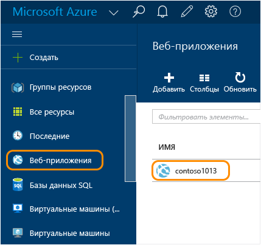
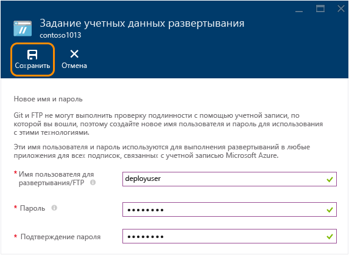
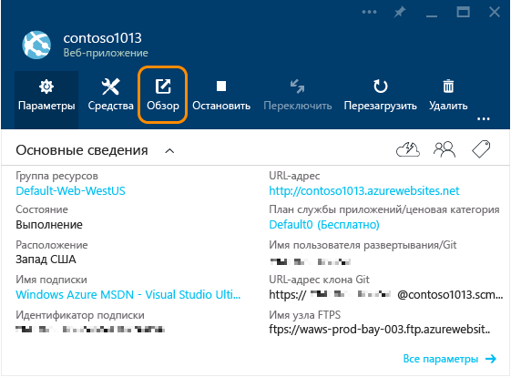
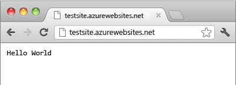

<properties
	pageTitle="Создание веб-приложения Node.js в службе приложений Azure | Microsoft Azure"
	description="Сведения о развертывании приложения Node.js в веб-приложение в службе приложений Azure."
	services="app-service\web"
	documentationCenter="nodejs"
	authors="rmcmurray"
	manager="wpickett"
	editor=""/>

<tags
	ms.service="app-service-web"
	ms.workload="web"
	ms.tgt_pltfrm="na"
	ms.devlang="nodejs"
	ms.topic="hero-article"
	ms.date="11/20/2015"
	ms.author="robmcm"/>

# Создание веб-приложения Node.js в службе приложений Azure

> [AZURE.SELECTOR]
- [.Net](web-sites-dotnet-get-started.md)
- [Node.js](web-sites-nodejs-develop-deploy-mac.md)
- [Java](web-sites-java-get-started.md)
- [PHP - Git](web-sites-php-mysql-deploy-use-git.md)
- [PHP - FTP](web-sites-php-mysql-deploy-use-ftp.md)
- [Python](web-sites-python-ptvs-django-mysql.md)

В этом учебнике показано, как создать простое приложение [Node.js](http://nodejs.org) и развернуть его в [веб-приложение](app-service-web-overview.md) в [службе приложений Azure](../app-service/app-service-value-prop-what-is.md) с помощью [Git](http://git-scm.com). Инструкции, приведенные в этом учебнике, применимы к любой операционной системе, на которой может работать Node.js.

Вы узнаете следующее:

* Как создать веб-приложение в службе приложений Azure с помощью портала предварительной версии Azure.
* Как развернуть приложение Node.js в веб-приложение путем передачи в репозиторий Git веб-приложения.

Готовое приложение выводит короткую строку «hello world» в браузер.

![Браузер, в котором отображается сообщение Hello World.][helloworld-completed]

Учебники и образцы кода с более сложными приложениями Node.js, а также другие статьи по использованию Node.js в Azure см. в [Центре разработчиков Node.js](/develop/nodejs/).

> [AZURE.NOTE]Для работы с этим учебником необходимо использовать учетную запись Microsoft Azure. Если у вас нет учетной записи, можно [активировать преимущества для подписчиков MSDN](/ru-RU/pricing/member-offers/msdn-benefits-details/?WT.mc_id=A261C142F) или [подписаться на бесплатную пробную версию](/ru-RU/pricing/free-trial/?WT.mc_id=A261C142F).
>
> Если вы хотите приступить к работе со службой приложений Azure до регистрации и получения учетной записи Azure, перейдите на страницу [Пробное использование службы приложений](http://go.microsoft.com/fwlink/?LinkId=523751). Там вы сможете немедленно создать кратковременное начальное веб-приложение в службе приложений. Для этого не потребуется ни кредитная карта, ни какие-либо обязательства.

## Создание веб-приложения и включение публикации через Git

Выполните следующие действия для создания веб-приложения в службе приложений Azure и включения публикации через Git.

[Git](http://git-scm.com/%20target="_blank) является распределенной системой управления версиями, которую можно использовать для развертывания веб-сайта Azure. Код, созданный для веб-приложения, будет храниться в локальном репозитории Git, а для развертывания кода в Azure он будет передаваться в удаленный репозиторий. Этот метод развертывания является функцией веб-приложений службы приложений.

1. Войдите на [портал предварительной версии Azure](https://portal.azure.com).

2. Щелкните значок **+ СОЗДАТЬ** в верхнем левом углу портала.

3. Щелкните элемент **Интернет и мобильные устройства**, а затем — **Веб-приложение**.

    ![][portal-quick-create]

4. Введите имя для веб-приложения в поле **Веб-приложение**.

	Это имя должно быть уникальным в домене azurewebsites.net, так как URL-адрес веб-приложения будет иметь такой формат: {имя}. azurewebsites.net. Если введенное имя не является уникальным, в текстовом поле отображается красный восклицательный знак.

5. Выберите **подписку**.

6. Выберите **группу ресурсов** или создайте новую.

	Дополнительные сведения о группах ресурсов Azure см. в статье [Управление ресурсами Azure с помощью портала предварительной версии Azure](../resource-group-portal.md).

7. Выберите или создайте **план службы приложений или расположение**.

	Дополнительные сведения о планах службы приложений см. в статье [Обзор планов службы приложений Azure](../azure-web-sites-web-hosting-plans-in-depth-overview.md).

8. Щелкните **Создать**.
   
	![][portal-quick-create2]

	Вскоре Azure завершит создание нового веб-приложения, обычно это занимает меньше минуты.

9. Щелкните элемент **Веб-приложения > {ваше новое веб-приложение}**.

	

10. В колонке **Веб-приложение** щелкните элемент **Развертывание**.

	![][deployment-part]

11. В колонке **Непрерывное развертывание** щелкните **Выбрать источник**.

12. Щелкните **Локальный репозиторий Git**, а затем нажмите кнопку **OK**.

	![][setup-git-publishing]

13. Настройте учетные данные развертывания, если это еще не сделано.

	а. В колонке веб-приложения щелкните **Параметры > Учетные данные развертывания**.

	![][deployment-credentials]
 
	b. Укажите имя пользователя и пароль.
	
	

14. В колонке веб-приложения щелкните **Параметры**, а затем — **Свойства**.
 
	Чтобы опубликовать содержимое, необходимо отправить его в удаленный репозиторий Git. URL-адрес репозитория указан в разделе **URL-адрес GIT**. Этот адрес потребуется позже в данном учебнике.

	![][git-url]

## Построение и тестирование приложения на локальном ресурсе

В этом разделе описано создание файла **server.js**, который содержит слегка измененную версию примера «Hello World» из [nodejs.org]. Код добавляет process.env.PORT в качестве прослушиваемого порта при запуске в веб-приложении Azure.

1. Создайте каталог с именем *helloworld*.

2. С помощью текстового редактора создайте в каталоге *helloworld* новый файл с именем **server.js**.

2. Скопируйте следующий код в файл **server.js**, после чего сохраните файл.

        var http = require('http')
        var port = process.env.PORT || 1337;
        http.createServer(function(req, res) {
          res.writeHead(200, { 'Content-Type': 'text/plain' });
          res.end('Hello World\n');
        }).listen(port);

3. Откройте командную строку и введите следующую команду, чтобы запустить веб-приложение локально:

        node server.js

4. Откройте веб-браузер и перейдите по адресу http://localhost:1337.

	Появится веб-страница, содержащая фразу «Hello World», как показано на следующем снимке экрана.

    ![Браузер, в котором отображается сообщение Hello World.][helloworld-localhost]

## Публикация приложения

1. Установите Git, если это еще не сделано.

	Указания по установке для вашей платформы см. на [странице загрузки Git](http://git-scm.com/download).

1. В командной строке перейдите в каталог **helloworld** и введите следующую команду для инициализации локального репозитория Git.

		git init

2. Используйте следующие команды для добавления файлов в репозиторий:

		git add .
		git commit -m "initial commit"

3. Добавьте удаленный Git для отправки обновлений в ранее созданное веб-приложение Azure с помощью команды:

		git remote add azure [URL for remote repository]

4. Отправьте обновления в Azure с помощью следующей команды:

		git push azure master

	Появится запрос на ввод ранее созданного пароля. Результат будет похож на следующий пример.

		Counting objects: 3, done.
		Delta compression using up to 8 threads.
		Compressing objects: 100% (2/2), done.
		Writing objects: 100% (3/3), 374 bytes, done.
		Total 3 (delta 0), reused 0 (delta 0)
		remote: New deployment received.
		remote: Updating branch 'master'.
		remote: Preparing deployment for commit id '5ebbe250c9'.
		remote: Preparing files for deployment.
		remote: Deploying Web.config to enable Node.js activation.
		remote: Deployment successful.
		To https://user@testsite.scm.azurewebsites.net/testsite.git
		 * [new branch]      master -> master

5. Чтобы отобразить приложение, на портале Azure в разделе **Веб-приложение** нажмите кнопку **Обзор**.

	

	

## Публикация изменений в приложении

1. Откройте файл **server.js** в текстовом редакторе и измените Hello World\\n на Hello Azure\\n. 

2. Сохраните файл.

2. В командной строке перейдите в каталог **helloworld** и выполните следующие команды:

		git add .
		git commit -m "changing to hello azure"
		git push azure master

	Будет предложено снова ввести пароль.

3. Обновите окно браузера, в котором вы перешли по URL-адресу веб-приложения.

	![Веб-страница с отображением строки Hello Azure][helloworld-completed]

## Откат развертывания

В колонке **Веб-приложение** можно щелкнуть элементы **Параметры > Непрерывное развертывание**, чтобы просмотреть историю развертывания в колонке **Развертывания**. Если вам нужно выполнить откат к более раннему развертыванию, выберите развертывание, а затем в колонке **Сведения о развертывании** щелкните элемент **Развернуть повторно**.

## Дальнейшие действия

Вы развернули приложение Node.js в веб-приложение в службе приложений Azure. Дополнительные сведения о том, как веб-приложения службы приложений запускают приложения Node.js, см. в статьях [Веб-приложения службы приложений Azure: Node.js](http://blogs.msdn.com/b/silverlining/archive/2012/06/14/windows-azure-websites-node-js.aspx) и [Выбор версии Node.js в приложении Azure](../nodejs-specify-node-version-azure-apps.md).

Node.js предоставляет обширную экосистему модулей, которые можно использовать в своих приложениях. Сведения о работе веб-приложений с модулями см. в статье [Использование модулей Node.js с приложениями Azure](../nodejs-use-node-modules-azure-apps.md).

При возникновении проблем после развертывания приложения в Azure см. сведения о диагностике проблем в статье [Отладка приложения Node.js в службе приложений Azure](web-sites-nodejs-debug.md).

В этой статье используется портал Azure для создания веб-приложения. Для выполнения этих операций можно также использовать [интерфейс командной строки Azure](../xplat-cli-install.md) или [Azure PowerShell](../install-configure-powershell.md).

Дополнительные сведения о разработке приложений Node.js в Azure см. в [Центре разработчиков Node.js](/develop/nodejs/).

[helloworld-completed]: ./media/web-sites-nodejs-develop-deploy-mac/helloazure.png
[helloworld-localhost]: ./media/web-sites-nodejs-develop-deploy-mac/helloworldlocal.png
[portal-quick-create]: ./media/web-sites-nodejs-develop-deploy-mac/create-quick-website.png
[portal-quick-create2]: ./media/web-sites-nodejs-develop-deploy-mac/create-quick-website2.png
[setup-git-publishing]: ./media/web-sites-nodejs-develop-deploy-mac/setup_git_publishing.png
[go-to-dashboard]: ./media/web-sites-nodejs-develop-deploy-mac/go_to_dashboard.png
[deployment-part]: ./media/web-sites-nodejs-develop-deploy-mac/deployment-part.png
[deployment-credentials]: ./media/web-sites-nodejs-develop-deploy-mac/deployment-credentials.png
[git-url]: ./media/web-sites-nodejs-develop-deploy-mac/git-url.png

<!---HONumber=AcomDC_1125_2015-->