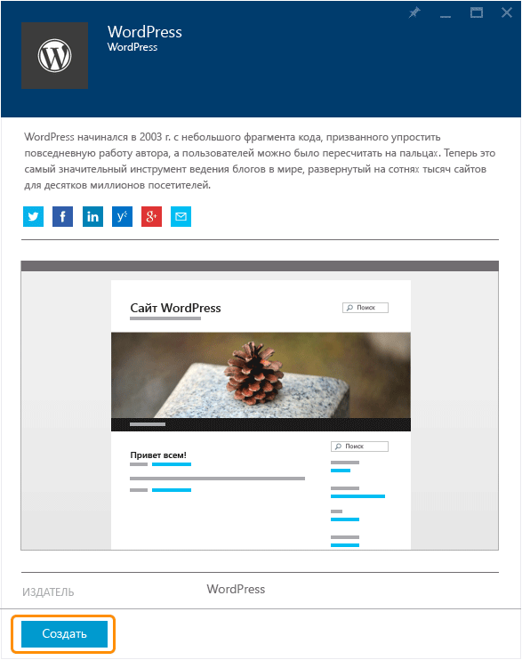
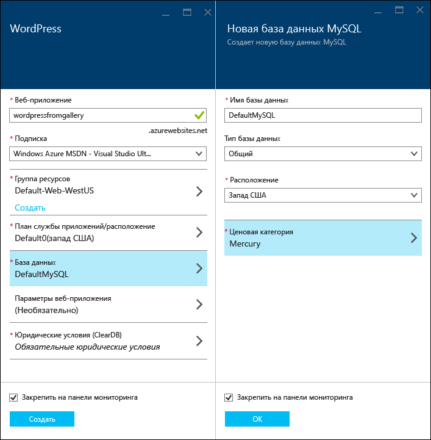
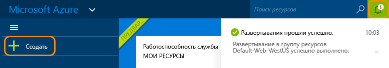
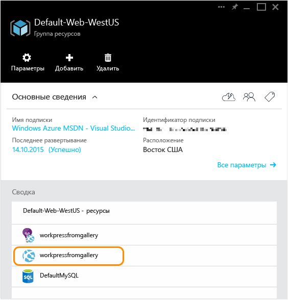

<properties
	pageTitle="Создание веб-приложения WordPress в службе приложений Azure | Microsoft Azure"
	description="Узнайте, как создать новое веб-приложение Azure для блога WordPress с помощью портала Azure."
	services="app-service\web"
	documentationCenter="php"
	authors="rmcmurray"
	manager="wpickett"
	editor=""/>

<tags
	ms.service="app-service-web"
	ms.workload="na"
	ms.tgt_pltfrm="na"
	ms.devlang="PHP"
	ms.topic="hero-article"
	ms.date="02/08/2016"
	ms.author="robmcm"/>

# Создание веб-приложения WordPress в службе приложений Azure

В этом руководстве объясняется, как развернуть сайт блога WordPress в Azure Marketplace.

После завершения работы с учебником ваш собственный блог WordPress будет работать в облаке.

Вы узнаете следующее:

* Как найти шаблон приложения в магазине Azure.
* Как создать веб-приложение в службе приложений Azure на основе шаблона.
* Как настроить параметры службы приложений Azure для нового веб-приложения и базы данных.

Azure Marketplace предоставляет широкий спектр популярных веб-приложений, разработанных нами, сторонними компаниями и группами разработки программного обеспечения с открытым исходным кодом. Веб-приложения создаются на основе различных популярных платформ, в том числе [PHP](/develop/nodejs/) (в данном примере с WordPress), [.NET](/develop/net/), [Node.js](/develop/nodejs/), [Java](/develop/java/), [Python](/develop/python/) и другие. Единственное программное обеспечение, которое понадобится для создания веб-приложения из магазина Azure, — это браузер, который вы будете использовать для входа на [портал Azure](https://portal.azure.com/).

Сайт WordPress, развертываемый в этом руководстве, использует MySQL для базы данных. Если вы хотите использовать Базу данных SQL в качестве базы данных, см. сайт [Project Nami](http://projectnami.org/) (Проект Nami). **Project Nami** также доступен в Marketplace.

> [AZURE.NOTE]
Для работы с этим учебником необходимо использовать учетную запись Microsoft Azure. Если у вас нет учетной записи, можно [активировать преимущества для подписчиков Visual Studio](/pricing/member-offers/msdn-benefits-details/?WT.mc_id=A261C142F) или [подписаться на бесплатную пробную версию](/ru-RU/pricing/free-trial/?WT.mc_id=A261C142F).
>
> Если вы хотите приступить к работе со службой приложений Azure до регистрации и получения учетной записи Azure, перейдите на страницу [Пробное использование службы приложений](http://go.microsoft.com/fwlink/?LinkId=523751). Там вы сможете немедленно создать кратковременное начальное веб-приложение в службе приложений. Для этого не потребуется ни кредитная карта, ни какие-либо обязательства.

## Выбор WordPress и настройка для службы приложений Azure

1. Войдите на [портал Azure](https://portal.azure.com/).

2. Нажмите кнопку **Создать**.
	
    ![Создать][5]
	
3. Выполните поиск по запросу **WordPress**, а затем щелкните приложение **WordPress**. Если вы хотите использовать Базу данных SQL вместо MySQL, выполните поиск по запросу **Project Nami**.

	![WordPress из списка][7]
	
5. После прочтения описания приложения WordPress нажмите кнопку **Создать**.

	

4. Введите имя для веб-приложения в поле **Веб-приложение**.

	Это имя должно быть уникальным в домене azurewebsites.net, так как URL-адрес веб-приложения будет иметь такой формат: {имя}. azurewebsites.net. Если введенное имя не является уникальным, в текстовом поле отображается красный восклицательный знак.

8. Если у вас есть несколько подписок, выберите ту, которую будете использовать.

5. Выберите **группу ресурсов** или создайте новую.

	Дополнительные сведения о группах ресурсов Azure см. в статье [Управление ресурсами Azure с помощью портала Azure](../resource-group-portal.md).

5. Выберите или создайте **план службы приложений или расположение**.

	Дополнительные сведения о планах службы приложений см. в разделе [Обзор планов службы приложений Azure](../azure-web-sites-web-hosting-plans-in-depth-overview.md).

7. Щелкните элемент **База данных** и укажите в колонке **Новая база данных MySQL** необходимые значения для настройки базы данных MySQL.

	а. Введите новое имя или оставьте имя по умолчанию.

	b. Оставьте в поле **Тип базы данных** значение **Общая**.

	c. Выберите то же расположение, которое выбрано для веб-приложения.

	г) Выберите ценовую категорию. Для этого учебника подходит «Меркурий» (бесплатно с минимумом разрешенных подключений и места на диске).

8. В колонке **Новая база данных MySQL** нажмите **ОК**.

8. В колонке **WordPress** примите условия использования и нажмите кнопку **Создать**.

	

	Служба приложений Azure создаст веб-приложение (обычно это занимает меньше минуты). Можно отслеживать ход выполнения, щелкнув значок колокольчика в верхней части страницы портала.

	

## Запуск веб-приложения WordPress и управление им
	
7. После завершения создания веб-приложения перейдите на портале Azure к группе ресурсов, в которой было создано приложение, и вы увидите веб-приложение и базу данных.

	Дополнительный ресурс со значком лампочки — надстройка [Application Insights](/services/application-insights/), которая предоставляет службы мониторинга для веб-приложения.

1. В колонке **Группа ресурсов** щелкните строку веб-приложения.

	

2. В колонке веб-приложения нажмите кнопку **Обзор**.

    ![URL-адрес сайта][browse]

3. На странице **приветствия** WordPress введите сведения о конфигурации, которые требуются WordPress, после чего нажмите кнопку **Установить WordPress**.

	

4. Войдите, используя учетные данные, созданные на странице **приветствия**.

5. Откроется страница панели мониторинга вашего сайта.

	

## Дальнейшие действия

Вы уже знаете, как создать и развернуть веб-приложение PHP из коллекции. Дополнительные сведения об использовании PHP в Azure см. в [Центре разработчиков PHP](/develop/php/).

Дополнительные сведения о работе с веб-приложениями службы приложений см. по ссылкам в левой части страницы (для широких окон браузера) или в верхней части страницы (для узких окон браузера).

## Изменения
* Информацию об изменениях, связанных с переходом с веб-сайтов на службы приложений, см. в статье [Служба приложений Azure и ее влияние на существующие службы Azure](http://go.microsoft.com/fwlink/?LinkId=529714).

[5]: ./media/web-sites-php-web-site-gallery/startmarketplace.png
[7]: ./media/web-sites-php-web-site-gallery/search-web-app.png
[browse]: ./media/web-sites-php-web-site-gallery/browse-web.png

<!---HONumber=AcomDC_0323_2016-->