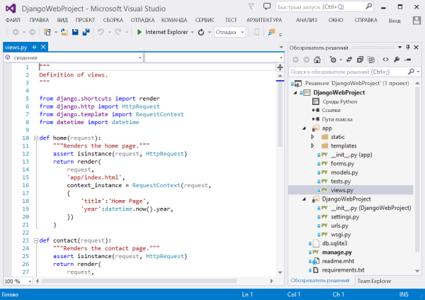
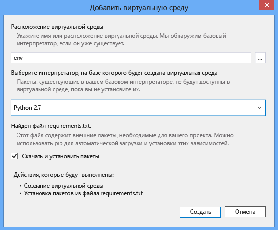
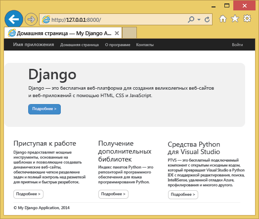
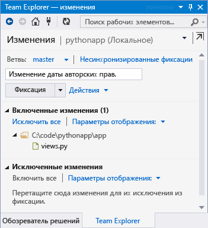
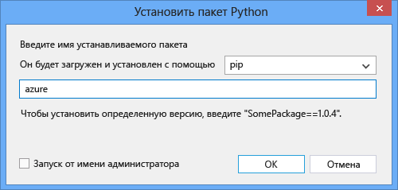

<properties
	pageTitle="Создание веб-приложений с помощью Django в Azure"
	description="Учебник, в котором вы ознакомитесь с запуском веб-приложения Python в веб-приложениях службы приложений Azure."
	services="app-service\web"
	documentationCenter="python"
	tags="python"
	authors="huguesv" 
	manager="wpickett" 
	editor=""/>

<tags
	ms.service="app-service-web"
	ms.workload="web"
	ms.tgt_pltfrm="na"
	ms.devlang="python"
	ms.topic="hero-article" 
	ms.date="02/19/2016"
	ms.author="huvalo"/>

# Создание веб-приложений с помощью Django в Azure

В этом учебнике описывается, как работать с языком Python в [веб-приложениях службы приложений Azure](http://go.microsoft.com/fwlink/?LinkId=529714). Служба веб-приложений предоставляет ограниченное бесплатное размещение приложений, а также возможности их быстрого развертывания и использования языка Python. По мере роста приложения можно переключиться на платное размещение, а также интегрировать его со всеми другими службами Azure.

Вы создадите приложение с помощью веб-платформы Django (см. другие версии этого учебника для веб-платформ [Flask](web-sites-python-create-deploy-flask-app.md) и [Bottle](web-sites-python-create-deploy-bottle-app.md)). Вы можете создать веб-приложение из Azure Marketplace, настроить развертывание Git и локально клонировать репозиторий. Затем вы сможете запускать приложение локально, вносить изменения, фиксировать и отправлять их в Azure. В этом учебнике показано, как выполнить вышеуказанные действия в Windows, Mac или Linux.

[AZURE.INCLUDE [create-account-and-websites-note](../../includes/create-account-and-websites-note.md)]

>[AZURE.NOTE] Чтобы приступить к работе со службой приложений Azure до создания учетной записи Azure, перейдите к разделу [Пробное использование службы приложений](http://go.microsoft.com/fwlink/?LinkId=523751), где вы можете быстро создать кратковременное веб-приложение начального уровня в службе приложений. Никаких кредитных карт и обязательств.

## Предварительные требования

- Windows, Mac или Linux
- Python 2.7 или 3.4
- setuptools, pip, virtualenv (только для Python 2.7)
- Git
- [Инструменты Python для Visual Studio][] \(PTVS) (необязательно).

**Примечание**. Публикация TFS в настоящее время для проектов Python не поддерживается.

### Windows

Если у вас еще не установлен Python 2.7 или 3.4 (32-разрядная версия), рекомендуется сначала установить [пакет SDK для Azure для Python 2.7] или [пакет SDK для Azure для Python 3.4] с помощью установщика веб-платформы. При этом выполняется установка 32-разрядной версии Python (для установки на хост-компьютерах Azure), setuptools, pip, virtualenv, и т. д. Python также можно скачать с веб-сайта [python.org].

Для Git рекомендуется использовать [Git для Windows] или [GitHub для Windows]. При использовании Visual Studio можно использовать интегрированную поддержку Git.

Мы также рекомендуем установить [инструменты Python 2.2 для Visual Studio]. Это необязательно, но, если у вас есть [Visual Studio], например бесплатная версия Visual Studio Community 2013 или Visual Studio Express 2013 для Web, вы получите отличную интегрированную среду разработки Python.

### Mac/Linux

У вас должны быть установлены Python и Git. Убедитесь, что у вас установлена версия Python 2.7 или 3.4.

## Создание веб-приложения на портале

Первым делом нужно создать веб-приложение на [портале Azure](https://portal.azure.com).

1. Войдите на портал Azure и нажмите кнопку **СОЗДАТЬ** в нижнем левом углу.
3. В поле поиска введите "python".
4. В результатах поиска выберите **Django** (издатель — PTVS), а затем нажмите кнопку **Создать**.
5. Настройте новое приложение Django, например создайте новый план службы приложений и новую группу ресурсов для него. Затем щелкните **Создать**.
6. Настройте публикацию Git для вновь созданного веб-приложения, следуя инструкциям из статьи [Развертывание локального репозитория Git в службе приложений Azure](app-service-deploy-local-git.md).

## Обзор приложений

### Содержимое репозитория Git

Ниже приведен обзор файлов, которые можно найти в исходном репозитории Git. Мы клонируем его в следующем разделе.

    \app\__init__.py
    \app\forms.py
    \app\models.py
    \app\tests.py
    \app\views.py
    \app\static\content\
    \app\static\fonts\
    \app\static\scripts\
    \app\templates\about.html
    \app\templates\contact.html
    \app\templates\index.html
    \app\templates\layout.html
    \app\templates\login.html
    \app\templates\loginpartial.html
    \DjangoWebProject\__init__.py
    \DjangoWebProject\settings.py
    \DjangoWebProject\urls.py
    \DjangoWebProject\wsgi.py

Основные источники для приложения. Состоит из 3 страниц (index, about, contact) с макетом главной страницы. Использует такое статическое содержимое и сценарии, как bootstrap, jquery, modernizr и respond.

    \manage.py

Поддержка локального сервера управления и разработки. Используется для локального запуска приложения, синхронизации базы данных и т. д.

    \db.sqlite3

База данных по умолчанию. Содержит таблицы, необходимые для выполнения приложения, но не содержит пользователей (синхронизируйте базу данных, чтобы создать пользователя).

    \DjangoWebProject.pyproj
    \DjangoWebProject.sln

Файлы проекта для использования со [средствами Python для Visual Studio].

    \ptvs_virtualenv_proxy.py

Прокси-сервер IIS для виртуальных сред и поддержки удаленной отладки PTVS.

    \requirements.txt

Внешние пакеты, необходимые для этого приложения. Сценарий развертывания установит пакеты, указанные в этом файле, с помощью pip.

    \web.2.7.config
    \web.3.4.config

Файлы конфигурации IIS. Сценарий развертывания использует соответствующий web.x.y.config и скопирует его с именем web.config.

### Дополнительные файлы — настройка развертывания

[AZURE.INCLUDE [web-sites-python-django-customizing-deployment](../../includes/web-sites-python-django-customizing-deployment.md)]

### Дополнительные файлы — среда выполнения Python

[AZURE.INCLUDE [web-sites-python-customizing-runtime](../../includes/web-sites-python-customizing-runtime.md)]

### Дополнительные файлы на сервере

Некоторые файлы размещены на сервере, но не добавляются в репозиторий git. Такие файлы создаются с помощью сценария развертывания.

    \web.config

Файл конфигурации IIS. Создается из файла web.x.y.config при каждом развертывании.

    \env\

Виртуальная среда Python. Создается при развертывании, если совместимая виртуальная среда еще не создана для веб-приложения. Пакеты, указанные в файле requirements.txt, устанавливаются с помощью pip. Однако если они уже установлены, pip не будет выполнять установку.

В следующих 3 разделах описывается разработка веб-приложения в 3 разных средах:

- Windows, со средствами Python для Visual Studio
- Windows с командной строкой;
- Mac и Linux с командной строкой.

## Развертывание веб-приложений — Windows — средства Python для Visual Studio

### Клонирование репозитория

Сначала клонируйте репозиторий, используя URL-адрес на портале Azure. Дополнительные сведения см. в статье [Развертывание локального репозитория Git в службе приложений Azure](app-service-deploy-local-git.md).

Откройте файл решения (SLN-файл), который содержится в корневой папке репозитория.

### Создание виртуальной среды

Теперь мы создадим виртуальную среду для локальной разработки веб-сайта. Щелкните правой кнопкой мыши **Среды Python** и выберите **Добавить виртуальную среду...**.

- Убедитесь, что имя среды — `env`.

- Выберите базовый интерпретатор. Убедитесь, что используется та же версия Python, которая выбрана для веб-приложения (в файле runtime.txt или в колонке **Параметры приложения** веб-приложения на портале Azure).

- Убедитесь, что установлен флажок для скачивания и установки пакетов.

Щелкните **Создать**. Таким образом будет создана виртуальная среда и установлены зависимости из файла requirements.txt.

### Создание суперпользователя

В базе данных, которая содержится в приложении, не определен суперпользователь. Чтобы использовать функции входа в приложение или интерфейс администрирования Django (если вы решили включить его), необходимо будет создать суперпользователя.

Выполните эту команду в командной строке в папке проекта:

    env\scripts\python manage.py createsuperuser

Следуйте указаниям, чтобы задать имя пользователя, пароль и т. д.

### Запуск страницы с помощью сервера разработки

Нажмите клавишу F5, чтобы начать отладку, и браузер автоматически откроет страницу, запущенную локально.

Можно установить точки останова в источниках, использовать окна контрольных значений и т. д. Дополнительные сведения о различных функциях см. в [документации по средствам Python для Visual Studio].

### Внесение изменений

Теперь вы можете поэкспериментировать, внося изменения в исходные коды и/или шаблоны приложений.

После тестирования изменений их необходимо сохранить в репозитории Git:

### Установка дополнительных пакетов

Зависимости приложений могут не ограничиваться Python и Django.

С помощью pip можно установить дополнительные пакеты. Чтобы установить пакет, щелкните правой кнопкой мыши в виртуальной среде и выберите **Установить пакет Python**.

Например, чтобы установить пакет SDK для Azure для Python, который предоставляет доступ к службе хранилища Azure, служебной шине и другим службам Azure, введите `azure`:

Щелкните правой кнопкой мыши в виртуальной среде и выберите **Создать файл requirements.txt**, чтобы обновить файл requirements.txt.

Затем сохраните внесенные в этот файл изменения в репозитории Git.

### Развертывание в Azure

Чтобы запустить развертывание, щелкните **Синхронизировать** или **Отправить**. При синхронизации выполняется как принудительная отправка, так и применение по запросу.

Первое развертывание может занять некоторое время, необходимое для создания виртуальной среды, установку пакетов и т. д.

В Visual Studio не отображается ход выполнения развертывания. Информацию о том, как можно просмотреть результат, см. в разделе [Устранение неполадок — развертывание](#troubleshooting-deployment).

Перейдите по URL-адресу Azure, чтобы просмотреть внесенные изменения.

## Разработка веб-приложения — Windows — командная строка

### Клонирование репозитория

Сначала клонируйте репозиторий, используя URL-адрес на портале Azure, а затем добавьте репозиторий Azure в качестве удаленного. Дополнительные сведения см. в статье [Развертывание локального репозитория Git в службе приложений Azure](app-service-deploy-local-git.md).

    git clone <repo-url>
    cd <repo-folder>
    git remote add azure <repo-url>

### Создание виртуальной среды

Давайте создадим новую виртуальную среду для разработки (не добавляйте ее в репозиторий). Виртуальные среды на языке Python нельзя перемещать, поэтому каждому разработчику, работающему над приложением, будет необходимо создать такую среду локально.

Убедитесь, что используется та же версия Python, которая выбрана для веб-приложения (в файле runtime.txt или в колонке "Параметры приложения" веб-приложения на портале Azure).

Для Python 2.7:

    c:\python27\python.exe -m virtualenv env

Для Python 3.4:

    c:\python34\python.exe -m venv env

Установите все внешние пакеты, необходимые для этого приложения. Чтобы установить пакеты в своей виртуальной среде, вы можете использовать файл requirements.txt в корне репозитория:

    env\scripts\pip install -r requirements.txt

### Создание суперпользователя

В базе данных, которая содержится в приложении, не определен суперпользователь. Чтобы использовать функции входа в приложение или интерфейс администрирования Django (если вы решили включить его), необходимо будет создать суперпользователя.

Выполните эту команду в командной строке в папке проекта:

    env\scripts\python manage.py createsuperuser

Следуйте указаниям, чтобы задать имя пользователя, пароль и т. д.

### Запуск страницы с помощью сервера разработки

Вы можете запустить приложение на сервере разработки с помощью следующей команды:

    env\scripts\python manage.py runserver

В консоли отобразится URL-адрес и порт, который прослушивает сервер:

Далее откройте браузер и введите этот URL-адрес.

### Внесение изменений

Теперь вы можете поэкспериментировать, внося изменения в исходные коды и/или шаблоны приложений.

После тестирования изменений их необходимо сохранить в репозитории Git:

    git add <modified-file>
    git commit -m "<commit-comment>"

### Установка дополнительных пакетов

Зависимости приложений могут не ограничиваться Python и Django.

С помощью pip можно установить дополнительные пакеты. Например, чтобы установить пакет SDK для Azure для Python, который предоставляет доступ к службе хранилища Azure, служебной шине, а также другим службам Azure, введите:

    env\scripts\pip install azure

Обязательно обновите файл requirements.txt:

    env\scripts\pip freeze > requirements.txt

Примените изменения:

    git add requirements.txt
    git commit -m "Added azure package"

### Развертывание в Azure

Чтобы запустить развертывание, принудительно отправьте эти изменения в Azure:

    git push azure master

Отобразятся выходные данные сценария развертывания, а также создание виртуальной среды, установку пакетов, и создание файла web.config.

Перейдите по URL-адресу Azure, чтобы просмотреть внесенные изменения.

## Разработка веб-приложения — Mac/Linux — командная строка

### Клонирование репозитория

Сначала клонируйте репозиторий, используя URL-адрес на портале Azure, а затем добавьте репозиторий Azure в качестве удаленного. Дополнительные сведения см. в статье [Развертывание локального репозитория Git в службе приложений Azure](app-service-deploy-local-git.md).

    git clone <repo-url>
    cd <repo-folder>
    git remote add azure <repo-url>

### Создание виртуальной среды

Давайте создадим новую виртуальную среду для разработки (не добавляйте ее в репозиторий). Виртуальные среды на языке Python нельзя перемещать, поэтому каждому разработчику, работающему над приложением, будет необходимо создать такую среду локально.

Убедитесь, что используется та же версия Python, которая выбрана для веб-приложения (в файле runtime.txt или в колонке "Параметры приложения" веб-приложения на портале Azure).

Для Python 2.7:

    python -m virtualenv env

Для Python 3.4:

    python -m venv env

или

	pyvenv env

Установите все внешние пакеты, необходимые для этого приложения. Чтобы установить пакеты в своей виртуальной среде, вы можете использовать файл requirements.txt в корне репозитория:

    env/bin/pip install -r requirements.txt

### Создание суперпользователя

В базе данных, которая содержится в приложении, не определен суперпользователь. Чтобы использовать функции входа в приложение или интерфейс администрирования Django (если вы решили включить его), необходимо будет создать суперпользователя.

Выполните эту команду в командной строке в папке проекта:

    env/bin/python manage.py createsuperuser

Следуйте указаниям, чтобы задать имя пользователя, пароль и т. д.

### Запуск страницы с помощью сервера разработки

Вы можете запустить приложение на сервере разработки с помощью следующей команды:

    env/bin/python manage.py runserver

В консоли отобразится URL-адрес и порт, который прослушивает сервер:

Далее откройте браузер и введите этот URL-адрес.

### Внесение изменений

Теперь вы можете поэкспериментировать, внося изменения в исходные коды и/или шаблоны приложений.

После тестирования изменений их необходимо сохранить в репозитории Git:

    git add <modified-file>
    git commit -m "<commit-comment>"

### Установка дополнительных пакетов

Зависимости приложений могут не ограничиваться Python и Django.

С помощью pip можно установить дополнительные пакеты. Например, чтобы установить пакет SDK для Azure для Python, который предоставляет доступ к службе хранилища Azure, служебной шине, а также другим службам Azure, введите:

    env/bin/pip install azure

Обязательно обновите файл requirements.txt:

    env/bin/pip freeze > requirements.txt

Примените изменения:

    git add requirements.txt
    git commit -m "Added azure package"

### Развертывание в Azure

Чтобы запустить развертывание, принудительно отправьте эти изменения в Azure:

    git push azure master

Отобразятся выходные данные сценария развертывания, а также создание виртуальной среды, установку пакетов, и создание файла web.config.

Перейдите по URL-адресу Azure, чтобы просмотреть внесенные изменения.

## Устранение неполадок — установка пакета

[AZURE.INCLUDE [web-sites-python-troubleshooting-package-installation](../../includes/web-sites-python-troubleshooting-package-installation.md)]

## Устранение неполадок — виртуальная среда

[AZURE.INCLUDE [web-sites-python-troubleshooting-virtual-environment](../../includes/web-sites-python-troubleshooting-virtual-environment.md)]

## Устранение неполадок — статические файлы

Django использует концепцию сбора статических файлов. Согласно этой концепции все статические файлы извлекаются из исходных расположений и копируются в одну папку. Для этого приложения они копируются в папку `/static`.

Это делается потому, что статические файлы могут поступать из различных приложений Django. Например, статические файлы интерфейсов администратора Django находятся во вложенной папке библиотеки Django в виртуальной среде. Статические файлы, определенные в этом приложении, находятся в папке `/app/static`. При использовании нескольких приложений Django статические файлы будут расположены в нескольких местах.

При запуске приложения в режиме отладки статические файлы обслуживаются из исходного расположения.

При запуске приложения в режиме выпуска статические файлы **не** обслуживаются. За это отвечает веб-сервер. Для этого приложения IIS будет обслуживать статические файлы из папки `/static`.

Сбор статических файлов выполняется автоматически в ходе выполнения сценария развертывания, а файлы, собранные ранее, удаляются. Это означает, что сбор выполняется при каждом развертывании. Это немного замедляет развертывание, но обеспечивает недоступность устаревших файлов во избежание потенциальных проблем безопасности.

Вот как можно пропустить сбор статических файлов для приложения Django:

    \.skipDjango

Затем вам понадобится собрать файлы вручную на локальном компьютере:

    env\scripts\python manage.py collectstatic

Удалите папку `\static` из `.gitignore` и добавьте ее в репозиторий Git.

## Устранение неполадок — настройки

В `DjangoWebProject/settings.py` можно изменить различные параметры приложения.

Для удобства разработчиков включен режим отладки. Одним из положительных внешних эффектов является возможность просматривать образы и другое статическое содержимое во время локального выполнения без сбора статических файлов.

Чтобы отключить режим отладки, воспользуйтесь следующей командой:

    DEBUG = False

Если режим отладки отключен, в значении параметра `ALLOWED_HOSTS` необходимо указать имя узла Azure. Например:

    ALLOWED_HOSTS = (
        'pythonapp.azurewebsites.net',
    )

Чтобы включить любой узел, введите следующее:

    ALLOWED_HOSTS = (
        '*',
    )

На практике для переключения между режимами отладки и выпуска, а также получения имени узла можно выполнять более сложные задачи.

Вы можете задать переменные среды на странице **НАСТРОЙКА** портала Azure в разделе **Параметры приложения**. Таким способом можно задать значения, которые не будут отображаться в исходном коде (строки подключения, пароли и т. д.), а также задать разные значения для Azure и локального компьютера. В файле `settings.py` можно запросить переменные среды с помощью `os.getenv`.

## Использование базы данных

В приложении содержится база данных sqlite. Эту базу данных по умолчанию удобно использовать для разработки, так как она практически не требует настройки. Эта база данных хранится в файле db.sqlite3 в папке проекта.

Azure предоставляет службы баз данных, которые легко использовать в приложении Django. В учебниках по использованию [базы данных SQL] и [MySQL] в приложении на платформе Django описываются шаги по созданию службы базы данных и изменению параметров базы данных в файле `DjangoWebProject/settings.py`. В этих учебниках также приводится список библиотек, которые необходимо установить.

Конечно, если вы предпочитаете управлять собственными серверами баз данных, это можно сделать с помощью виртуальных машин Windows или Linux, работающих в Azure.

## Интерфейс администрирования Django

Как только вы начнете создавать модели, вам необходимо будет заполнять базу данных данными. Интерфейс администрирования Django позволяет с легкостью добавлять и изменять содержимое в интерактивном режиме.

Код интерфейса администрирования закомментирован в исходном коде приложения, но он четко помечен, поэтому его можно легко включить (ищите слово "admin").

Включив код, синхронизируйте базу данных, запустите приложение и перейдите к `/admin`.

## Дальнейшие действия

Используйте следующие ссылки, чтобы узнать больше о средствах Django и Python для Visual Studio.

- [Документация по Django]
- [Документация по средствам Python для Visual Studio]

Дополнительную информацию об использовании базы данных SQL и MySQL см. в статьях:

- [Использование Django и MySQL в Azure с помощью инструментов Python для Visual Studio]
- [Использование Django и базы данных SQL в Azure с помощью инструментов Python для Visual Studio]

Дополнительные сведения см. в [Центре разработчика Python](/develop/python/).

## Изменения
* Указания по изменениям при переходе от веб-сайтов к службе приложений см. в разделе [Служба приложений Azure и ее влияние на существующие службы Azure](http://go.microsoft.com/fwlink/?LinkId=529714).

<!--Link references-->
[Использование Django и MySQL в Azure с помощью инструментов Python для Visual Studio]: web-sites-python-ptvs-django-mysql.md
[Использование Django и базы данных SQL в Azure с помощью инструментов Python для Visual Studio]: web-sites-python-ptvs-django-sql.md
[базы данных SQL]: web-sites-python-ptvs-django-sql.md
[MySQL]: web-sites-python-ptvs-django-mysql.md

<!--External Link references-->
[пакет SDK для Azure для Python 2.7]: http://go.microsoft.com/fwlink/?linkid=254281
[пакет SDK для Azure для Python 3.4]: http://go.microsoft.com/fwlink/?linkid=516990
[python.org]: http://www.python.org/
[Git для Windows]: http://msysgit.github.io/
[GitHub для Windows]: https://windows.github.com/
[Инструменты Python для Visual Studio]: http://aka.ms/ptvs
[средствами Python для Visual Studio]: http://aka.ms/ptvs
[инструменты Python 2.2 для Visual Studio]: http://go.microsoft.com/fwlink/?LinkID=624025
[Visual Studio]: http://www.visualstudio.com/
[Документация по средствам Python для Visual Studio]: http://aka.ms/ptvsdocs
[документации по средствам Python для Visual Studio]: http://aka.ms/ptvsdocs
[Документация по Django]: https://www.djangoproject.com/

<!---HONumber=AcomDC_0810_2016-->