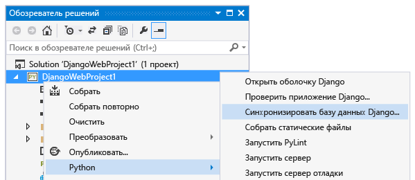
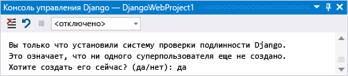
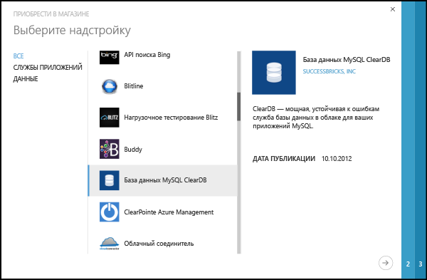
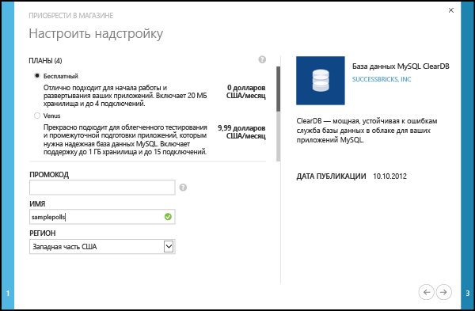
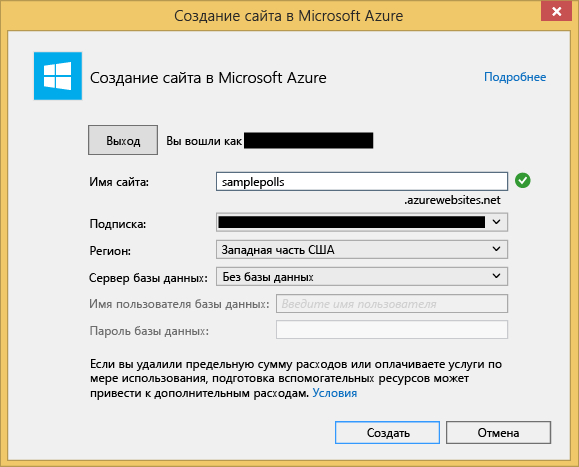

<properties 
	pageTitle="Использование Django и MySQL в Azure с помощью инструментов Python 2.2 для Visual Studio" 
	description="Информация о том, как создать веб-приложение Django, которое хранит данные в экземпляре базы данных MySQL, с помощью инструментов Python для Visual Studio и развернуть его в веб-приложениях службы приложений Azure." 
	services="app-service\web" 
	documentationCenter="python" 
	authors="huguesv" 
	manager="wpickett" 
	editor=""/>

<tags 
	ms.service="app-service-web" 
	ms.workload="web" 
	ms.tgt_pltfrm="na" 
	ms.devlang="python"
	ms.topic="get-started-article" 
	ms.date="02/25/2016"
	ms.author="huvalo"/>

# Использование Django и MySQL в Azure с помощью инструментов Python 2.2 для Visual Studio 

> [AZURE.SELECTOR]
- [.Net](web-sites-dotnet-get-started.md)
- [Node.js](app-service-web-nodejs-get-started.md)
- [Java](web-sites-java-get-started.md)
- [PHP — Git](web-sites-php-mysql-deploy-use-git.md)
- [PHP — FTP](web-sites-php-mysql-deploy-use-ftp.md)
- [Python](web-sites-python-ptvs-django-mysql.md)

В этом учебнике мы используем [Средства Python для Visual Studio], чтобы создать простое веб-приложение опросника с помощью шаблонов PTVS. Также доступна [видеоверсия](https://www.youtube.com/watch?v=oKCApIrS0Lo) этого учебника.

Вы узнаете, как использовать службу MySQL, размещенную на платформе Azure, как настроить веб-приложение для работы с MySQL и как опубликовать веб-приложение в [веб-приложениях службы приложений Azure](http://go.microsoft.com/fwlink/?LinkId=529714).

Зайдите в [Центр по разработке для Python], где можно найти статьи о разработке веб-приложений службы приложений Azure с PTVS при помощи веб-платформ Bottle, Flask и Django, с использованием MongoDB, табличного хранилища Azure, MySQL и служб Базы данных SQL. Хотя эта статья ориентирована в первую очередь на службу приложений, при разработке для [облачных служб Azure] используются аналогичные процедуры.

## Предварительные требования

 - Visual Studio 2013 или 2015
 - [Инструменты Python 2.2 для Visual Studio].
 - [Образцы VSIX средств Python 2.2 для Visual Studio].
 - [Пакет SDK для Azure для VS 2013] или [пакет SDK для Azure для VS 2015].
 - [Python 2.7 (32-разрядная версия)].
 - Django 1.6 или более ранняя версия.

[AZURE.INCLUDE [create-account-and-websites-note](../../includes/create-account-and-websites-note.md)]

>[AZURE.NOTE] Чтобы приступить к работе со службой приложений Azure до создания учетной записи Azure, перейдите к разделу [Пробное использование службы приложений](http://go.microsoft.com/fwlink/?LinkId=523751), где вы можете быстро создать кратковременное веб-приложение начального уровня в службе приложений. Никаких кредитных карт и обязательств.

## Создание проекта

В этом разделе мы создадим проект Visual Studio с помощью шаблона. Мы создадим виртуальную среду и установим необходимые пакеты. Мы создадим локальную базу данных с помощью sqlite. После этого мы запустим приложение локально.

1.  В Visual Studio выберите **Файл** > **Создать проект**.

1.  В шаблонах проекта PTVS Samples VSIX в секции **Python** выберите **Примеры**. Выберите **Веб-проект опросов Django** и нажмите кнопку «ОК», чтобы создать проект.

  	

1.  Вам будет предложено установить внешние пакеты. Выберите вариант **Установить в виртуальной среде**.

  	

1.  Выберите **Python 2.7** в качестве базового интерпретатора.

  	

1.  Щелкните правой кнопкой мыши узел проекта и выберите **Python**, **База данных синхронизации Django**.

  	

1.  Откроется консоль управления Django. Следуйте инструкциям на экране для создания пользователя.

    Будет создана база данных sqlite в папке проекта.

  	

1.  Убедитесь в том, что приложение работает, нажав клавишу <kbd>F5</kbd>.

1.  Щелкните **Войти в систему** на панели навигации сверху.

  	

1.  Введите учетные данные пользователя, который был создан при синхронизации базы данных.

  	

1.  Щелкните **Создать примеры опросов**.

  	

1.  Выберите опрос и проголосуйте.

  	

## Создание базы данных MySQL

В качестве базы данных мы создадим базу данных ClearDB MySQL с размещением в Azure.

В качестве альтернативного решения вы можете создать свою собственную виртуальную машину в Azure, а затем установить и настроить MySQL самостоятельно.

Выполнив следующие шаги, вы сможете создать бесплатную базу данных.

1.  Войдите на [портал Azure](https://portal.azure.com/).

1.  В верхней части области навигации щелкните **Создать**. Выберите **Данные + хранилище** > **База данных MySQL**.

  

1.  Введите **mysql** в поле поиска, щелкните **База данных MySQL**, а затем нажмите кнопку **Создать**. -->
  	<!--  -->

1.  Настройте новую базу данных MySQL, создав новую группу ресурсов, и выберите соответствующее расположение для нее.

  	<!--  -->

1.  После создания базы данных MySQL щелкните **Свойства** в колонке базы данных.
2.  Поместите значение **CONNECTION STRING** в буфер обмена с помощью кнопки копирования.

## Настройка проекта

В этом разделе мы настроим веб-приложение для использования только что созданной базы данных MySQL. Мы также установим дополнительные пакеты Python, необходимые для использования баз данных MySQL с Django. Затем запустим веб-приложение локально.

1.  Откройте в Visual Studio файл **settings.py** из папки *ProjectName*. Временно вставьте строку подключения в редакторе. Строка подключения имеет такой формат:

        Database=<NAME>;Data Source=<HOST>;User Id=<USER>;Password=<PASSWORD>

    Измените базу данных по умолчанию **ENGINE** так, чтобы она использовала MySQL, и задайте значения для параметров **NAME**, **USER**, **PASSWORD** и **HOST** из строки **CONNECTIONSTRING**.

        DATABASES = {
            'default': {
                'ENGINE': 'django.db.backends.mysql',
                'NAME': '<Database>',
                'USER': '<User Id>',
                'PASSWORD': '<Password>',
                'HOST': '<Data Source>',
                'PORT': '',
            }
        }

1.  В обозревателе решений в разделе **Среды Python** щелкните правой кнопкой мыши виртуальную среду и выберите **Установить пакет Python**.

1. Установите пакет `mysql-python`, используя **easy\_install**.

  	

1.  Щелкните правой кнопкой мыши узел проекта и выберите **Python**, **База данных синхронизации Django**.

    В результате будут созданы таблицы для базы данных MySQL, созданной в предыдущем разделе. Следуя подсказкам, создайте пользователя, отличного от пользователя базы данных sqlite, которого мы создали в первом разделе.

  	

1.  Запустите приложение, нажав клавишу `F5`. Опросы, созданные с помощью команды **Создать примеры опросов** и отправленных данных голосования, будут сериализованы в базе данных MySQL.

## Публикация веб-приложения в службе приложений Azure

С помощью пакета SDK для Azure для .NET можно легко развернуть веб-приложение в службе приложений Azure.

1.  В **обозревателе решений** щелкните правой кнопкой мыши узел проекта и выберите **Опубликовать**.

  	

1.  Щелкните **Веб-приложения Microsoft Azure**.

1.  Нажмите **Создать**, чтобы создать новое веб-приложение.

1.  Заполните перечисленные ниже поля и нажмите кнопку **Создать**.
	-	**Имя веб-приложения**
	-	**План обслуживания приложения**
	-	**Группа ресурсов**
	-	**Регион**
	-	Для параметра **Сервер баз данных** оставьте значение **Без базы данных**

  	<!--  -->

1.  Примите значения по умолчанию и щелкните **Опубликовать**.

1.  Опубликованное веб-приложение автоматически откроется в вашем браузере. Вы должны увидеть, что веб-приложение, как и ожидалось, работает с базой данных **MySQL**, размещенной в Azure.

    Поздравляем!

  	

## Дальнейшие действия

Используйте следующие ссылки, чтобы узнать больше об инструментах Python для Visual Studio, Django и MySQL.

- [Документация по средствам Python для Visual Studio]
  - [Веб-проекты]
  - [Проекты для облачной службы]
  - [Удаленная отладка в Microsoft Azure]
- [Документация по Django]
- [MySQL]

Дополнительные сведения см. в [Центре разработки Python](/develop/python/).

## Изменения
* Указания по изменениям при переходе от веб-сайтов к службе приложений см. в разделе [Служба приложений Azure и ее влияние на существующие службы Azure](http://go.microsoft.com/fwlink/?LinkId=529714).

<!--Link references-->
[Центр по разработке для Python]: /develop/python/
[облачных служб Azure]: ../cloud-services-python-ptvs.md

<!--External Link references-->
[Azure Portal]: https://portal.azure.com
[Средства Python для Visual Studio]: http://aka.ms/ptvs
[Инструменты Python 2.2 для Visual Studio]: http://go.microsoft.com/fwlink/?LinkID=624025
[Образцы VSIX средств Python 2.2 для Visual Studio]: http://go.microsoft.com/fwlink/?LinkID=624025
[Пакет SDK для Azure для VS 2013]: http://go.microsoft.com/fwlink/?LinkId=323510
[пакет SDK для Azure для VS 2015]: http://go.microsoft.com/fwlink/?LinkId=518003
[Python 2.7 (32-разрядная версия)]: http://go.microsoft.com/fwlink/?LinkId=517190
[Документация по средствам Python для Visual Studio]: http://aka.ms/ptvsdocs
[Удаленная отладка в Microsoft Azure]: http://go.microsoft.com/fwlink/?LinkId=624026
[Веб-проекты]: http://go.microsoft.com/fwlink/?LinkId=624027
[Проекты для облачной службы]: http://go.microsoft.com/fwlink/?LinkId=624028
[Документация по Django]: https://www.djangoproject.com/
[MySQL]: http://www.mysql.com/
 

<!---HONumber=AcomDC_0406_2016-->