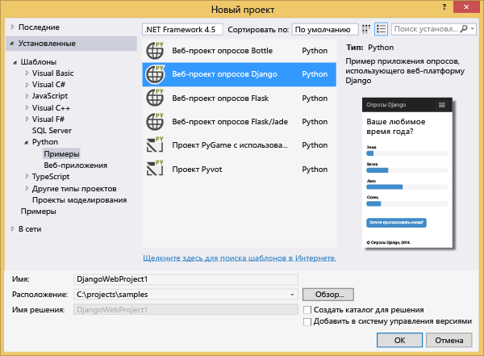
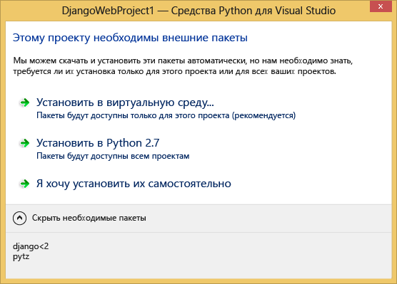
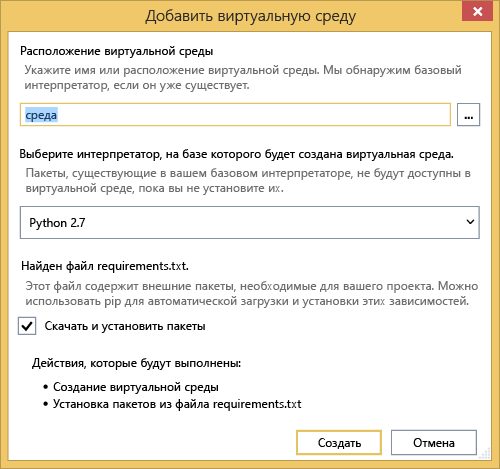
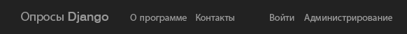
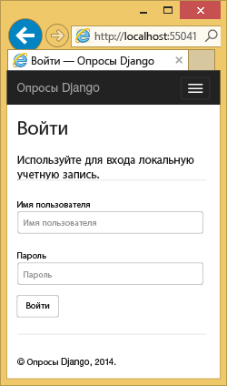
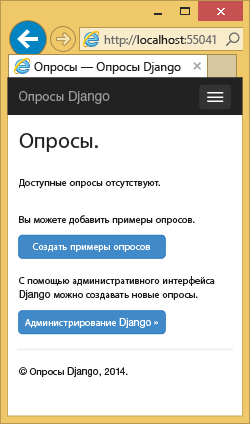
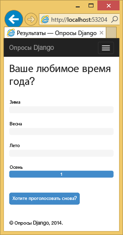
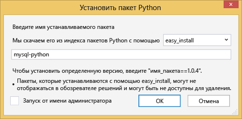
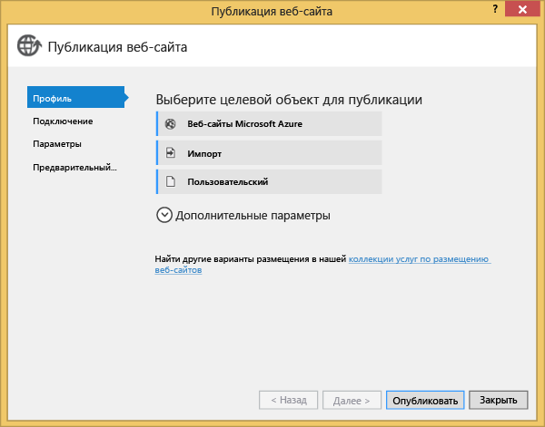

<properties 
	pageTitle="Использование Django и MySQL в Azure с помощью инструментов Python 2.2 для Visual Studio" 
	description="Информация о том, как создать веб-приложение Django, которое хранит данные в экземпляре базы данных MySQL, с помощью инструментов Python для Visual Studio и развернуть его в веб-приложениях службы приложений Azure." 
	services="app-service\web" 
	documentationCenter="python" 
	authors="huguesv" 
	manager="wpickett" 
	editor=""/>

<tags 
	ms.service="app-service-web" 
	ms.workload="web" 
	ms.tgt_pltfrm="na" 
	ms.devlang="python"
	ms.topic="get-started-article" 
	ms.date="07/07/2016"
	ms.author="huvalo"/>

# Использование Django и MySQL в Azure с помощью инструментов Python 2.2 для Visual Studio 

[AZURE.INCLUDE [вкладки](../../includes/app-service-web-get-started-nav-tabs.md)]

В этом руководстве показано, как с помощью [средств Python для Visual Studio](PTVS) можно создать простое веб-приложение опросника с использованием шаблонов PTVS. Вы узнаете, как использовать службу MySQL, размещенную на платформе Azure, как настроить веб-приложение для работы с MySQL и как опубликовать веб-приложение в [веб-приложениях службы приложений Azure](http://go.microsoft.com/fwlink/?LinkId=529714).

> [AZURE.NOTE] Доступна также видеоверсия этого руководства:
> 
> [PTVS 2.1: Django app with MySQL][video] \(PTVS 2.1: приложение Django с использованием MySQL).

В [центре разработчиков Python] доступны материалы по разработке веб-приложений службы приложений Azure с использованием PTVS, веб-платформ Bottle, Flask и Django, хранилища таблиц Azure, а также служб базы данных SQL и MySQL. Хотя эта статья ориентирована в первую очередь на службу приложений, при разработке для [облачных служб Azure] используются аналогичные процедуры.

## Предварительные требования

 - Visual Studio 2015
 - [Python 2.7 (32-разрядный)] или [Python 3.4 (32-разрядный)]
 - [Инструменты Python 2.2 для Visual Studio]
 - [Образцы VSIX средств Python 2.2 для Visual Studio]
 - [Инструменты пакета SDK для Azure для VS 2015]
 - Django 1.9 или более поздней версии

[AZURE.INCLUDE [create-account-and-websites-note](../../includes/create-account-and-websites-note.md)]

<!-- This note should not render as part of the the previous include. -->

> [AZURE.NOTE] Чтобы приступить к работе со службой приложений Azure до создания учетной записи Azure, перейдите к разделу [Пробное использование службы приложений](http://go.microsoft.com/fwlink/?LinkId=523751), где вы можете быстро создать кратковременное веб-приложение начального уровня в службе приложений. Не требуется никаких кредитных карт и обязательств.

## Создание проекта

В этом разделе мы создадим проект Visual Studio с помощью шаблона. Мы создадим виртуальную среду и установим необходимые пакеты. Мы создадим также локальную базу данных с помощью sqlite. После этого мы запустим приложение локально.

1. В Visual Studio выберите **Файл** > **Создать проект**.

1. Чтобы найти шаблоны проекта [Образцы VSIX средств Python 2.2 для Visual Studio], в разделе **Python** выберите **Примеры**. Выберите **Веб-проект опросов Django** и нажмите кнопку «ОК», чтобы создать проект.

    

1. Вам будет предложено установить внешние пакеты. Выберите вариант **Установить в виртуальной среде**.

    

1. Выберите **Python 2.7** или **Python 3.4** в качестве базового интерпретатора.

    

1. В **обозревателе решений** щелкните правой кнопкой мыши узел проекта, а затем выберите **Python** и **Django Migrate** (Миграция Django). Выберите **Django Create Superuser** (Создать суперпользователя Django).

1. Откроется консоль управления Django, а в папке проекта будет создана база данных sqlite. Следуйте инструкциям на экране для создания пользователя.

1. Убедитесь, что приложение работает, нажав клавишу `F5`.

1. Щелкните **Войти в систему** на панели навигации сверху.

    

1. Введите учетные данные пользователя, который был создан при синхронизации базы данных.

    

1. Щелкните **Создать примеры опросов**.

    

1. Выберите опрос и проголосуйте.

    

## Создание базы данных MySQL

В качестве базы данных мы создадим базу данных ClearDB MySQL, размещенную в Azure.

В качестве альтернативного решения вы можете создать свою собственную виртуальную машину в Azure, а затем установить и настроить MySQL самостоятельно.

Выполнив следующие шаги, вы сможете создать бесплатную базу данных.

1. Войдите на [портал Azure].

1. В верхней части области навигации последовательно выберите пункты **Создать**, **Данные+хранилище**, **База данных MySQL**.

1. Настройте новую базу данных MySQL, создав новую группу ресурсов, и выберите соответствующее расположение для нее.

1. После создания базы данных MySQL щелкните **Свойства** в колонке базы данных.

1. Поместите значение **CONNECTION STRING** в буфер обмена с помощью кнопки копирования.

## Настройка проекта

В этом разделе мы настроим веб-приложение для использования только что созданной базы данных MySQL. Мы также установим дополнительные пакеты Python, необходимые для использования баз данных MySQL с Django. Затем запустим веб-приложение локально.

1. Откройте в Visual Studio файл **settings.py** из папки *ProjectName*. Временно вставьте строку подключения в редакторе. Строка подключения имеет такой формат:

        Database=<NAME>;Data Source=<HOST>;User Id=<USER>;Password=<PASSWORD>

    Измените базу данных по умолчанию **ENGINE** так, чтобы она использовала MySQL, и задайте значения для параметров **NAME**, **USER**, **PASSWORD** и **HOST** из строки **CONNECTIONSTRING**.

        DATABASES = {
            'default': {
                'ENGINE': 'django.db.backends.mysql',
                'NAME': '<Database>',
                'USER': '<User Id>',
                'PASSWORD': '<Password>',
                'HOST': '<Data Source>',
                'PORT': '',
            }
        }

1. В обозревателе решений в разделе **Среды Python** щелкните правой кнопкой мыши виртуальную среду и выберите **Установить пакет Python**.

1. Установите пакет `mysqlclient`, используя **pip**.

    

1. В **обозревателе решений** щелкните правой кнопкой мыши узел проекта, а затем выберите **Python** и **Django Migrate** (Миграция Django). Выберите **Django Create Superuser** (Создать суперпользователя Django).

    Появятся таблицы для базы данных MySQL, созданной в предыдущем разделе. Следуя подсказкам, создайте пользователя, который будет отличаться от пользователя базы данных sqlite, которого мы создали в первом разделе.

1. Запустите приложение, нажав клавишу `F5`. Опросы, созданные с помощью команды **Создать примеры опросов** и отправленных данных голосования, будут сериализованы в базе данных MySQL.

## Публикация веб-приложения в службе приложений Azure

С помощью пакета SDK для Azure для .NET можно легко развернуть веб-приложение в службе приложений Azure.

1. В **обозревателе решений** щелкните правой кнопкой мыши узел проекта и выберите **Опубликовать**.

    

1. Щелкните **Служба приложений Microsoft Azure**.

1. Нажмите **Создать**, чтобы создать новое веб-приложение.

1. Заполните следующие поля и нажмите кнопку **Создать**.
	- **Имя веб-приложения**
	- **План обслуживания приложения**
	- **Группа ресурсов**
	- **Регион**
	- Для параметра **Сервер баз данных** оставьте значение **Без базы данных**

1. Примите значения по умолчанию и щелкните **Опубликовать**.

1. Опубликованное веб-приложение автоматически откроется в вашем браузере. Вы должны увидеть, что веб-приложение, как и ожидалось, работает с базой данных **MySQL**, размещенной в Azure.

    

    Поздравляем! Вы опубликовали в Azure веб-приложение на основе MySQL.

## Дальнейшие действия

Используйте следующие ссылки, чтобы узнать больше об инструментах Python для Visual Studio, Django и MySQL.

- [Документация по средствам Python для Visual Studio]
  - [Веб-проекты]
  - [Проекты для облачной службы]
  - [Удаленная отладка в Microsoft Azure]
- [Документация по Django]
- [MySQL]

Дополнительные сведения см. в [Центре разработчика Python](/develop/python/).

<!--Link references-->

[центре разработчиков Python]: /develop/python/
[облачных служб Azure]: ../cloud-services-python-ptvs.md

<!--External Link references-->

[портал Azure]: https://portal.azure.com
[Python Tools for Visual Studio]: http://aka.ms/ptvs
[Инструменты Python 2.2 для Visual Studio]: http://go.microsoft.com/fwlink/?LinkID=624025
[Образцы VSIX средств Python 2.2 для Visual Studio]: http://go.microsoft.com/fwlink/?LinkID=624025
[Инструменты пакета SDK для Azure для VS 2015]: http://go.microsoft.com/fwlink/?LinkId=518003
[Python 2.7 (32-разрядный)]: http://go.microsoft.com/fwlink/?LinkId=517190
[Python 3.4 (32-разрядный)]: http://go.microsoft.com/fwlink/?LinkId=517191
[Документация по средствам Python для Visual Studio]: http://aka.ms/ptvsdocs
[Удаленная отладка в Microsoft Azure]: http://go.microsoft.com/fwlink/?LinkId=624026
[Веб-проекты]: http://go.microsoft.com/fwlink/?LinkId=624027
[Проекты для облачной службы]: http://go.microsoft.com/fwlink/?LinkId=624028
[Документация по Django]: https://www.djangoproject.com/
[MySQL]: http://www.mysql.com/
[video]: http://youtu.be/oKCApIrS0Lo

<!---HONumber=AcomDC_0713_2016-->