<properties
	pageTitle="Создание веб-задания .NET в службе приложений Azure | Microsoft Azure"
	description="Создание многоуровневого приложения с помощью ASP.NET MVC и Azure. Внешний сервер запускается как веб-приложение в службе приложений Azure, а внутренний сервер — как веб-задание. Приложение использует Entity Framework, базу данных SQL, очереди службы хранилища Azure и большие двоичные объекты."
	services="app-service\web"
	documentationCenter=".net"
	authors="tdykstra"
	manager="wpickett"
	editor="mollybos"/>

<tags
	ms.service="app-service-web"
	ms.workload="web"
	ms.tgt_pltfrm="na"
	ms.devlang="na"
	ms.topic="get-started-article"
	ms.date="09/22/2015"
	ms.author="tdykstra"/>

# Создание веб-задания .NET в службе приложений Azure

В этом учебнике описано создание многоуровневого приложения MVC ASP.NET, которое использует пакет SDK веб-заданий для работы с [очередями Azure](http://www.asp.net/aspnet/overview/developing-apps-with-windows-azure/building-real-world-cloud-apps-with-windows-azure/queue-centric-work-pattern) и [большими двоичными объектами Azure](http://www.asp.net/aspnet/overview/developing-apps-with-windows-azure/building-real-world-cloud-apps-with-windows-azure/unstructured-blob-storage) в веб-приложении в [службе приложений Azure](http://go.microsoft.com/fwlink/?LinkId=529714). Приложение также использует [базу данных SQL Azure](http://msdn.microsoft.com/library/azure/ee336279).

Пример приложения представляет собой рекламную доску объявлений. Пользователи создают рекламу, вводя текст и загружая изображения. Они могут видеть список рекламы по эскизам изображений, и они могут видеть изображения в полном размере, когда выбирают рекламу для просмотра деталей. Ниже приведен снимок экрана:

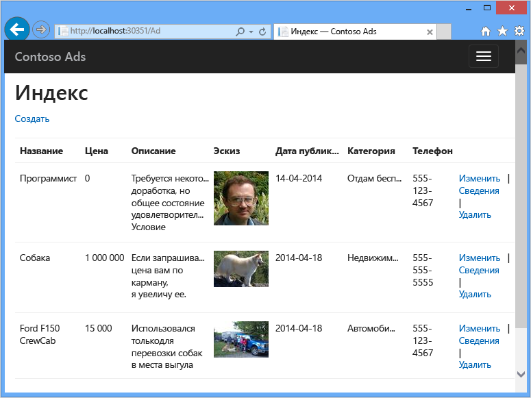

Можно [загрузить проект Visual Studio][download] из галереи кода MSDN.

[download]: http://code.msdn.microsoft.com/Simple-Azure-Website-with-b4391eeb

## Предварительные требования

В учебнике предполагается, что вы знаете, как работать с проектами [ASP.NET MVC](http://www.asp.net/mvc/tutorials/mvc-5/introduction/getting-started) или [веб-форм](http://www.asp.net/web-forms/tutorials/aspnet-45/getting-started-with-aspnet-45-web-forms/introduction-and-overview) в Visual Studio. Пример приложения использует MVC, но многое в руководство также применимо к веб-формам.

Инструкции в учебнике применимы к следующим продуктам:

* Visual Studio 2013
* Visual Studio 2013 Community.
* Visual Studio 2013 Express для Web

Если у вас нет одного из них, Visual Studio 2013 Express for Web установится автоматически, когда будет установлен Azure SDK.

[AZURE.INCLUDE [free-trial-note](../../includes/free-trial-note.md)]

>[AZURE.NOTE] Если вы хотите приступить к работе со службой приложений Azure до создания учетной записи Azure, перейдите к разделу [Пробное использование службы приложений](http://go.microsoft.com/fwlink/?LinkId=523751), где вы можете быстро создать кратковременное веб-приложение начального уровня в службе приложений. Никаких кредитных карт и обязательств.

## Содержание обучения

В учебнике показано, как выполнять следующие задачи.

* Подготовка компьютера к разработке для Azure путем установки пакета Azure SDK.
* Создание проекта приложения консоли, который автоматически развертывается как веб-задание Azure при развертывании связанного веб-проекта.
* Локальное тестирование внутреннего сервера SDK веб-заданий на компьютере разработки.
* Публикация приложения с помощью внутреннего сервера веб-заданий в веб-приложение в службе приложений.
* Отправка файлов и сохранение их в службе больших двоичных объектов Azure.
* Использование пакета SDK веб-заданий Azure для работы с очередями и большими двоичными объектами хранилища Azure.

## Архитектура приложения

Пример приложения использует [рабочий шаблон на основе очередей](http://www.asp.net/aspnet/overview/developing-apps-with-windows-azure/building-real-world-cloud-apps-with-windows-azure/queue-centric-work-pattern) для разгрузки процессора от задач создания эскизов для обработки внутреннего сервера

Приложение хранит рекламу в базе данных SQL, используя Entity Framework Code First для создания таблиц и доступа к данным. Для каждого рекламного объявления база данных хранит два URL-адреса: один для полноразмерного изображения, другой для эскиза.

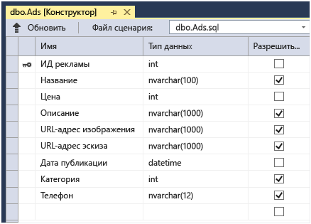

Когда пользователь отправляет изображение, внешний сервер веб-приложения сохраняет его в [большой двоичный объект Azure](http://www.asp.net/aspnet/overview/developing-apps-with-windows-azure/building-real-world-cloud-apps-with-windows-azure/unstructured-blob-storage), а информацию о рекламе — в базу данных с URL-адресом, который указывает на большой двоичный объект. В это же время оно записывает сообщение в очередь Azure. Обработка внутреннего сервера, запущенная как веб-задание Azure, использует пакет SDK веб-заданий, чтобы опросить очередь на предмет новых сообщений. Когда появляется новое сообщение, веб-задание создает эскиз для изображения и обновляет поле базы данных с URL-адресом эскиза для этой рекламы. Вот диаграмма, которая показывает, как взаимодействуют части приложения:

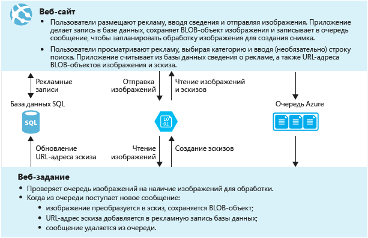

### Альтернативная архитектура

Веб-задания запускаются в контексте веб-приложения и не масштабируются отдельно. Например, если у вас есть один экземпляр веб-приложения Standard, вы можете запустить только один экземпляр внутренней обработки и он будет использовать некоторые ресурсы сервера (ЦП, память и т. д.), которые в противном случае были бы доступны для обработки веб-содержимого.

Если трафик зависит от времени дня или дня недели и если необходимую обработку внутреннего сервера можно запустить позже, запланируйте запуск веб-заданий на период, когда трафик мало используется. Если загрузка для этого решения все еще слишком высока, можно рассмотреть другие среды для программы внутреннего сервера, например, следующие.

* Запустите программу как веб-задание в отдельном веб-приложении, предназначенном для этого. Затем можно масштабировать веб-приложение внутреннего сервера отдельно от веб-приложения внешнего сервера.
* Запустите программу в рабочей роли облачной службы Azure. При выборе этого параметра можно запустить внешний сервер в веб-роли облачной службы или в веб-приложении.

В этом учебнике показано, как запустить внешний сервер в веб-приложении и внутренний сервер как веб-задание в том же веб-приложении. Информацию о том, как выбрать оптимальную среду для вашего сценария, см. в разделе [Сравнение веб-приложений, облачных служб и виртуальных машин Azure](../choose-web-site-cloud-service-vm/).

[AZURE.INCLUDE [install-sdk-2013-only](../../includes/install-sdk-2013-only.md)]

Инструкции учебника касаются пакета SDK Azure для .NET 2.5.1 или более поздней версии. В разделе создания с нуля, где создается проект веб-заданий, пакеты SDK веб-заданий автоматически включены в проект. В более ранних версиях пакета SDK пакеты нужно устанавливать вручную.

## Создание учетной записи хранения Azure

Учетная запись хранилища Azure обеспечивает ресурсы для хранения данных очередей и больших двоичных объектов в облаке. Она также используется пакетом SDK веб-заданий для хранения данных журналов для панели мониторинга.

В реальном приложении обычно создают отдельные учетные записи для данных приложения и данных журналов, а также отдельные учетные записи для тестовых данных и рабочих данных. В этом учебнике будет использоваться одна запись.

1. Откройте окно **Обозреватель серверов** в Visual Studio.

2. Щелкните правой кнопкой мыши узел **Azure**, а затем нажмите **Подключиться к Microsoft Azure**. 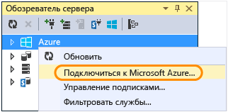

3. Выполните вход с использованием учетных данных Azure.

5. Щелкните правой кнопкой мыши **Хранилище** в узле Azure и выберите пункт **Создать учетную запись хранения**.
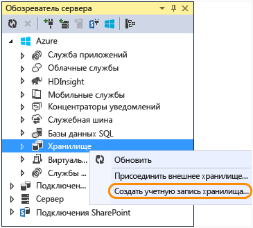

3. В диалоговом окне **Создание учетной записи хранения** введите имя для учетной записи хранения.

	Имя должно быть уникальным (не допускается существование учетных записей хранения Azure с одинаковыми именами). Если введенное имя уже используется, вы получите возможность изменить его.

	URL-адрес для доступа к вашей учетной записи хранения будет выглядеть следующим образом: *{имя}*.core.windows.net.

5. В раскрывающемся списке **Регион или территориальная группа** укажите ближайший к вам регион.

	Этот параметр указывает, в каком центре обработки данных Azure будет размещаться учетная запись хранения. Теоретически этот выбор не имеет большого значения. Но для рабочего веб-приложения веб-сервер и учетная запись хранения должны находиться в одном регионе, чтобы свести к минимуму задержку и стоимость исходящих данных. Веб-приложение (которое будет создано позже) должно находиться как можно ближе к браузерам, получившим доступ к нему, чтобы свести к минимуму задержку.

6. В раскрывающемся списке **Репликация ** установите значение **Локально избыточное**.

	При включении георепликации для учетной записи хранения хранящиеся данные реплицируются в дополнительный центр обработки данных для обеспечения возможности отработки отказа в это расположение в случае крупной аварии в основном расположении. Георепликация может потребовать дополнительных затрат. Для учетных записей тестирования и разработки оплачивать георепликацию обычно не требуется. Дополнительные сведения см. в разделе [Создание, удаление учетной записи хранения или управление ей](../storage-create-storage-account/#replication-options).

5. Щелкните **Создать**.

	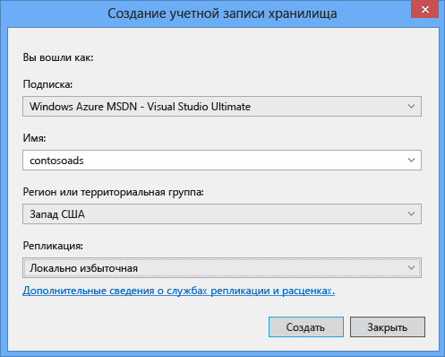

## Загрузка приложения

1. Загрузите и распакуйте [готовое решение][download].

2. Запустите Visual Studio.

3. В меню **Файл** нажмите кнопку **Открыть** > **Проект/решение**, перейдите к скачанному решению и откройте файл решения.

4. Чтобы построить решение, нажмите CTRL+SHIFT+B.

	По умолчанию Visual Studio автоматически запускает содержимое пакета NuGet, которое не включено в файл *.zip* Если пакеты не восстановлены, установите их вручную, перейдя к диалогу **Управление пакетами для NuGet решения** и нажав кнопку **Восстановить** вверху справа.

5. В **обозревателе решений** убедитесь, что в качестве запускаемого проекта выбран **ContosoAdsWeb**.

## Настройка приложения для использования учетной записи хранения

1. Откройте файл приложения *Web.config* в проекте ContosoAdsWeb.

	Файл содержит строку подключения SQL и строку подключения хранилища Azure для работы с большими двоичными объектами и очередями.

	Строка подключения SQL указывает на базу данных [SQL Server Express LocalDB](http://msdn.microsoft.com/library/hh510202.aspx).

	В примере строки подключения к хранилищу использованы заполнители для имени учетной записи хранения и ключа доступа. Замените это строкой подключения, которая содержит имя и ключ для вашей учетной записи хранения.

	<pre class="prettyprint">&lt;connectionStrings>
  &lt;add name="ContosoAdsContext" connectionString="Data Source=(localdb)\v11.0; Initial Catalog=ContosoAds; Integrated Security=True; MultipleActiveResultSets=True;" providerName="System.Data.SqlClient" />
  &lt;add name="AzureWebJobsStorage" connectionString="DefaultEndpointsProtocol=https;AccountName=<mark>[accountname]</mark>;AccountKey=<mark>[accesskey]</mark>"/>
&lt;/connectionStrings></pre>Строка подключения хранилища называется AzureWebJobsStorage, поскольку пакет SDK веб-заданий использует это имя по умолчанию. Здесь используется то же имя, поэтому вам нужно задать только одно значение строки подключения в среде Azure.

2. В **обозревателе серверов** щелкните правой кнопкой мыши учетную запись хранения в узле **Хранилище** и щелкните **Свойства**.

	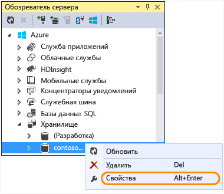

3. В окне **Свойства** щелкните **Ключи учетной записи хранения** и нажмите кнопку с многоточием.

	

4. Скопируйте **строку подключения**.

	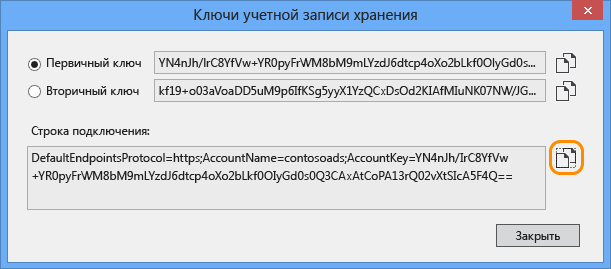

5. Замените строку подключения к хранилищу в файле *Web.config* на скопированную строку подключения. Перед вставкой убедитесь, что выбраны все элементы внутри кавычек, но не сами кавычки.

6. Откройте файл *App.config* в проекте ContosoAdsWebJob.

	Этот файл содержит две строки подключения хранилища: одну для данных приложения, а другую для ведения журнала. В этом учебнике будет использоваться одна учетная запись. В строках подключения есть заполнители для ключей учетной записи хранения. 
  	<pre class="prettyprint">&lt;configuration&gt;
    &lt;connectionStrings&gt;
        &lt;add name="AzureWebJobsDashboard" connectionString="DefaultEndpointsProtocol=https;AccountName=<mark>[accountname]</mark>;AccountKey=<mark>[accesskey]</mark>"/&gt;
        &lt;add name="AzureWebJobsStorage" connectionString="DefaultEndpointsProtocol=https;AccountName=<mark>[accountname]</mark>;AccountKey=<mark>[accesskey]</mark>"/&gt;
        &lt;add name="ContosoAdsContext" connectionString="Data Source=(localdb)\v11.0; Initial Catalog=ContosoAds; Integrated Security=True; MultipleActiveResultSets=True;"/&gt;
    &lt;/connectionStrings&gt;
        &lt;startup&gt; 
            &lt;supportedRuntime version="v4.0" sku=".NETFramework,Version=v4.5" /&gt;
    &lt;/startup&gt;
&lt;/configuration&gt;</pre>

	По умолчанию пакет SDK веб-заданий ищет строки подключения с именами AzureWebJobsStorage и AzureWebJobsDashboard. В качестве альтернативы можно [сохранить строку подключения любым способом и передать ее явно в объект `JobHost`](websites-dotnet-webjobs-sdk-storage-queues-how-to.md#config).

7. Замените обе строки подключения к хранилищу скопированной ранее строкой подключения.

8. Сохраните изменения.

## Локальный запуск приложения

1. Чтобы запустить внешний сервер приложения, нажмите клавиши CTRL + F5.

	Откроется домашняя страница браузера по умолчанию. (Запускается веб-проект, поскольку он стал запускаемым проектом.)

	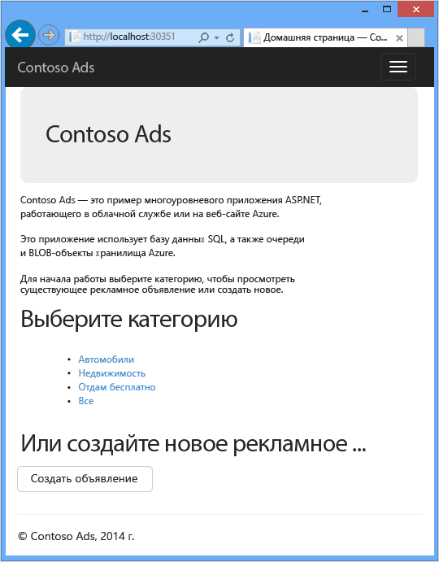

2. Чтобы запустить внутренний сервер веб-задания приложения, щелкните правой кнопкой мыши проект ContosoAdsWebJob в **обозревателе решений** и нажмите **Отладка** > **Запустить новый экземпляр**.

	Окно консоли приложения открывает и отображает сообщение для ведения журнала, указывающее начало выполнения объекта JobHost из веб-заданий SDK.

	

3. В браузере щелкните кнопку **Создать рекламу**.

4. Введите тестовые данные, выберите изображение и нажмите кнопку **Create**.

	

	Приложение переходит к странице индексации, но не показывает эскиз для новой рекламы, поскольку индексирование еще не проводилось.

	В то же время после короткого ожидания в окне приложения консоли отобразится сообщение журнала, что сообщение очереди было получено и обработано.

	

5. После того, как вы увидите сообщения журнала в окне приложения консоли, обновите страницу индексов, чтобы увидеть эскиз.

	

6. Щелкните **Details**, чтобы увидеть рекламу в полный размер.

	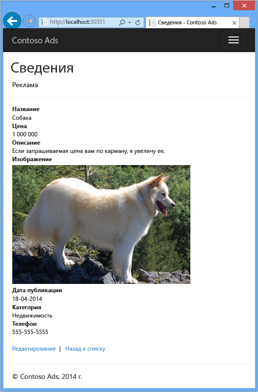

Вы запустили приложение на локальном компьютере, и оно использует базу данных SQL Server, расположенную на компьютере, но она работает с очередями и большими двоичными объектами в облаке. В следующем разделе вы запустите приложение в облаке с помощью облачной базы данных, а также облачных больших двоичных объектов и очередей.

## Запуск приложения в облаке

Чтобы запустить приложение в облаке, выполните следующие действия:

* Развертывание веб-приложений. Visual Studio автоматически создаст новое веб-приложение в службе приложений Azure и экземпляр базы данных SQL.
* Настройка веб-приложения для использования базы данных SQL Azure и учетной записи хранения.

После создания рекламы во время работы в облаке вы просмотрите панель мониторинга SDK веб-заданий, чтобы увидеть предлагаемые обширные функции мониторинга.

### Развертывание веб-приложений

1. Закройте браузер и окно приложения консоли.

2. В **обозревателе решений** щелкните правой кнопкой мыши проект ContosoAdsWeb и нажмите **Опубликовать**.

3. В шаге **Профиль** мастера **публикации в Интернете** щелкните **Веб-приложения Microsoft Azure**.

	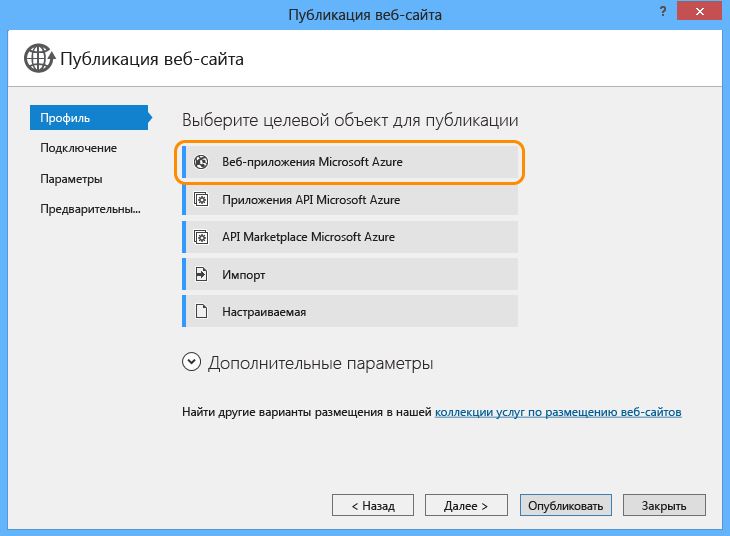

4. В поле **Выбор существующего веб-приложения** нажмите кнопку **Войти** и введите учетные данные, если вы еще не вошли в систему.

5. После того как вы выполните вход, нажмите кнопку **Создать**.

	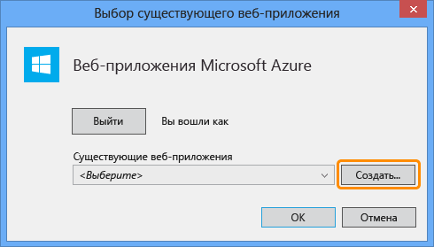

6. В диалоговом окне **Создание сайта в Microsoft Azure** введите уникальное имя в поле **Имя веб-приложения**.

	Полный URL-адрес будет состоять из того, что вы укажете здесь, плюс ".azurewebsites.net" (как показано в текстовом поле **Имя веб-приложения**). Например, если имя веб-приложения — ContosoAds, URL-адрес будет ContosoAds.azurewebsites.net.

7. В раскрывающемся списке [План службы приложений](../app-service/azure-web-sites-web-hosting-plans-in-depth-overview.md) выберите пункт **Создать новый план службы приложений**. Введите имя для плана службы приложений, например ContosoAdsPlan.

8. В раскрывающемся списке [Группа ресурсов](../resource-group-overview.md) выберите пункт **Создать новую группу ресурсов**.

9. Введите имя для группы ресурсов, например ContosoAdsGroup.

10. В раскрывающемся списке **Регион** выберите тот же регион, который выбрали для учетной записи хранения.

	Этот параметр указывает, в каком центре обработки данных Azure будет выполняться ваше веб-приложение. Размещение веб-приложения и учетной записи хранения в одном центре обработки данных сводит к минимуму задержки и расходы на исходящие данные.

11. В раскрывающемся списке **Сервер базы данных** нажмите кнопку **Создать сервер**.

12. Введите имя сервера базы данных, например ContosoAdsServer.

	Если в подписке уже есть сервер, можно выбрать его в раскрывающемся списке.

12. Введите **Имя пользователя базы данных** и **Пароль базы данных** администратора.

	Если выбрано действие **Создать сервер базы данных SQL**, не используйте здесь существующие имя и пароль, введите новые, которые в дальнейшем будут использоваться при обращении к базе данных. Если выбран созданный ранее сервер, появится запрос на ввод пароля для ранее созданной административной учетной записи.

13. Щелкните **Создать**.

	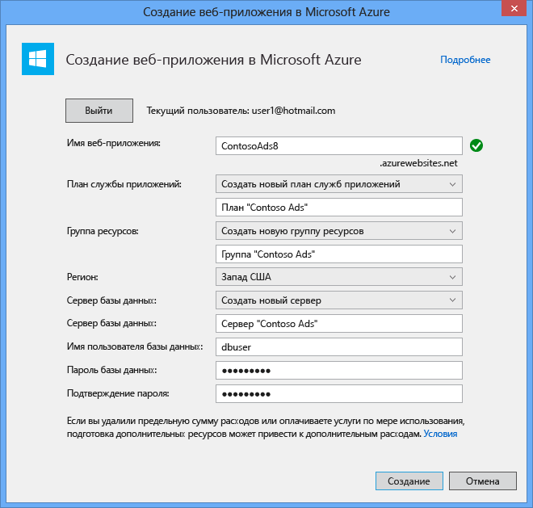

	Visual Studio создает решение, веб-проект, веб-приложение в Azure и экземпляр базы данных SQL Azure.

14. В шаге **Подключение** мастера **веб-публикации** нажмите кнопку **Далее**.

	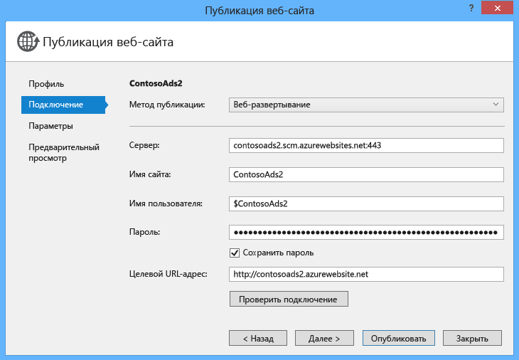

15. В шаге **Параметры** снимите флажок **Использовать эту строку подключения в среде выполнения** и нажмите кнопку **Далее**.

	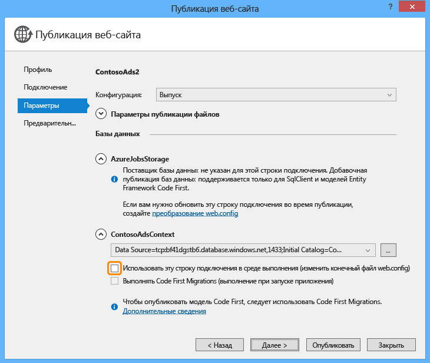

	Не нужно использовать диалоговое окно "Публикация", чтобы задать строку подключения SQL, поскольку это значение будет указано в среде Azure позже.

	Вы можете проигнорировать предупреждения на этой странице.

	* Обычно учетная запись хранения, используемая при запуске Azure, отличается от той, которая используется при локальном запуске, но в этом учебнике для обеих сред используется одна учетная запись. Поэтому не требуется изменять строку подключения AzureWebJobsStorage. Даже если бы вы хотели использовать в облаке другую учетную запись хранения, строку подключения изменять бы не пришлось, поскольку при запуске в Azure приложение будет использовать параметры среды Azure. Это будет показано позже в данном учебнике.

	* В этом учебнике не будут вноситься изменения в модель данных, использованную для базы данных ContosoAdsContext, поэтому для развертывания не нужно использовать Entity Framework Code First Migrations. Code First автоматически создает новую базу данных при первой попытке приложения получить доступ к данным SQL.

	Для этого учебника подойдут значения по умолчанию в разделе **Параметры публикации файлов**.

16. В шаге **Предварительный просмотр** нажмите кнопку **Начать предварительный просмотр**.

	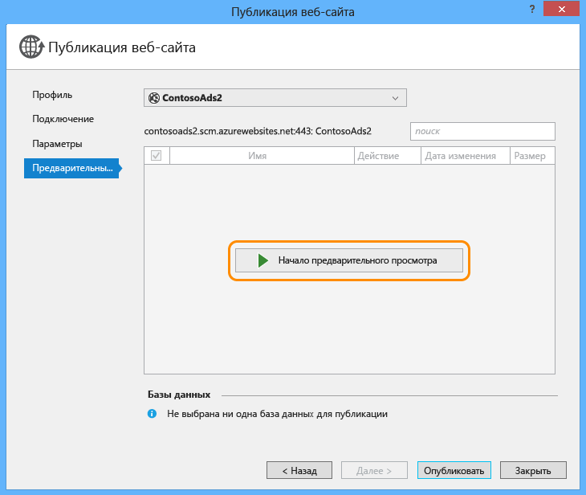

	Вы можете проигнорировать предупреждение об отсутствии баз данных для публикации. Entity Framework Code First создаст базу данных; ее не нужно публиковать.

	В окне предварительного просмотра будет показано, что двоичные файлы и файлы конфигурации проекта веб-задания будут скопированы в каталог *app\_data\\jobs\\continuous* веб-приложения.

	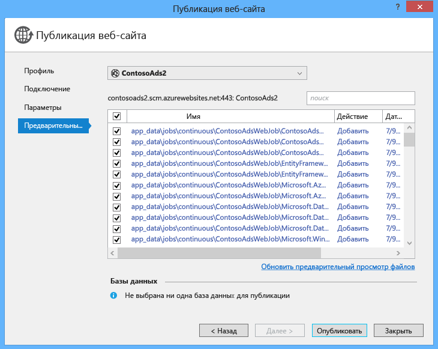

17. Щелкните **Опубликовать**.

	Visual Studio развертывает приложение и открывает URL-адрес домашней страницы в браузере.

	Вы не сможете использовать веб-приложение, пока не зададите строки подключения в среде Azure в следующем разделе. Появится страница ошибки или домашняя страница в зависимости от выбранных ранее параметров создания веб-приложения и базы данных.

### Настройка веб-приложения для использования базы данных SQL Azure и учетной записи хранения.

В целях безопасности рекомендуется [не указывать конфиденциальную информацию, такую как строки подключения, в файлах, которые хранятся в репозиториях исходного кода](http://www.asp.net/aspnet/overview/developing-apps-with-windows-azure/building-real-world-cloud-apps-with-windows-azure/source-control#secrets). Это можно сделать с помощью Azure: вы можете задать строку подключения и другие значения параметров в среде Azure, и API конфигурации ASP.NET автоматически выберут эти значения при запуске приложения в Azure. Вы можете задать эти значения в Azure с помощью **обозревателя сервера**, портала, Windows PowerShell или кроссплатформенного интерфейса командной строки. Дополнительные сведения см. в статье [Как работают строки приложения и строки подключения](/blog/2013/07/17/windows-azure-web-sites-how-application-strings-and-connection-strings-work/).

В этом разделе вы сможете задать значения строк подключения в Azure с помощью **обозревателя сервера**.

7. В **обозревателе сервера** щелкните правой кнопкой мыши свое веб-приложение в узле **Веб-приложения**, а затем щелкните **Просмотреть параметры**.

	Окно **Веб-приложение Azure** откроется на вкладке **Конфигурация**.

9. Измените имя строки подключения DefaultConnection на ContosoAdsContext.

	Служба Azure автоматически создала эту строку подключения, когда вы создали веб-приложение со связанной базой данных, поэтому она автоматически содержит правильное значение строки подключения. Нужно только изменить имя на искомый код.

9. Добавьте две новые строки подключения с именами AzureWebJobsStorage и AzureWebJobsDashboard. Задайте тип "Пользовательская" и укажите для строки подключения то же значение, которое использовалось ранее для файлов *Web.config* и *App.config*. (Убедитесь, что включили всю строку подключения без кавычек, а не только ключ доступа.)

	Эти строки подключения используются пакетом SDK веб-заданий: одна для данных приложения, а другая для ведения журнала. Как было показано ранее, строка подключения для данных приложения также используется кодом внешнего сервера.

9. Щелкните **Сохранить**.

	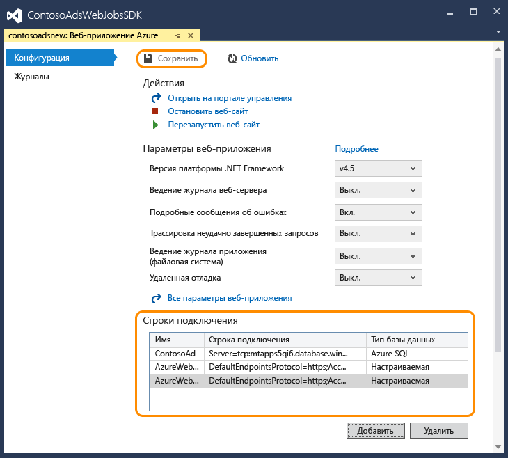

10. В **обозревателе сервера** щелкните правой кнопкой мыши веб-приложение, а затем нажмите кнопку **Остановить веб-приложение**.

12. После остановки веб-приложения снова щелкните его правой кнопкой мыши, а затем нажмите кнопку **Запустить веб-приложение**.

	Веб-задание запустится автоматически при публикации, но остановится при внесении изменений в конфигурацию. Его можно запустить повторно, перезапустив веб-приложение или веб-задание на [портале Azure](http://go.microsoft.com/fwlink/?LinkId=529715). Обычно рекомендуется перезапускать веб-приложение после изменения конфигурации.

9. Обновите окно браузера, которое содержит URL-адрес веб-приложения в адресной строке.

	Появится домашняя страница.

10. Создайте рекламу, как вы делали это при локальном запуске приложения.

	Сначала появится страница индексов без эскизов.

11.	Через несколько секунд обновите страницу, чтобы появился эскиз.

	Если эскиз не появляется, возможно, веб-задание не запустилось автоматически. В этом случае перейдите на вкладку "Веб-задания" в

### Просмотр панели мониторинга SDK веб-заданий

1. На [портале Azure](https://manage.windowsazure.com) выберите свое веб-приложение.

2. Перейдите на вкладку **Веб-задания**.

3. Щелкните URL-адрес в столбце «Журналы» для своего веб-задания.

	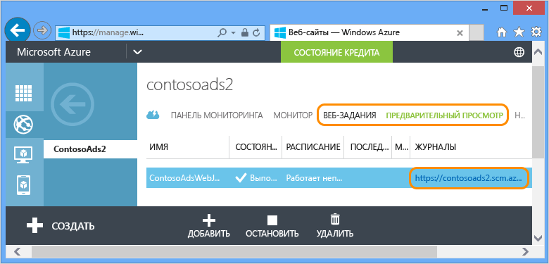

	На панели мониторинга SDK веб-заданий откроется новая вкладка браузера. На панели мониторинга отобразится, что веб-задание запущено, и появится список функций в коде, активированных пакетом SDK веб-заданий.

4. Щелкните одну из функций, чтобы получить сведения о ее выполнении.

	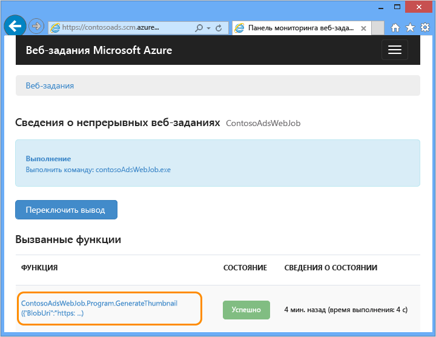

	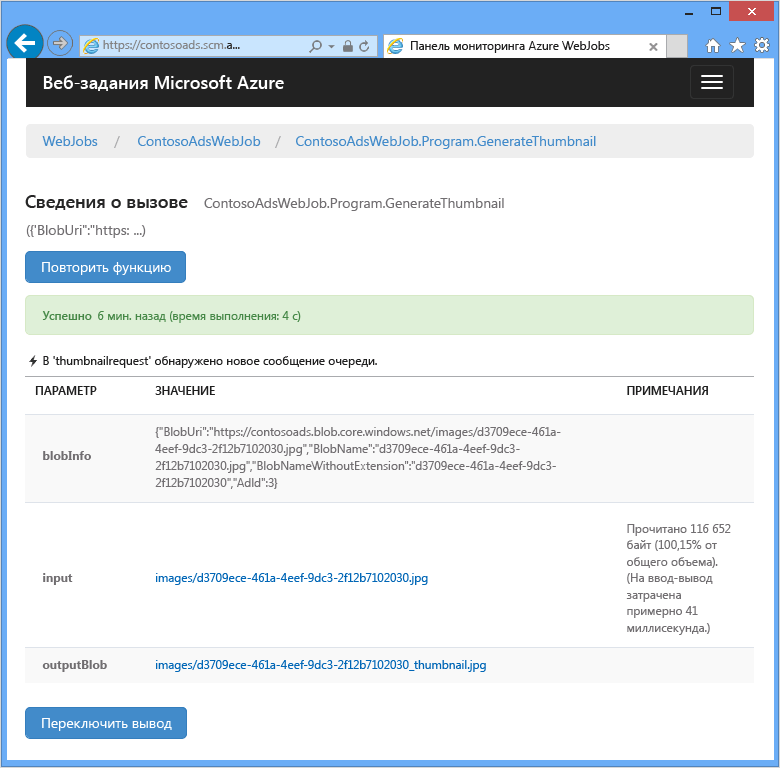

	Кнопка **Повторить функцию** на этой странице позволяет платформе SDK веб-заданий повторно вызывать функцию и дает возможность изменить данные, изначально переданные в функцию.

>[AZURE.NOTE] По завершении тестирования удалите веб-приложение и экземпляр базы данных SQL. Веб-приложение бесплатно, но за экземпляр базы данных SQL и учетную запись хранения взимается плата (минимальная из-за мелкого размера). Также, если оставить веб-приложение работающим, любой, кто найдет этот URL-адрес, сможет создать и просмотреть рекламу. На портале Azure перейдите на вкладку **Панель мониторинга** для веб-приложения и нажмите кнопку **Удалить** внизу страницы. Затем можно установить флажок, чтобы удалить экземпляр базы данных SQL. Если необходимо временно предотвратить доступ посторонних к веб-приложению, щелкните **Остановить**. В этом случае плата за базы данных SQL и учетную запись хранения продолжит взиматься. Можно повторить эту же процедуру для удаления базы данных SQL и учетной записи хранилища, если они больше не нужны.

### Включите функцию AlwaysOn для длительных рабочих процессов

Чтобы веб-задания всегда выполнялись и работали на всех экземплярах веб-приложения, необходимо включить функцию [AlwaysOn](http://weblogs.asp.net/scottgu/archive/2014/01/16/windows-azure-staging-publishing-support-for-web-sites-monitoring-improvements-hyper-v-recovery-manager-ga-and-pci-compliance.aspx).

## Создание приложения с самого начала

В этом разделе предстоит выполнить следующие задачи:

* Создание решения Visual Studio с веб-проектом.
* Добавление проекта библиотеки класса для уровня доступа данных, который совместно используется внешним и внутренним сервером.
* Добавление проекта приложения консоли для внутреннего сервера с включенным развертыванием веб-заданий.
* Добавление пакетов NuGet.
* Указание ссылок на проекты.
* Копирование кода приложения и файлов конфигурации из скачанного приложения, с которым вы работали в предыдущем разделе учебника.
* Просмотр фрагментов кода, которые работают с большими двоичными объектами и очередями Azure и пакетом SDK веб-заданий.

### Создание решения Visual Studio с веб-проектом и проектом библиотеки класса

1. В Visual Studio нажмите кнопку **Создать** > **Проект** в меню **Файл**.

2. В диалоговом окне **Новый проект** щелкните **Visual C#** > **Веб-приложение** > **Веб-приложение ASP.NET**.

3. Назовите проект "ContosoAdsWeb", назовите решение "ContosoAdsWebJobsSDK" (измените имя решения, если планируете поместить его в ту же папку, что и скачанное решение), а затем нажмите кнопку **ОК**.

	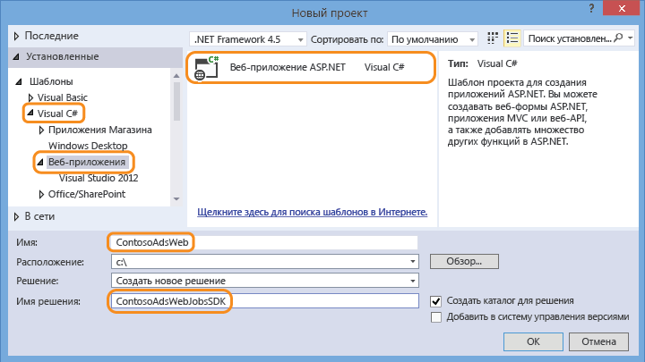

5. В диалоговом окне **Новый проект ASP.NET** выберите шаблон MVC и снимите флажок **Размещение в облаке** в **Microsoft Azure**.

	Параметр **Размещение в облаке** позволяет Visual Studio автоматически создать веб-приложение Azure и базу данных SQL. Поскольку вы уже создали их ранее, это не нужно делать при создании проекта. Если нужно создать новые, установите флажок. После этого можно настроить новое веб-приложение и базу данных SQL так же, как вы делали ранее при развертывании приложения.

5. Щелкните **Изменить проверку подлинности**.

	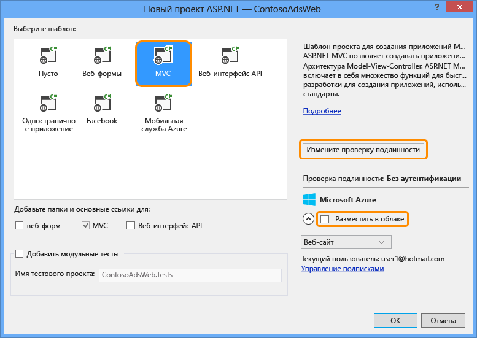

7. В диалоговом окне **Изменение проверки подлинности** щелкните **Без проверки подлинности** и нажмите кнопку **ОК**.

	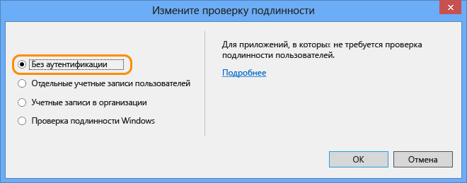

8. В диалоговом окне **Новый проект ASP.NET** нажмите кнопку **ОК**.

	Visual Studio создаст решение и веб-проект.

9. в **обозревателе решений** щелкните правой кнопкой мыши решение (а не проект) и выберите **Добавить** > **Новый проект**.

11. В диалоговом окне **Добавление нового проекта** выберите шаблон **Visual C#** > **Классические приложения Windows** > **Библиотека классов**.

10. Присвойте проекту имя *ContosoAdsCommon* и нажмите кнопку **ОК**.

	Этот проект будет содержать контекст и модель данных Entity Framework, которые будут использовать внешний и внутренний сервер. Как вариант, можно определить связанные с EF классы в веб-проекте и сослаться на этот проект из проекта веб-задания. Но тогда проект веб-задания будет содержать ссылку на веб-сборки, которые ему не нужны.

### Добавление проекта приложения консоли, в котором включено развертывание веб-заданий

1. Щелкните правой кнопкой мыши проект (а не решение или проект библиотеки классов) и нажмите кнопку **Добавить** > **Новый проект веб-задания Azure**.

	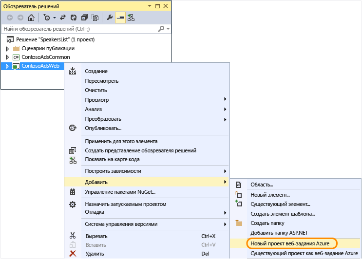

2. В диалоговом окне **Добавление веб-задания Azure** введите ContosoAdsWebJob в поля **Имя проекта** и **Имя веб-задания**. Оставьте в поле **Режим запуска веб-задания** значение **Запускать постоянно**.

3.  Нажмите кнопку **ОК**.

	Visual Studio создает приложение консоли, которое настроено для развертывания в качестве веб-задания при каждом развертывании веб-проекта. Для этого после создания проекта выполняются следующие задачи.

	* Добавляется файл *webjob-publish-settings.json* в папку "Свойства" проекта веб-задания.
	* Добавляется файл *webjobs-list.json* в папку "Свойства" веб-проекта.
	* Устанавливается пакет NuGet Microsoft.Web.WebJobs.Publish в проект веб-задания.

	Дополнительные сведения об этих изменениях см. в разделе [Развертывание веб-заданий с помощью Visual Studio](websites-dotnet-deploy-webjobs.md).

### Добавление пакетов NuGet

Шаблон нового проекта для проекта веб-задания автоматически устанавливает пакет веб-заданий SDK NuGet [Microsoft.Azure.WebJobs](http://www.nuget.org/packages/Microsoft.Azure.WebJobs) и зависимости.

Одна из зависимостей пакета SDK веб-заданий, которая автоматически устанавливается в проекте веб-задания, это клиентская библиотека хранилища Azure (SCL). Однако, чтобы она работала с BLOB-объектами и очередями, вам необходимо добавить ее в веб-проект.

1. Откройте диалоговое окно **Управление пакетами NuGet** для решения.

2. В левой области выберите **Установленные пакеты**.

3. Найдите пакет *Хранилище Azure* и щелкните кнопку **Управление**.

4. В поле **Выберите проекты** установите флажок **ContosoAdsWeb** и нажмите кнопку **ОК**.

	Все три проекта используют Entity Framework для работы с данными в базе данных SQL.

5. В левой области щелкните **В сети**.

6. Найдите пакет NuGet *EntityFramework* и установите его во все проекты.

### Установите ссылки проекта

Веб-проекты и проекты веб-заданий работают с базой данных SQL, поэтому и для тех, и для других необходима ссылка на проект ContosoAdsCommon.

1. Задайте в проекте ContosoAdsWeb ссылку на проект ContosoAdsCommon. (Щелкните правой кнопкой мыши проект ContosoAdsWeb и нажмите кнопку **Добавить** > **Ссылка**. В диалоговом окне **Диспетчер ссылок** выберите **Решение** > **Проекты** > **ContosoAdsCommon** и нажмите кнопку **ОК**.)

1. Задайте в проекте ContosoAdsWebJob ссылку на проект ContosoAdsCommon.

	Для проекта веб-задания нужны ссылки для работы с изображениями и для доступа к строкам подключения.

3. Задайте в проекте ContosoAdsWebJob ссылку на `System.Drawing` и `System.Configuration`.

### Добавление кода и файлов конфигурации

В этом учебнике не представлены следующие пошаговые инструкции: [Создание контроллеров и представлений MVC с помощью формирования шаблонов](http://www.asp.net/mvc/tutorials/mvc-5/introduction/getting-started), [Запись кода Entity Framework, который работает с базами данных SQL Server](http://www.asp.net/mvc/tutorials/getting-started-with-ef-using-mvc) или [Основы асинхронного программирования в ASP.NET 4.5](http://www.asp.net/aspnet/overview/developing-apps-with-windows-azure/building-real-world-cloud-apps-with-windows-azure/web-development-best-practices#async). Поэтому все, что нужно сделать, — скопировать код и файлы конфигурации из скачанного решения в новое. После этого в следующих разделах будут показаны и объяснены основные фрагменты кода.

Чтобы добавить файлы в проект или папку, щелкните правой кнопкой мыши проект или папку и нажмите **Добавить** > **Существующий элемент**. Выберите необходимые файлы и щелкните **Добавить**. При запросе о том, заменять ли существующие файлы, щелкните **Да**.

1. В проекте ContosoAdsCommon удалите файл *Class1.cs* и добавьте на его место следующие файлы из скачанного проекта.

	- *Ad.cs*
	- *ContosoAdscontext.cs*
	- *BlobInformation.cs*  

2. В проекте ContosoAdsCommon добавьте следующие файлы из загруженного проекта.

	- *Web.config*
	- *Global.asax.cs*  
	- В папку *Controllers*: *AdController.cs* 
	- В папку *Views\Shared*: файл *_Layout.cshtml*.
	- В папку *Views\Home*: файл *Index.cshtml*. 
	- В папку *Views\Ad* (сначала создайте эту папку): пять файлов *.cshtml*.  

3. В проекте ContosoAdsWebJob добавьте следующие файлы из скачанного проекта.

	- *App.config* (измените фильтр типов файлов на **Все файлы**)
	- *Program.cs*
	- *Functions.cs*

Теперь вы можете создать, запустить и развернуть приложение, как показано ранее в этом учебнике. Однако перед этим остановите веб-задание, которое все еще выполняется в первом веб-приложении, на котором произведено развертывание. В противном случае такое веб-задание обработает сообщения очереди, созданные локально или запущенные приложением в новом веб-приложении, поскольку все они используют одну учетную запись хранения.

## Просмотр кода приложения

В следующих разделах объясняется код, связанный с работой с пакетом SDK веб-заданий и большими двоичными объектами и очередями Azure.

> [AZURE.NOTE] Код, характерный для пакета SDK веб-заданий, см. в разделе [Program.cs и Functions.cs](#programcs).

### ContosoAdsCommon - Ad.cs

Файл Ad.cs определяет перечисляемый тип для класса Ad и класс сущностей POCO для информации в рекламе.

		public enum Category
		{
		    Cars,
		    [Display(Name="Real Estate")]
		    RealEstate,
		    [Display(Name = "Free Stuff")]
		    FreeStuff
		}

		public class Ad
		{
		    public int AdId { get; set; }

		    [StringLength(100)]
		    public string Title { get; set; }

		    public int Price { get; set; }

		    [StringLength(1000)]
		    [DataType(DataType.MultilineText)]
		    public string Description { get; set; }

		    [StringLength(1000)]
		    [DisplayName("Full-size Image")]
		    public string ImageURL { get; set; }

		    [StringLength(1000)]
		    [DisplayName("Thumbnail")]
		    public string ThumbnailURL { get; set; }

		    [DataType(DataType.Date)]
		    [DisplayFormat(DataFormatString = "{0:yyyy-MM-dd}", ApplyFormatInEditMode = true)]
		    public DateTime PostedDate { get; set; }

		    public Category? Category { get; set; }
		    [StringLength(12)]
		    public string Phone { get; set; }
		}

### ContosoAdsCommon - ContosoAdsContext.cs

Класс ContosoAdsContext указывает, что класс Ad используется коллекцией DbSet, которую Entity Framework хранит в базе данных SQL.

		public class ContosoAdsContext : DbContext
		{
		    public ContosoAdsContext() : base("name=ContosoAdsContext")
		    {
		    }
		    public ContosoAdsContext(string connString)
		        : base(connString)
		    {
		    }
		    public System.Data.Entity.DbSet<Ad> Ads { get; set; }
		}

Класс имеет два конструктора. Первый из них используется веб-проектом и указывает имя строки подключения, которая хранится в файле Web.config или в среде выполнения Azure. Второй конструктор дает возможность передачи действующей строки подключения. Это необходимо проекту веб-задания, поскольку он не имеет файла Web.config. Ранее было показано, где хранится строка подключения, а потом будет показано, как код извлекает строку подключения, когда он создает экземпляр класса DbContext.

### ContosoAdsCommon — BlobInformation.cs

Класс `BlobInformation` используется для хранения информации о BLOB-объекте изображения в сообщении очереди.

		public class BlobInformation
		{
		    public Uri BlobUri { get; set; }

		    public string BlobName
		    {
		        get
		        {
		            return BlobUri.Segments[BlobUri.Segments.Length - 1];
		        }
		    }
		    public string BlobNameWithoutExtension
		    {
		        get
		        {
		            return Path.GetFileNameWithoutExtension(BlobName);
		        }
		    }
		    public int AdId { get; set; }
		}

### ContosoAdsWeb - Global.asax.cs

Код, который вызывается из метода `Application_Start`, создает контейнер большого двоичного объекта *images* и очередь *images*, если они отсутствуют. Это гарантирует, что при каждом использовании новой учетной записи хранения необходимый контейнер больших двоичных объектов и очередь будут создаваться автоматически.

Код получает доступ к учетной записи хранения, используя строку подключения из файла *Web.config* или среду выполнения Azure.

		var storageAccount = CloudStorageAccount.Parse
		    (ConfigurationManager.ConnectionStrings["AzureWebJobsStorage"].ToString());

Затем он получает ссылку на контейнер больших двоичных объектов *images*, создает контейнер, если он еще не существует, и устанавливает разрешения доступа к новому контейнеру. По умолчанию новые контейнеры разрешают доступ к большим двоичным объектам только клиентам с учетными данными записи хранения. Веб-приложению требуются общедоступные большие двоичные объекты, чтобы оно могло выводить изображения с использованием URL-адресов, которые указывают на объекты изображений.

		var blobClient = storageAccount.CreateCloudBlobClient();
		var imagesBlobContainer = blobClient.GetContainerReference("images");
		if (imagesBlobContainer.CreateIfNotExists())
		{
		    imagesBlobContainer.SetPermissions(
		        new BlobContainerPermissions
		        {
		            PublicAccess = BlobContainerPublicAccessType.Blob
		        });
		}

Аналогичный код получает ссылку на очередь *blobnamerequest* и создает новую очередь В этом случае изменений разрешений не требуется. В разделе [ResolveBlobName](#resolveblobname) далее в этом учебнике объясняется, почему очередь, в которую выполняет запись веб-приложение, используется только для получения имен больших двоичных объектов, а не для создания эскизов.

		CloudQueueClient queueClient = storageAccount.CreateCloudQueueClient();
		var imagesQueue = queueClient.GetQueueReference("blobnamerequest");
		imagesQueue.CreateIfNotExists();

### ContosoAdsWeb — \_Layout.cshtml

Файл *\_Layout.cshtml* устанавливает имя приложения в заголовке и нижнем колонтитуле и создает запись меню "Ads".

### ContosoAdsWeb - Views\\Home\\Index.cshtml

Файл *Views\\Home\\Index.cshtml* выводит ссылки категорий на домашней странице. Ссылки передают целочисленное значение перечисляемого типа `Category` в переменную querystring на странице индекса Ads.

		<li>@Html.ActionLink("Cars", "Index", "Ad", new { category = (int)Category.Cars }, null)</li>
		<li>@Html.ActionLink("Real estate", "Index", "Ad", new { category = (int)Category.RealEstate }, null)</li>
		<li>@Html.ActionLink("Free stuff", "Index", "Ad", new { category = (int)Category.FreeStuff }, null)</li>
		<li>@Html.ActionLink("All", "Index", "Ad", null, null)</li>

### ContosoAdsWeb - AdController.cs

В файле *AdController.cs* конструктор вызывает метод `InitializeStorage` для создания объектов клиентской библиотеки хранилища Azure, которые предоставляют API-интерфейс для работы с большими двоичными объектами и очередями.

Затем код получает ссылку на контейнер больших двоичных объектов *images*, как показано ранее в *Global.asax.cs*. При этом он устанавливает [политику повторения](http://www.asp.net/aspnet/overview/developing-apps-with-windows-azure/building-real-world-cloud-apps-with-windows-azure/transient-fault-handling) по умолчанию, подходящую для веб-приложения. Политика повторения с экспоненциальной задержкой по умолчанию может застопорить веб-приложение более чем на минуту при повторяющихся повторах во время кратковременного сбоя. Политика повторения здесь указывает ожидание в 3 секунды после каждой попытки, всего до 3 повторений.

		var blobClient = storageAccount.CreateCloudBlobClient();
		blobClient.DefaultRequestOptions.RetryPolicy = new LinearRetry(TimeSpan.FromSeconds(3), 3);
		imagesBlobContainer = blobClient.GetContainerReference("images");

Аналогичный код получает ссылку на очередь *images*.

		CloudQueueClient queueClient = storageAccount.CreateCloudQueueClient();
		queueClient.DefaultRequestOptions.RetryPolicy = new LinearRetry(TimeSpan.FromSeconds(3), 3);
		imagesQueue = queueClient.GetQueueReference("blobnamerequest");

Большая часть кода контроллера обычна для работы с моделью данных Entity Framework с использованием класса DbContext. Исключением является метод `Create` HttpPost, который отправляет файл и сохраняет его в хранилище больших двоичных объектов. Связыватель модели предоставляет объект [HttpPostedFileBase](http://msdn.microsoft.com/library/system.web.httppostedfilebase.aspx) для метода.

		[HttpPost]
		[ValidateAntiForgeryToken]
		public async Task<ActionResult> Create(
		    [Bind(Include = "Title,Price,Description,Category,Phone")] Ad ad,
		    HttpPostedFileBase imageFile)

При выбора файла для отправки код отправляет его, сохраняет его в большом двоичном объекте и обновляет запись базы данных URL-адресом, который указывает на большой двоичный объект.

		if (imageFile != null && imageFile.ContentLength != 0)
		{
		    blob = await UploadAndSaveBlobAsync(imageFile);
		    ad.ImageURL = blob.Uri.ToString();
		}

Код отправки содержится в методе `UploadAndSaveBlobAsync`. Он создает имя GUID для большого двоичного объекта, отправляет и сохраняет файл, а также возвращает ссылку на сохраненный большой двоичный объект.

		private async Task<CloudBlockBlob> UploadAndSaveBlobAsync(HttpPostedFileBase imageFile)
		{
		    string blobName = Guid.NewGuid().ToString() + Path.GetExtension(imageFile.FileName);
		    CloudBlockBlob imageBlob = imagesBlobContainer.GetBlockBlobReference(blobName);
		    using (var fileStream = imageFile.InputStream)
		    {
		        await imageBlob.UploadFromStreamAsync(fileStream);
		    }
		    return imageBlob;
		}

После того как метод `Create` HttpPost отправит большой двоичный объект и обновит базу данных, он создаст сообщение в очереди для информирования фонового процесса о том, что изображение готово для конвертации в эскиз.

		BlobInformation blobInfo = new BlobInformation() { AdId = ad.AdId, BlobUri = new Uri(ad.ImageURL) };
		var queueMessage = new CloudQueueMessage(JsonConvert.SerializeObject(blobInfo));
		await thumbnailRequestQueue.AddMessageAsync(queueMessage);

Код для метода `Edit` HttpPost аналогичен, за одним исключением — если пользователь выбирает новый файл изображения, все большие двоичные объекты, которые уже существуют для этой рекламы, должны быть удалены.

		if (imageFile != null && imageFile.ContentLength != 0)
		{
		    await DeleteAdBlobsAsync(ad);
		    imageBlob = await UploadAndSaveBlobAsync(imageFile);
		    ad.ImageURL = imageBlob.Uri.ToString();
		}

Вот код, который удаляет большие двоичные объекты при удалении элемента рекламы:

		private async Task DeleteAdBlobsAsync(Ad ad)
		{
		    if (!string.IsNullOrWhiteSpace(ad.ImageURL))
		    {
		        Uri blobUri = new Uri(ad.ImageURL);
		        await DeleteAdBlobAsync(blobUri);
		    }
		    if (!string.IsNullOrWhiteSpace(ad.ThumbnailURL))
		    {
		        Uri blobUri = new Uri(ad.ThumbnailURL);
		        await DeleteAdBlobAsync(blobUri);
		    }
		}
		private static async Task DeleteAdBlobAsync(Uri blobUri)
		{
		    string blobName = blobUri.Segments[blobUri.Segments.Length - 1];
		    CloudBlockBlob blobToDelete = imagesBlobContainer.GetBlockBlobReference(blobName);
		    await blobToDelete.DeleteAsync();
		}

### ContosoAdsWeb - Views\\Ad\\Index.cshtml и Details.cshtml

Файл *Index.cshtml* выводит эскиз с другими данными рекламы:

		

Файл *Details.cshtml* выводит изображение в полном размере:

		

### ContosoAdsWeb - Views\\Ad\\Create.cshtml и Edit.cshtml

Файлы *Create.cshtml* и *Edit.cshtml* указывают кодирование формы, которое дает возможность контроллеру получить объект `HttpPostedFileBase`.

		@using (Html.BeginForm("Create", "Ad", FormMethod.Post, new { enctype = "multipart/form-data" }))

Элемент `<input>` сообщает браузеру, что нужно открыть диалоговое окно выбора файла.

		<input type="file" name="imageFile" accept="image/*" class="form-control fileupload" />

### ContosoAdsWebJob - Program.cs

При запуске веб-задания метод `Main` вызывает метод пакета `JobHost.RunAndBlock` SDK веб-заданий, чтобы начать выполнение инициированных функций в текущем потоке.

		static void Main(string[] args)
		{
		    JobHost host = new JobHost();
		    host.RunAndBlock();
		}

### ContosoAdsWebJob - Functions.cs - GenerateThumbnail

Пакет SDK веб-заданий вызывает этот метод при получении сообщения очереди. Метод создает эскиз и помещает URL-адрес эскиза в базу данных.

		public static void GenerateThumbnail(
		[QueueTrigger("thumbnailrequest")] BlobInformation blobInfo,
		[Blob("images/{BlobName}", FileAccess.Read)] Stream input,
		[Blob("images/{BlobNameWithoutExtension}_thumbnail.jpg")] CloudBlockBlob outputBlob)
		{
		    using (Stream output = outputBlob.OpenWrite())
		    {
		        ConvertImageToThumbnailJPG(input, output);
		        outputBlob.Properties.ContentType = "image/jpeg";
		    }

		    // Entity Framework context class is not thread-safe, so it must
		    // be instantiated and disposed within the function.
		    using (ContosoAdsContext db = new ContosoAdsContext())
		    {
		        var id = blobInfo.AdId;
		        Ad ad = db.Ads.Find(id);
		        if (ad == null)
		        {
		            throw new Exception(String.Format("AdId {0} not found, can't create thumbnail", id.ToString()));
		        }
		        ad.ThumbnailURL = outputBlob.Uri.ToString();
		        db.SaveChanges();
		    }
		}

* Атрибут `QueueTrigger` направляет пакет SDK веб-заданий для вызова этого метода при получении нового сообщения в очереди запросов эскизов.

		[QueueTrigger("thumbnailrequest")] BlobInformation blobInfo,

	Для объекта `BlobInformation` в сообщении очереди автоматически выполняется десериализация в параметр `blobInfo`. По завершении метода сообщение очереди удаляется. Если происходит сбой метода до его завершения, сообщение очереди не удаляется. После истечения 10-минутного срока действия аренды сообщение передается для повторной обработки. Если сообщение вызывает исключение, эта последовательность не будет повторяться бесконечно. После 5 неудачных попыток обработать сообщение, оно будет перемещено в очередь с именем {queuename}-poison. Можно настроить максимальное количество попыток.

* Два атрибута `Blob` указывают на объекты, связанные с большими двоичными объектами: первый — на существующий большой двоичный объект изображения, второй — на большой двоичный объект эскиза, создаваемый методом.

		[Blob("images/{BlobName}", FileAccess.Read)] Stream input,
		[Blob("images/{BlobNameWithoutExtension}_thumbnail.jpg")] CloudBlockBlob outputBlob)

	Имена больших двоичных объектов задаются в соответствии со свойствами объекта `BlobInformation`, полученного в сообщении очереди (`BlobName` и `BlobNameWithoutExtension`). Чтобы получить все функции клиентской библиотеки хранилища, можно использовать класс `CloudBlockBlob` для работы с большими двоичными объектами. Если вы хотите повторно использовать код, написанный для работы с объектами `Stream`, можно использовать класс `Stream`.

Дополнительную информацию о написании функций, использующих атрибуты пакета SDK для заданий WebJob, см. на следующих ресурсах:

* [Использование пакета SDK веб-заданий для работы с хранилищем очередей Azure](websites-dotnet-webjobs-sdk-storage-queues-how-to.md)
* [Использование хранилища больших двоичных объектов Azure с пакетом SDK веб-заданий](websites-dotnet-webjobs-sdk-storage-blobs-how-to.md)
* [Использование табличного хранилища Azure с пакетом SDK веб-заданий](websites-dotnet-webjobs-sdk-storage-tables-how-to.md)
* [Использование служебной шины Azure с пакетом SDK для веб-заданий](websites-dotnet-webjobs-sdk-service-bus.md)

> [AZURE.NOTE]
>
> * Если веб-приложение выполняется на нескольких виртуальных машинах, одновременно будет выполнятся несколько веб-заданий, а это в некоторых случаях может привести к многократной обработке одних и тех же данных. Такой проблемы не будет при использовании встроенной очереди, BLOB-объектов и триггеров служебной шины. Пакет SDK гарантирует, что функции для каждого сообщения или BLOB-объекта будут обрабатываться только один раз.
>
> * Сведения о нормальном завершении работы см. в разделе [Нормальное завершение работы](websites-dotnet-webjobs-sdk-storage-queues-how-to.md#graceful).
>
> * Для простоты код в методе `ConvertImageToThumbnailJPG` (не показан) использует классы в пространстве имен `System.Drawing`. Однако классы в этом пространстве имен были спроектированы для использования с формами Windows. Они не поддерживаются в службе Windows или ASP.NET. Дополнительную информацию о параметрах обработки изображений см. в статьях [Динамическое создание образов](http://www.hanselman.com/blog/BackToBasicsDynamicImageGenerationASPNETControllersRoutingIHttpHandlersAndRunAllManagedModulesForAllRequests.aspx) и [Особенности изменения размеров изображения](http://www.hanselminutes.com/313/deep-inside-image-resizing-and-scaling-with-aspnet-and-iis-with-imageresizingnet-author-na).

### Преимущества пакета SDK веб-заданий перед рабочей ролью облачной службы без пакета SDK веб-заданий

Если сравнить объем кода в методе `GenerateThumbnails` из этого примера приложения с кодом рабочей роли в [версии приложения для облачной службы](../cloud-services-dotnet-get-started.md), можно увидеть, сколько работы выполняется пакетом SDK веб-заданий автоматически. Преимуществ больше, чем кажется, поскольку код примера приложения облачной службы не выполняет всего (например, обработку сообщений о сбоях), что требуется в рабочем приложении, в отличие от пакета SDK веб-заданий.

В версии облачной службы приложения идентификатор записи — это единственная информация в сообщении очереди, а фоновый процесс получает URL-адрес изображения базы данных. В версии приложения для пакета SDK веб-заданий сообщение очереди включает URL-адрес изображения так, что его можно предоставить атрибутам `Blob`. Если сообщение очереди не содержало URL-адрес больших двоичных объектов, вы можете [использовать атрибут больших двоичных объектов в теле метода, а не в подписи](websites-dotnet-webjobs-sdk-storage-queues-how-to.md#blobbody).

### Использование пакета SDK веб-заданий вне сферы применения веб-заданий

Программа, которая использует пакет SDK веб-заданий, не должна запускаться в Azure в веб-задании. Ее можно запустить локально, а также в другой среде, например в рабочей роли облачной службы или службы Windows. Однако доступ к панели мониторинга пакета SDK веб-заданий можно получить только с помощью веб-приложения Azure. Чтобы использовать панель мониторинга, необходимо подключить веб-приложение к используемой учетной записи хранения, задав строку подключения AzureWebJobsDashboard на вкладке **Настройка** портала Azure. Затем можно перейти на панель мониторинга по URL-адресу:

https://{webappname}.scm.azurewebsites.net/azurejobs/#/functions

Дополнительные сведения см. в разделе [Получение панели мониторинга для локальной разработки с помощью пакета SDK веб-заданий](http://blogs.msdn.com/b/jmstall/archive/2014/01/27/getting-a-dashboard-for-local-development-with-the-webjobs-sdk.aspx), но обратите внимание, что она отображает имя старой строки подключения.

## Дальнейшие действия

В этом учебнике было показано простое многоуровневое приложение, которое использует пакет SDK веб-заданий для обработки внутреннего сервера. Приложение намеренно сделано простым, поскольку это учебник для начинающих. Например, оно не реализует [вставку зависимостей](http://www.asp.net/mvc/tutorials/hands-on-labs/aspnet-mvc-4-dependency-injection) или [репозиторий и блок рабочих шаблонов](http://www.asp.net/mvc/tutorials/getting-started-with-ef-using-mvc/advanced-entity-framework-scenarios-for-an-mvc-web-application#repo), не [использует интерфейс для журналов](http://www.asp.net/aspnet/overview/developing-apps-with-windows-azure/building-real-world-cloud-apps-with-windows-azure/monitoring-and-telemetry#log), не использует [EF Code First Migrations](http://www.asp.net/mvc/tutorials/getting-started-with-ef-using-mvc/migrations-and-deployment-with-the-entity-framework-in-an-asp-net-mvc-application) для управления изменениями модели данных или [EF Connection Resiliency](http://www.asp.net/mvc/tutorials/getting-started-with-ef-using-mvc/connection-resiliency-and-command-interception-with-the-entity-framework-in-an-asp-net-mvc-application) для управления кратковременными ошибками сети и т. д.

Дополнительные сведения см. в разделе [Рекомендуемые ресурсы по веб-заданиям Azure](http://go.microsoft.com/fwlink/?LinkId=390226).

## Изменения
* Указания по изменениям при переходе от веб-сайтов к службе приложений см. в разделе [Служба приложений Azure и ее влияние на существующие службы Azure](http://go.microsoft.com/fwlink/?LinkId=529714).
* Руководство по смене портала Azure на портал предварительной версии Azure см. в разделе [Справочная информация о навигации по предварительной версии портала](http://go.microsoft.com/fwlink/?LinkId=529715).

<!---HONumber=Sept15_HO4-->