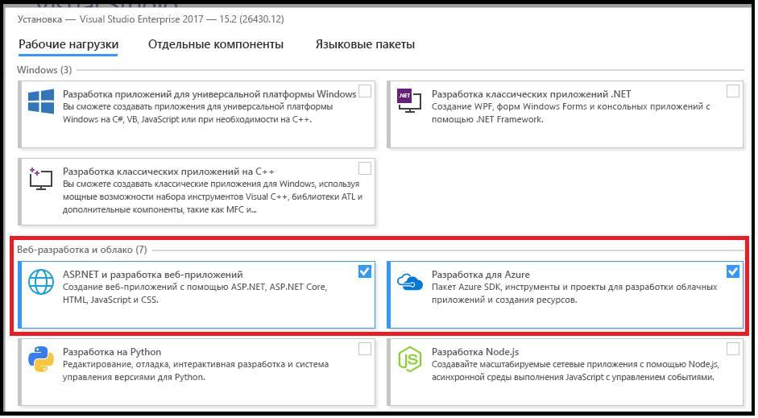
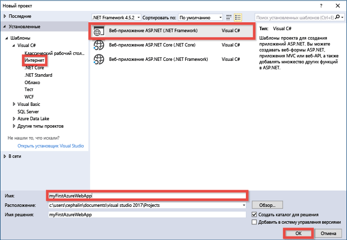
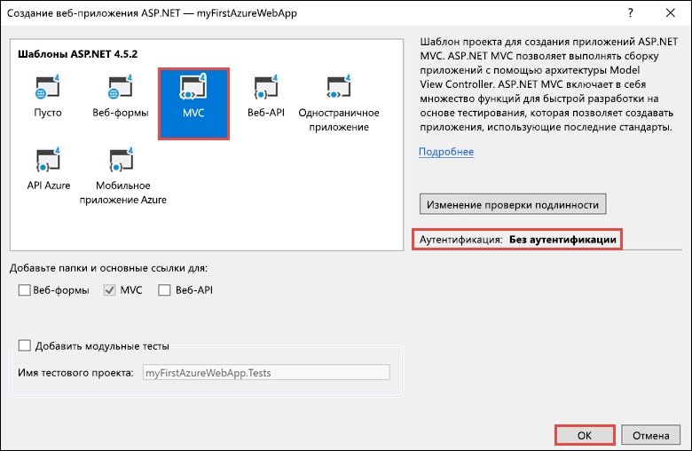
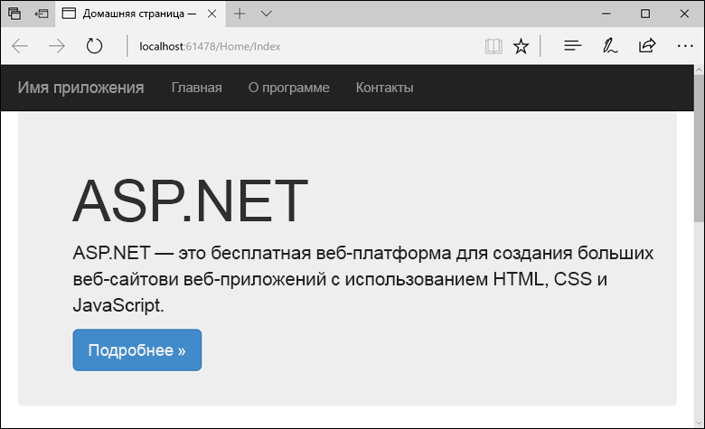
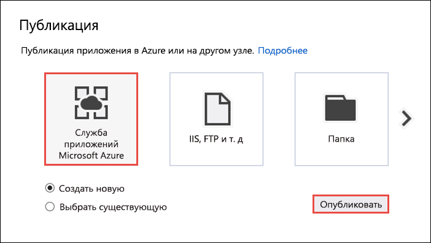
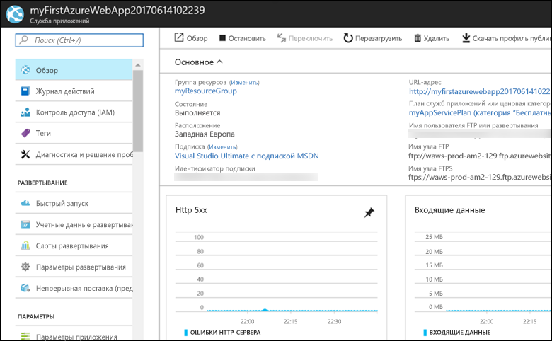

# <a name="create-an-aspnet-framework-web-app-in-azure"></a>Создание веб-приложения ASP.NET Framework в Azure

[Веб-приложения Azure](app-service-web-overview.md) — это служба веб-размещения с самостоятельной установкой исправлений и высоким уровнем масштабируемости.  В этом кратком руководстве рассматривается развертывание первого веб-приложения ASP.NET в службе веб-приложений Azure. В результате будет создана группа ресурсов, состоящая из плана службы приложений и развернутого веб-приложения Azure.

Просмотрите видео, чтобы увидеть выполнение краткого руководства, а затем самостоятельно выполните шаги, чтобы опубликовать свое первое приложение .NET в Azure.

> [!VIDEO https://channel9.msdn.com/Shows/Azure-for-NET-Developers/Create-a-NET-app-in-Azure-Quickstart/player]

[!INCLUDE [quickstarts-free-trial-note](../../includes/quickstarts-free-trial-note.md)]

## <a name="prerequisites"></a>предварительным требованиям

Для работы с этим руководством:

* Установите <a href="https://www.visualstudio.com/downloads/" target="_blank">Visual Studio 2017</a> с указанными ниже рабочими нагрузками:
    - **ASP.NET и веб-разработка;**
    - **разработка Azure.**

    

Если вы уже установили Visual Studio, добавьте в него рабочие нагрузки. Для этого последовательно выберите **Инструменты** > **Get Tools and Features (Получить инструменты и функции)**.

## <a name="create-an-aspnet-web-app"></a>Создание веб-приложения ASP.NET

Создайте проект в Visual Studio, последовательно выбрав пункты **Файл > Создать > Проект**. 

В диалоговом окне **Новый проект** последовательно выберите пункты **Visual C# > Интернет > Веб-приложение ASP.NET (.NET Framework)**.

Присвойте приложению имя _myFirstAzureWebApp_ и нажмите кнопку **ОК**.
   


Вы можете развернуть любой тип веб-приложения ASP.NET в Azure. Для примера в этом руководстве выберите шаблон **MVC** и задайте для аутентификации значение **Без аутентификации**.
      
Нажмите кнопку **ОК**.



В меню последовательно выберите пункты **Отладка > Запуск без отладки**, чтобы запустить веб-приложение локально.



## <a name="publish-to-azure"></a>Публикация в Azure

Щелкните правой кнопкой мыши проект **myFirstAzureWebApp** в **обозревателе решений** и выберите **Опубликовать**.


Выберите **Служба приложений Microsoft Azure** и нажмите кнопку **Опубликовать**.



Откроется диалоговое окно **Создать службу приложений**, с помощью которого вы можете создать все ресурсы Azure, необходимые для запуска веб-приложения ASP.NET в Azure.

## <a name="sign-in-to-azure"></a>Вход в Azure

В диалоговом окне **Создать службу приложений** выберите **Добавить учетную запись** и выполните вход в подписку Azure. Если вы уже вошли в систему, выберите учетную запись, содержащую необходимую подписку, в раскрывающемся меню.

> [!NOTE]
> Если вы уже выполнили вход, пока не нажимайте кнопку **Создать**.
>
>
   


## <a name="create-a-resource-group"></a>Создание группы ресурсов

[!INCLUDE [resource group intro text](../../includes/resource-group.md)]

Рядом с **группой ресурсов** выберите команду **Создать**.

Присвойте группе ресурсов имя **myResourceGroup** и нажмите кнопку **ОК**.

## <a name="create-an-app-service-plan"></a>Создание плана службы приложений

[!INCLUDE [app-service-plan](../../includes/app-service-plan.md)]

Рядом с **планом службы приложений** выберите команду **Создать**. 

В диалоговом окне **Настроить план службы приложений** используйте параметры в таблице, которая находится под снимком экрана.


| Параметр | Рекомендуемое значение | ОПИСАНИЕ |
|-|-|-|
|План обслуживания приложения| myAppServicePlan | Имя плана службы приложений. |
| Расположение | Западная Европа | Центр обработки данных, где размещается веб-приложение. |
| Размер | Free | [Ценовая категория](https://azure.microsoft.com/pricing/details/app-service/?ref=microsoft.com&utm_source=microsoft.com&utm_medium=docs&utm_campaign=visualstudio) определяет возможности размещения. |

Нажмите кнопку **ОК**.

## <a name="create-and-publish-the-web-app"></a>Создание и публикация веб-приложения

В поле **Имя веб-приложения** введите уникальное имя (допустимые символы: `a-z`, `0-9` и `-`) или примите уникальное имя, созданное автоматически. URL-адрес веб-приложения: `http://<app_name>.azurewebsites.net`, где `<app_name>` — имя веб-приложения.

Нажмите кнопку **Создать**, чтобы начать создавать ресурсы Azure.


По завершении работы мастера веб-приложение ASP.NET будет опубликовано в Azure и запущено в браузере по умолчанию.


Имя веб-приложения, указанное [на этапе создания и публикации](#create-and-publish-the-web-app), используется как префикс URL-адреса в формате `http://<app_name>.azurewebsites.net`.

Поздравляем, ваше веб-приложение ASP.NET работает в службе приложений Azure в режиме реального времени.

## <a name="update-the-app-and-redeploy"></a>Обновление и повторное развертывание приложения

В **обозревателе решений** откройте _Views\Home\Index.cshtml_.

Найдите тег HTML `<div class="jumbotron">` в верхней области и замените его следующим кодом:

```HTML
<div class="jumbotron">
    <h1>ASP.NET in Azure!</h1>
    <p class="lead">This is a simple app that we’ve built that demonstrates how to deploy a .NET app to Azure App Service.</p>
</div>
```

Чтобы выполнить повторное развертывание в Azure, щелкните правой кнопкой мыши проект **myFirstAzureWebApp** в **обозревателе решений**, а затем выберите **Опубликовать**.

На странице публикации выберите команду **Опубликовать**.

По завершении публикации Visual Studio открывает в браузере страницу с URL-адресом веб-приложения.


## <a name="manage-the-azure-web-app"></a>Управление веб-приложением Azure

Перейдите на <a href="https://portal.azure.com" target="_blank">портал Azure</a> для управления веб-приложением.

В меню слева выберите **Службы приложений**, а затем щелкните имя своего веб-приложения Azure.


Отобразится страница обзора вашего веб-приложения. Вы можете выполнять базовые задачи управления: обзор, завершение, запуск, перезагрузку и удаление. 



В меню слева доступно несколько страниц для настройки приложения. 

[!INCLUDE [Clean-up section](../../includes/clean-up-section-portal.md)]

## <a name="next-steps"></a>Дополнительная информация

> [!div class="nextstepaction"]
> [Создание приложения ASP.NET в Azure с подключением к базе данных SQL](app-service-web-tutorial-dotnet-sqldatabase.md)
