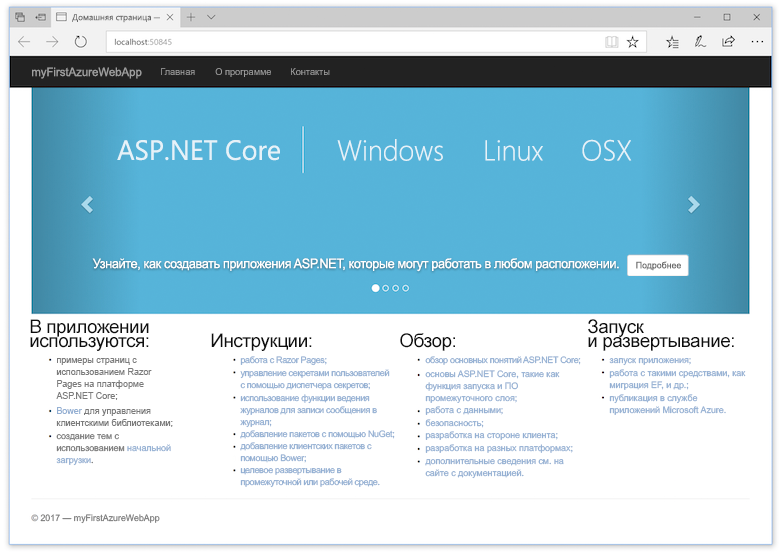
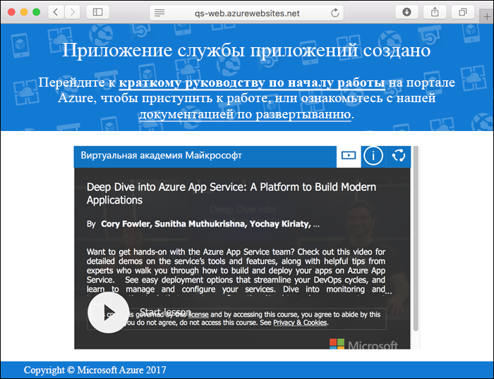
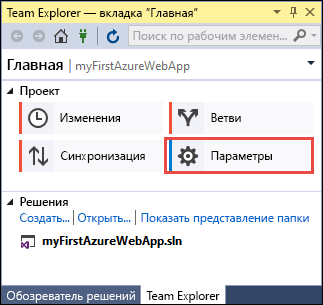
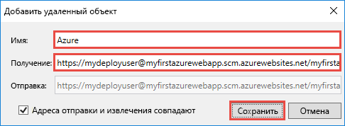
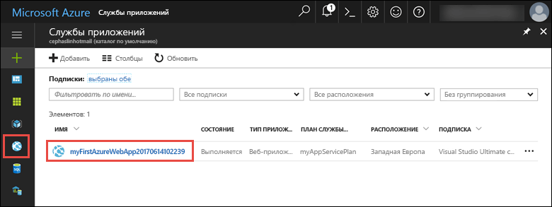

# <a name="create-an-aspnet-core-web-app-in-azure"></a>Создание веб-приложения ASP.NET Core в Azure

> [!NOTE]
> В этой статье мы развернем приложение в службе приложений на платформе Windows. Чтобы развернуть приложение .NET Core в службе приложений на платформе _Linux_, см. статью [Создание веб-приложения .NET Core в службе приложений на платформе Linux](./containers/quickstart-dotnetcore.md).
>
> Инструкции для веб-приложения ASP.NET Framework см. в статье [Создание веб-приложения ASP.NET Framework в Azure](app-service-web-get-started-dotnet-framework.md). 
>

[Веб-приложения Azure](app-service-web-overview.md) — это служба веб-размещения с самостоятельной установкой исправлений и высоким уровнем масштабируемости.  В этом кратком руководстве рассматривается развертывание первого веб-приложения ASP.NET Core при помощи функции Azure "Веб-приложения". В результате будет создана группа ресурсов, состоящая из плана службы приложений и развернутого веб-приложения Azure.

[!INCLUDE [quickstarts-free-trial-note](../../includes/quickstarts-free-trial-note.md)]

## <a name="prerequisites"></a>Предварительные требования

Для работы с этим руководством:

* Установите <a href="https://www.visualstudio.com/downloads/" target="_blank">Visual Studio 2017</a> с указанными ниже компонентами:
    - **ASP.NET и веб-разработка;**
    - **разработка Azure.**

    

## <a name="create-an-aspnet-core-web-app"></a>Создание веб-приложения ASP.NET Core

Создайте проект в Visual Studio, последовательно выбрав пункты **Файл > Создать > Проект**. 

В диалоговом окне **Новый проект** последовательно выберите пункты **Visual C# > Веб > Веб-приложение ASP.NET Core**.

Назовите приложение _myFirstAzureWebApp_, выберите **Создать новый репозиторий Git**, а затем нажмите кнопку **ОК**.
   


Вы можете развернуть в Azure веб-приложения ASP.NET Core любого типа. Для примера в этом руководстве выберите шаблон **Веб-приложение** и задайте для аутентификации значение **Без аутентификации**.
      
Нажмите кнопку **ОК**.


После создания проекта ASP.NET Core отобразится страница приветствия ASP.NET Core с множеством ссылок на ресурсы, которые помогут вам приступить к работе. 


В меню последовательно выберите пункты **Отладка > Запуск без отладки**, чтобы запустить веб-приложение локально.



[!INCLUDE [cloud-shell-try-it.md](../../includes/cloud-shell-try-it.md)]

[!INCLUDE [Configure deployment user](../../includes/configure-deployment-user.md)] 

[!INCLUDE [Create resource group](../../includes/app-service-web-create-resource-group.md)] 

[!INCLUDE [Create app service plan](../../includes/app-service-web-create-app-service-plan.md)] 

[!INCLUDE [Create web app](../../includes/app-service-web-create-web-app.md)] 



## <a name="push-to-azure-from-visual-studio"></a>Принудительная отправка в Azure из Visual Studio

Перейдите в Visual Studio и в меню **Просмотр** щелкните **Team Explorer**. Отобразится **Team Explorer**.

В **домашнем** представлении щелкните **Параметры** > **Параметры репозитория**.



В разделе **Удаленные** **параметров репозитория** щелкните **Добавить**. Откроется диалоговое окно **Добавить удаленный объект**.

В поле **Имя** укажите _Azure_ и задайте в поле **Извлечь** URL-адрес, сохраненный в разделе [Создание веб-приложения](#create-a-web-app). Выберите команду **Сохранить**.



Этот параметр эквивалентен команде Git `git remote add Azure <URL>`.

Нажмите кнопку **Домой** вверху.

Выберите **Параметры** > **Global Settings** (Глобальные параметры). Убедитесь, что заданы имя и адрес электронной почты. При необходимости выберите **Обновить**.

При создании проекта в Visual Studio все файлы были зафиксированы в репозиторий Git. Все, что вам нужно сделать, — отправить эти файлы в Azure.

Нажмите кнопку **Домой** вверху. Выберите **Синхронизация** > **Действия** > **Открыть командную строку**. 

Введите следующую команду в командное окно и при появлении запроса введите пароль развертывания.

```
git push Azure master
```

Выполнение этой команды может занять несколько минут. При выполнении эта команда выводит приблизительно следующие сведения:

```
Counting objects: 4, done.
Delta compression using up to 8 threads.
Compressing objects: 100% (4/4), done.
Writing objects: 100% (4/4), 349 bytes | 349.00 KiB/s, done.
Total 4 (delta 3), reused 0 (delta 0)
remote: Updating branch 'master'.
remote: Updating submodules.
remote: Preparing deployment for commit id '9e20345e9c'.
remote: Generating deployment script.
remote: Project file path: .\myFirstAzureWebApp\myFirstAzureWebApp.csproj
remote: Solution file path: .\myFirstAzureWebApp.sln
remote: Generated deployment script files
remote: Running deployment command...
remote: Handling ASP.NET Core Web Application deployment.
remote:   Restoring packages for D:\home\site\repository\myFirstAzureWebApp\myFirstAzureWebApp.csproj...
remote:   Restoring packages for D:\home\site\repository\myFirstAzureWebApp\myFirstAzureWebApp.csproj...
...
remote: Finished successfully.
remote: Running post deployment command(s)...
remote: Deployment successful.
To https://<app_name>.scm.azurewebsites.net/<app_name>.git
 * [new branch]      master -> master
```

## <a name="browse-to-the-app"></a>Переход в приложение

В браузере перейдите по URL-адресу веб-приложения Azure: `http://<app_name>.azurewebsites.net`.

Страница выполняется как веб-приложение службы приложений Azure.


Поздравляем, ваше веб-приложение ASP.NET Core работает в службе приложений Azure в режиме реального времени.

## <a name="update-the-app-and-redeploy"></a>Обновление и повторное развертывание приложения

В **обозревателе решений** откройте _Pages/Index.cshtml_.

Найдите тег HTML `<div id="myCarousel" class="carousel slide" data-ride="carousel" data-interval="6000">` в верхней области и замените его следующим кодом:

```HTML
<div class="jumbotron">
    <h1>ASP.NET in Azure!</h1>
    <p class="lead">This is a simple app that we’ve built that demonstrates how to deploy a .NET app to Azure App Service.</p>
</div>
```

В **обозревателе решений** щелкните правой кнопкой мыши _Pages/Index.cshtml_ и выберите **Зафиксировать**. Введите сообщение фиксации для изменения и щелкните **Зафиксировать все**.

Снова откройте окно командной строки и отправьте изменения кода в Azure.

```bash
git push Azure master
```

После завершения развертывания снова перейдите к `http://<app_name>.azurewebsites.net`.


## <a name="manage-the-azure-web-app"></a>Управление веб-приложением Azure

Перейдите на <a href="https://portal.azure.com" target="_blank">портал Azure</a> для управления веб-приложением.

В меню слева выберите **Службы приложений**, а затем щелкните имя своего веб-приложения Azure.



Отобразится страница обзора вашего веб-приложения. Вы можете выполнять базовые задачи управления: обзор, завершение, запуск, перезагрузку и удаление. 


В меню слева доступно несколько страниц для настройки приложения. 

[!INCLUDE [Clean-up section](../../includes/clean-up-section-portal.md)]

## <a name="next-steps"></a>Дополнительная информация

> [!div class="nextstepaction"]
> [Использование ASP.NET Core с базой данных SQL](app-service-web-tutorial-dotnetcore-sqldb.md)
