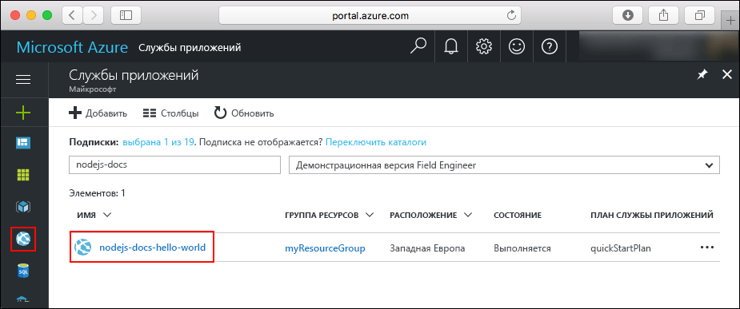
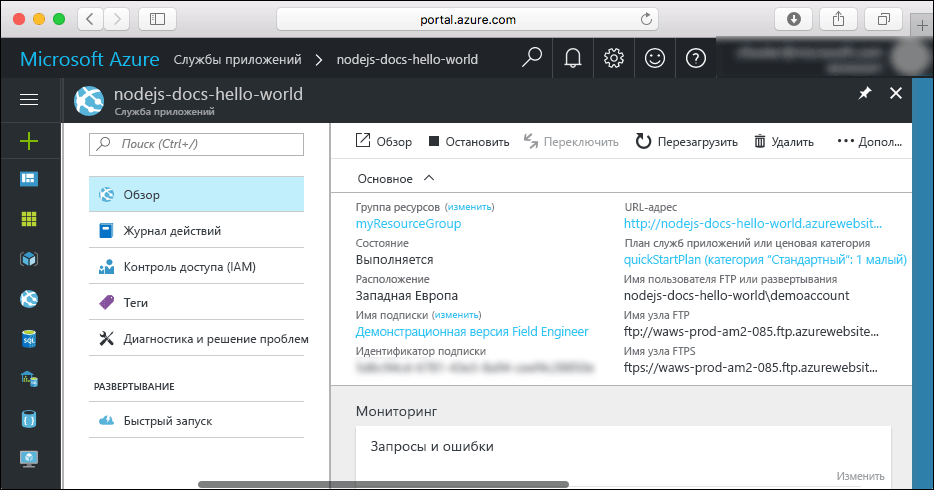

# <a name="create-a-nodejs-web-app-in-azure"></a>Создание веб-приложений Node.js в Azure

> [!NOTE]
> В этой статье мы развернем приложение в службе приложений на платформе Windows. Чтобы развернуть приложение .NET Core в службе приложений на платформе _Linux_, см. статью [Создание веб-приложения Node.js в службе приложений Azure на платформе Linux](./containers/quickstart-nodejs.md).
>

[Веб-приложения Azure](app-service-web-overview.md) — это служба веб-размещения с самостоятельной установкой исправлений и высоким уровнем масштабируемости.  В этом кратком руководстве объясняется, как развертывать приложения Node.js в веб-приложениях Azure. С помощью [Azure CLI](https://docs.microsoft.com/cli/azure/get-started-with-azure-cli) вы можете создавать веб-приложения, в которых можно развертывать примеры кода Node.js с использованием Git.


Выполните приведенные здесь инструкции с помощью компьютера Mac, Windows или Linux. После установки необходимых компонентов для выполнения этих шагов потребуется около пяти минут.   

> [!VIDEO https://channel9.msdn.com/Shows/Azure-for-Node-Developers/Create-a-Nodejs-app-in-Azure-Quickstart/player]   

[!INCLUDE [quickstarts-free-trial-note](../../includes/quickstarts-free-trial-note.md)]

## <a name="prerequisites"></a>предварительным требованиям

Для работы с этим кратким руководством сделайте следующее:

* <a href="https://nodejs.org/" target="_blank">установите Node.j и NPM</a>.

## <a name="download-the-sample"></a>Скачивание примера приложения

Скачайте пример проекта Node.js с [https://github.com/Azure-Samples/nodejs-docs-hello-world/archive/master.zip](https://github.com/Azure-Samples/nodejs-docs-hello-world/archive/master.zip) и извлеките ZIP-архив.

В окне терминала перейдите в корневой каталог примера проекта Node.js (с _index.js_).

## <a name="run-the-app-locally"></a>Локальный запуск приложения

Запустите приложение в локальной среде, открыв окно терминала и выполнив скрипт `npm start`, чтобы запустить встроенный HTTP-сервер Node.js.

```bash
npm start
```

Откройте веб-браузер и перейдите к примеру приложения по адресу `http://localhost:1337`.

На странице отобразится сообщение **Hello World** из примера приложения.


В окне терминала нажмите клавиши **CTRL+C**, чтобы выйти из веб-сервера.

[!INCLUDE [Create ZIP file](../../includes/app-service-web-create-zip.md)]

[!INCLUDE [cloud-shell-try-it.md](../../includes/cloud-shell-try-it.md)]

[!INCLUDE [Create resource group](../../includes/app-service-web-create-resource-group.md)] 

[!INCLUDE [Create app service plan](../../includes/app-service-web-create-app-service-plan.md)] 

## <a name="create-a-web-app"></a>Создание веб-приложения

В Cloud Shell создайте веб-приложение в рамках плана службы приложений `myAppServicePlan` с помощью команды [`az webapp create`](/cli/azure/webapp?view=azure-cli-latest#az_webapp_create). 

В следующем примере замените `<app_name>`глобальным уникальным именем приложения (допустимые символы: `a-z`, `0-9` и `-`). Для среды выполнения установлено значение `NODE|6.9`. Список всех поддерживаемых сред выполнения можно получить с помощью команды [`az webapp list-runtimes`](/cli/azure/webapp?view=azure-cli-latest#az_webapp_list_runtimes). 

```azurecli-interactive
# Bash
az webapp create --resource-group myResourceGroup --plan myAppServicePlan --name <app_name> --runtime "NODE|6.9"
# PowerShell
az --% webapp create --resource-group myResourceGroup --plan myAppServicePlan --name <app_name> --runtime "NODE|6.9"
```

Когда веб-приложение будет создано, в Azure CLI отобразится примерно следующее:

```json
{
  "availabilityState": "Normal",
  "clientAffinityEnabled": true,
  "clientCertEnabled": false,
  "cloningInfo": null,
  "containerSize": 0,
  "dailyMemoryTimeQuota": 0,
  "defaultHostName": "<app_name>.azurewebsites.net",
  "enabled": true,
  < JSON data removed for brevity. >
}
```

Перейдите к только что созданному веб-приложению. Замените _&lt;app name>_ уникальным именем приложения.

```bash
http://<app name>.azurewebsites.net
```

Новое веб-приложение должно выглядеть так:


[!INCLUDE [Deploy ZIP file](../../includes/app-service-web-deploy-zip.md)]

## <a name="browse-to-the-app"></a>Переход в приложение

Перейдите в развертываемое приложение с помощью веб-браузера.

```
http://<app_name>.azurewebsites.net
```

Пример кода Node.js выполняется в веб-приложении службы приложений Azure.


**Поздравляем!** Вы развернули свое первое приложение Node.js в службе приложений.

## <a name="update-and-redeploy-the-code"></a>Обновление и повторное развертывание кода

В текстовом редакторе в приложении Node.js откройте файл `index.js` и измените текст в вызове `response.end`:

```nodejs
response.end("Hello Azure!");
```

В окне локального терминала перейдите в корневой каталог приложения и создайте ZIP-файл для обновленного проекта.

```
# Bash
zip -r myUpdatedAppFiles.zip .

# PowerShell
Compress-Archive -Path * -DestinationPath myUpdatedAppFiles.zip
``` 

Разверните новый ZIP-файл в службе приложений в соответствии с инструкциями из раздела о [передаче ZIP-файла](#upload-the-zip-file).

Перейдите в окно браузера, открытое на шаге **перехода в приложение**, и обновите страницу.


## <a name="manage-your-new-azure-web-app"></a>Управление новым веб-приложением Azure

Перейдите на <a href="https://portal.azure.com" target="_blank">портал Azure</a> для управления созданным веб-приложением.

В меню слева выберите **Службы приложений**, а затем щелкните имя своего веб-приложения Azure.



Отобразится страница обзора вашего веб-приложения. Вы можете выполнять базовые задачи управления: обзор, завершение, запуск, перезагрузку и удаление. 



В меню слева доступно несколько страниц для настройки приложения. 

[!INCLUDE [cli-samples-clean-up](../../includes/cli-samples-clean-up.md)]

## <a name="next-steps"></a>Дополнительная информация

> [!div class="nextstepaction"]
> [Node.js с MongoDB](app-service-web-tutorial-nodejs-mongodb-app.md)
