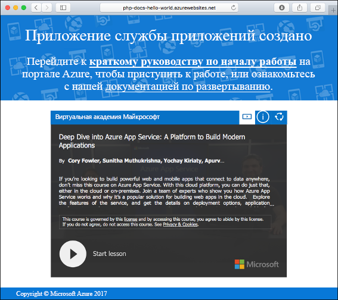
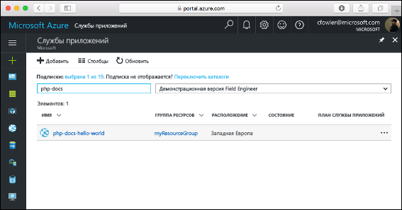
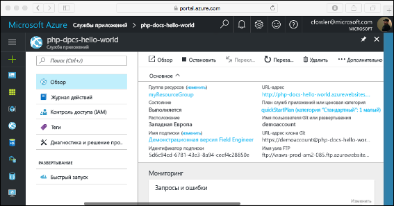

# <a name="create-a-php-web-app-in-azure"></a>Создание веб-приложения PHP в Azure

> [!NOTE]
> В этой статье мы развернем приложение в службе приложений на платформе Windows. Чтобы развернуть приложение .NET Core в службе приложений на платформе _Linux_, см. статью [Создание веб-приложения PHP в службе приложений на платформе Linux](./containers/quickstart-php.md).
>

[Веб-приложения Azure](app-service-web-overview.md) — это служба веб-размещения с самостоятельной установкой исправлений и высоким уровнем масштабируемости.  В этом кратком руководстве объясняется, как развернуть приложение PHP в веб-приложениях Azure. Создайте веб-приложение с помощью [Azure CLI](https://docs.microsoft.com/cli/azure/get-started-with-azure-cli) в Cloud Shell и разверните пример кода PHP в веб-приложении с помощью Git.

![Пример приложения, выполняющегося в Azure]](media/app-service-web-get-started-php/hello-world-in-browser.png)

Выполните приведенные здесь инструкции с помощью компьютера Mac, Windows или Linux. После установки необходимых компонентов для выполнения этих шагов потребуется около пяти минут.

[!INCLUDE [quickstarts-free-trial-note](../../includes/quickstarts-free-trial-note.md)]

## <a name="prerequisites"></a>предварительным требованиям

Для работы с этим кратким руководством сделайте следующее:

* <a href="https://git-scm.com/" target="_blank">установите Git</a>;
* <a href="http://php.net/manual/install.php" target="_blank">установите PHP</a>.

## <a name="download-the-sample-locally"></a>Скачать пример на локальный компьютер

Выполните следующие команды в окне терминала. Так вы клонируете пример приложения на локальный компьютер и перейдете в каталог, содержащий пример кода.

```bash
git clone https://github.com/Azure-Samples/php-docs-hello-world
cd php-docs-hello-world
```

## <a name="run-the-app-locally"></a>Локальный запуск приложения

Запустите приложение в локальной среде, открыв окно терминала и выполнив команду `php`, чтобы запустить встроенный веб-сервер PHP.

```bash
php -S localhost:8080
```

Откройте веб-браузер и перейдите к примеру приложения по адресу `http://localhost:8080`.

На странице отобразится сообщение **Hello World!** из примера приложения.


В окне терминала нажмите клавиши **CTRL+C**, чтобы выйти из веб-сервера.

[!INCLUDE [cloud-shell-try-it.md](../../includes/cloud-shell-try-it.md)]

[!INCLUDE [Configure deployment user](../../includes/configure-deployment-user.md)]

[!INCLUDE [Create resource group](../../includes/app-service-web-create-resource-group.md)]

[!INCLUDE [Create app service plan](../../includes/app-service-web-create-app-service-plan.md)]

## <a name="create-a-web-app"></a>Создание веб-приложения

В Cloud Shell создайте веб-приложение в рамках плана службы приложений `myAppServicePlan` с помощью команды [`az webapp create`](/cli/azure/webapp?view=azure-cli-latest#az_webapp_create). 

В следующем примере замените `<app_name>`глобальным уникальным именем приложения (допустимые символы: `a-z`, `0-9` и `-`). Для среды выполнения установлено значение `PHP|7.0`. Список всех поддерживаемых сред выполнения можно получить с помощью команды [`az webapp list-runtimes`](/cli/azure/webapp?view=azure-cli-latest#az_webapp_list_runtimes). 

```azurecli-interactive
# Bash
az webapp create --resource-group myResourceGroup --plan myAppServicePlan --name <app_name> --runtime "PHP|7.0" --deployment-local-git
# PowerShell
az --% webapp create --resource-group myResourceGroup --plan myAppServicePlan --name <app_name> --runtime "PHP|7.0" --deployment-local-git
```

Когда веб-приложение будет создано, в Azure CLI отобразится примерно следующее:

```json
{
  "availabilityState": "Normal",
  "clientAffinityEnabled": true,
  "clientCertEnabled": false,
  "cloningInfo": null,
  "containerSize": 0,
  "dailyMemoryTimeQuota": 0,
  "defaultHostName": "<app_name>.azurewebsites.net",
  "enabled": true,
  < JSON data removed for brevity. >
}
```

Перейдите к только что созданному веб-приложению. Замените _&lt;app name>_ уникальным именем приложения.

```bash
http://<app name>.azurewebsites.net
```

Новое веб-приложение должно выглядеть так:



[!INCLUDE [Push to Azure](../../includes/app-service-web-git-push-to-azure.md)] 

```bash
Counting objects: 2, done.
Delta compression using up to 4 threads.
Compressing objects: 100% (2/2), done.
Writing objects: 100% (2/2), 352 bytes | 0 bytes/s, done.
Total 2 (delta 1), reused 0 (delta 0)
remote: Updating branch 'master'.
remote: Updating submodules.
remote: Preparing deployment for commit id '25f18051e9'.
remote: Generating deployment script.
remote: Running deployment command...
remote: Handling Basic Web Site deployment.
remote: Kudu sync from: '/home/site/repository' to: '/home/site/wwwroot'
remote: Copying file: '.gitignore'
remote: Copying file: 'LICENSE'
remote: Copying file: 'README.md'
remote: Copying file: 'index.php'
remote: Ignoring: .git
remote: Finished successfully.
remote: Running post deployment command(s)...
remote: Deployment successful.
To https://<app_name>.scm.azurewebsites.net/<app_name>.git
   cc39b1e..25f1805  master -> master
```

## <a name="browse-to-the-app"></a>Переход в приложение

Перейдите в развертываемое приложение с помощью веб-браузера.

```
http://<app_name>.azurewebsites.net
```

Пример кода PHP выполняется в веб-приложении службы приложений Azure.


**Поздравляем!** Вы развернули свое первое приложение PHP в службе приложений.

## <a name="update-locally-and-redeploy-the-code"></a>Обновление на локальном компьютере и повторное развертывание кода

В локальном текстовом редакторе в приложении PHP откройте файл `index.php` и внесите небольшое изменение в текстовой строке рядом с `echo`:

```php
echo "Hello Azure!";
```

В окне терминала на локальном компьютере зафиксируйте изменения в Git, а затем отправьте изменение кода в Azure.

```bash
git commit -am "updated output"
git push azure master
```

После завершения развертывания перейдите в окно браузера, открытое на шаге **перехода в приложение**, и обновите страницу.


## <a name="manage-your-new-azure-web-app"></a>Управление новым веб-приложением Azure

Перейдите на <a href="https://portal.azure.com" target="_blank">портал Azure</a> для управления созданным веб-приложением.

В меню слева выберите **Службы приложений**, а затем щелкните имя своего веб-приложения Azure.



Отобразится страница обзора вашего веб-приложения. Вы можете выполнять базовые задачи управления: обзор, завершение, запуск, перезагрузку и удаление.



В меню слева доступно несколько страниц для настройки приложения. 

[!INCLUDE [cli-samples-clean-up](../../includes/cli-samples-clean-up.md)]

## <a name="next-steps"></a>Дополнительная информация

> [!div class="nextstepaction"]
> [Использование PHP и MySQL](app-service-web-tutorial-php-mysql.md)
