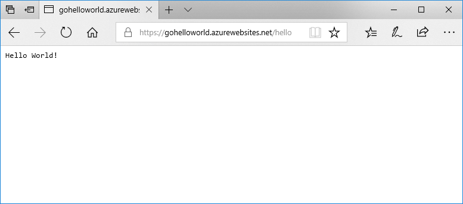

# <a name="deploy-a-dockergo-web-app-in-web-app-for-containers"></a>Развертывание веб-приложения Docker или Go в Веб-приложении для контейнеров

[Служба приложений в Linux](app-service-linux-intro.md) предоставляет предопределенные стеки приложений на платформе Linux с поддержкой определенных языков (например, .NET, PHP, Node.js и т. д.). Вы также можете использовать пользовательский образ Docker для запуска веб-приложения в стеке приложений, который еще не определен в Azure. В этом кратком руководстве показано, как создать веб-приложение и развернуть образ Go из центра Docker. Создайте веб-приложение с помощью [Azure CLI](https://docs.microsoft.com/cli/azure/get-started-with-azure-cli).



[!INCLUDE [quickstarts-free-trial-note](../../../includes/quickstarts-free-trial-note.md)]

[!INCLUDE [cloud-shell-try-it.md](../../../includes/cloud-shell-try-it.md)]

[!INCLUDE [Configure deployment user](../../../includes/configure-deployment-user.md)]

[!INCLUDE [Create resource group](../../../includes/app-service-web-create-resource-group-linux.md)]

[!INCLUDE [Create app service plan](../../../includes/app-service-web-create-app-service-plan-linux.md)]

## <a name="create-a-web-app"></a>Создание веб-приложения

Создайте [веб-приложение](../app-service-web-overview.md) в рамках плана `myAppServicePlan` службы приложений с помощью команды [az webapp create](/cli/azure/webapp?view=azure-cli-latest#az_webapp_create). Не забудьте указать глобально уникальное имя приложения вместо `<app name>`.

```azurecli-interactive
az webapp create --resource-group myResourceGroup --plan myAppServicePlan --name <app name> --deployment-container-image-name microsoft/azure-appservices-go-quickstart
```

В предыдущей команде `--deployment-container-image-name` указывает на общедоступный образ центра Docker [microsoft/azure-appservices-go-quickstart](https://hub.docker.com/r/microsoft/azure-appservices-go-quickstart/).

Когда веб-приложение будет создано, в Azure CLI отобразится примерно следующее:

```json
{
  "availabilityState": "Normal",
  "clientAffinityEnabled": true,
  "clientCertEnabled": false,
  "cloningInfo": null,
  "containerSize": 0,
  "dailyMemoryTimeQuota": 0,
  "defaultHostName": "<app name>.azurewebsites.net",
  "deploymentLocalGitUrl": "https://<username>@<app name>.scm.azurewebsites.net/<app name>.git",
  "enabled": true,
  < JSON data removed for brevity. >
}
```

## <a name="browse-to-the-app"></a>Переход в приложение

```bash
http://<app_name>.azurewebsites.net/hello
```


**Поздравляем!** Вы развернули пользовательский образ Docker в Веб-приложении Azure для контейнеров.

[!INCLUDE [Clean-up section](../../../includes/cli-script-clean-up.md)]

## <a name="next-steps"></a>Дополнительная информация

> [!div class="nextstepaction"]
> [Использование пользовательского образа Docker](tutorial-custom-docker-image.md)
