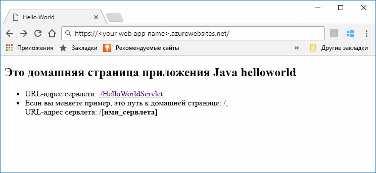
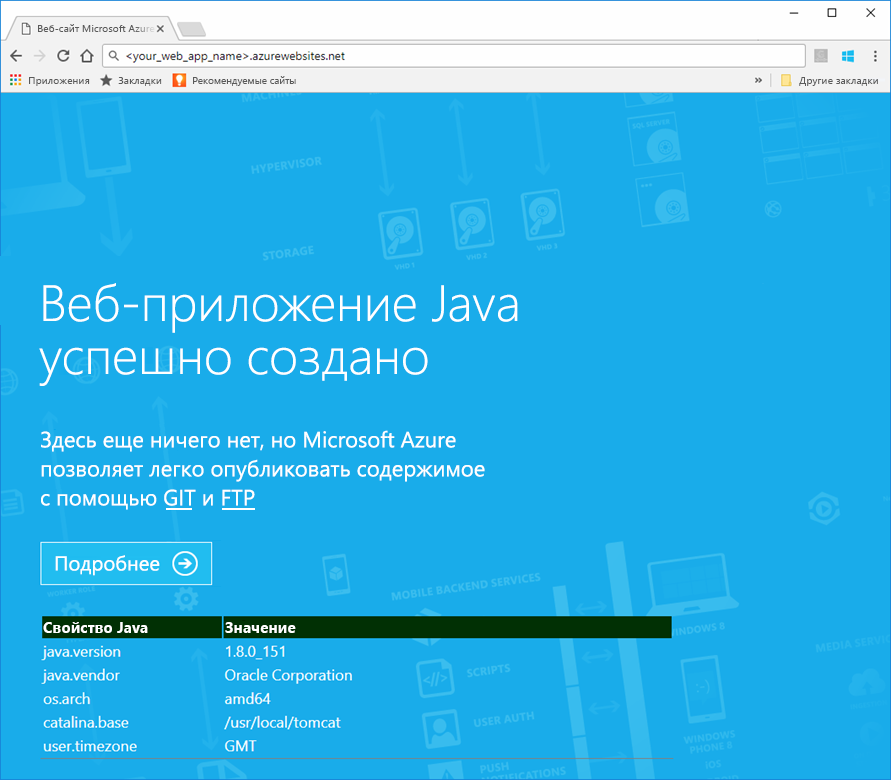
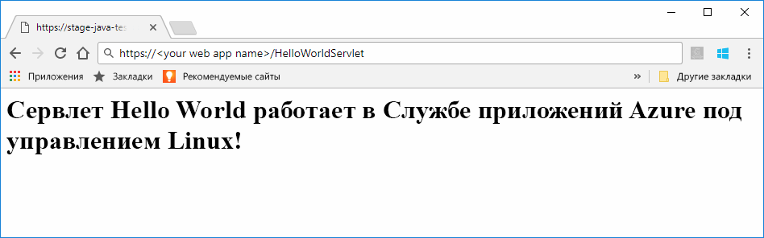
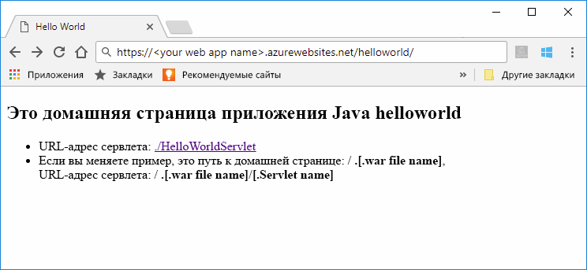
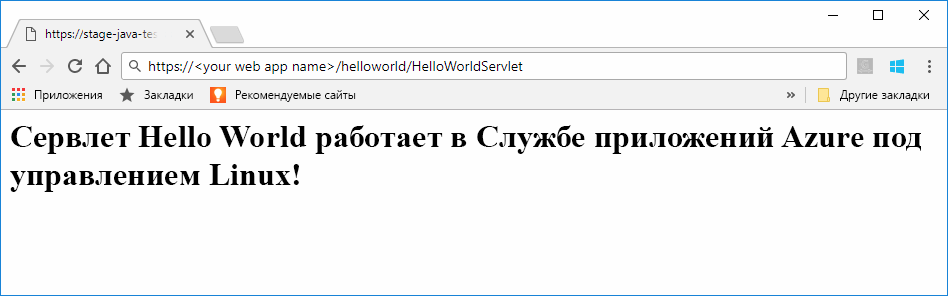

# <a name="preview-create-a-java-web-app-in-app-service-on-linux"></a>Создание веб-приложения Java в службе приложений Azure в Linux (предварительная версия)

Служба приложений в Linux в настоящее время предоставляет предварительную версию функции, позволяющую создавать веб-приложения Java. Сведения о предварительных версиях функций см. на странице [Дополнительные условия использования предварительных выпусков Microsoft Azure](https://azure.microsoft.com/support/legal/preview-supplemental-terms/). Можно также [развернуть веб-приложения Java в собственный контейнер Linux в облаке с помощью набора средств Azure для IntelliJ](https://docs.microsoft.com/java/azure/intellij/azure-toolkit-for-intellij-hello-world-web-app-linux).

> [!NOTE]
> В этой статье описывается процесс развертывания веб-приложения Java в службе приложений на платформе Linux.
>

[Служба приложений на платформе Linux](app-service-linux-intro.md) — это высокомасштабируемая служба размещения с самостоятельной установкой исправлений на основе операционной системы Linux. В этом кратком руководстве показано, как развернуть в службе приложений в Linux приложение Java, использующее встроенный образ. Вы создадите веб-приложение со встроенным образом, используя [Azure CLI](https://docs.microsoft.com/cli/azure/get-started-with-azure-cli), и развернете в нем приложение Java.



[!INCLUDE [quickstarts-free-trial-note](../../../includes/quickstarts-free-trial-note.md)]


## <a name="prerequisites"></a>предварительным требованиям

Для работы с этим кратким руководством сделайте следующее: 

* У вас должна быть подписка Azure. Если у вас еще нет подписки Azure, [создайте бесплатную учетную запись Azure](https://azure.microsoft.com/free/?ref=microsoft.com&utm_source=microsoft.com&utm_medium=docs&utm_campaign=visualstudio), прежде чем начинать работу.
* [Установка Git](https://git-scm.com/).
* [Установите Eclipse](https://www.eclipse.org/downloads/).


[!INCLUDE [cloud-shell-try-it.md](../../../includes/cloud-shell-try-it.md)]

[!INCLUDE [Configure deployment user](../../../includes/configure-deployment-user.md)]

[!INCLUDE [Create resource group](../../../includes/app-service-web-create-resource-group-linux.md)]

[!INCLUDE [Create app service plan](../../../includes/app-service-web-create-app-service-plan-linux.md)]


## <a name="create-a-web-app"></a>Создание веб-приложения

В Cloud Shell создайте [веб-приложение](../app-service-web-overview.md) в рамках плана службы приложений `myAppServicePlan`. Для этого воспользуйтесь командой [`az webapp create`](/cli/azure/webapp?view=azure-cli-latest#az_webapp_create). В следующем примере замените *\<app_name>* глобальным уникальным именем приложения (допустимые символы: `a-z`, `0-9` и `-`). 

```azurecli-interactive
# Bash
az webapp create --name <app_name> --resource-group myResourceGroup --plan myAppServicePlan --runtime "TOMCAT|8.5-jre8"
# PowerShell
az --% webapp create --name <app_name> --resource-group myResourceGroup --plan myAppServicePlan --runtime "TOMCAT|8.5-jre8"
```

В качестве параметра **среды выполнения** используйте одну из следующих сред выполнения:
 * TOMCAT|8.5-jre8
 * TOMCAT|9.0-jre8


После создания веб-приложения в Azure CLI отображаются следующие сведения:

```json
{
  "additionalProperties": {},
  "availabilityState": "Normal",
  "clientAffinityEnabled": true,
  "clientCertEnabled": false,
  "cloningInfo": null,
  "containerSize": 0,
  "dailyMemoryTimeQuota": 0,
  "defaultHostName": "<your web app name>.azurewebsites.net",
  "enabled": true,
  "enabledHostNames": [
    "<your web app name>.azurewebsites.net",
    "<your web app name>.scm.azurewebsites.net"
  ],
  "ftpPublishingUrl": "ftp://<your ftp URL>",  
  < JSON data removed for brevity. >
}
```

Скопируйте значение **ftpPublishingUrl**. Он будет использован позже, если вы выберете вариант развертывания с помощью FTP.

Перейдите к только что созданному веб-приложению.

```
http://<app_name>.azurewebsites.net
```

Если веб-приложение запущено и работает, экран по умолчанию будет выглядеть, как на следующем изображении:




## <a name="download-the-sample-java-app"></a>Загрузка примера приложения Java

В окне терминала на компьютере выполните следующую команду, чтобы клонировать репозиторий с примером приложения на локальный компьютер. Вы развернете этот пример приложения на следующем шаге.

```bash
git clone https://github.com/Azure-Samples/java-docs-hello-world
```


## <a name="deploying-the-java-app-to-app-service-on-linux"></a>Развертывание приложения Java в службе приложений на платформе Linux

Откройте пример проекта в [Eclipse](https://www.eclipse.org/downloads/) и [экспортируйте приложение Java в WAR-файл](http://help.eclipse.org/kepler/index.jsp?topic=%2Forg.eclipse.wst.webtools.doc.user%2Ftopics%2Ftwcrewar.html) с именем `helloworld.war`.

Для развертывания WAR-файла приложения Java можно воспользоваться WarDeploy (в настоящее время [в предварительной версии](https://azure.microsoft.com/support/legal/preview-supplemental-terms/)) или FTP.

В зависимости от того, какой метод развертывания вы используете, относительные пути к веб-приложению Java немного отличаются.

### <a name="deploy-with-wardeploy"></a>Развертывание с помощью WarDeploy 

Для развертывания WAR-файла с помощью WarDeploy отправьте запрос POST к *https://<your app name>.scm.azurewebsites.net/api/wardeploy*, используя приведенный ниже пример с программой командной строки cURL. В тексте сообщения запроса POST должен содержаться WAR-файл. Учетные данные развертывания для приложения указываются в запросе с использованием обычной проверки подлинности HTTP. Дополнительные сведения о WarDeploy см. в статье [Развертывание приложения в Службе приложений Azure с помощью ZIP-файла](../app-service-deploy-zip.md).

```bash
curl -X POST -u <username> --data-binary @"<war_file_path>" https://<app_name>.scm.azurewebsites.net/api/wardeploy
```

Укажите следующие значения вместо заполнителей:

* `username` — имя пользователя из учетных данных, созданных ранее для развертывания;
* `war_file_path` — локальный путь к WAR-файлу;
* `app_name` — созданное ранее имя приложения.

Выполните команду. При появлении запроса cURL введите пароль из учетных данных для развертывания.

Перейдите к странице развернутого приложения, используя следующий URL-адрес в веб-браузере.

```bash
http://<app_name>.azurewebsites.net
```

Пример кода Java выполняется в веб-приложении со встроенным образом.


Перейдите в веб-браузере к сервлету.

```bash
http://<app_name>.azurewebsites.net/HelloWorldServlet
```

Сервлет выполняется в веб-приложении со встроенным образом.




**Поздравляем!** Вы развернули свое первое приложение Java в службе приложений на платформе Linux.


### <a name="ftp-deployment"></a>Развертывание с помощью FTP

WAR-файл также можно развернуть с помощью протокола FTP. 

Передайте файл по FTP в каталог */home/site/wwwroot/webapps* веб-приложения. В следующем примере используется программа командной строки cURL:

```bash
curl -T war_file_path -u "app_name\username" ftp://webappFTPURL/site/wwwroot/webapps/
```

Укажите следующие значения вместо заполнителей:

* `war_file_path` — локальный путь к WAR-файлу;
* `app_name` — созданное ранее имя приложения;
* `username` — имя пользователя из учетных данных, созданных ранее для развертывания;
* `webappFTPURL` — значение **имени узла FTP** для веб-приложения, которое было скопировано ранее. Имя узла FTP также указано в колонке **Обзор** веб-приложения на [портале Azure](https://portal.azure.com/).

Выполните команду. При появлении запроса cURL введите пароль из учетных данных для развертывания.


Перейдите к странице развернутого приложения, используя следующий URL-адрес в веб-браузере.

```bash
http://<app_name>.azurewebsites.net/helloworld
```

Пример кода Java выполняется в веб-приложении со встроенным образом.



Перейдите в веб-браузере к сервлету.

```bash
http://<app_name>.azurewebsites.net/helloworld/HelloWorldServlet
```

Пример кода Java выполняется в веб-приложении со встроенным образом.




**Поздравляем!** Вы развернули свое первое приложение Java в службе приложений на платформе Linux.


[!INCLUDE [cli-samples-clean-up](../../../includes/cli-samples-clean-up.md)]


## <a name="next-steps"></a>Дополнительная информация

Дополнительные сведения об использовании Java в Azure см. по следующим ссылкам:

* [Azure для разработчиков Java](https://docs.microsoft.com/java/azure/)
* [Развертывание веб-приложения Hello World в контейнере Linux в облаке с помощью набора средств Azure для IntelliJ](https://docs.microsoft.com/java/azure/intellij/azure-toolkit-for-intellij-hello-world-web-app-linux)
* [Java Tools for Visual Studio Team Services](https://java.visualstudio.com/) (Инструменты Java для Visual Studio Team Services)
