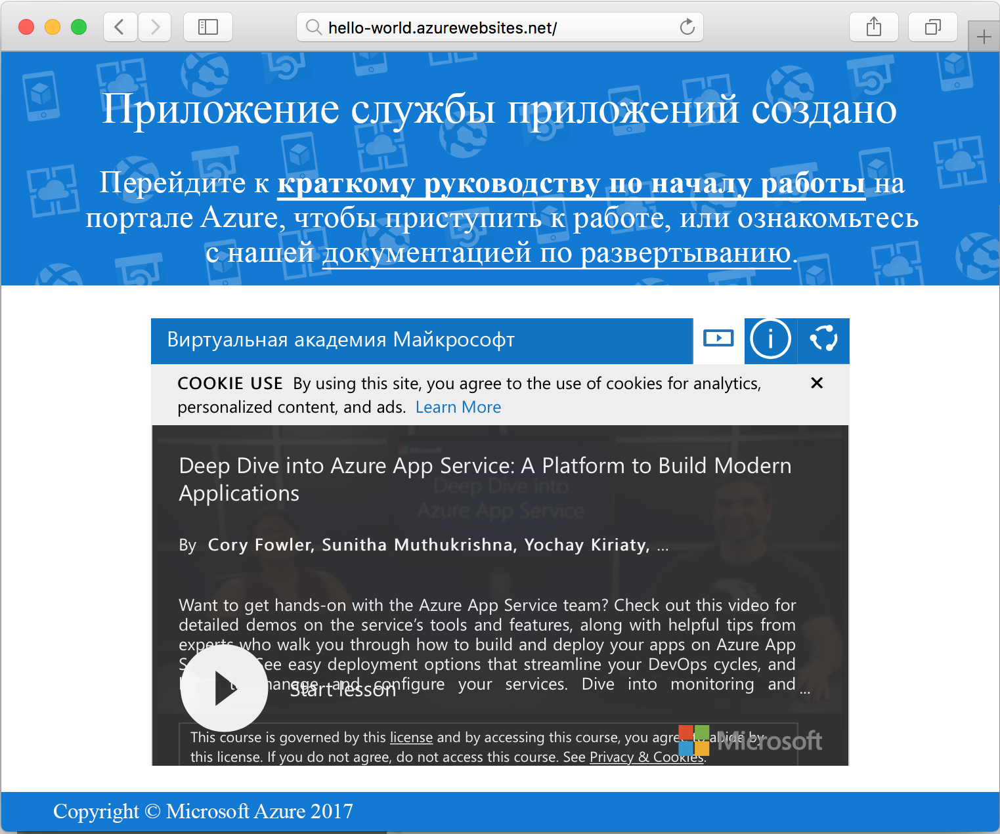

# <a name="create-a-ruby-app-in-app-service-on-linux"></a>Создание приложения Ruby в службе приложений на платформе Linux

[Служба приложений Azure на платформе Linux](app-service-linux-intro.md) — это служба веб-размещения с самостоятельной установкой исправлений и высоким уровнем масштабируемости. В этом кратком руководстве показано, как создать базовое приложение [Ruby on Rails](https://rubyonrails.org/) и развернуть его в Azure в качестве веб-приложения на платформе Linux.


[!INCLUDE [quickstarts-free-trial-note](../../../includes/quickstarts-free-trial-note.md)]

## <a name="prerequisites"></a>предварительным требованиям

* <a href="https://www.ruby-lang.org/en/documentation/installation/#rubyinstaller" target="_blank">Установите Ruby 2.3 или более поздней версии</a>.
* <a href="https://git-scm.com/" target="_blank">установите Git</a>;

## <a name="download-the-sample"></a>Скачивание примера приложения

В окне терминала выполните следующую команду, чтобы клонировать репозиторий с примером приложения на локальный компьютер.

```bash
git clone https://github.com/Azure-Samples/ruby-docs-hello-world
```

## <a name="run-the-application-locally"></a>Локальный запуск приложения

Для работы приложения нужно запустить сервер Rails. Измените каталог `hello-world` и выполните команду `rails server` для запуска сервера.

```bash
cd hello-world\bin
rails server
```

С помощью веб-браузера перейдите к `http://localhost:3000`, чтобы протестировать приложение локально.


[!INCLUDE [Try Cloud Shell](../../../includes/cloud-shell-try-it.md)]

[!INCLUDE [Configure deployment user](../../../includes/configure-deployment-user.md)]

[!INCLUDE [Create resource group](../../../includes/app-service-web-create-resource-group-linux.md)]

[!INCLUDE [Create app service plan](../../../includes/app-service-web-create-app-service-plan-linux.md)]

## <a name="create-a-web-app"></a>Создание веб-приложения

[!INCLUDE [Create web app](../../../includes/app-service-web-create-web-app-ruby-linux-no-h.md)] 

Перейдите на сайт, чтобы просмотреть созданное веб-приложение со встроенным образом. Замените _&lt;имя_приложения>_ уникальным именем веб-приложения.

```bash
http://<app_name>.azurewebsites.net
```

Новое веб-приложение должно выглядеть так:



## <a name="deploy-your-application"></a>Развертывание приложения

Выполните следующие команды, чтобы развернуть локальное приложение на веб-сайте Azure.

```bash
git remote add azure <Git deployment URL from above>
git add -A
git commit -m "Initial deployment commit"
git push azure master
```

Убедитесь, что операции удаленного развертывания успешно выполнены. Выходные данные команд будут выглядеть следующим образом:

```bash
remote: Using sass-rails 5.0.6
remote: Updating files in vendor/cache
remote: Bundle gems are installed into ./vendor/bundle
remote: Updating files in vendor/cache
remote: ~site/repository
remote: Finished successfully.
remote: Running post deployment command(s)...
remote: Deployment successful.
To https://<your web app name>.scm.azurewebsites.net/<your web app name>.git
  579ccb....2ca5f31  master -> master
myuser@ubuntu1234:~workspace/<app name>$
```

После завершения развертывания перезапустите веб-приложение, чтобы изменения вступили в силу, выполнив команду [`az webapp restart`](/cli/azure/webapp?view=azure-cli-latest#az_webapp_restart), как показано ниже.

```azurecli-interactive
az webapp restart --name <app name> --resource-group myResourceGroup
```

Перейдите на свой сайт и проверьте результаты.

```bash
http://<app name>.azurewebsites.net
```


> [!NOTE]
> Во время перезапуска приложения попытка просмотреть сайт приведет к ошибке с кодом состояния HTTP `Error 503 Server unavailable`. На полный перезапуск может потребоваться несколько минут.
>

[!INCLUDE [Clean-up section](../../../includes/cli-script-clean-up.md)]

## <a name="next-steps"></a>Дополнительная информация

> [!div class="nextstepaction"]
> [Build a Ruby and MySQL web app in Azure App Service on Linux](tutorial-ruby-mysql-app.md) (Создание веб-приложения Ruby и MySQL в службе приложений Azure на платформе Linux)
