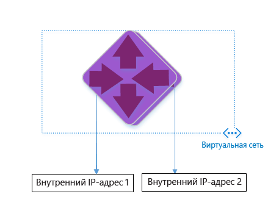
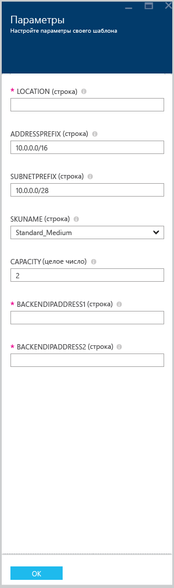

<properties 
   pageTitle="Создание шлюза приложений с помощью шаблонов диспетчера ресурсов Azure | Microsoft Azure"
   description="На этой странице приводятся инструкции по созданию шлюза приложений Azure с помощью шаблона диспетчера ресурсов Azure."
   documentationCenter="na"
   services="application-gateway"
   authors="joaoma"
   manager="jdial"
   editor="tysonn"/>
<tags 
   ms.service="application-gateway"
   ms.devlang="na"
   ms.topic="hero-article" 
   ms.tgt_pltfrm="na"
   ms.workload="infrastructure-services" 
   ms.date="09/21/2015"
   ms.author="joaoma"/>

# Создание шлюза приложений с помощью шаблона ARM

Шлюз приложений — это уровень 7 балансировщика нагрузки. Он отвечает за отработку отказов и HTTP-запросы маршрутизации производительности между различными облачными и локальными серверами. Шлюз приложений обладает следующими функциями доставки приложений: балансировка нагрузки HTTP, определение сходства сеансов по файлам cookie, разгрузка SSL.

> [AZURE.SELECTOR]
- [Azure Classic Powershell steps](application-gateway-create-gateway.md)
- [Azure Resource Manager Powershell steps](application-gateway-create-gateway-arm.md)
- [Azure Resource Manager template steps](application-gateway-create-gateway-arm-template.md)

 

Вы узнаете, как загружать и изменять существующий шаблон ARM из GitHub, а также как развернуть шаблон из GitHub, PowerShell и интерфейса командной строки Azure.

Если вы разворачиваете шаблон ARM непосредственно из GitHub без внесения каких-либо изменений, не используйте приведенные в этой статье инструкции.

>[AZURE.IMPORTANT]Прежде чем приступить к работе с ресурсами Azure, обратите внимание на то, что в настоящее время Azure имеет две модели развертывания: классическую и диспетчер ресурсов. Обязательно изучите [модели и средства развертывания](azure-classic-rm.md), прежде чем начинать работать с какими бы то ни было ресурсами Azure. Чтобы просмотреть документацию по различных средствам, откройте соответствующую вкладку в верхней части этой статьи. В этом документе мы расскажем, как создать шлюз приложений с помощью диспетчера ресурсов Azure. Сведения об использовании классической модели развертывания см. в статье [Создание классического развертывания шлюза приложений с помощью PowerShell](application-gateway-create-gateway.md).

## Сценарий

В рамках этой статьи вам предстоит:

- создать шлюз приложений с 2 экземплярами;
- создать виртуальную сеть с именем VirtualNetwork1 с зарезервированным блоком CIDR (10.0.0.0/16);
- создать подсеть с именем Appgatewaysubnet с блоком CIDR (10.0.0.0/28);
- задать два ранее настроенных серверных IP-адреса для веб-серверов, которые будут балансировать трафик. В этом примере в качестве серверных IP-адресов используются 10.0.1.10 и 10.0.1.11.

>[AZURE.NOTE]Эти значения используются в данном шаблоне. Чтобы изменить шаблон, например обновить правила, прослушиватель и SSL, внесите необходимые изменения в файл azuredeploy.json.

## Загрузка и анализ шаблона ARM

Вы можете загрузить уже существующий шаблон ARM для создания виртуальной сети и двух подсетей из Github, внести в него желаемые изменения и применить. Для этого выполните описанные ниже действия.

1. Перейдите на страницу https://github.com/Azure/azure-quickstart-templates/blob/master/101-create-applicationgateway-publicip.
2. Щелкните **azuredeploy.json** и нажмите кнопку **RAW**.
3. Сохраните файл в локальную папку на своем компьютере.
4. Если вы знакомы с шаблонами ARM, перейдите к шагу 7.
5. Откройте только что сохраненный файл и просмотрите содержимое раздела **parameters** в строке 5. Параметры шаблона ARM предоставляют заполнитель для значений, которые могут заполняться во время развертывания.

	| Параметр | Описание |
	|---|---|
	| **location** | Регион Azure, в котором будет создан шлюз приложений |
	| **VirtualNetwork1** | Имя для новой виртуальной сети |
	| **addressPrefix** | Адресное пространство виртуальной сети в формате CIDR |
	| **ApplicationGatewaysubnet** | Имя подсети шлюза приложений |
	| **subnetPrefix** | Блок CIDR для подсети шлюза приложений |
	| **skuname** | Размер экземпляра sku |
	| **емкость** | количество экземпляров. |
	| **backendaddress1** | IP-адрес первого веб-сервера |
	| **backendaddress2** | IP-адрес второго веб-сервера|

>[AZURE.IMPORTANT]Шаблоны ARM, хранящиеся в Github, со временем могут изменяться. Перед использованием шаблона обязательно его проверьте.
	
6. Проверьте содержимое раздела **resources** и обратите внимание на следующие параметры.

	- **type**. Тип ресурса, который создается шаблоном. В этом случае используется тип **Microsoft.Network/applicationGateways**. Он представляет шлюз приложений.
	- **name**. Имя ресурса. Обратите внимание на фрагмент кода **[parameters('applicationGatewayName')]**, означающий, что имя будет предоставлено пользователем или взято из файла параметров в процессе развертывания.
	- **properties**. Список свойств для ресурса. Во время создания шлюза приложений этот шаблон использует виртуальную сеть и общедоступный IP-адрес.

7. Вернитесь на страницу https://github.com/Azure/azure-quickstart-templates/blob/master/101-create-applicationgateway-publicip.
8. Щелкните **azuredeploy paremeters.json** и нажмите кнопку **RAW**.
9. Сохраните файл в локальную папку на своем компьютере.
10. Откройте только что сохраненный файл и измените значения параметров. Чтобы развернуть шлюз приложений так, как требуется для целей этой статьи, используйте приведенные ниже значения.

		{
		   "$schema": "http://schema.management.azure.com/schemas/2015-01-01/deploymentParameters.json#",
		   "contentVersion": "1.0.0.0",
		   "parameters": {
		     "location": {
		       "value": "East US"
		     },
		     "addressPrefix": {
		      "value": "10.0.0.0/16"
    		 },
		     "subnetPrefix": {
		      "value": "10.0.0.0/24"
		     },
		     "skuName": {
		       "value": "Standard_Small"
		     },
		     "capacity": {
		       "value": 2
		    },
		    "backendIpAddress1": {
		      "value": "10.0.1.10"
		    },
		     "backendIpAddress2": {
		       "value": "10.0.1.11"
		     }
		  }
		}

11. Сохраните файл. Вы можете проверить шаблон JSON и шаблон параметров при помощи таких веб-инструментов проверки JSON, как [JSlint.com](http://www.jslint.com/)
 
## Развертывание шаблона ARM с помощью PowerShell

1. Если вы ранее не использовали Azure PowerShell, следуйте инструкциям в статье [Установка и настройка Azure PowerShell](powershell-install-configure.md) до момента входа в Azure и выбора подписки.
2. В командной строке Azure PowerShell выполните командлет **Switch-AzureMode**, чтобы включить режим диспетчера ресурсов, как показано ниже.

		Switch-AzureMode AzureResourceManager
	
Ожидаемые выходные данные:

		WARNING: The Switch-AzureMode cmdlet is deprecated and will be removed in a future release.

>[AZURE.WARNING]Командлет Switch-AzureMode является устаревшим. По этой причине все командлеты диспетчера ресурсов вскоре будут переименованы.
	
3. При необходимости создайте новую группу ресурсов с помощью командлета `New-AzureResourceGroup`. В приведенном ниже примере создается группа ресурсов с именем AppgatewayRG, расположенная в регионе «Восток США».

		PS C:\> New-AzureResourceGroup -Name AppgatewayRG -Location "East US"
		VERBOSE: 5:38:49 PM - Created resource group 'AppgatewayRG' in location 'eastus'

		ResourceGroupName : AppgatewayRG
		Location          : eastus
		ProvisioningState : Succeeded
		Tags              :
		Permissions       :
	                 Actions  NotActions
	                 =======  ==========
	                  *

		ResourceId        : /subscriptions/################################/resourceGroups/AppgatewayRG

4. Выполните командлет New-AzureResourceGroupDeployment, чтобы развернуть новую виртуальную сеть с помощью файлов, которые вы скачали и изменили раньше (шаблон и параметры).

		New-AzureResourceGroupDeployment -Name TestAppgatewayDeployment -ResourceGroupName AppgatewayRG `
 		   -TemplateFile C:\ARM\azuredeploy.json -TemplateParameterFile C:\ARM\azuredeploy-parameters.json

Выходные данные командной строки будут выглядеть так:

		DeploymentName    : testappgatewaydeployment
		ResourceGroupName : appgatewayRG
		ProvisioningState : Succeeded
		Timestamp         : 9/19/2015 1:49:41 AM
		Mode              : Incremental
		TemplateLink      :
		Parameters        :
                   Name             Type                       Value
                   ===============  =========================  ==========
                   location         String                     East US
                   addressPrefix    String                     10.0.0.0/16
                   subnetPrefix     String                     10.0.0.0/24
                   skuName          String                     Standard_Small
                   capacity         Int                        2
                   backendIpAddress1  String                     10.0.1.10
                   backendIpAddress2  String                     10.0.1.11

		Outputs           :

## Развертывание шаблона ARM с помощью интерфейса командной строки Azure

Чтобы развернуть шаблон ARM, загруженный с помощью интерфейса командной строки Azure (Azure CLI), выполните описанные ниже действия.

1. Если вы еще не работали с Azure CLI, откройте статью [Установка и настройка CLI Azure](xplat-cli.md) и выполните инструкции вплоть до выбора учетной записи Azure и подписки.
2. Выполните команду **azure config mode**, чтобы переключиться в режим диспетчера ресурсов, как показано ниже.

		azure config mode arm

Вот результат, ожидаемый для указанной выше команды:

		info:	New mode is arm

3. При необходимости выполните команду **azure group create**, как показано ниже, чтобы создать новую группу ресурсов. Обратите внимание на результат выполнения команды. В списке, который откроется после выполнения команды, будут указаны используемые параметры. Дополнительные сведения о группах ресурсов см. в статье [Общие сведения о диспетчере ресурсов Azure](resource-group-overview.md).

		azure group create -n appgatewayRG -l eastus

**-n (или --name)**. Имя для новой группы ресурсов. В нашем случае это *appgatewayRG*.

**-l (или --location)**. Регион Azure, в котором будет создана новая группа ресурсов. В нашем случае это *Eastus*.

4. Выполните командлет **azure group deployment create**, чтобы развернуть новую виртуальную сеть с помощью файлов шаблона и параметров, которые вы скачали и изменили раньше. В списке, который откроется после выполнения команды, будут указаны используемые параметры.

		azure group deployment create -g appgatewayRG -n TestAppgatewayDeployment -f C:\ARM\azuredeploy.json -e C:\ARM\azuredeploy-parameters.json

Вот результат, ожидаемый для указанной выше команды:

		azure group deployment create -g appgatewayRG -n TestAppgatewayDeployment -f C:\ARM\azuredeploy.json -e C:\ARM\azuredeploy-parameters.json
		info:    Executing command group deployment create
		+ Initializing template configurations and parameters
		+ Creating a deployment
		info:    Created template deployment "TestAppgatewayDeployment"
		+ Waiting for deployment to complete
		data:    DeploymentName     : TestAppgatewayDeployment
		data:    ResourceGroupName  : appgatewayRG
		data:    ProvisioningState  : Succeeded
		data:    Timestamp          : 2015-09-21T20:50:27.5129912Z
		data:    Mode               : Incremental
		data:    Name               Type    Value
		data:    -----------------  ------  --------------
		data:    location           String  East US
		data:    addressPrefix      String  10.0.0.0/16
		data:    subnetPrefix       String  10.0.0.0/24	
		data:    skuName            String  Standard_Small
		data:    capacity           Int     2
		data:    backendIpAddress1  String  10.0.1.10
		data:    backendIpAddress2  String  10.0.1.11
		info:    group deployment create command OK

**-g (или --resource-group)**. Имя группы ресурсов, в которой будет создана новая виртуальная сеть.

**-f (или --template-file)**. Путь к файлу шаблона ARM.

**-e (или --parameters-file)**. Путь к файлу параметров ARM.

## Развертывание шаблона ARM с помощью кнопки развертывания

Развертывание с помощью кнопки развертывания — еще один способ использования шаблонов ARM. Он позволяет быстро и удобно работать с шаблонами на портале Azure.

### Шаг 1 
Выбрав ссылку [Щелкните, чтобы развернуть шлюз приложений](http://azure.microsoft.com/documentation/templates/101-create-applicationgateway-publicip/), вы перейдете на страницу портала с шаблоном шлюза приложений.

### Шаг 2 

Нажмите кнопку «Развернуть в Azure».

### Шаг 3.

На портале заполните параметры шаблона развертывания и нажмите кнопку «ОК».

### Шаг 4.

Выберите «Условия» и нажмите кнопку «Купить».

### Шаг 5

В колонке «Настраиваемое развертывание» щелкните «Создать».

 
## Дальнейшие действия

Сведения о настройке разгрузки SSL см. в статье [Настройка шлюза приложений для разгрузки SSL](application-gateway-ssl.md).

Сведения о настройке шлюза приложений для использования внутреннего балансировщика нагрузки см. в статье [Создание шлюза приложений с внутренним балансировщиком нагрузки (ILB)](application-gateway-ilb.md).

Дополнительные сведения о параметрах балансировки нагрузки в целом см. в статьях:

- [Подсистема балансировщика нагрузки Azure](https://azure.microsoft.com/documentation/services/load-balancer/)
- [Azure Traffic Manager](https://azure.microsoft.com/documentation/services/traffic-manager/)

<!---HONumber=Sept15_HO4-->