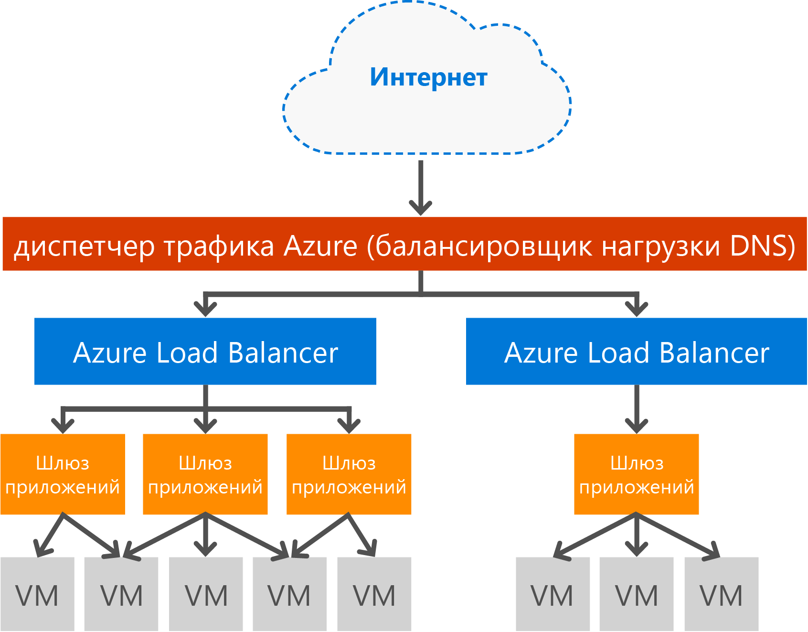

# Обзор шлюза приложений

Шлюз приложений Microsoft Azure является выделенным виртуальным устройством, которое предоставляет контроллер доставки приложений (ADC) как услугу. Он предлагает различные возможности подсистемы балансировки нагрузки уровня 7 для вашего приложения. Таким образом, пользователи могут оптимизировать производительность веб-фермы за счет выполнения операции завершения SSL-запросов, требующей интенсивного использования ЦП, на шлюзе приложений. Кроме того, пользователи получают другие возможности маршрутизации уровня 7, включая распределение входящего трафика методом циклического перебора, соответствие сеансу на основе файлов cookie, маршрутизацию на основе URL-путей и возможность размещения нескольких веб-сайтов за одним шлюзом приложений. Брандмауэр веб-приложений (WAF) также предоставляется как часть SKU WAF шлюза приложений. Он обеспечивает защиту веб-приложений от распространенных веб-уязвимостей и эксплойтов. Шлюз приложений можно настроить как шлюз с выходом в Интернет, внутренний шлюз или их сочетание. 

## Функции

Шлюз приложений в настоящее время предоставляет следующие возможности:

* **[Брандмауэр веб-приложения.](application-gateway-webapplicationfirewall-overview.md)** Брандмауэр веб-приложения (WAF) в шлюзе приложений Azure защищает веб-приложения от таких распространенных веб-атак, как атаки путем внедрения кода SQL, атаки межсайтовых скриптов и захваты сеанса.
* **Балансировка нагрузки HTTP.** Шлюз приложений обеспечивает балансировку нагрузки по методу циклического перебора. Она выполняется на уровне 7 и используется только для трафика HTTP(S).
* **Соответствие сеансу на основе файлов cookie.** Эта функция удобна, если нужно, чтобы сеанс пользователя выполнялся на одном и том же внутреннем сервере. Используя управляемые шлюзом файлы cookie, шлюз приложений может направлять последующий трафик из сеанса пользователя в тот же внутренний сервер для обработки. Эта функция важна, когда состояние сеанса пользователя сохраняется локально на внутреннем сервере.
* **[Выгрузка SSL.](application-gateway-ssl-arm.md)** Эта функция позволяет избежать затратной процедуры расшифровки HTTPS-трафика с веб-серверов. Если разорвать SSL-соединение на шлюзе приложений и отправить на сервер незашифрованный запрос, веб-серверу не придется выполнять расшифровку.  Шлюз приложений повторно шифрует ответ перед отправкой в клиент. Эта функция полезна, когда внутренний сервер находится в той же защищенной виртуальной сети, что и шлюз приложений в Azure.
* **[Сквозной режим связи SSL.](application-gateway-backend-ssl.md)** Шлюз приложений поддерживает сквозное шифрование трафика. Для этого шлюз приложений завершает SSL-соединение. Затем шлюз применяет правила маршрутизации к трафику, повторно шифрует пакет и пересылает его в соответствующую серверную часть согласно определенным правилам маршрутизации. Любой ответ веб-сервера проходит через тот же процесс на пути к пользователю.
* **[Маршрутизация содержимого на основе URL-адресов.](application-gateway-url-route-overview.md)** Эта функция позволяет использовать различные внутренние серверы для разного трафика. Трафик для папки на веб-сервере или в сети доставки содержимого может быть направлен в другую серверную часть. Эта возможность сокращает ненужную нагрузку на серверные части, которые не обслуживают конкретное содержимое.
* **[Маршрутизация для нескольких сайтов.](application-gateway-multi-site-overview.md)** На одном шлюзе приложений можно объединять до 20 веб-сайтов.
* **[Поддержка WebSocket.](application-gateway-websocket.md)** Еще одна отличная функция шлюза приложений — встроенная поддержка WebSocket.
* **[Мониторинг работоспособности.](application-gateway-probe-overview.md)** Шлюз приложений обеспечивает используемый по умолчанию мониторинг работоспособности ресурсов серверной части, а также пользовательские пробы для мониторинга в конкретных сценариях.
* **[Политика SSL и шифры](application-gateway-ssl-policy-overview.md)** — это функция, обеспечивающая возможность ограничения версий протокола SSL и наборы шифров, которые поддерживаются, а также порядок их обработки.
* **[Перенаправление запросов.](application-gateway-redirect-overview.md)** Эта функция предоставляет возможность перенаправлять HTTP запросы в прослушиватель HTTPS.
* **[Поддержка мультитенантной серверной части](application-gateway-web-app-overview.md)**. Шлюз приложения поддерживает настройку мультитенантных серверных служб, таких как веб-приложения Azure и шлюз API, в качестве участников пула серверной части. 
* **[Расширенная диагностика.](application-gateway-diagnostics.md)** Шлюз приложений предоставляет все журналы доступа и диагностики. Журналы брандмауэра доступны для ресурсов шлюза приложений с включенным WAF.

## Преимущества

Шлюз приложений эффективен:

* Для приложений, которым для получения доступа к одной серверной виртуальной машине требуются запросы от сеанса одного пользователя или клиента. В качестве примера таких приложений можно привести приложения корзины для покупок и почтовые веб-серверы.
* Для освобождения веб-сервера от нагрузки, связанной с завершением SSL-запросов.
* Такие приложения, как сеть доставки содержимого, которым для маршрутизации или распределения нагрузки на другие внутренние серверы требуются многократные HTTP-запросы к одному и тому же долгосрочному подключению TCP.
* Приложения, поддерживающие трафик WebSocket
* Для защиты веб-приложений от таких распространенных сетевых атак, как атаки путем внедрения кода SQL, атаки межсайтовых скриптов и захваты сеанса.
* Для логического распределения трафика на основе различных критериев маршрутизации, например URL-адреса или заголовка домена.

Шлюз приложений полностью управляем Azure, масштабируем и обладает высоким уровнем доступности. Для более эффективного управления предоставляется широкий набор возможностей ведения журнала и диагностики. При создании этого шлюза конечная точка (общедоступный виртуальный IP-адрес или IP-адрес внутреннего балансировщика нагрузки) связывается и используется для входящего сетевого трафика. Общедоступный виртуальный IP-адрес или IP-адрес внутреннего балансировщика нагрузки обеспечивается службой Azure Load Balancer. Она работает на транспортном уровне (TCP/UDP), и с ее помощью выполняется балансировка нагрузки всего входящего сетевого трафика рабочих экземпляров шлюза приложений. В зависимости от своей конфигурации шлюз приложений направляет трафик HTTP/HTTPS в виртуальную машину, облачную службу или на внешний или внутренний IP-адрес.

Как служба под управлением Azure, балансировка нагрузки шлюза приложений позволяет использовать подсистему балансировщика нагрузки 7 уровня в обход подсистемы балансировщика нагрузки программного обеспечения Azure. Диспетчер трафика можно использовать для выполнения сценария, показанного на следующем изображении. В этом случае диспетчер трафика обеспечивает перенаправление трафика, а также его доступность для нескольких ресурсов шлюза приложений, а шлюз приложений — балансировку нагрузки уровня 7 между регионами. Пример такого сценария см. в статье [Using load balancing services in the Azure cloud](../traffic-manager/traffic-manager-load-balancing-azure.md) (Использование служб балансировки нагрузки в облаке Azure).

[!INCLUDE [load-balancer-compare-tm-ag-lb-include.md](../../includes/load-balancer-compare-tm-ag-lb-include.md)]

## Размеры и экземпляры шлюза

Шлюз приложений сейчас предлагается в трех размерах: **малый**, **средний** и **большой**. Экземпляры малого размера предназначены для разработки и тестирования сценариев.

На каждую подписку можно создавать до 50 шлюзов приложений, а у каждого шлюза может быть до 10 экземпляров. Каждый шлюз приложений может состоять из 20 прослушивателей HTTP. Полный список ограничений шлюза приложений см. [здесь](../azure-subscription-service-limits.md?toc=%2fazure%2fapplication-gateway%2ftoc.json#application-gateway-limits).

В таблице ниже показана средняя пропускная способность каждого экземпляра шлюза приложений с активированной разгрузкой SSL.

| Ответ страницы сервера | Малый | Средний | большой |
| --- | --- | --- | --- |
| 6K |7,5 Мбит/с |13 Мбит/с |50 Мбит/с |
| 100 тыс |35 Мбит/с |100 Мбит/с |200 Мбит/с |

> [!NOTE]
> Это примерные значения для настройки пропускной способности шлюза приложений. Фактическая пропускная способность зависит от различных параметров среды, таких как средний размер страницы, расположение внутренних экземпляров и время обработки страницы сервером. Чтобы точно определить производительность, выполните собственные тесты. Приведенные здесь значения служат только для планирования емкости.

## Мониторинг работоспособности

Шлюз приложений Azure автоматически отслеживает работоспособность серверных экземпляров с помощью базовых или пользовательских проверок работоспособности. Это позволяет гарантировать, что только работоспособные узлы отвечают на трафик. Дополнительные сведения см. в статье [Обзор мониторинга работоспособности шлюза приложений](application-gateway-probe-overview.md).

## Настройка и управление

У конечной точки шлюза приложений может быть общедоступный, частный IP-адрес или оба, если они настроены. Шлюз приложений настроен внутри виртуальной сети в собственной подсети. Подсеть, созданная или используемая для шлюза приложений, не может содержать другие типы ресурсов. В качестве ресурсов в сети разрешаются только другие шлюзы приложений. Для защиты ресурсов серверной части внутренние серверы можно поместить в подсеть, отличную от подсети шлюза приложений, в той же виртуальной сети. Для внутренних приложений эта подсеть не требуется. Пока шлюз приложений может обратиться по IP-адресу, он может предоставить возможности ADC для внутренних серверов. 

Для создания шлюзов приложений и управления ими можно использовать REST API, командлеты PowerShell, интерфейс командной строки Azure или [портал Azure](https://portal.azure.com/). Список стандартных часто задаваемых вопросов о шлюзе приложений см. в [этой статье](application-gateway-faq.md).

## Цены

Цена зависит от почасовой стоимости использования экземпляра шлюза и стоимости обработки данных. Почасовая стоимость использования номера SKU WAF и стандартного номера SKU отличается. Сведения о ценах можно найти на [странице цен на шлюз приложений](https://azure.microsoft.com/pricing/details/application-gateway/). Плата за обработку данных остается неизменной.

## Часто задаваемые вопросы

См. [вопросы и ответы, связанные с использованием шлюза приложений](application-gateway-faq.md).

## Дополнительная информация

Изучив принципы создания шлюза приложений, вы можете [создать шлюз приложений](application-gateway-create-gateway-portal.md) или [разгрузку SSL шлюза приложений](application-gateway-ssl-arm.md) для балансировки нагрузки подключений HTTPS.

Чтобы узнать, как создать шлюз приложений с маршрутизацией содержимого на основе URL-адресов, за дополнительной информацией обратитесь к статье [Создание шлюза приложений с помощью маршрутизации на основе URL-адресов](application-gateway-create-url-route-arm-ps.md) .

Дополнительные сведения о некоторых других ключевых сетевых возможностях Azure см. в разделе [Сеть Azure](../networking/networking-overview.md).
