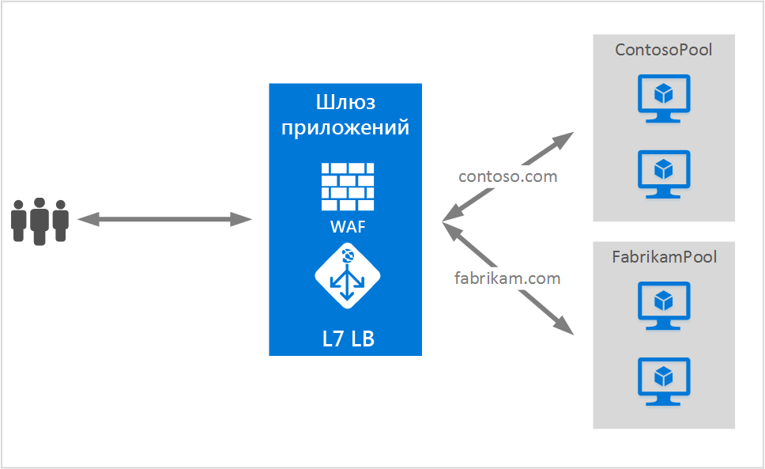

# <a name="application-gateway-multiple-site-hosting"></a>Размещение нескольких сайтов с помощью шлюза приложений

Размещение нескольких сайтов позволяет настроить в одном экземпляре шлюза приложений не одно, а несколько веб-приложений. Эта функция позволяет настроить более эффективную топологию развернутых служб, добавляя до 20 веб-сайтов в один шлюз приложений. Каждый веб-сайт может быть направлен в свой собственный внутренний пул. В следующем примере шлюз приложений обслуживает трафик сайтов contoso.com и fabrikam.com с помощью двух внутренних пулов серверов: ContosoServerPool и FabrikamServerPool.



> [!IMPORTANT]
> Правила обрабатываются в том порядке, в котором они указаны на портале. Мы настоятельно рекомендуем в первую очередь настроить многосайтовые прослушиватели, чтобы настроить базовый прослушиватель.  Это позволит гарантировать, что трафик будет перенаправлен на правильный внутренний сервер. Если базовый прослушиватель стоит первым в списке и совпадает с входящим запросом, он будет обрабатываться прослушивателем.

Запросы к http://contoso.com будут направляться в пул ContosoServerPool, а запросы к http://fabrikam.com — в пул FabrikamServerPool.

Точно так же в одном развернутом шлюзе приложений можно разместить два поддомена одного родительского домена. К примерам использования поддоменов можно отнести http://blog.contoso.com и http://app.contoso.com, размещенные в одном развернутом шлюзе приложений.

## <a name="host-headers-and-server-name-indication-sni"></a>Заголовки узлов и указание имени сервера (SNI)

Существует три распространенных механизма, обеспечивающих размещение нескольких сайтов в одной инфраструктуре:

1. Размещение нескольких веб-приложений с уникальным IP-адресом у каждого из них.
2. Использование имени узла для размещения нескольких веб-приложений на одном IP-адресе.
3. Использование разных портов для размещения нескольких веб-приложений на одном IP-адресе.

В настоящее время шлюз приложений получает один общедоступный IP-адрес, на котором он прослушивает трафик. Поэтому поддержка нескольких приложений, каждое из которых имеет собственный IP-адрес, сейчас не обеспечивается. Шлюз приложений поддерживает размещение нескольких приложений, которые прослушивают разные порты. В рамках этого сценария приложениям нужно принимать трафик через нестандартные порты, что часто является нежелательным для конфигурации. Шлюз приложений использует заголовки узлов HTTP 1.1 для размещения нескольких веб-сайтов на одном общедоступном IP-адресе и порте. Сайты, размещенные в шлюзе приложений, могут также поддерживать разгрузку SSL с использованием расширения TLS для указания имени сервера (SNI). В рамках этого сценария это значит, что браузер клиента и внутренняя веб-ферма должны поддерживать HTTP/1.1 и расширение TLS, как определено в стандарте RFC 6066.

## <a name="listener-configuration-element"></a>Элемент конфигурации прослушивателя

Существующий элемент конфигурации HTTPListener усовершенствован для поддержки элементов имени узла и указания имени сервера, используемых шлюзом приложений для маршрутизации трафика в соответствующий внутренний пул. Ниже приведен пример кода, который является фрагментом элемента HttpListeners из файла шаблона.

```json
"httpListeners": [
    {
        "name": "appGatewayHttpsListener1",
        "properties": {
            "FrontendIPConfiguration": {
                "Id": "/subscriptions/<subid>/resourceGroups/<rgName>/providers/Microsoft.Network/applicationGateways/applicationGateway1/frontendIPConfigurations/DefaultFrontendPublicIP"
            },
            "FrontendPort": {
                "Id": "/subscriptions/<subid>/resourceGroups/<rgName>/providers/Microsoft.Network/applicationGateways/applicationGateway1/frontendPorts/appGatewayFrontendPort443'"
            },
            "Protocol": "Https",
            "SslCertificate": {
                "Id": "/subscriptions/<subid>/resourceGroups/<rgName>/providers/Microsoft.Network/applicationGateways/applicationGateway1/sslCertificates/appGatewaySslCert1'"
            },
            "HostName": "contoso.com",
            "RequireServerNameIndication": "true"
        }
    },
    {
        "name": "appGatewayHttpListener2",
        "properties": {
            "FrontendIPConfiguration": {
                "Id": "/subscriptions/<subid>/resourceGroups/<rgName>/providers/Microsoft.Network/applicationGateways/applicationGateway1/frontendIPConfigurations/appGatewayFrontendIP'"
            },
            "FrontendPort": {
                "Id": "/subscriptions/<subid>/resourceGroups/<rgName>/providers/Microsoft.Network/applicationGateways/applicationGateway1/frontendPorts/appGatewayFrontendPort80'"
            },
            "Protocol": "Http",
            "HostName": "fabrikam.com",
            "RequireServerNameIndication": "false"
        }
    }
],
```

Комплексное развертывание с помощью шаблона можно изучить на примере [шаблона Resource Manager, использующего размещение нескольких сайтов](https://github.com/Azure/azure-quickstart-templates/blob/master/201-application-gateway-multihosting).

## <a name="routing-rule"></a>Правило маршрутизации

Правило маршрутизации изменять не нужно. Следует все так же выбрать базовое правило маршрутизации, чтобы привязать соответствующий сайт прослушивателя к нужному внутреннему пулу адресов.

```json
"requestRoutingRules": [
{
    "name": "<ruleName1>",
    "properties": {
        "RuleType": "Basic",
        "httpListener": {
            "id": "/subscriptions/<subid>/resourceGroups/<rgName>/providers/Microsoft.Network/applicationGateways/applicationGateway1/httpListeners/appGatewayHttpsListener1')]"
        },
        "backendAddressPool": {
            "id": "/subscriptions/<subid>/resourceGroups/<rgName>/providers/Microsoft.Network/applicationGateways/applicationGateway1/backendAddressPools/ContosoServerPool')]"
        },
        "backendHttpSettings": {
            "id": "/subscriptions/<subid>/resourceGroups/<rgName>/providers/Microsoft.Network/applicationGateways/applicationGateway1/backendHttpSettingsCollection/appGatewayBackendHttpSettings')]"
        }
    }

},
{
    "name": "<ruleName2>",
    "properties": {
        "RuleType": "Basic",
        "httpListener": {
            "id": "/subscriptions/<subid>/resourceGroups/<rgName>/providers/Microsoft.Network/applicationGateways/applicationGateway1/httpListeners/appGatewayHttpListener2')]"
        },
        "backendAddressPool": {
            "id": "/subscriptions/<subid>/resourceGroups/<rgName>/providers/Microsoft.Network/applicationGateways/applicationGateway1/backendAddressPools/FabrikamServerPool')]"
        },
        "backendHttpSettings": {
            "id": "/subscriptions/<subid>/resourceGroups/<rgName>/providers/Microsoft.Network/applicationGateways/applicationGateway1/backendHttpSettingsCollection/appGatewayBackendHttpSettings')]"
        }
    }

}
]
```

## <a name="next-steps"></a>Дополнительная информация

Изучив размещение нескольких сайтов, перейдите к [созданию шлюза приложений с использованием размещения нескольких сайтов](application-gateway-create-multisite-azureresourcemanager-powershell.md) , чтобы создать шлюз приложений с возможностью поддержки нескольких веб-приложений.

