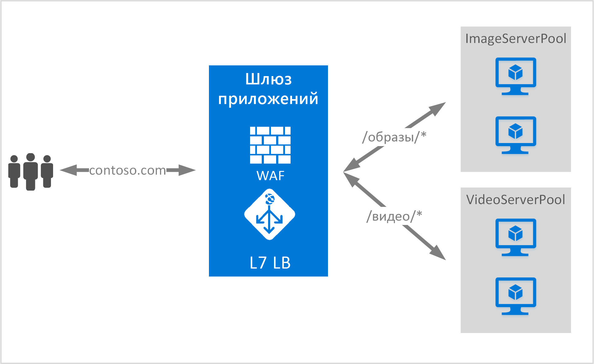

<properties
   pageTitle="Общие сведения о маршрутизации содержимого на основе URL-адресов | Microsoft Azure"
   description="Эта страница содержит общие сведения о маршрутизации содержимого шлюза приложений на основе URL-адресов, настройки UrlPathMap и правила PathBasedRouting."
   documentationCenter="na"
   services="application-gateway"
   authors="georgewallace"
   manager="carmonm"
   editor="tysonn"/>
<tags
   ms.service="application-gateway"
   ms.devlang="na"
   ms.topic="article"
   ms.tgt_pltfrm="na"
   ms.workload="infrastructure-services"
   ms.date="09/16/2016"
   ms.author="gwallace"/>

# Общие сведения о маршрутизации на основе URL-путей

Маршрутизация на основе URL-путей позволяет направлять трафик в пулы тыловых серверов в зависимости от URL-путей поступающих запросов. Один из сценариев — это маршрутизация запросов содержимого различных типов в различные пулы тыловых серверов. В следующем примере шлюз приложений обслуживает трафик веб-сайта contoso.com с трех пулов тыловых серверов, например VideoServerPool, ImageServerPool и DefaultServerPool.

Запросы к http://contoso.com/video* направляются в пул VideoServerPool, а запросы к http://contoso.com/images* — в пул ImageServerPool. Если ни один из шаблонов пути не подходит, выбирается пул DefaultServerPool.

## Элемент конфигурации UrlPathMap

Элемент UrlPathMap используется для указания шаблонов пути при сопоставлении с пулом тыловых серверов. Ниже приведен пример кода, который является фрагментом элемента urlPathMap из файла шаблона.

	"urlPathMaps": [
	{
    "name": "<urlPathMapName>",
    "id": "/subscriptions/<subscriptionId>/../microsoft.network/applicationGateways/<gatewayName>/ urlPathMaps/<urlPathMapName>",
    "properties": {
        "defaultBackendAddressPool": {
            "id": "/subscriptions/<subscriptionId>/../microsoft.network/applicationGateways/<gatewayName>/backendAddressPools/<poolName>"
        },
        "defaultBackendHttpSettings": {
            "id": "/subscriptions/<subscriptionId>/../microsoft.network/applicationGateways/<gatewayName>/backendHttpSettingsList/<settingsName>"
        },
        "pathRules": [
            {
                "paths": [
                    <pathPattern>
                ],
                "backendAddressPool": {
                    "id": "/subscriptions/<subscriptionId>/../microsoft.network/applicationGateways/<gatewayName>/backendAddressPools/<poolName2>"
                },
                "backendHttpsettings": {
                    "id": "/subscriptions/<subscriptionId>/../microsoft.network/applicationGateways/<gatewayName>/backendHttpsettingsList/<settingsName2>"
                },

            },

        ],

    }
	}
	

>[AZURE.NOTE] Параметр PathPattern представляет список шаблонов пути для сопоставления. Каждый шаблон должен начинаться с косой черты (/). Символ * может быть только в конце после косой черты. Строка, передаваемая для сопоставления пути, не должна содержать никакого текста после первого символа ? или # — эти символы не допускаются.

Дополнительные сведения см. в статье [Resource Manager template using URL-based routing](https://azure.microsoft.com/documentation/templates/201-application-gateway-url-path-based-routing) (Шаблон Resource Manager с использованием маршрутизации на основе URL-адресов).

## Правило PathBasedRouting

Правило RequestRoutingRule типа PathBasedRouting используется для привязки прослушивателя к urlPathMap. Все получаемые запросы для этого прослушивателя распределяются согласно политике, указанной в urlPathMap. Фрагмент правила PathBasedRouting:

	"requestRoutingRules": [
  	{

    "name": "<ruleName>",
    "id": "/subscriptions/<subscriptionId>/../microsoft.network/applicationGateways/<gatewayName>/requestRoutingRules/<ruleName>",
    "properties": {
        "ruleType": "PathBasedRouting",
        "httpListener": {
            "id": "/subscriptions/<subscriptionId>/../microsoft.network/applicationGateways/<gatewayName>/httpListeners/<listenerName>"
        },
        "urlPathMap": {
            "id": "/subscriptions/<subscriptionId>/../microsoft.network/applicationGateways/<gatewayName>/ urlPathMaps/<urlPathMapName>"
        },

    }
	
## Дальнейшие действия

Ознакомившись с маршрутизацией на основе URL-адресов, создайте шлюз приложений с соответствующими правилами маршрутизации, как указано в статье о [создании шлюза приложений с помощью маршрутизации на основе URL-адресов](application-gateway-create-url-route-portal.md).

<!---HONumber=AcomDC_0921_2016-->