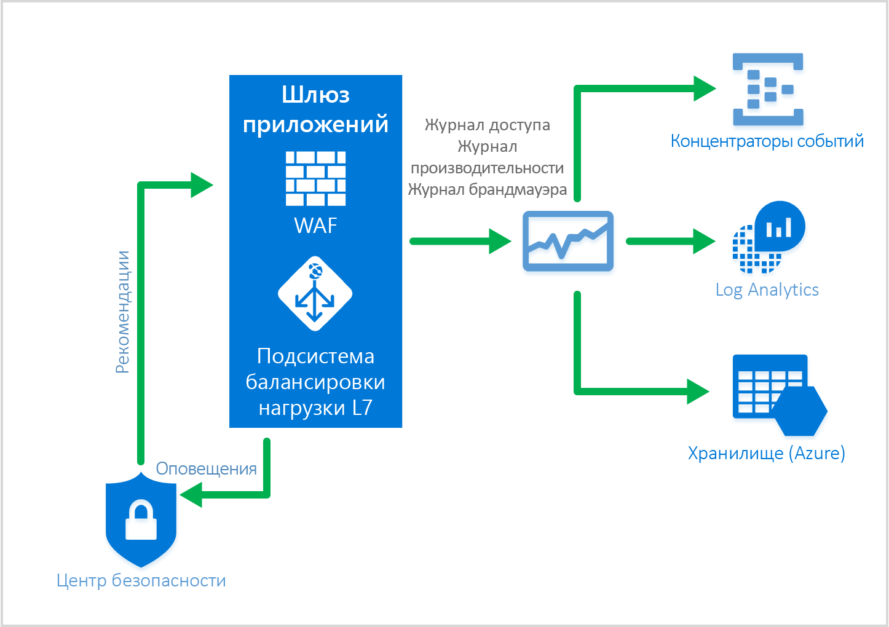

# <a name="web-application-firewall-waf"></a>Брандмауэр веб-приложения (WAF)

Брандмауэр веб-приложения (WAF) — это компонент шлюза приложений, обеспечивающий централизованную защиту веб-приложений от распространенных эксплойтов и уязвимостей. 

Брандмауэр веб-приложения обеспечивает такие возможности на основе правил из [основных наборов правил OWASP](https://www.owasp.org/index.php/Category:OWASP_ModSecurity_Core_Rule_Set_Project) версии 3.0 или 2.2.9. Веб-приложения все чаще подвергаются вредоносным атакам, использующим общеизвестные уязвимости. Повсеместно используются уязвимости для атак путем внедрения кода SQL и межсайтовых сценариев, и это лишь немногие из них. Предотвращение таких атак в коде приложения может быть сложной задачей, требующей неукоснительного обслуживания, установки исправлений и мониторинга на различных уровнях топологии приложения. Централизованный брандмауэр веб-приложения значительно упрощает управление безопасностью и помогает администраторам защищать приложение от угроз вторжения. Решение WAF может быстрее реагировать на угрозы безопасности по сравнению с защитой каждого отдельного веб-приложения благодаря установке исправлений известных уязвимостей в центральном расположении. Существующие шлюзы приложений можно преобразовать в шлюзы приложений с поддержкой брандмауэра веб-приложений.


Шлюз приложений работает как контроллер доставки приложений и предлагает функции моста SSL, сходство сеансов на основе файлов cookie, распределение нагрузки по методу циклического перебора, маршрутизацию на основе содержимого, возможность размещения нескольких веб-сайтов и повышенную безопасность. К усовершенствованиям системы безопасности шлюза приложений относятся управление политиками SSL и поддержка сквозного режима связи SSL. Теперь защита приложений усилена за счет прямой интеграции WAF (брандмауэра веб-приложения) с предложением ADC. Это позволяет легко настроить централизованное управление и защиту веб-приложений от распространенных сетевых уязвимостей.

## <a name="benefits"></a>Преимущества

Ниже перечислены основные преимущества шлюза приложений и брандмауэра веб-приложения.

### <a name="protection"></a>Защита

* Защита веб-приложения от сетевых уязвимостей и атак без изменения в коде серверной части.

* Одновременная защита нескольких веб-приложений с помощью шлюза приложений. Шлюз приложений поддерживает размещение до 20 веб-сайтов за одним шлюзом, который позволяет защитить их все от сетевых атак с помощью WAF.

### <a name="monitoring"></a>Мониторинг

* Выполняйте мониторинг веб-приложения для защиты от атак, используя журнал WAF в режиме реального времени. Этот журнал интегрирован с [Azure Monitor](../monitoring-and-diagnostics/monitoring-overview.md) для отслеживания журналов и оповещений WAF и простого мониторинга тенденций.

* WAF интегрируется с центром безопасности Azure. Благодаря центру безопасности Azure вы получаете полное представление о состоянии безопасности всех своих ресурсов в Azure.

### <a name="customization"></a>Настройка

* Возможность настройки правил и групп правил WAF согласно требованиям приложения для уменьшения числа ложноположительных результатов.

## <a name="features"></a>Функции

По умолчанию брандмауэр веб-приложения поставляется с CR 3.0. Кроме того, можно использовать версию 2.2.9. В предложениях CR 3.0 сократилось число ложноположительных результатов по сравнению с CR 2.2.9. Предоставляется возможность [настройки правил в соответствии с требованиями](application-gateway-customize-waf-rules-portal.md). Ниже представлены некоторые из распространенных сетевых уязвимостей, которые позволяет устранить брандмауэр веб-приложения.

* Защита от внедрения кода SQL.
* Защита от межсайтовых сценариев.
* Защита от распространенных сетевых атак, в том числе от внедрения команд, несанкционированных HTTP-запросов, разделения HTTP-запросов и атак с включением удаленного файла.
* Защита от нарушений протокола HTTP.
* Защита от аномалий протокола HTTP, например отсутствия агента пользователя узла и заголовков accept.
* Защита от программ-роботов, программ-обходчиков и сканеров.
* Обнаружение распространенных неправильных конфигураций приложений (например, Apache, IIS и т. д.).

Более подробный список правил и соответствующие возможности защиты см. в разделе [Основные наборы правил](#core-rule-sets).

### <a name="core-rule-sets"></a>Основные наборы правил

Шлюз приложений поддерживает два набора правил: CRS 3.0 и CRS 2.2.9. Это основные наборы правил, защищающие веб-приложения от вредоносных действий.

#### <a name="owasp30"></a>OWASP_3.0

В предоставленном основном наборе правил версии 3.0 есть 13 групп правил, как показано в следующей таблице. Каждая из этих групп правил содержит несколько правил, которые могут быть отключены.

|Группа правил|ОПИСАНИЕ|
|---|---|
|**[REQUEST-911-METHOD-ENFORCEMENT](application-gateway-crs-rulegroups-rules.md#crs911)**|Содержит правила для блокировки методов (PUT, PATCH<..)|
|**[REQUEST-913-SCANNER-DETECTION](application-gateway-crs-rulegroups-rules.md#crs913)**| Содержит правила, обеспечивающие защиту от сканеров портов и среды.|
|**[REQUEST-920-PROTOCOL-ENFORCEMENT](application-gateway-crs-rulegroups-rules.md#crs920)**|Содержит правила, обеспечивающие защиту от проблем с протоколами и кодированием.|
|**[REQUEST-921-PROTOCOL-ATTACK](application-gateway-crs-rulegroups-rules.md#crs921)**|Содержит правила, обеспечивающие защиту от внедрения заголовка, несанкционированных запросов и разделения ответа|
|**[REQUEST-930-APPLICATION-ATTACK-LFI](application-gateway-crs-rulegroups-rules.md#crs930)**|Содержит правила, обеспечивающие защиту от атак, направленных на путь и файлы.|
|**[REQUEST-931-APPLICATION-ATTACK-RFI](application-gateway-crs-rulegroups-rules.md#crs931)**|Содержит правила, обеспечивающие защиту от включения удаленного файла (RFI)|
|**[REQUEST-932-APPLICATION-ATTACK-RCE](application-gateway-crs-rulegroups-rules.md#crs932)**|Содержит правила, обеспечивающие защиту от удаленного выполнения кода|
|**[REQUEST-933-APPLICATION-ATTACK-PHP](application-gateway-crs-rulegroups-rules.md#crs933)**|Содержит правила, обеспечивающие защиту от атак путем внедрения кода PHP.|
|**[REQUEST-941-APPLICATION-ATTACK-XSS](application-gateway-crs-rulegroups-rules.md#crs941)**|Содержит правила, обеспечивающие защиту от выполнения межсайтовых сценариев.|
|**[REQUEST-942-APPLICATION-ATTACK-SQLI](application-gateway-crs-rulegroups-rules.md#crs942)**|Содержит правила, обеспечивающие защиту от атак путем внедрения кода SQL.|
|**[REQUEST-943-APPLICATION-ATTACK-SESSION-FIXATION](application-gateway-crs-rulegroups-rules.md#crs943)**|Содержит правила, обеспечивающие защиту от атак с фиксацией сеанса.|

#### <a name="owasp229"></a>OWASP_2.2.9

В предоставленном основном наборе правил версии 2.2.9 есть 10 групп правил, как показано в следующей таблице. Каждая из этих групп правил содержит несколько правил, которые могут быть отключены.

|Группа правил|ОПИСАНИЕ|
|---|---|
|**[crs_20_protocol_violations](application-gateway-crs-rulegroups-rules.md#crs20)**|Содержит правила, обеспечивающие защиту от нарушений протокола (недопустимые знаки, GET с текстом запроса и т. д.)|
|**[crs_21_protocol_anomalies](application-gateway-crs-rulegroups-rules.md#crs21)**|Содержит правила, обеспечивающие защиту от неверных сведений в заголовке.|
|**[crs_23_request_limits](application-gateway-crs-rulegroups-rules.md#crs23)**|Содержит правила, обеспечивающие защиту от аргументов или файлов с превышенными ограничениями.|
|**[crs_30_http_policy](application-gateway-crs-rulegroups-rules.md#crs30)**|Содержит правила, обеспечивающие защиту от ограниченных методов, заголовков и типов файлов. |
|**[crs_35_bad_robots](application-gateway-crs-rulegroups-rules.md#crs35)**|Содержит правила, обеспечивающие защиту от поисковых модулей и сканеров.|
|**[crs_40_generic_attacks](application-gateway-crs-rulegroups-rules.md#crs40)**|Содержит правила, обеспечивающие защиту от универсальных атак (фиксация сеанса, включение удаленных файлов, внедрение кода PHP и т. д.)|
|**[crs_41_sql_injection_attacks](application-gateway-crs-rulegroups-rules.md#crs41sql)**|Содержит правила, обеспечивающие защиту от атак путем внедрения кода SQL|
|**[crs_41_xss_attacks](application-gateway-crs-rulegroups-rules.md#crs41xss)**|Содержит правила, обеспечивающие защиту от выполнения межсайтовых сценариев.|
|**[crs_42_tight_security](application-gateway-crs-rulegroups-rules.md#crs42)**|Содержит правила, обеспечивающие защиту от атак с обходом пути|
|**[crs_45_trojans](application-gateway-crs-rulegroups-rules.md#crs45)**|Содержит правила, обеспечивающие защиту от программ-троянов, использующих лазейки.|

### <a name="waf-modes"></a>Режимы WAF

WAF шлюза приложений можно настроить для работы в следующих двух режимах:

* **Режим обнаружения**. В этом режиме WAF шлюза приложений обнаруживает и регистрирует все угрозы, сохраняя оповещения в файл журнала. Для шлюза приложений в разделе **Диагностика** нужно включить ведение журнала диагностики. Кроме того, нужно убедиться, что журнал WAF выбран и включен. В режиме обнаружения брандмауэр веб-приложения не блокирует входящие запросы.
* **Режим предотвращения**. В этом режиме шлюз приложений активно блокирует вторжения и атаки, обнаруженные с помощью его правил. Злоумышленник получает исключение "403 — несанкционированный доступ", после чего подключение прерывается. В режиме предотвращения подобные атаки также заносятся в журналы WAF.

### <a name="application-gateway-waf-reports"></a>Мониторинг WAF

Важно наблюдение за работоспособностью шлюза приложений. Мониторинг работоспособности брандмауэра веб-приложения и приложений, которые он защищает, обеспечивается за счет ведения журналов и интеграции с Azure Monitor, центром безопасности Azure и Log Analytics.



#### <a name="azure-monitor"></a>Azure Monitor

Каждый журнал шлюза приложений интегрирован с [Azure Monitor](../monitoring-and-diagnostics/monitoring-overview.md).  Это позволяет отслеживать диагностические сведения, включая журналы и оповещения WAF.  Эта возможность предоставляется в ресурсе шлюза приложений на портале на вкладке **Диагностика** или напрямую через службу Azure Monitor. Дополнительные сведения о включении журналов диагностики для шлюза приложений см. в статье [Мониторинг работоспособности серверной части, ведение журнала диагностики и метрики для шлюза приложений](application-gateway-diagnostics.md).

#### <a name="azure-security-center"></a>Центр безопасности Azure

[Центр безопасности Azure](../security-center/security-center-intro.md) помогает вам выявлять и предотвращать угрозы, а также принимать ответные меры благодаря более полной информации о состоянии ресурсов Azure и контролю над их безопасностью. Шлюз приложений [интегрируется в центр безопасности Azure](application-gateway-integration-security-center.md). Центр безопасности Azure проверяет среды для обнаружения незащищенных веб-приложений. Теперь он может рекомендовать WAF шлюза приложений для защиты таких уязвимых ресурсов. WAF шлюза приложений можно создать непосредственно в центре безопасности Azure.  Эти экземпляры WAF интегрируются с центром безопасности Azure. Они будут отправлять предупреждения и сведения о работоспособности в центр безопасности Azure для создания отчетов.


#### <a name="logging"></a>Ведение журналов

WAF шлюза приложений предоставляет подробные отчеты о каждой из обнаруженных угроз. Функция ведения журналов интегрирована с журналами системы диагностики Azure, и оповещения записываются в формате JSON. Эти журналы можно интегрировать с [Log Analytics](../log-analytics/log-analytics-azure-networking-analytics.md).


```json
{
  "resourceId": "/SUBSCRIPTIONS/{subscriptionId}/RESOURCEGROUPS/{resourceGroupId}/PROVIDERS/MICROSOFT.NETWORK/APPLICATIONGATEWAYS/{appGatewayName}",
  "operationName": "ApplicationGatewayFirewall",
  "time": "2017-03-20T15:52:09.1494499Z",
  "category": "ApplicationGatewayFirewallLog",
  "properties": {
    "instanceId": "ApplicationGatewayRole_IN_0",
    "clientIp": "104.210.252.3",
    "clientPort": "4835",
    "requestUri": "/?a=%3Cscript%3Ealert(%22Hello%22);%3C/script%3E",
    "ruleSetType": "OWASP",
    "ruleSetVersion": "3.0",
    "ruleId": "941320",
    "message": "Possible XSS Attack Detected - HTML Tag Handler",
    "action": "Blocked",
    "site": "Global",
    "details": {
      "message": "Warning. Pattern match \"<(a|abbr|acronym|address|applet|area|audioscope|b|base|basefront|bdo|bgsound|big|blackface|blink|blockquote|body|bq|br|button|caption|center|cite|code|col|colgroup|comment|dd|del|dfn|dir|div|dl|dt|em|embed|fieldset|fn|font|form|frame|frameset|h1|head|h ...\" at ARGS:a.",
      "data": "Matched Data: <script> found within ARGS:a: <script>alert(\\x22hello\\x22);</script>",
      "file": "rules/REQUEST-941-APPLICATION-ATTACK-XSS.conf",
      "line": "865"
    }
  }
} 

```

## <a name="application-gateway-waf-sku-pricing"></a>Цена на SKU для WAF шлюза приложений

Брандмауэр веб-приложения предоставляется в новом номере SKU WAF. Этот номер SKU доступен только в модели подготовки Azure Resource Manager и недоступен в классической модели развертывания. Кроме того, в пределах номера SKU WAF поставляются только экземпляры шлюза приложений среднего и крупного размера. Все ограничения для шлюза приложений также применяются и к номеру SKU WAF. Цена зависит от почасовой стоимости использования экземпляра шлюза и стоимости обработки данных. Почасовая стоимость использования номера SKU WAF и стандартного номера SKU отличается. Дополнительные сведения см. на [странице цен на шлюз приложений](https://azure.microsoft.com/pricing/details/application-gateway/). Плата за обработку данных остается неизменной. Плата за правило или группу правил отсутствует. Вы можете бесплатно обеспечить защиту нескольких веб-приложений за одним брандмауэром веб-приложения. 


## <a name="next-steps"></a>Дополнительная информация

После изучения возможностей WAF можно ознакомиться с разделом [Создание шлюза приложений с брандмауэром веб-приложения с помощью портала](application-gateway-web-application-firewall-portal.md).

