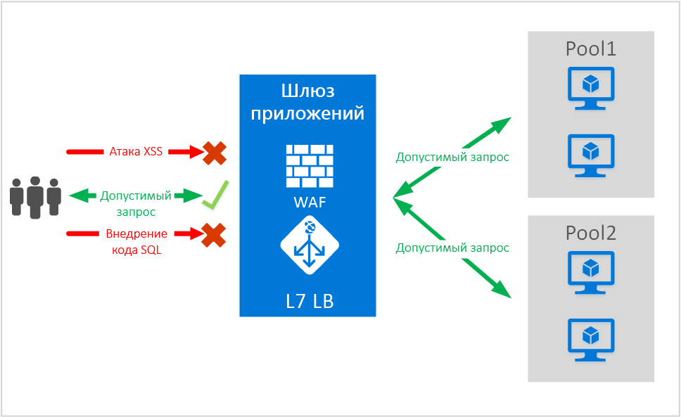
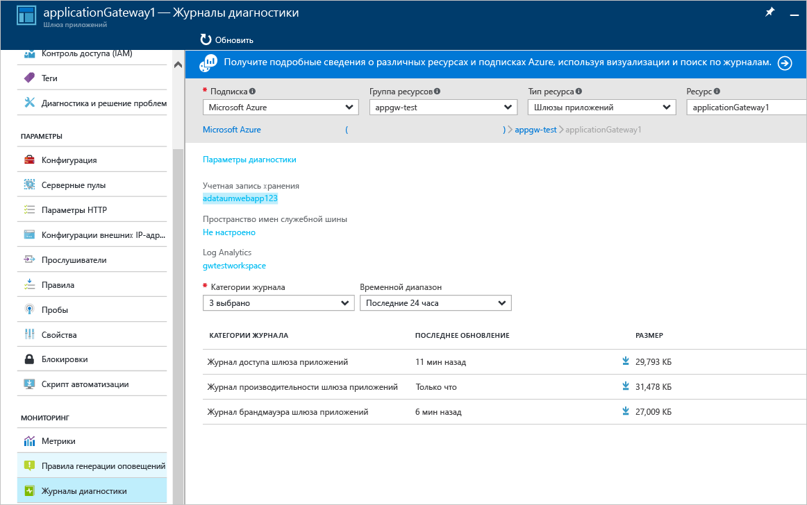

# <a name="application-gateway-web-application-firewall-preview"></a>Брандмауэр веб-приложения шлюза приложений (предварительная версия)

Брандмауэр веб-приложения (WAF) — это функция шлюза приложений Azure, которая обеспечивает защиту веб-приложений, использующих шлюз приложений для стандартных функций управления доставкой приложений. Принцип работы брандмауэра веб-приложения заключается в защите приложений от большинства из основных десяти уязвимостей OWASP. Веб-приложения все чаще подвергаются вредоносным атакам, использующим общеизвестные уязвимости. Повсеместно используются уязвимости для атак путем внедрения кода SQL и межсайтовых сценариев, и это лишь немногие из них. Предотвращение таких атак в коде приложения может быть сложной задачей, требующей неукоснительного обслуживания, установки исправлений и мониторинга на различных уровнях топологии приложения. Централизованная защита от сетевых атак с помощью брандмауэра веб-приложения значительно упрощает управление безопасностью и помогает приложению избегать угроз вторжения. Решение WAF может быстрее реагировать на угрозы безопасности по сравнению с защитой каждого отдельного веб-приложения благодаря установке исправлений известных уязвимостей в центральном расположении. Существующие шлюзы приложений можно легко преобразовать в шлюзы приложений с поддержкой брандмауэра веб-приложений.



Шлюз приложений выполняет работает как контроллер доставки приложений и предлагает функции моста SSL, сходство сеансов на основе файлов cookie, распределение нагрузки по методу циклического перебора, маршрутизацию на основе содержимого, возможность размещения нескольких веб-сайтов и повышенную безопасность. К усовершенствованиям системы безопасности шлюза приложений относятся управление политиками SSL и поддержка сквозного режима связи SSL. Мы расширяем наши возможности по защите приложений, введя брандмауэр веб-приложения (WAF), который непосредственно интегрируется в предложение ADC. Это позволяет легко настроить централизованное управление и защиту веб-приложений от распространенных сетевых уязвимостей.

Настройка WAF в шлюзе приложений предоставляет следующие преимущества.

* Защита веб-приложения от сетевых уязвимостей и атак без изменения в коде серверной части.
* Одновременная защита нескольких веб-приложений с помощью шлюза приложений. Шлюз приложений поддерживает размещение до 20 веб-сайтов за одним шлюзом, который позволяет защитить их все от сетевых атак.
* Мониторинг веб-приложения на наличие атак с помощью отчета, создаваемого в режиме реального времени на основе журналов WAF шлюза приложений.
* Для некоторых элементов управления соответствием требованиям необходимо, чтобы все конечные точки для Интернета были защищены решением WAF. С помощью шлюза приложений с включенным WAF вы можете удовлетворить эти требования.

## <a name="overview"></a>Обзор

WAF шлюза приложений предоставляется по новому SKU (SKU WAF) и поставляется с предварительно настроенным компонентом ModSecurity и набором основных правил OWASP, что обеспечивает базовую защиту от большинства распространенных сетевых уязвимостей, описанных в документе OWASP Top 10.

* Защита от внедрения кода SQL.
* Защита от межсайтовых сценариев.
* Защита от распространенных сетевых атак, в том числе от внедрения команд, несанкционированных HTTP-запросов, разделения HTTP-запросов и атак с включением удаленного файла.
* Защита от нарушений протокола HTTP.
* Защита от аномалий протокола HTTP, например отсутствия агента пользователя узла и заголовков accept.
* Защита от программ-роботов, программ-обходчиков и сканеров.
* Обнаружение распространенных неправильных настроек приложений (т. е. Apache, IIS и т. д.).

## <a name="waf-modes"></a>Режимы WAF

WAF шлюза приложений можно настроить для работы в следующих двух режимах:

* **Режим обнаружения**. В этом режиме WAF шлюза приложений обнаруживает и регистрирует все угрозы, сохраняя оповещения в файл журнала. Необходимо убедиться, что для шлюза приложений в разделе "Диагностика" включено ведение журнала диагностики. Кроме того, нужно убедиться, что журнал WAF выбран и включен.
* **Режим предотвращения**. В этом режиме шлюз приложений активно блокирует вторжения и атаки, обнаруженные с помощью его правил. Злоумышленник получает исключение "403 — несанкционированный доступ", после чего подключение прерывается. В режиме предотвращения подобные атаки также заносятся в журналы WAF.

## <a name="application-gateway-waf-reports"></a>Отчеты WAF шлюза приложений

WAF шлюза приложений предоставляет подробные отчеты о каждой из обнаруженных угроз. Функция ведения журналов интегрирована с журналами системы диагностики Azure, и оповещения записываются в формате JSON.



```json
{
    "resourceId": "/SUBSCRIPTIONS/<subscriptionId>/RESOURCEGROUPS/<resourceGroupName>/PROVIDERS/MICROSOFT.NETWORK/APPLICATIONGATEWAYS/<applicationGatewayName>",
    "operationName": "ApplicationGatewayFirewall",
    "time": "2016-09-20T00:40:04.9138513Z",
    "category": "ApplicationGatewayFirewallLog",
    "properties":     {
        "instanceId":"ApplicationGatewayRole_IN_0",
        "clientIp":"108.41.16.164",
        "clientPort":1815,
        "requestUri":"/wavsep/active/RXSS-Detection-Evaluation-POST/",
        "ruleId":"OWASP_973336",
        "message":"XSS Filter - Category 1: Script Tag Vector",
        "action":"Logged",
        "site":"Global",
        "message":"XSS Filter - Category 1: Script Tag Vector",
        "details":{"message":" Warning. Pattern match "(?i)(<script","file":"/owasp_crs/base_rules/modsecurity_crs_41_xss_attacks.conf","line":"14"}}
}
```

## <a name="application-gateway-waf-sku-pricing"></a>Цена на SKU для WAF шлюза приложений

На этапе предварительной версии отсутствуют какие-либо дополнительные платежи за использование WAF шлюза приложений. Будет взиматься оплата согласно текущим тарифам SKU "Базовый". Мы сообщим цены на SKU для WAF после выпуска общедоступной версии. С пользователей, выбравших развертывание шлюза приложений со SKU для WAF, оплата согласно этого SKU начнет взиматься только после выпуска общедоступной версии WAF.

## <a name="next-steps"></a>Дальнейшие действия

После изучения возможностей WAF можно ознакомиться с разделом [Создание шлюза приложений с брандмауэром веб-приложения с помощью портала](application-gateway-web-application-firewall-portal.md).


<!--HONumber=Nov16_HO3-->


