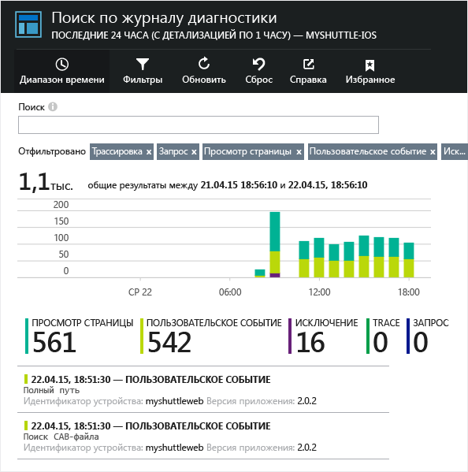
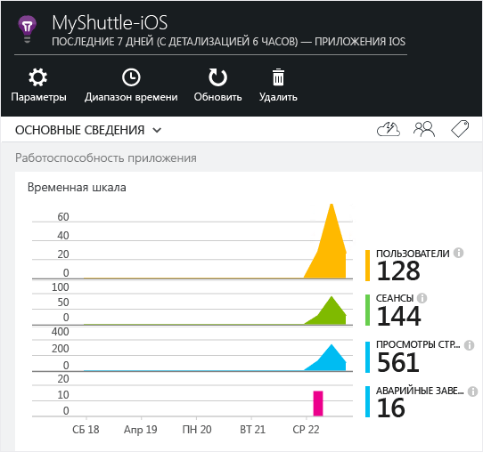
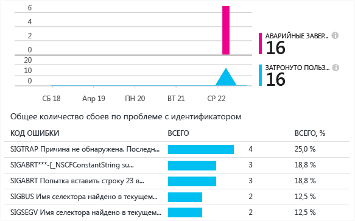

<properties 
    pageTitle="Application Insights для приложений Android" 
    description="Анализ использования и производительности приложения Windows с помощью Application Insights." 
    services="application-insights" 
    documentationCenter="android"
    authors="alancameronwills" 
    manager="ronmart"/>

<tags 
    ms.service="application-insights" 
    ms.workload="mobile" 
    ms.tgt_pltfrm="mobile-android" 
    ms.devlang="na" 
    ms.topic="article" 
	ms.date="04/28/2015" 
    ms.author="awills"/>

# Application Insights для приложений Android

Visual Studio Application Insights позволяет отслеживать мобильные приложения для оценки частоты использования, характера событий и сбоев.

## Требования

Вам потребуется следующее:

* подписка на [Microsoft Azure](http://azure.com). Вход выполняется с помощью учетной записи Майкрософт, которая уже может быть у вас для Windows, XBox Live или других облачных служб Майкрософт;
* Android Studio
* пакет Android SDK версии 9 и выше.

## Создание ресурса Application Insights

На [портале Azure][portal] создайте новый ресурс Application Insights. Выберите вариант Android.


В отобразившейся колонке будут содержатся данные о производительности и использовании приложения. Чтобы вернуться к ней после следующего входа в Azure, найдите соответствующую плитку на начальном экране. Ее также можно найти, щелкнув «Обзор».

## Установка подключаемого модуля Application Insights в Android Studio

(Если это еще не сделано.)

1.  Запустите Android Studio и настройте подключаемые модули.

    

2.  Выберите и установите подключаемый модуль Application Insights в Android Studio.

    

## <a name="sdk"></a>Установка пакета SDK в приложении


1.  Выберите пункты «Инструменты» -> «Интегрировать Application Insights».

    
    
3.  Создайте компонент в своей подписке.

    

    Используйте ключ инструментирования, полученный из ресурса Application Insights.

4.  Синхронизируйте Gradle, чтобы скачать пакет SDK и интегрировать его с проектом.

    
    
    (Дополнительную информация см. на [странице использования](http://go.microsoft.com/fwlink/?LinkID=533220).)
    
На этом этапе следующая ссылка была добавлена в модуль build.gradle, а разрешения для `INTERNET` и `ACCESS_NETWORK_STATE`, а также тег метаданных, содержащий ключ инструментирования компонента, были добавлены в файл `AndroidManifest.xml` модуля.

```java

    dependencies {
    compile 'com.microsoft.azure:applicationinsights-android:+'
    }
```

```xml

    <manifest>
    <uses-permission android:name="android.permission.INTERNET" />
    <uses-permission android:name="android.permission.ACCESS_NETWORK_STATE" />
    
    <application>
        <meta-data
            android:name="com.microsoft.applicationinsights.instrumentationKey"
            android:value="${AI_INSTRUMENTATION_KEY}" />
    </application>
    </manifest>
```

#### Установка ключа инструментирования (необязательно)

Можно также задать ключ инструментирования в коде. Это переопределит ключ инструментирования, заданный в файле `AndroidManifest.xml`.

```java

    ApplicationInsights.setup(this, "<YOUR-IKEY-GOES-HERE>");
    ApplicationInsights.start();
```


## Использование пакета SDK

Инициализируйте пакет SDK и начните отслеживать телеметрию.

Добавьте следующее утверждение import в корневой файл действий вашего приложения.

```java

     import com.microsoft.applicationinsights.library.ApplicationInsights;
```

Кроме того, добавьте следующий код в вызов `onCreate` действия.

```java

    ApplicationInsights.setup(this.getApplicationContext(), this.getApplication());
    ApplicationInsights.start();
```

Как только функция `ApplicationInsights.start()` будет вызвана, пакет SDK начнет отслеживать действия, связанные с жизненным циклом приложения Android, и любые необработанные исключения.

> [AZURE.NOTE]События жизненного цикла приложения собираются только в пакете Android SDK версии 15 и выше (Ice Cream Sandwich+).

Кроме того, могут собираться пользовательские события, трассировки, метрики и обработанные исключения. Используйте любой из [API Application Insights][api] для отправки телеметрии.

* TrackEvent(eventName) для других действий пользователя;
* TrackTrace(logEvent) для [ведения журнала диагностики][diagnostic];
* TrackException(exception) в предложениях catch;
* TrackMetric(имя, значение) в фоновой задаче для отправки периодических отчетов с метриками, не присоединенными к определенным событиям.

Ниже приведен пример инициализации и сбора данных телеметрии вручную.

```java

    public class MyActivity extends Activity {

      @Override
      protected void onCreate(Bundle savedInstanceState) {
        
        ApplicationInsights.setup(this);
        //... other initialization code ...//
        ApplicationInsights.start();
        
        // track telemetry data
        TelemetryClient client = TelemetryClient.getInstance();
        HashMap<String, String> properties = new HashMap<String, String>();
        properties.put("property1", "my custom property");
        client.trackEvent("sample event", properties);
        client.trackTrace("sample trace");
        client.trackMetric("sample metric", 3);
        client.trackHandledException(new Exception("sample exception"));
      }
    }
```

## Запуск проекта

Запустите приложение (SHIFT+F10 в Windows, CTRL+R в OS X) для формирования телеметрии.

## Просмотр данных в Application Insights

Вернитесь к http://portal.azure.com и перейдите к ресурсу Application Insights.

Нажмите кнопку «Поиск», чтобы открыть [Поиск по журналу диагностики][diagnostic], — здесь события появляются в первую очередь. Если ничего не отображается, подождите одну-две минуты и щелкните «Обновить».



По мере использования приложения данные будут отображаться в колонке обзора.



Щелкните любую диаграмму, чтобы получить более подробную информацию. Например, в случае сбоя:




## <a name="usage"></a>Дальнейшие действия

[Отслеживание использования приложения][track]

[Поиск по журналу диагностики][diagnostic]

[Обозреватель метрик][metrics]

[Устранение неполадок][qna]


<!--Link references-->

[api]: app-insights-api-custom-events-metrics.md
[diagnostic]: app-insights-diagnostic-search.md
[metrics]: app-insights-metrics-explorer.md
[portal]: http://portal.azure.com/
[qna]: app-insights-troubleshoot-faq.md
[track]: app-insights-custom-events-metrics-api.md

 

<!---HONumber=62-->