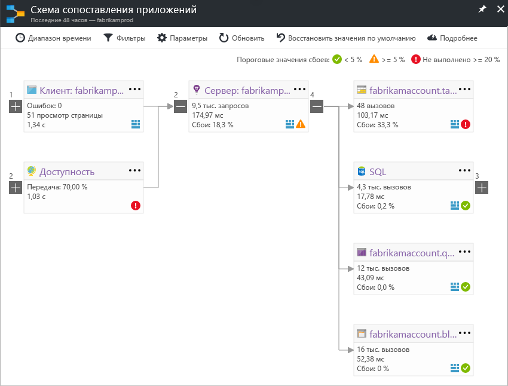

# Схема приложений: рассмотрение распределенных приложений
Схема приложений позволяет выявлять сбои и проблемы с производительностью во всех компонентах распределенного приложения. Каждый узел на схеме представляет компонент приложения или его зависимости с такими данными, отображая КПЭ работоспособности и состояние оповещений. Вы можете щелкнуть любой компонент, чтобы получить более подробные диагностические данные (например, события Application Insights). Если приложение использует службы Azure, то можно также выбрать данные системы диагностики Azure, например рекомендации Помощника по базам данных SQL.

## Что такое компонент?

Компоненты — это независимо развертываемые части распределенного приложения или приложения для микрослужб. Разработчики и операционные команды могут просматривать данные телеметрии, созданные компонентами приложения, на уровне кода. 

* Компоненты отличаются от наблюдаемых внешних зависимостей, таких как база данных SQL или концентратор событий, к которым команды или организации могут не иметь доступа (код или данные телеметрии).
* Компоненты выполняются на любом количестве экземпляров серверов, ролей или контейнеров.
* К компонентам могут относиться отдельные ключи инструментирования Application Insights (даже из разных подписок) или разные роли, относящиеся к одному такому ключу. В предварительной версии схемы компоненты отображаются, независимо от того, как они настроены.

## Схема составных приложений (предварительная версия)
*Это ранняя предварительная версия. Мы добавим больше возможностей в эту схему. Мы будем рады получить ваши отзывы о новом интерфейсе. Вы можете легко переключаться с интерфейса предварительной версии на классический интерфейс.*

Включите компонент "Схема сопоставления составных приложений" в [списке предварительных версий](app-insights-previews.md) или щелкните переключатель "Предварительная версия схемы сопоставления" в правом верхнем углу. Вы можете использовать этот переключатель, чтобы вернуться в классический интерфейс.

>[!Note]
Эта предварительная версия заменяет предыдущую предварительную версию компонента "Схема приложений с несколькими ролями". Сейчас этом компонент используется для просмотра всей топологии на нескольких уровнях зависимостей компонентов приложения. Оставьте свой отзыв. Мы добавим больше возможностей, аналогичных тем, которые поддерживаются в классической схеме.

Вы увидите все данные топологии на нескольких уровнях компонентов, связанных с приложением. Компонентами могут быть различные ресурсы Application Insights или различные роли в одном ресурсе. Схема приложений находит компоненты, отслеживая HTTP-вызовы зависимостей, выполняемые между серверами, на которых установлен пакет SDK для Application Insights. 

В этом интерфейсе сначала осуществляется последовательное обнаружение компонентов. При первой загрузке предварительной версии активируется набор запросов, который позволяет обнаружить компоненты, относящиеся к этому компоненту. Возле кнопки в верхнем левом углу будет обновляться число компонентов приложения по мере их обнаружения. 

Если вы нажмете кнопку "Обновить компоненты сопоставления", схема обновится со всеми компонентами, обнаруженными до этого момента.

Если все компоненты представляют собой роли в одном ресурсе Application Insights, этот шаг обнаружения не требуется. При начальной загрузке такого приложения загрузятся и все его компоненты.

Одной из ключевых задач нового интерфейса является возможность визуализировать сложные топологии с сотнями компонентов. В новом интерфейсе поддерживается изменение масштаба и добавление сведений при его увеличении. Вы можете уменьшать масштаб, чтобы сразу увидеть больше компонентов, а также выявлять компоненты с более высокой частотой сбоев. 

Щелкните любой компонент, чтобы просмотреть соответствующие данные аналитики и перейти к интерфейсу для рассмотрения производительности и сбоев этого компонента.

## Классическая схема приложений

На схеме показаны:

* Тесты доступности
* компонент на стороне клиента (отслеживаемый с помощью пакета SDK для JavaScript);
* компонент на стороне сервера;
* зависимости клиентских и серверных компонентов.

Можно разворачивать и сворачивать группы ссылок зависимостей:

Если есть большое количество однотипных зависимостей (например, SQL, HTTP и пр.), они могут группироваться. 

## Выявление проблем
Каждый узел имеет соответствующие показатели эффективности, например нагрузки, производительности и частоты сбоев для определенного компонента. 

Предупреждающие значки указывают на возможные проблемы. Оранжевое предупреждение означает сбои в запросах, представлении страниц или вызовах зависимостей. Красное предупреждение указывает на риск сбоя с вероятностью более 5 %. Откройте "Параметры", чтобы изменить эти пороговые значения.

Тут же отображаются активные оповещения: 

При использовании SQL Azure вы увидите соответствующий значок, информирующий о наличии рекомендаций по улучшению производительности. 

Щелкните любой значок, чтобы просмотреть подробные данные:

## Просмотр данных диагностики
Каждый из узлов на схеме позволяет просматривать определенные данные диагностики. Параметры различаются в зависимости от типа узла.

Для компонентов, которые размещаются в Azure, доступны прямые ссылки.

## Фильтры и диапазон времени
По умолчанию на схеме представлены все данные, доступные для выбранного диапазона времени. Однако можно отфильтровать только имена конкретных операций или зависимостей.

* Имя операции: сюда входят запросы просмотров страниц и запросы сервера. Этот параметр позволяет отобразить на схеме ключевые показатели эффективности на узле сервера или клиента только для отдельных операций. Будут показаны зависимости, вызванные в контексте этих конкретных операций.
* Базовое имя зависимости: сюда входят зависимости обозревателя AJAX и сервера. Если вы включите в отчет данные телеметрии настраиваемых зависимостей с помощью API TrackDependency, они также будут показаны здесь. Можно выбирать зависимости, которые будут отображены на схеме. Обратите внимание, что сейчас запросы на стороне сервера или просмотры страниц на стороне клиента не фильтруются.

## Сохранение фильтров
Чтобы сохранить примененные фильтры, закрепите отфильтрованный вид на [панели мониторинга](app-insights-dashboards.md).

## Область ошибок
Если щелкнуть узел в схеме, справа отобразится область ошибок, содержащая краткую информацию о сбоях этого узла. Сбои группируются сначала по идентификатору операции, затем — по идентификатору проблемы.

Если щелкнуть сбой, можно перейти к последнему экземпляру этого сбоя.

## Работоспособность ресурса
Для некоторых типов ресурсов в верхней части области ошибок отображается работоспособность ресурса. Например, если щелкнуть узел SQL, отобразится состояние базы данных и все оповещения, которые были активированы.

Можно щелкнуть имя ресурса, чтобы просмотреть стандартные общие метрики для этого ресурса.

## Видео

> [!VIDEO https://channel9.msdn.com/events/Connect/2016/112/player] 

## Отзыв
Оставьте свой отзыв на портале.

## Дополнительная информация

* [портал Azure](https://portal.azure.com)
