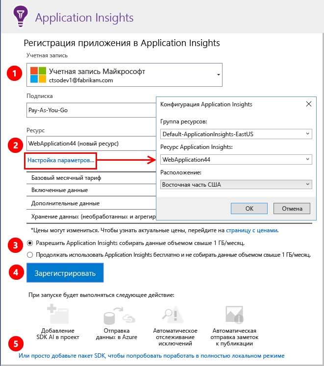
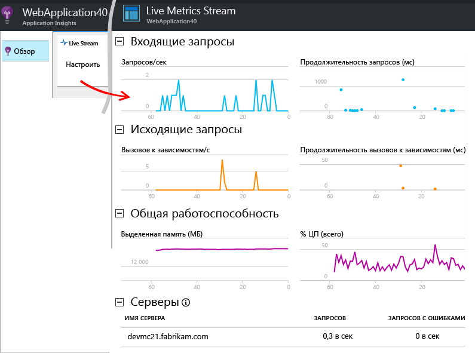
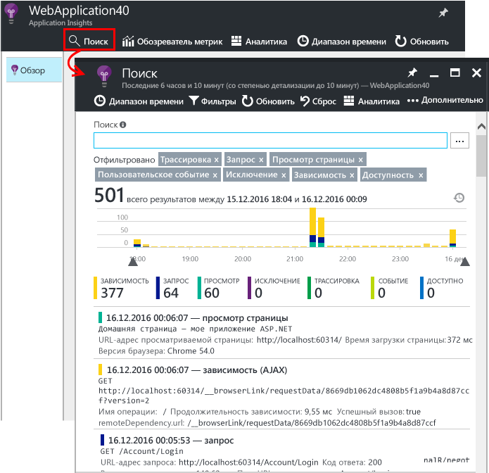
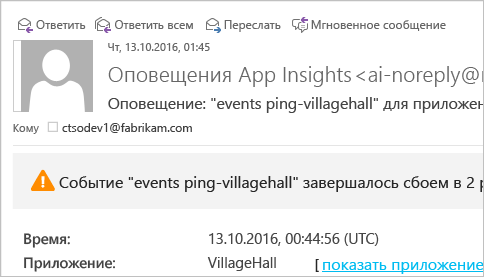
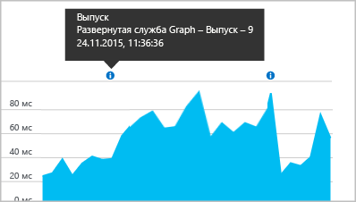

# <a name="set-up-application-insights-for-your-aspnet-website"></a>Настройка Application Insights для веб-сайта ASP.NET
[Azure Application Insights](app-insights-overview.md) выполняет мониторинг работы действующего приложения, благодаря чему вы можете [обнаруживать и диагностировать проблемы, связанные с производительностью и исключениями](app-insights-detect-triage-diagnose.md), а также [просматривать показатели использования приложений](app-insights-overview-usage.md). Эта услуга работает для веб-приложений в службе приложений Azure, а также для приложений, размещенных на локальных серверах IIS или на облачных виртуальных машинах.

## <a name="before-you-start"></a>Перед началом работы
Вам необходимы:

* Visual Studio 2013 с обновлением 3 или более новая версия. Чем новее версия, тем лучше.
* подписка на [Microsoft Azure](http://azure.com). Если у вашей группы или организации есть подписка Azure, владелец может добавить вас в нее с помощью вашей [учетной записи Майкрософт](http://live.com).

Существуют и другие статьи, к которым можно обратиться, если вас интересуют такие темы, как:

* [инструментирование веб-приложения во время выполнения;](app-insights-monitor-performance-live-website-now.md)
* [облачных служб Azure](app-insights-cloudservices.md)

## <a name="ide"></a> Шаг 1. Добавление пакета SDK Application Insights

В обозревателе решений щелкните проект веб-приложения правой кнопкой мыши и выберите пункт **Добавить**, **Телеметрия Application Insights...** или **Настроить Application Insights**.


(В Visual Studio 2015 есть параметр, который позволяет добавить Application Insights в диалоговое окно создания проекта.)

Перейдите на страницу настройки Application Insights.



1. Выберите учетную запись и подписку, которые будут использоваться для доступа к Azure.
2. Выберите ресурс в Azure, в котором должны отображаться данные из приложения. Обычно для каждого приложения создается отдельный ресурс. Если вы хотите задать группу ресурсов или расположение, где будут храниться данные, щелкните **Настроить параметры**. Группы ресурсов используются для управления доступом к данным. Например, если имеется несколько приложений, которые являются частью одной системы, вы можете поместить их данные Application Insights в одну группу ресурсов.
3. Служба Application Insights является бесплатной до определенного объема данных телеметрии. Чтобы плата не взималась, можно установить ограничение на объем данных. После создания ресурса можно изменить выбранные параметры на портале, открыв **Компоненты и расценки**, **Управление данными**, **Ограничение ежедневного объема**.
4. Щелкните **Регистрация**, чтобы приступить к настройке Application Insights для веб-приложения. Данные телеметрии будут отправляться на [портал Azure](https://portal.azure.com) как во время отладки, так и после публикации приложения.
5. Кроме того, можно добавить пакет SDK Application Insights в свое приложение. В этом случае во время отладки можно будет просмотреть данные телеметрии в Visual Studio. Позже вы сможете вернуться на эту страницу настроек или можете дождаться, когда приложение будет развернуто, и [переключиться на данные телеметрии во время выполнения](app-insights-monitor-performance-live-website-now.md).


## <a name="run"></a> Шаг 2. Запуск приложения
Запустите приложение, нажав клавишу F5. Откройте разные страницы, чтобы создать некоторый объем данных телеметрии.

В Visual Studio вы увидите число записанных в журнал событий.


## <a name="step-3-see-your-telemetry-in-visual-studio-or-application-insights"></a>Шаг 3. Просмотр данных телеметрии в Visual Studio или в Application Insights
Вы можете просмотреть данные телеметрии в Visual Studio или на веб-портале Application Insights.

В **Visual Studio** откройте окно Application Insights. Нажмите кнопку **Application Insights** или щелкните проект в обозревателе решений правой кнопкой мыши, выберите **Application Insights**, а затем щелкните **Поиск действующей телеметрии**.

В окне поиска Application Insights в Visual Studio просмотрите представление **данных, полученных в ходе сеанса отладки**, где отображаются данные телеметрии, созданные в серверной части приложения. Поэкспериментируйте с фильтрами и щелкните любое событие, чтобы просмотреть подробные сведения.


> [!NOTE]
> Если данные не отображаются, проверьте диапазон времени и щелкните значок поиска.

[Дополнительные сведения о средствах Application Insights в Visual Studio](app-insights-visual-studio.md).

<a name="monitor"></a>
### <a name="the-application-insights-web-portal"></a>Веб-портал Application Insights
Вы можете также просматривать данные телеметрии **на веб-портале Application Insights**, если не решили установить только пакет SDK. На портале представлено больше дополнительных диаграмм, средств анализа и панелей мониторинга, чем в Visual Studio.

Откройте ресурс Application Insights. Войдите на [портал Azure](https://portal.azure.com/) и найдите его там или щелкните правой кнопкой мыши проект в Visual Studio и перейдите к нему.


> [!NOTE]
> Если произошла ошибка доступа, возможно, у вас есть несколько наборов учетных данных Майкрософт и вы использовали для входа неправильный набор. На портале повторите процедуру выхода и входа.

На портале откроется представление данных телеметрии из приложения.


Щелкните любую диаграмму, чтобы просмотреть подробные сведения.

### <a name="more-details-in-the-application-insights-web-portal"></a>Дополнительные сведения на веб-портале Application Insights
Ниже приведены некоторые примеры, как получить дополнительные сведения на портале.

* [**Live Metrics Stream**](app-insights-live-stream.md) отображает данные телеметрии практически мгновенно.

    

    Откройте Live Metrics Stream, когда ваше приложение выполняется, чтобы обеспечить подключение.

    Live Metrics Stream отображает данные телеметрии только в течение минуты после их отправки. Дополнительные исторические данные можно просмотреть с помощью поиска, обозревателя метрик и аналитики. Чтобы эти компоненты отобразили данные, может потребоваться несколько минут.

* [**Поиск**](app-insights-diagnostic-search.md) отображает отдельные события, например запросы, исключения и просмотры страниц. Можно использовать фильтрацию по типу события, совпадению терминов и значениям свойств. Щелкните любое событие, чтобы просмотреть его свойства и связанные события.

    

 * В режиме разработки может отобразиться много событий зависимостей (AJAX). Они представляют синхронизации, выполняемые для браузера и эмулятора сервера. Чтобы скрыть их, щелкните фильтр **Зависимость**.
* [**Сводные метрики**](app-insights-metrics-explorer.md), например показатель частоты запросов и сбоев, отобразятся на диаграммах. Щелкните любую диаграмму, чтобы открыть колонку с более подробной информацией. Щелкните **Изменить** на любой диаграмме, чтобы задать фильтры и размер.

    

[Дополнительные сведения об использовании Application Insights на портале Azure](app-insights-dashboards.md).

## <a name="step-4-publish-your-app"></a>Шах 4. Публикация приложения
Опубликуйте приложение на сервере IIS или в Azure. Просмотрите [динамический поток метрик](app-insights-metrics-explorer.md#live-metrics-stream) , чтобы убедиться в бесперебойной работе приложения.

Телеметрия создается на портале Application Insights, где можно отслеживать метрики, выполнять поиск данных телеметрии и настраивать [панели мониторинга](app-insights-dashboards.md). Можно также использовать эффективный [язык запросов аналитики](app-insights-analytics.md) для анализа использования и производительности или поиска определенных событий.

Кроме того, можно продолжить анализировать телеметрию в [Visual Studio](app-insights-visual-studio.md) с помощью таких средств, как поиск по журналу диагностики и [тренды](app-insights-visual-studio-trends.md).

> [!NOTE]
> Если приложение отправляет достаточно данных телеметрии для достижения [пределов регулирования](app-insights-pricing.md#limits-summary), включается автоматическая [выборка](app-insights-sampling.md). Выборка позволяет уменьшить количество данных телеметрии, отправляемых из приложения, сохраняя связанные данные в целях диагностики.
>
>

## <a name="land"></a> Как работает команда "Добавить Application Insights"?
Application Insights отправляет данные телеметрии из приложения на портал Application Insights (размещенный в Azure).


Эта команда выполняет три действия:

1. Добавляет в проект пакет NuGet с веб-пакетом SDK для Application Insights. Чтобы увидеть его в Visual Studio, щелкните правой кнопкой мыши проект и выберите пункт **Управление пакетами NuGet**.
2. Создает ресурс Application Insights на [портале Azure](https://portal.azure.com/). Здесь будут отображаться ваши данные. Команда извлекает *ключ инструментирования*, идентифицирующий ресурс.
3. Вставляет ключ инструментирования в `ApplicationInsights.config`, чтобы пакет SDK мог отправлять данные телеметрии на портал.

При необходимости вы можете выполнить эти действия вручную для проекта [ASP.NET 4](app-insights-windows-services.md) или [ASP.NET Core](https://github.com/Microsoft/ApplicationInsights-aspnetcore/wiki/Getting-Started).

### <a name="upgrade-to-future-sdk-versions"></a>Обновление до будущих версий пакета SDK
Чтобы установить [новый выпуск пакета SDK](https://github.com/Microsoft/ApplicationInsights-dotnet-server/releases), еще раз откройте **диспетчер пакетов NuGet** и выполните фильтрацию по установленным пакетам. Выберите элемент **Microsoft.ApplicationInsights.Web**, а затем — элемент **Обновить**.

Если были выполнены какие-либо настройки файла ApplicationInsights.config, то прежде чем выполнять обновление, сохраните его копию. Затем объедините изменения в новой версии.

## <a name="add-more-telemetry"></a>Добавление данных телеметрии
Ниже приведены другие типы телеметрии, которые можно добавить.
### <a name="dependencies-exceptions-and-performance-counters"></a>Зависимости, исключения и счетчики производительности

[Установите монитор состояний](http://go.microsoft.com/fwlink/?LinkId=506648) на всех серверных компьютерах IIS, чтобы получать дополнительные телеметрические данные о веб-приложении. Если он уже установлен, то ничего делать не нужно. (Возможно, вы уже используете монитор состояния для наблюдения за приложением во время выполнения.)

Используя монитор состояния вместе с пакетом SDK для установки во время сборки, вы получите более полный набор данных телеметрии, который включает в себя следующее:

* [Счетчики производительности](app-insights-performance-counters.md) — счетчики использования ЦП, памяти, диска и другие счетчики производительности, относящиеся к приложению.
* [Исключения](app-insights-asp-net-exceptions.md) — более подробные данные телеметрии для некоторых исключений.
* [Зависимости](app-insights-asp-net-dependencies.md) — включая возвращаемые значения.

### <a name="webpages-and-single-page-apps"></a>Веб-страницы и одностраничные приложения
1. [Добавьте фрагмент JavaScript](app-insights-javascript.md) на веб-страницы, чтобы отображались данные о просмотре страниц, времени загрузки, исключениях браузера, производительности вызовов AJAX, а также количестве пользователей и сеансов. Они отображаются в колонках обзора и использования.
2. [Добавьте в приложение код для пользовательских событий](app-insights-api-custom-events-metrics.md), таких как события количества, времени или измерения, касающиеся действий пользователя.


### <a name="diagnostic-code"></a>Код для диагностики
Возникла проблема? Если вы хотите вставить код для диагностики приложения, можно выбрать один из нескольких вариантов:

* [Журнал трассировки.](app-insights-asp-net-trace-logs.md) Если вы уже используете Log4N, NLog или System.Diagnostics.Trace для записи событий трассировки, можно настроить отправку выходных данных в Application Insights. Вы можете сопоставлять эти выходные данные с запросами, просматривать и анализировать их.
* [Пользовательские события и метрики.](app-insights-api-custom-events-metrics.md) Используйте элемент TrackEvent() и TrackMetric() в коде сервера или веб-страницы.
* [Дополнительные свойства для данных телеметрии](app-insights-api-filtering-sampling.md#add-properties).

Используйте [функцию поиска](app-insights-diagnostic-search.md) для поиска и сопоставления определенных событий и инструмент [аналитики](app-insights-analytics.md) для выполнения более эффективных запросов.

## <a name="alerts"></a>Оповещения
Узнавайте о проблемах в приложении первыми,

* [Тесты доступности.](app-insights-monitor-web-app-availability.md) Создавайте тесты, позволяющие проверить, доступен ли ваш сайт в Интернете.
* [Интеллектуальная диагностика.](app-insights-proactive-diagnostics.md) Эти тесты выполняются автоматически, поэтому вам не нужно их настраивать. Благодаря ей вы узнаете о необычном количестве неудачных запросов.
* [Оповещения о метриках.](app-insights-alerts.md) Настройте их, чтобы получать уведомления в случае, если метрика превысила пороговое значение. Их можно настроить для пользовательских метрик, добавляемых в код приложения.

По умолчанию уведомления об оповещениях отправляются владельцу подписки Azure.



## <a name="version-and-release-tracking"></a>Отслеживание версии и выпуска
Для отслеживания версии приложения убедитесь, что во время выполнения процесса Microsoft Build Engine создается `buildinfo.config`. Добавьте в CSPROJ-файл:  

```XML

    <PropertyGroup>
      <GenerateBuildInfoConfigFile>true</GenerateBuildInfoConfigFile>    <IncludeServerNameInBuildInfo>true</IncludeServerNameInBuildInfo>
    </PropertyGroup>
```

При наличии данных сборки веб-модуль Application Insights автоматически добавляет **версию приложения** как свойство для каждого элемента телеметрии. Это позволяет применить фильтр по версии при [диагностическом поиске](app-insights-diagnostic-search.md) или [изучении метрик](app-insights-metrics-explorer.md).

Обратите внимание, что номер версии сборки создается только Microsoft Build Engine, а не в процессе сборки в Visual Studio.

### <a name="release-annotations"></a>Примечания к выпуску
Если используется Visual Studio Team Services, можно настроить [добавление маркера заметки](app-insights-annotations.md) к диаграммам при выпуске новой версии. На следующем рисунке показано, как появляется этот маркер.



## <a name="video"></a>Видео

> [!VIDEO https://channel9.msdn.com/events/Connect/2016/100/player]

## <a name="next-steps"></a>Дальнейшие действия
**[Работа с Application Insights в Visual Studio](app-insights-visual-studio.md)**<br/>Содержит сведения об отладке с помощью телеметрии, о поиске по журналу диагностики и детализации кода.

**[Работа с порталом Application Insights](app-insights-dashboards.md)**<br/> Содержит сведения о панелях мониторинга, эффективных средствах диагностики и анализа, оповещениях, картах динамических зависимостей приложения, а также сведения об экспорте данных телеметрии.

