# Общие сведения о Application Insights для DevOps

С помощью [Application Insights](app-insights-overview.md) можно быстро получить сведения о производительности и использовании динамического приложения. В случае возникновения проблемы эта служба уведомляет вас о ней, помогает оценить влияние и определить причину.

Прочитайте отзыв рабочей группы, разрабатывающей веб-приложения:

* *"Несколько дней назад мы развернули минимальное исправление. Мы не проводили широкое тестирование, но, к сожалению, возникли неожиданные изменения в данных, что привело к несовместимости между внешним и внутренним интерфейсами. Сразу же возросло число исключений сервера и сработало оповещение, которое и уведомило нас о ситуации. В несколько щелчков на портале Application Insights мы получили достаточно информации из стека вызовов исключений, чтобы сузить круг причины проблемы. Мы сразу же выполнили откат и тем самым сократили ущерб.  Благодаря Application Insights эта часть цикла разработки стала очень простой и реально выполнимой".*

В этой статье мы будем наблюдать за действиями команды, разрабатывающей систему интернет-банкинга (OBS) в Fabrikam Bank, чтобы увидеть, как они используют Application Insights для быстрого реагирования на запросы клиентов и вносят изменения.  

Цикл DevOps команды показан на следующем рисунке:

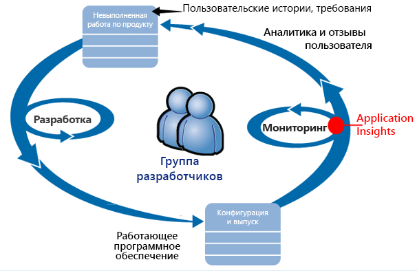

Требования поступают в план разработки (список задач). Команда работает в рамках коротких спринтов, в результате которых, как правило, выпускается работающее программное обеспечение — обычно в виде улучшений и расширений для существующего приложения. В динамическое приложение часто добавляются новые функции. Поскольку приложение динамическое, команда отслеживает его производительность и использование с помощью Application Insights. Данные APM поступают в невыполненную работу по разработке.

Команда использует Application Insights для тщательного наблюдения за динамическим веб-приложением.

* Производительность. Команде нужна информация о том, как время отклика зависит от количества запросов; какой объем ресурсов ЦП, сети, диска и т. д. используется; код какого приложения снижает производительность; и где возникают узкие места.
* Сбои. Если возникли исключения или невыполненные запросы, или если счетчик производительности вышел за пределы обычных значений, группе необходимо быстро получать сведения о сбоях, чтобы принять меры.
* Использование. Каждый раз, когда выпускается новая функция, команде нужно знать, часто ли она используется и не возникают ли у пользователей проблемы при работе с ней.

Рассмотрим часть цикла, связанную с отзывами.

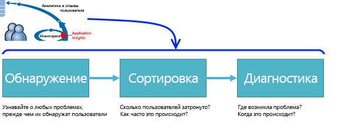

## Обнаружение низкой доступности
Анастасия Лебедева — старший разработчик в команде интернет-банкинга. Она также отвечает за мониторинг производительности сети. Она настраивает несколько [тестов доступности](app-insights-monitor-web-app-availability.md).

* Тест с одним URL-адресом для основной целевой страницы приложения — http://fabrikambank.com/onlinebanking/. Она задает в качестве условия получение кода состояния HTTP 200 и текста "Добро пожаловать!". Если данный тест завершается ошибкой, это говорит о серьезном сбое в работе сети или серверов или же о проблемах с развертыванием. (Или кто-то изменил приветственное сообщение на странице и не поставил Анастасию в известность.)
* Глубокий многоэтапный тест, во время которого выполняется вход в систему и создается список текущих учетных записей, а также проверяется несколько ключевых пунктов на каждой странице. Этот тест позволяет проверить, работает ли ссылка на базу учетных записей. Анастасия использует идентификатор вымышленного пользователя: несколько таких пользователей создано специально для тестирования.

Благодаря этим тестам она уверена, что команда сможет быстро узнать о любом сбое в системе.  

Ошибки отображаются красными точками на диаграмме веб-теста:

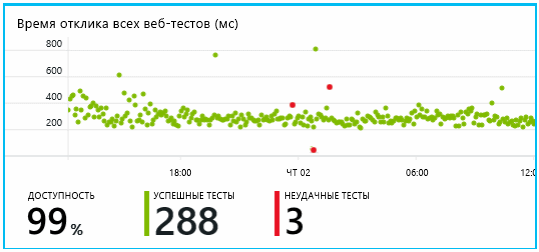

Но еще важнее другое: команда разработчиков получает тревожное оповещение о любом сбое по электронной почте. Таким образом специалисты узнают о проблеме раньше практически всех клиентов.

## Мониторинг производительности
На странице "Обзор" Application Insights есть диаграмма, отображающая ряд [ключевых метрик](app-insights-web-monitor-performance.md).

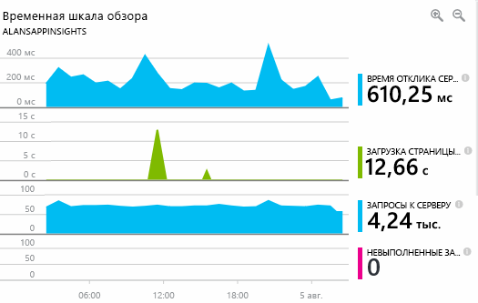

Время загрузки страницы в браузере определяется на основе телеметрических данных, отправляемых непосредственно с веб-страниц. Данные о времени отклика сервера, числе запросов к серверу и числе неудачных запросов фиксируются на веб-сервере, а затем передаются в Application Insights.

Анастасия слегка обеспокоена графом ответов сервера. Он показывает среднее время между получением сервером HTTP-запроса от браузера пользователя и возвращением ответа. Изменения на этой диаграмме не вызывают удивление, так как загрузка системы непостоянна. Но в этом случае кажется, что существует взаимосвязь между небольшим увеличением числа запросов и значительным возрастанием времени ответа. Это может означать, что система работает на пределе своих возможностей.

Она открывает диаграммы серверов.

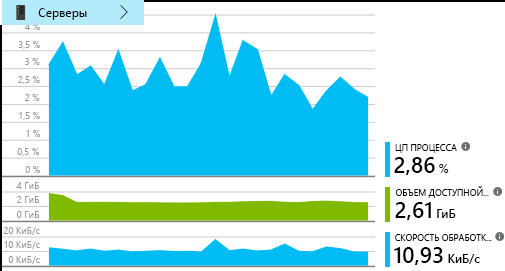

Похоже, нет никаких признаков ограниченности ресурсов. Может быть, всплески на диаграммах ответа серверов — просто совпадение.

## Настройка оповещений для достижения целей
Тем не менее она бы хотела следить за временем отклика. Если оно станет слишком долгим, она хочет немедленно узнать об этом.

Поэтому она задает [оповещение](app-insights-metrics-explorer.md) о времени отклика, превышающем обычное пороговое значение. Это гарантирует, что она узнает, если ответы будут выполняться медленно.

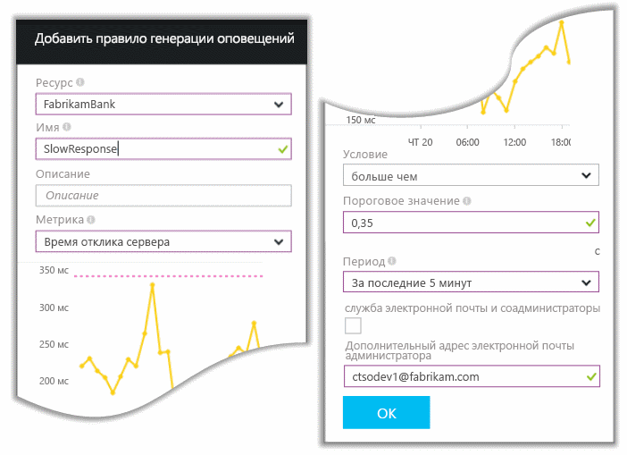

Можно задать оповещения о широком наборе других метрик. Например, получать уведомление по электронной почте в случае увеличения числа исключений, нехватки памяти или при пиковых значениях числа клиентских запросов.

## Будьте в курсе последних новостей с помощью оповещений интеллектуального обнаружения.
На следующий день по электронной почте поступает оповещение из Application Insights. Но когда Анастасия его открывает, то находит не оповещение о времени ответа, которое настроила. Вместо этого ей сообщается о неожиданном увеличении числа невыполненных запросов — то есть запросов, которые вернули код ошибки 500 или более.

Невыполненные запросы — это запросы, после выполнения которых пользователи видят сообщение об ошибке, обычно сопровождаемое исключением, порожденным кодом. Возможно, пользователи видят сообщение "К сожалению, сейчас обновить данные не удалось". Или, в самом худшем случае, на экране пользователя отображается дамп стека, любезно предоставленный веб-сервером.

Это оповещение вызвало удивление, так как когда она в последний раз проверяла число невыполненных запросов, оно было обнадеживающе малым. При загруженном сервере ожидаемо возникает небольшое количество сбоев.

Также было удивительно то, что она не настраивала данное оповещение. Application Insights включает интеллектуальное обнаружение. Она автоматически подстраивается под характер сбоев вашего приложения и "привыкает" к сбоям на определенной странице, в условиях высокой нагрузки или сбоям, связанным с другими метриками. Она создает оповещение только в том случае, если показатель увеличился сверх ожидаемого значения.

Это очень полезное электронное сообщение. Было не просто создано оповещение. Также выполнены рассмотрение и диагностика.

В нем указано, сколько клиентов затронуто, а также — какие веб-страницы или операции. Анастасия может решить, нужно ли срочно привлечь всю группу для работы над проблемой, или ее можно игнорировать до следующей недели.

В электронном сообщении также указано, что возникло конкретное исключение и, что еще более интересно, что сбой связан с неудачными вызовами к конкретной базе данных. Это объясняет, почему ошибка возникла внезапно, хотя группа Анастасии в последнее время не развертывала обновления.

Анастасия связывается с руководителем команды разработчиков для баз данных, чтобы сообщить об этом письме. Она узнает, что они выпустили исправление полчаса назад. И, возможно, немного изменили схему…

Итак, проблема устраняется уже через 15 минут после появления, и для этого даже не пришлось изучать журналы. Тем не менее Анастасия щелкает ссылку, чтобы открыть Application Insights. Открывается невыполненный запрос, и она сразу видит неудачный вызов к базе данных в связанном списке вызовов зависимостей.

## Обнаружение исключений
После несложной настройки уведомления об [исключениях](app-insights-asp-net-exceptions.md) поступают в Application Insights автоматически. Они также могут быть захвачены напрямую путем вставки в код вызовов [TrackException()](app-insights-api-custom-events-metrics.md#trackexception) :  

    var telemetry = new TelemetryClient();
    ...
    try
    { ...
    }
    catch (Exception ex)
    {
       // Set up some properties:
       var properties = new Dictionary <string, string>
         {{"Game", currentGame.Name}};

       var measurements = new Dictionary <string, double>
         {{"Users", currentGame.Users.Count}};

       // Send the exception telemetry:
       telemetry.TrackException(ex, properties, measurements);
    }

В команде Банка Fabrikam сложилась практика всегда отправлять телеметрические данные об исключении, если отсутствует очевидный способ восстановления.  

В реальности их стратегия даже шире: данные телеметрии отправляются во всех случаях, когда клиент не удовлетворен результатом операции, которую он выполнял в онлайн-банке, — и неважно, имеет это отношение к исключению в коде или нет. Например, если сторонняя система межбанковских переводов отображает сообщение "невозможно выполнить данную операцию" по какой-то внутренней причине (не по вине клиента), команда отслеживает это событие.

    var successCode = AttemptTransfer(transferAmount, ...);
    if (successCode < 0)
    {
       var properties = new Dictionary <string, string>
            {{ "Code", returnCode, ... }};
       var measurements = new Dictionary <string, double>
         {{"Value", transferAmount}};
       telemetry.TrackEvent("transfer failed", properties, measurements);
    }

TrackException используется для сообщения об исключениях, так как отправляет копию стека. TrackEvent используется для сообщения о других событиях. Можно прикреплять любые свойства, которые могут пригодиться при диагностике.

Исключения и события отображаются в колонке [Diagnostic Search](app-insights-diagnostic-search.md) (Поиск в диагностических данных). Можно также проанализировать исключения, просмотрев дополнительные свойства и трассировку стека.

## Упреждающий мониторинг
Анастасия не просто сидит на месте в ожидании тревожных оповещений. Вскоре после каждого повторного развертывания она просматривает [время отклика](app-insights-web-monitor-performance.md) — как общее значение, так и таблицу с самыми медленными запросами, а также количество исключений.  

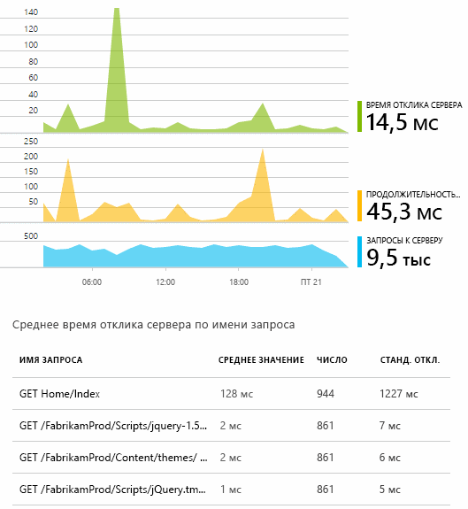

Она может оценить изменение производительности после каждого развертывания, сравнивая результаты с данными за предыдущую неделю. При резком ухудшении показателей она сообщает о проблеме разработчикам.

## Рассмотрение проблем
Рассмотрение — оценка важности и глубины проблемы — является первым шагом после обнаружения. Стоит ли собирать команду посреди ночи? Или можно поместить проблему в список невыполненных задач и решить ее при первой удобной возможности? Процесс рассмотрения предполагает ответы на некоторые ключевые вопросы.

Как часто происходит проблема? Диаграммы в колонке "Общая информация" позволяют достаточно глубоко оценить ситуацию. Например, за ночь приложение Fabrikam создало четыре тревожных оповещения, связанных с веб-тестами. Утром, взглянув на диаграмму, сотрудники увидели на ней соответствующие красные точки, при этом большая часть тестов была выполнена успешно, о чем свидетельствовали точки зеленого цвета. При детальном изучении диаграммы стало ясно, что все эти временные проблемы связаны с одним тестом. Очевидно, возникшая в сети проблема затронула только один маршрут, после чего самоустранилась.  

В то же время значительный и непрерывный рост на диаграмме исключений или времени отклика явно свидетельствует о серьезной проблеме.

Полезная тактика — выполнять рассмотрение самостоятельно. Потому что при повторном возникновении этой проблемы вы будете знать, что нужно делать.

Какая часть пользователей пострадала от проблемы? Чтобы получить приблизительный ответ, разделите число сбоев на число сеансов.

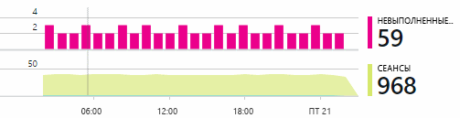

В случае медленного отклика сравните таблицу самых медленных запросов с частотой использования каждой страницы.

Насколько важен заблокированный сценарий? Это функциональная проблема блокирует только одну конкретную пользовательскую историю? Насколько она серьезна? Если клиенты не могут оплачивать свои счета, это серьезно; если не получается изменить настройки цвета экрана — возможно, это может подождать. Подробные сведения о событии, исключении или идентификация медленной страницы подскажет вам, в каком месте пользователи сталкиваются с проблемой.

## Диагностика проблем
Диагностика — это не совсем то же самое, что и отладка. Прежде чем приступить к отслеживанию через код, необходимо иметь примерное представление о причинах, месте и времени возникновения проблемы.

**Когда это происходит?** Просмотр журналов событий и диаграмм с метриками упрощает соотнесение последствий с возможными причинами. В случае периодического увеличения времени отклика или числа исключений взгляните на счетчик запросов: если пиковые значения достигаются в одно и то же время, это говорит о проблеме с ресурсами. Необходимо выделить дополнительные ЦП или память? Или это зависимость, которая не может справиться с нагрузкой?

**Или причина в нас?**  При внезапном падении производительности отдельного типа запросов — например, получение клиентом выписки по счету — проблема с большей вероятностью будет заключаться во внешней подсистеме, а не в вашем веб-приложении. В обозревателе метрик выберите показатели "Сбой зависимости" и "Длительность зависимости", после чего сравните их журналы за последние несколько часов или дней с момента возникновения проблемы. Если присутствуют взаимообусловленные изменения, причиной сбоя может являться внешняя подсистема.  

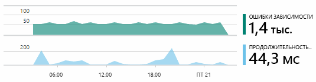

Иногда проблемы с медленными зависимостями возникают вследствие недоработок, связанных с географическим расположением. В Банке Fabrikam используются виртуальные машины Azure, и однажды обнаружилось, что банк непреднамеренно разместил свой веб-сервер и сервер учетных записей в разных странах. Перенос одного из них позволил добиться резкого улучшения в работе.

**Что мы сделали?** Если проблема не в зависимости и если она не проявлялась ранее, то, возможно, причиной является последнее изменение. Благодаря наличию исторической справки в диаграммах показателей и событий можно легко соотносить внезапные изменения с развертываниями. Это значительно сужает круг поиска причины проблемы. Чтобы определить, какие строки в коде приложения снижают производительность, включите Application Insights Profiler. Ознакомьтесь с разделом [Профилирование динамических веб-приложений Azure с помощью Application Insights](./app-insights-profiler.md). После включения Profiler вы увидите трассировку следующего вида. В этом примере легко заметить, причиной проблемы является метод *GetStorageTableData*.  

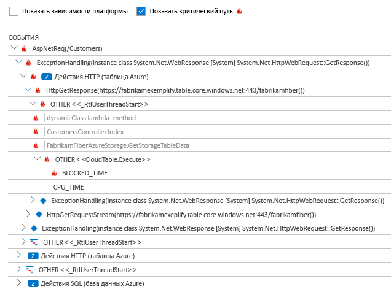

**В чем причина?** Некоторые ошибки возникают крайне редко и их сложно отследить при тестировании в автономном режиме. Все, что можно сделать в таком случае, — попытаться записать ошибку при ее возникновении в реальном времени. Можно проверить дампы стека в отчетах об исключениях. Кроме того, можно написать трассировочные вызовы с использованием привычной платформы ведения журналов либо задействовать TrackTrace() или TrackEvent().  

В Банке Fabrikam периодически возникала проблема с переводами между учетными записями, при этом были затронуты только записи определенного типа. Чтобы лучше разобраться в происходящем, они вставили вызовы TrackTrace() в ключевые точки кода, добавив тип учетной записи в виде свойства к каждому вызову. Это позволило легко отсортировать нужные трассировки в колонке "Поиск по журналу диагностики". Они также присоединили значения параметров в виде свойств и измерений к трассировочным вызовам.

## Реагирование на обнаруженные проблемы
Как только проблема диагностирована, нужно составить план по ее исправлению. Возможно, потребуется выполнить откат последнего изменения или же устранить ошибку обычным образом. После исправления проблемы служба Application Insights сообщит об успешном результате.  

Благодаря применению Application Insights команда разработчиков Банка Fabrikam выработала более структурированный подход к измерению производительности.

* На странице общей информации Application Insights они задали целевые значения производительности по отдельным показателям.
* В приложение были встроены показатели производительности, работающие уже с момента запуска. Среди них — показатели, отслеживающие продвижение пользователей через воронки продаж сайта.  

## Мониторинг действий пользователей
Когда время ответа стабильно допустимое и порождается мало исключений, команда разработчиков может заняться удобством использования. Они могут задуматься, как повысить удобство работы пользователей и поощрить дополнительных пользователей к достижению желаемых целей.

Служба Application Insights также собирает информацию о том, как пользователи используют приложение. Если оно работает без сбоев, разработчикам важно знать, какие из функций наиболее популярны, с чем у пользователей возникают сложности и как часто они возвращаются к приложению. Это позволяет правильно расставить приоритеты для предстоящей работы. Также можно запланировать измерение эффективности каждой функции в качестве отдельной части цикла разработки.

Например, типичному перемещению пользователя по веб-сайту соответствует понятная "воронка". Многие клиенты просматривают ставки по различным кредитам. Чем меньше число, тем охотнее заполняется форма предложения. Некоторые из тех, кто получил предложение, идут дальше и получают кредит.

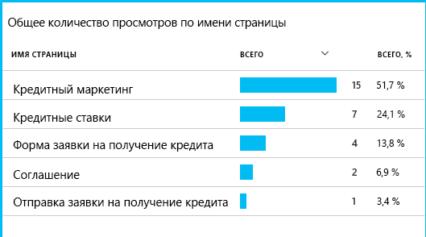

Выявляя, на каких из этапов просмотра сайта теряется больше всего клиентов, предприятие способно добиться увеличения количества пользователей, прошедших к концу воронки продаж. Возможные проблемы могут быть связаны с интерфейсом, например с плохой видимостью кнопки перехода "Далее" или непонятностью инструкций. Однако более вероятно, что существуют более серьезные деловые причины потерь: процентная ставка может быть слишком высока.

Независимо от причины, получаемые данные позволяют команде разобраться, чем интересуются пользователи. Для детализации общей картины можно отслеживать больше действий. С помощью TrackEvent() можно отслеживать любые действия пользователя, от малейших подробностей индивидуальных нажатий до таких значительных достижений, как погашение кредита.

Таким образом команда привыкает к доступности информации о действиях пользователей. Теперь при разработке любой новой функции предусматривается процесс получения отзывов о ее использовании. Вставка функций вызова отслеживания закладывается в проект изначально. Обратная связь используется для улучшения программного продукта на каждом из циклов разработки.

[Анализ использования для веб-приложений с помощью Application Insights](app-insights-usage-overview.md).

## Применение цикла DevOps
Вот как одна команда использует службу Application Insights не только для устранения отдельных проблем, но и для улучшения жизненного цикла разработки в целом. Надеюсь, вы получили некоторые соображения относительно того, как Application Insights может помочь управлять производительностью в собственных приложениях.

## Видео

> [!VIDEO https://channel9.msdn.com/events/Connect/2016/112/player]

## Дополнительная информация
Вы можете приступить к работе несколькими способами, в зависимости от характеристик приложения. Выберите, что вам лучше всего подходит:

* [веб-приложение ASP.NET](app-insights-asp-net.md);
* [веб-приложение Java](app-insights-java-get-started.md);
* [веб-приложение Node.js](app-insights-nodejs.md);
* уже развернутые приложения, размещенные в среде [IIS](app-insights-monitor-web-app-availability.md), [J2EE](app-insights-java-live.md) или [Azure](app-insights-azure.md);
* [веб-страницы](app-insights-javascript.md) (одностраничное приложение или обычная веб-страница) — можно использовать самостоятельное или в дополнение к любому варианту сервера;
* [тесты доступности](app-insights-monitor-web-app-availability.md) для тестирования приложений из общедоступного Интернета.
