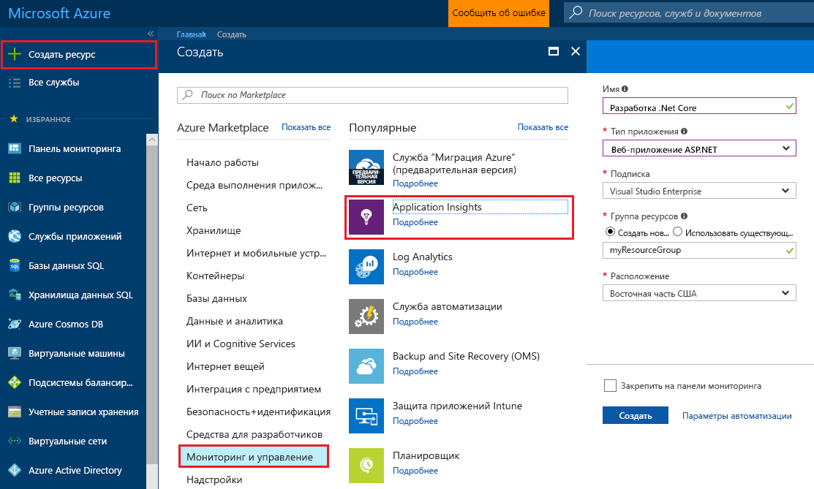
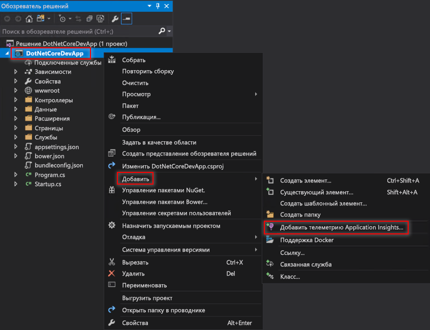
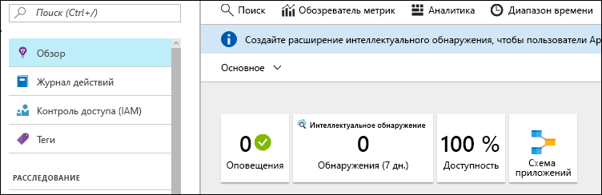
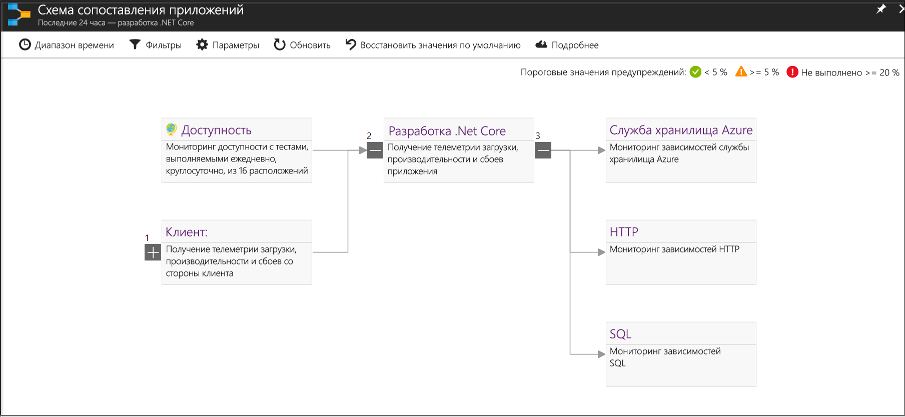
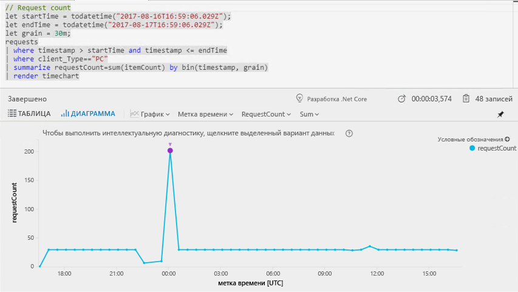
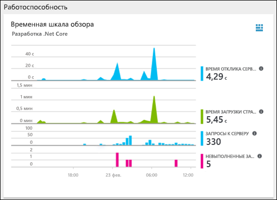
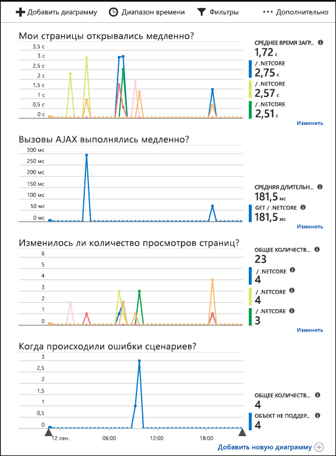

# <a name="start-monitoring-your-aspnet-core-web-application"></a>Запуск мониторинга веб-приложения ASP.NET Core

С помощью Azure Application Insights можно легко отслеживать доступность, производительность и использование своего веб-приложения. Вы также можете быстро идентифицировать и диагностировать ошибки в приложении, не дожидаясь, пока пользователь сообщит о них. 

Это краткое руководство поможет добавить пакет SDK для Application Insights в имеющееся веб-приложение ASP.Net Core. 

## <a name="prerequisites"></a>предварительным требованиям

Для работы с этим кратким руководством сделайте следующее:

- Установите [Visual Studio 2017](https://www.visualstudio.com/downloads/) с указанными ниже рабочими нагрузками:
  - ASP.NET и веб-разработка.
  - разработка Azure;
- [Установите пакет SDK для .NET Core 2.0.](https://www.microsoft.com/net/core)
- Потребуется подписка Azure и веб-приложение .NET Core.

Если у вас еще нет веб-приложения ASP.NET, его можно создать, следуя руководству [Публикация веб-приложения ASP.NET Core в службе приложений Azure с помощью Visual Studio](https://docs.microsoft.com/aspnet/core/tutorials/publish-to-azure-webapp-using-vs).

Если у вас еще нет подписки Azure, создайте [бесплатную](https://azure.microsoft.com/free/) учетную запись Azure, прежде чем начинать работу.

## <a name="log-in-to-the-azure-portal"></a>Войдите на портал Azure.

Войдите на [портал Azure](https://portal.azure.com/).

## <a name="enable-application-insights"></a>Включение Application Insights

В Application Insights можно собирать данные телеметрии из любого подключенного к Интернету приложения, независимо от того, работает оно локально или в облаке. Чтобы просмотреть эти данные, сделайте следующее.

1. Последовательно выберите **Создать ресурс** > **Мониторинг и управление** > **Application Insights**.

   

    Откроется окно настроек, в котором нужно заполнить все поля в соответствии с приведенной ниже таблицей.

    | Параметры        |  Значение           | ОПИСАНИЕ  |
   | ------------- |:-------------|:-----|
   | **Имя**      | Глобально уникальное значение | Имя, идентифицирующее отслеживаемое приложение |
   | **Тип приложения** | Веб-приложение ASP.NET | Тип отслеживаемого приложения |
   | **Группа ресурсов**     | myResourceGroup      | Имя новой группы ресурсов для размещения данных App Insights |
   | **Местоположение.** | Восток США | Выберите ближайшее расположение или расположение вблизи места размещения приложения |

2. Нажмите кнопку **Создать**.

## <a name="configure-app-insights-sdk"></a>Настройка пакета SDK App Insights

1. Откройте **проект** в веб-приложении ASP.NET Core в Visual Studio, щелкните правой кнопкой мыши AppName в **обозревателе решений** и щелкните **Добавить** > **Телеметрия Application Insights**.

    

2. Нажмите кнопку **Start Free** (Начать бесплатно), выберите **Имеющийся ресурс**, созданный на портале Azure, щелкните **Зарегистрировать**.

3. Чтобы запустить приложение, выберите **Отладка** > **Start without Debugging** (Запуск без отладки) (Ctrl + F5).

> [!NOTE]
> Данные начнут появляться на портале через 3–5 минут. Если это тестовое приложение со сниженным трафиком, следует помнить, что большинство метрик собираются только при наличии активных запросов или операций.

## <a name="start-monitoring-in-the-azure-portal"></a>Запуск мониторинга на портале Azure

1. Теперь можно повторно открыть страницу **Обзор** Application Insights на портале Azure, выбрав **Проект** > **Application Insights** > **Open Application Insights Portal** (Открыть портал Application Insights) для просмотра сведений о выполняющемся в данный момент приложении.

   

2. Щелкните **App map** (Карта приложений), чтобы получить визуальный макет отношений зависимости между компонентами приложения. Каждый компонент показывает ключевой показатель эффективности, такие как производительность, сбои и оповещения.

   

3. Щелкните значок **аналитики приложений** .  Откроется окно **Application Insights Analytics** (Application Insights — аналитика), которое предоставляет полнофункциональный язык запросов для анализа всех данных, собранных Application Insights. В этом случае создается запрос, который преобразовывает число запросов для просмотра в виде диаграммы. Вы можете записывать собственные запросы для анализа других данных.

   

4. Вернитесь к странице **Обзор** и изучите **временную шкалу обзора работоспособности**.  Эта панель мониторинга предоставляет статистические данные о работоспособности приложения, включая число входящих запросов, продолжительности этих запросов и возникающие ошибки. 

   

   Чтобы включить диаграмму **Время загрузки страницы** для заполнения данных **телеметрии на стороне клиента**, добавьте этот скрипт на каждую страницу, которую требуется отслеживать:

   ```HTML
   <!-- 
   To collect end-user usage analytics about your application, 
   insert the following script into each page you want to track.
   Place this code immediately before the closing </head> tag,
   and before any other scripts. Your first data will appear 
   automatically in just a few seconds.
   -->
   <script type="text/javascript">
     var appInsights=window.appInsights||function(config){
       function i(config){t[config]=function(){var i=arguments;t.queue.push(function(){t[config].apply(t,i)})}}var t={config:config},u=document,e=window,o="script",s="AuthenticatedUserContext",h="start",c="stop",l="Track",a=l+"Event",v=l+"Page",y=u.createElement(o),r,f;y.src=config.url||"https://az416426.vo.msecnd.net/scripts/a/ai.0.js";u.getElementsByTagName(o)[0].parentNode.appendChild(y);try{t.cookie=u.cookie}catch(p){}for(t.queue=[],t.version="1.0",r=["Event","Exception","Metric","PageView","Trace","Dependency"];r.length;)i("track"+r.pop());return i("set"+s),i("clear"+s),i(h+a),i(c+a),i(h+v),i(c+v),i("flush"),config.disableExceptionTracking||(r="onerror",i("_"+r),f=e[r],e[r]=function(config,i,u,e,o){var s=f&&f(config,i,u,e,o);return s!==!0&&t["_"+r](config,i,u,e,o),s}),t
       }({
           instrumentationKey:"<insert instrumentation key>"
       });
       
       window.appInsights=appInsights;
       appInsights.trackPageView();
   </script>
   ```

5. Щелкните **браузер** в заголовке раздела **Изучение**. Здесь можно найти метрики, связанные с производительностью страниц приложения. Щелкните **Add new chart** (Добавить новую диаграмму), чтобы создать дополнительные пользовательские представления, или **Изменение**, чтобы изменить имеющиеся типы диаграмм, высоту, цветовую палитру, группирования и метрики.

   

## <a name="clean-up-resources"></a>Очистка ресурсов

Если вы планируете продолжать работу с этими руководствами по быстрому запуску или обычными руководствами, не удаляйте созданные ресурсы. Если вы не планируете продолжать работу, удалите все созданные ресурсы, выполнив на портале Azure следующие действия.

1. В меню слева на портале Azure щелкните **Группы ресурсов**, а затем выберите **myResourceGroup**.
2. На странице группы ресурсов щелкните **Удалить**, в текстовом поле введите **myResourceGroup** и щелкните **Удалить**.

## <a name="next-steps"></a>Дополнительная информация

> [!div class="nextstepaction"]
> [Поиск и диагностика исключений во время выполнения](https://docs.microsoft.com/azure/application-insights/app-insights-tutorial-runtime-exceptions)
