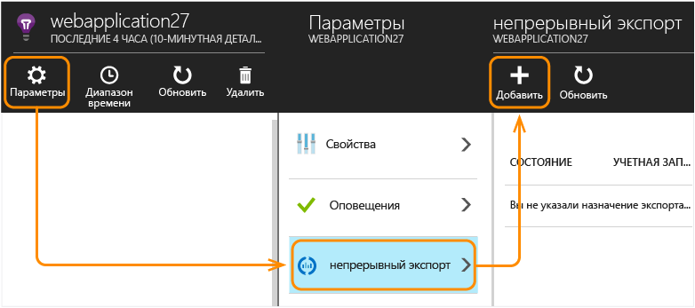
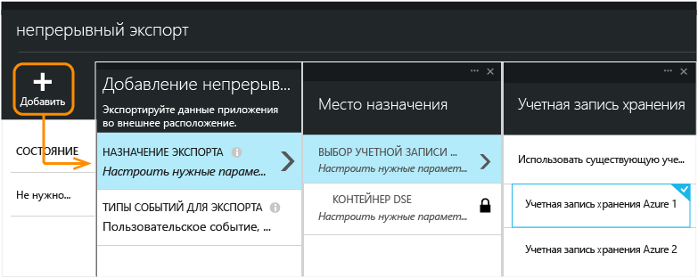
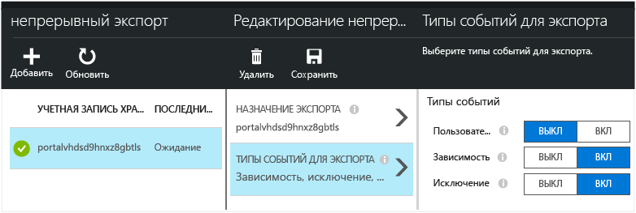
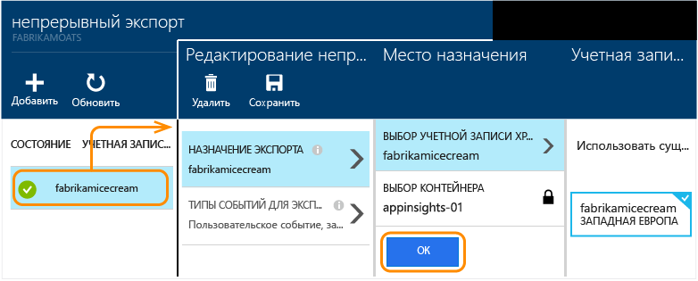

# Экспорт данных телеметрии из Application Insights
Хотите увеличить период удержания телеметрии или анализировать ее особым образом? Функция "Непрерывный экспорт" идеально подходит для этого. События, которые отображаются на портале Application Insights, можно экспортировать в хранилище Microsoft Azure в формате JSON. Отсюда можно загрузить данные; также вы можете написать любой код, необходимый для их обработки.  

За использование непрерывного экспорта может взиматься дополнительная плата. Проверьте свою [модель ценообразования](https://azure.microsoft.com/pricing/details/application-insights/).

Прежде чем настраивать функцию непрерывного экспорта, рассмотрите некоторые альтернативные варианты.

* Кнопка "Экспорт" в верхней части колонки метрик или поиска позволяет передавать таблицы и диаграммы в электронную таблицу Excel.

* [Аналитика](app-insights-analytics.md) предоставляет эффективный язык запросов для телеметрии и позволяет экспортировать результаты.
* Если вы собираетесь [исследовать данные в Power BI](app-insights-export-power-bi.md), это можно сделать, не прибегая к непрерывному экспорту.
* [REST API доступа к данным](https://dev.applicationinsights.io/) позволяет получить доступ к телеметрии программным образом.
* Можно также настроить [непрерывный экспорт с помощью PowerShell](https://docs.microsoft.com/powershell/module/azurerm.applicationinsights/new-azurermapplicationinsightscontinuousexport?view=azurermps-5.7.0).

После того, как во время непрерывного экспорта данные будут скопированы в хранилище (где они могут храниться столько, сколько необходимо), они по-прежнему будут доступны в Application Insights в течение обычного [периода хранения](app-insights-data-retention-privacy.md).

## Создание непрерывного экспорта
1. В ресурсе Application Insights для своего приложения откройте раздел непрерывного экспорта и выберите **Добавить**:

    

2. Выберите типы данных телеметрии, которые хотите экспортировать.

3. Создайте или выберите [учетную запись хранения Azure](../storage/common/storage-introduction.md), в которой необходимо сохранить данные.

    > [!Warning]
    > По умолчанию учетная запись хранения будет относиться к тому же географическому региону, что и ресурс Application Insights. Если вы выберете другой регион, может взиматься плата за передачу данных.

    

4. Создайте или выберите контейнер в хранилище:

    

После создания параметров экспорта запускается процедура экспорта. Вы получите только те данные, которые поступят после создания параметров экспорта.

Возможна задержка около часа до появления данных в хранилище.

### Изменение непрерывного экспорта

Если позднее потребуется изменить типы событий, просто изменить параметры экспорта:

### Остановка непрерывного экспорта

Чтобы остановить экспорт, нажмите кнопку "Отключить". При повторном нажатии кнопки включения экспорт будет повторно запущен с новыми данными. Пока экспорт был отключен, вы не будете получать данные, которые поступают на портал.

Чтобы остановить экспорт навсегда, удалите его. Это действие не повлечет удаление данных из хранилища.

### Не удается добавить или изменить параметры экспорта?
* Чтобы добавить или изменить параметры экспорта, необходимы права доступа владельца, участника или участника Application Insights. [Дополнительные сведения о ролях][roles].

##  Какие события вы получаете?
Экспортированные данные представляют собой необработанные данные телеметрии, полученные из приложения, за исключением того, что мы добавляем данные расположения, которые следует вычислять по IP-адресу клиента.

Данные, которые были отклонены [выборкой](app-insights-sampling.md) , не включаются в экспортированные данные.

Другие вычисляемые метрики не включаются. Например, мы не экспортируем показатель среднего использования ЦП, но экспортируем необработанные данные телеметрии, на основе которых можно вычислить это среднее значение.

Данные также содержат результаты любого настроенного [веб-теста доступности](app-insights-monitor-web-app-availability.md).

> [!NOTE]
> **Выборка.** Если ваше приложение отправляет большие объемы данных, может сработать функция выборки и отправить только часть вашей телеметрии. [Дополнительная информация о выборке.](app-insights-sampling.md)
>
>

##  Изучение данных
Проверить хранилище можно непосредственно на портале. Нажмите кнопку **Обзор**, выберите учетную запись хранения, а затем откройте раздел **Контейнеры**.

Чтобы проверить службу хранилища Azure в Visual Studio, выберите меню **Представление** и щелкните **Cloud Explorer**. (Если этой команды нет в меню, установите пакет SDK для Azure: откройте диалоговое окно **Создание проекта**, разверните узел "Visual C#/Облако" и выберите **Get Microsoft Azure SDK for .NET** (Получить пакет Microsoft Azure SDK для .NET).)

При открытии хранилища больших двоичных объектов вы увидите контейнер с набором файлов больших двоичных объектов. URI для каждого файла основан на имени ресурса Application Insights, ключе инструментирования, типе телеметрии, дате и времени. (Имя ресурса содержит только строчные буквы, в ключе инструментирования опускаются дефисы).

Дата и время имеют формат UTC и соответствуют моменту, когда элемент телеметрии был внесен в хранилище (не моменту его создания). Поэтому при написании кода для загрузки данных можно линейно перемещаться по данным.

Путь имеет следующий вид.

    $"{applicationName}_{instrumentationKey}/{type}/{blobDeliveryTimeUtc:yyyy-MM-dd}/{ blobDeliveryTimeUtc:HH}/{blobId}_{blobCreationTimeUtc:yyyyMMdd_HHmmss}.blob"

Where

* `blobCreationTimeUtc` — время создания большого двоичного объекта во внутреннем промежуточном хранилище.
* `blobDeliveryTimeUtc` — время копирования большого двоичного объекта в целевое хранилище экспорта.

##  Формат данных
* Каждый большой двоичный объект является текстовым файлом, который содержит несколько строк, разделенных символом новой строки "\n". Он содержит данные телеметрии, обрабатываемые примерно раз в 30 секунд.
* Каждая строка представляет точку данных телеметрии, например просмотр страницы или запроса.
* Каждая строка представляет собой неформатированный JSON-документ. Если вы хотите просмотреть его, откройте документ в Visual Studio и последовательно выберите "Правка", "Дополнительно", "Формат файла":

Продолжительность времени измеряется в тактах, где 10 000 тактов составляют 1 мс. Например, следующие значения показывают время 1 мс для отправки запроса из браузера, 3 мс для его получения и 1,8 с для обработки страницы в браузере.

    "sendRequest": {"value": 10000.0},
    "receiveRequest": {"value": 30000.0},
    "clientProcess": {"value": 17970000.0}

[Подробный справочник по модели данных типов и значений свойств.](app-insights-export-data-model.md)

## Обработка данных
Для небольших объемов данных можно написать код, который будет выделять элементы данных, записывать их в электронную таблицу и т. д. Например: 

    private IEnumerable<T> DeserializeMany<T>(string folderName)
    {
      var files = Directory.EnumerateFiles(folderName, "*.blob", SearchOption.AllDirectories);
      foreach (var file in files)
      {
         using (var fileReader = File.OpenText(file))
         {
            string fileContent = fileReader.ReadToEnd();
            IEnumerable<string> entities = fileContent.Split('\n').Where(s => !string.IsNullOrWhiteSpace(s));
            foreach (var entity in entities)
            {
                yield return JsonConvert.DeserializeObject<T>(entity);
            }
         }
      }
    }

Больший пример кода см. в статье [Пошаговое руководство. Экспорт в SQL из Application Insights с использованием Stream Analytics][exportasa].

## Удаление старых данных
Обратите внимание на то, что вы несете ответственность за управление емкостью хранилища и удаление при необходимости старых данных.

## При повторном создании ключа хранилища...
Если изменить ключ хранилища, непрерывный экспорт перестанет работать. Вы увидите уведомление в учетной записи Azure.

Откройте колонку непрерывного экспорта и измените параметры экспорта. Измените параметр назначения экспорта, но оставьте выбранным то же самое хранилище. Нажмите кнопку "ОК" для подтверждения.

Непрерывный экспорт будет перезапущен.

## Примеры экспорта

* [Экспорт в SQL с использованием Stream Analytics][exportasa]
* [Пример 2 с использованием Stream Analytics](app-insights-export-stream-analytics.md)

Для больших объемов данных рассмотрите возможность использования [HDInsight](https://azure.microsoft.com/services/hdinsight/) – кластеров Hadoop в облаке. HDInsight предусматривает широкий набор технологий для анализа больших объемов данных и управления ими. Кроме того, решение можно использовать для обработки данных, экспортированных из Application Insights.

## Вопросы и ответы
* *Все, что мне требуется, – всего лишь один раз загрузить диаграмму.*  

    Да, это можно сделать. В верхней части колонки щелкните **Экспорт данных**.
* *Параметры экспорта настроены, но в хранилище нет данных.*

    Получала ли служба Application Insights какие-либо данные телеметрии из вашего приложения с момента настройки параметров экспорта? Вы получите только новые данные.
* *Я попытался настроить параметры экспорта, но было отказано в доступе.*

    Если учетная запись принадлежит организации, необходимо быть членом группы владельцев или участников.
* *Могу ли я экспортировать данные непосредственно в свое локальное хранилище?*

    Нет. Наш механизм экспорта в настоящее время работает только для хранилища Azure.  
* *Существует ли предел для объема данных, помещаемых в мое хранилище?*

    Нет. Мы будем хранить переданные данные в хранилище, пока вы не удалите данные экспорта. Мы остановим передачу данных, если столкнемся с внешними ограничениями для хранилища больших двоичных объектов, но хранилище очень большое. Вы можете настроить объем используемого хранилища.  
* *Сколько больших двоичных объектов отображается в хранилище?*

  * Для каждого типа данных, выбранных для экспорта, каждую минуту создается новый большой двоичный объект (при наличии данных).
  * Кроме того, для приложений с высоким трафиком выделяются дополнительные единицы разделов. В этом случае каждую минуту каждая единица создает большой двоичный объект.
* *После повторного создания ключа для моего хранилища или изменения имени контейнера экспорт больше не работает.*

    Измените параметры экспорта и откройте колонку назначения экспорта. Оставьте выбранным прежнее хранилище и нажмите кнопку "OK" для подтверждения. Экспорт будет перезапущен. Если это изменение было сделано в течение последних нескольких дней, данные не будут потеряны.
* *Можно ли приостановить экспорт?*

    Да. Нажмите кнопку "Отключить".

## Примеры кода

* [Пример с использованием Stream Analytics](app-insights-export-stream-analytics.md).
* [Экспорт в SQL с использованием Stream Analytics][exportasa]
* [Подробный справочник по модели данных типов и значений свойств.](app-insights-export-data-model.md)

<!--Link references-->

[exportasa]: app-insights-code-sample-export-sql-stream-analytics.md
[roles]: app-insights-resources-roles-access-control.md
